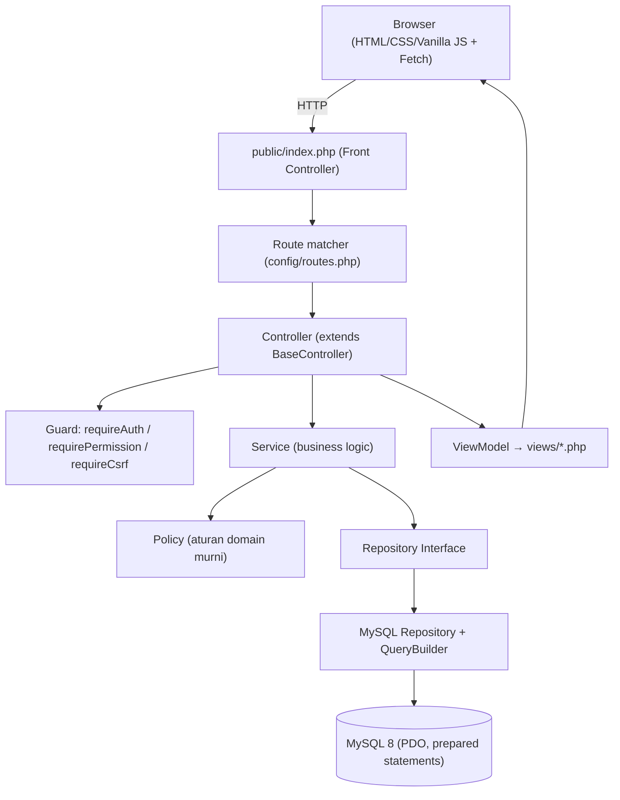
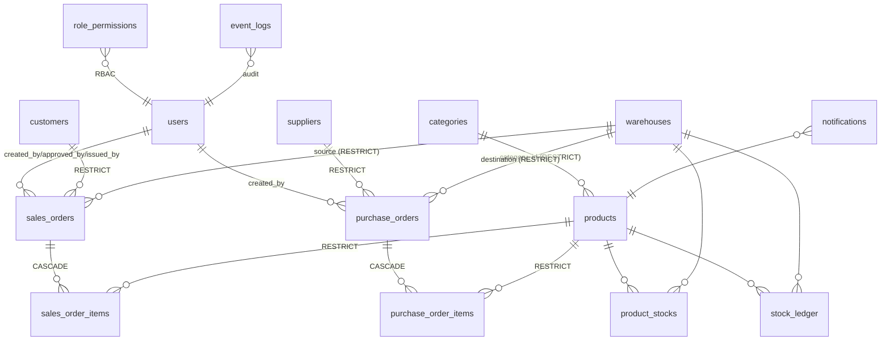

# IOMS — Panduan Presentasi & Pertahanan Sidang

> **Inventory & Order Management System** — PT Neuronworks Indonesia, Intermediate Programmer Final Project
> Dokumen ini dibuat untuk **persiapan sidang/presentasi final**: bukan dokumentasi developer biasa, tapi senjata untuk memahami dan mempertahankan setiap keputusan engineering.
>
> **Aturan baca:**
> - **[Verified]** = fakta yang langsung ditemukan di source code (ada referensi `file:line`).
> - **[Rationale]** = alasan engineering yang disimpulkan (bukan requirement tertulis — jangan diklaim sebagai requirement).
> - **[Improvement]** = sesuatu yang belum ada / bisa diperbaiki.
>
> Semua klaim teknis penting disertai path file. **Source code adalah sumber kebenaran.**

---

## DAFTAR ISI

- [System Map (ringkasan 10 poin)](#system-map)
- [PART A — Executive Overview (pembuka 2–3 menit)](#part-a)
- [PART B — System Architecture](#part-b)
- [PART C — Module Walkthrough](#part-c)
- [PART D — Database Walkthrough](#part-d)
- [PART E — Critical Code Walkthrough (urut presentasi)](#part-e)
- [PART F — Design Decisions (tabel)](#part-f)
- [PART G — Demo Script End-to-End (10–15 menit)](#part-g)
- [PART H — Presentation Narration](#part-h)
- [PART I — 50+ Pertanyaan Reviewer + Jawaban](#part-i)
- [PART J — Trick Questions](#part-j)
- [PART K — Weaknesses & Future Improvement](#part-k)
- [PART L — Cheat Sheet (1 halaman)](#part-l)
- [Catatan: Perbedaan Dokumentasi vs Kode](#catatan-diskrepansi)

---

<a name="system-map"></a>
## SYSTEM MAP (10 poin)

| # | Aspek | Ringkas | Bukti |
|---|---|---|---|
| 1 | **Struktur folder** | `public/` (entry) · `config/` (routes+global) · `app/{Controller,Service,Repository,Entity,Core}` · `views/` · `database/` · `tests/` · `docs/` · Docker | — |
| 2 | **Entry point** | Front controller tunggal | `public/index.php` |
| 3 | **Routing** | Array konfigurasi bersarang gaya ZF2, dicocokkan regex | `config/routes.php`, `public/index.php:66-211` |
| 4 | **Arsitektur layer** | Controller → Service → Repository(interface) → MySQL/PDO; + Entity, Policy, Core | lihat PART B |
| 5 | **Akses DB** | Hanya `Database.php` yang `new PDO()`; prepared statement selalu, `EMULATE_PREPARES=false` | `app/Core/Database.php:25-29` |
| 6 | **Authentication** | `password_verify` (bcrypt), session regenerate, idle timeout, reload user tiap request | `app/Service/AuthService.php` |
| 7 | **Authorization** | 3 lapis: controller permission → service/policy → query ownership. Tabel `role_permissions` | `BaseController.php:153-183`, `PermissionService.php` |
| 8 | **Modul bisnis** | Master Data · Purchase Order + Goods Receipt · Sales Order + Goods Issue · Inventory · Stock Ledger · Dashboard · Report · Notification · API | lihat PART C |
| 9 | **Tabel penting** | 15 tabel; inti: `product_stocks` (UNIQUE product+warehouse), `stock_ledger` (append-only) | `database/schema.sql` |
| 10 | **Transaksi kritikal** | Goods Issue & Goods Receipt: transaksi + `SELECT … FOR UPDATE` (anti-oversell ARCH-02) | `GoodsIssueService.php`, `GoodsReceiptService.php` |

---

<a name="part-a"></a>
## PART A — EXECUTIVE OVERVIEW (pembuka 2–3 menit)

> Naskah siap baca saat membuka presentasi.

"Aplikasi yang saya bangun adalah **Inventory & Order Management System** — sistem web internal untuk mengelola stok barang dan alur pesanan sebuah bisnis, dari pembelian ke supplier sampai penjualan ke pelanggan.

**Masalah yang diselesaikan:** di bisnis yang mengelola barang fisik, tiga hal paling sering jadi sumber kerugian — stok yang tidak akurat, penjualan melebihi stok yang tersedia (overselling), dan perubahan stok yang tidak bisa dilacak siapa yang melakukan. Sistem ini menjaga stok tetap akurat, **menjamin tidak pernah terjadi overselling meskipun dua transaksi berjalan bersamaan**, dan mencatat setiap pergerakan stok ke dalam buku besar (ledger) yang bersifat append-only sebagai audit trail.

**Penggunanya ada tiga peran:** *Admin* sebagai superuser yang mengelola master data dan menyetujui sales order; *Sales* yang membuat sales order miliknya sendiri; dan *Warehouse Staff* yang menangani penerimaan dan pengeluaran barang fisik di gudang.

**Alur bisnis utamanya:** Purchase Order → Goods Receipt (stok bertambah) → Sales Order → Approval oleh Admin → Goods Issue oleh gudang (stok berkurang) → selesai. Setiap langkah mengubah stok dilakukan secara **transaksional dan atomik**.

**Arsitekturnya** PHP 8.3 native OOP tanpa framework, berpola **Controller → Service → Repository**, dengan MySQL 8, frontend HTML/CSS/Vanilla JavaScript, dan seluruhnya berjalan di atas Docker.

**Tantangan teknis paling krusial** yang saya tangani adalah *concurrency*: memastikan dua Goods Issue yang hampir bersamaan tidak membuat stok menjadi minus. Saya menyelesaikannya dengan **database transaction + row-level locking (`SELECT … FOR UPDATE`)**, dan ini saya buktikan lewat test otomatis yang menjalankan dua proses PHP OS sungguhan secara paralel."

---

<a name="part-b"></a>
## PART B — SYSTEM ARCHITECTURE

### B.1 Diagram alur request



### B.2 Tanggung jawab tiap layer **[Verified]**

**Controller** (`app/Controller/*`, semua `extends BaseController`)
- Menerima HTTP request, memanggil **guard** (auth/permission/CSRF), men-*decode* `{id}` token, membaca `$_POST`, memanggil **satu** service, lalu memetakan `Result` ke `Response`/`ViewModel`.
- **Tidak boleh**: query SQL, logika bisnis, atau transaksi langsung di controller. Contoh bersih: `SalesOrderController::issueAction()` hanya guard + decode + panggil service (`app/Controller/SalesOrderController.php:274-294`).

**Service** (`app/Service/*`) — seluruh logika bisnis, validasi, orkestrasi transaksi. Contoh paling representatif: `GoodsIssueService` dan `SalesOrderService`.

**Policy** (`app/Service/SalesOrderPolicy.php`) — aturan domain murni (Segregation of Duties & transisi status), **tanpa DB, tanpa HTTP**. Bisa di-unit-test tanpa database.

**Repository Interface** (`app/Repository/Interface/*`) — kontrak yang di-*depend* service (ARCH-01). Service tidak pernah tahu implementasi MySQL-nya.

**Repository MySQL** (`app/Repository/MySQL/*` + `QueryBuilder`) — satu-satunya tempat SQL. Selalu kembalikan objek `Result`.

**Entity** (`app/Entity/*`) — data carrier (`fromArray()`, `withItems()`), plus konstanta status & helper (`PurchaseOrder::canReceiveGoods()`).

**Core** (`app/Core/*`) — plumbing framework buatan sendiri: `Database`, `Container`, `SessionManager`, `Result`, `Response`, `ViewModel`, `IdObfuscator`, `CacheService`, `MinioClient`.

### B.3 Dependency Injection **[Verified]**
`app/Core/Container.php` adalah *composition root* manual berbasis array — **tanpa framework DI** (dilarang CLAUDE.md). Tiap `get*()` me-*memoize* satu instance per request (`$this->instances[X] ??= new X(...)`), mis. `getGoodsIssueService()` (`Container.php:400-411`) merakit semua dependency-nya. Inilah tempat interface dipetakan ke implementasi MySQL.

### B.4 `Result` sebagai kontrak antar-layer **[Verified]**
`app/Core/Result.php`: `CODE_SUCCESS=0`, `CODE_VALIDATION=1`, `CODE_INTERNAL=2`, properti `$code/$info/$data`. Semua service & repository mengembalikan `Result`, bukan melempar exception ke atas — kecuali exception domain yang sengaja ditangkap. (Konvensi proyek: assignment hasil pakai `if/else` eksplisit, bukan ternary.)

---

<a name="part-c"></a>
## PART C — MODULE WALKTHROUGH

### C.1 Master Data **[Verified]**
Entitas: Products, Categories, Warehouses, Suppliers, Customers, Users.
- **CRUD + soft delete**: semua master data punya pola seragam `setActive($id,$active)` (toggle `is_active`) — bukan hard delete. (`ProductService.php:330-365`, `CategoryService.php:251-284`, dll.)
- **Pengecualian: Category punya hard delete** (`CategoryController::deleteAction`) tapi hanya jika tak ada produk terkait: `countAssignedSkus($id) > 0` → ditolak; backstop di DB adalah FK `ON DELETE RESTRICT` (`CategoryService.php:291-331`).
- **Unique constraint**: `users.email`, `products.sku`, `categories.name` & `categories.code`, `warehouses.code`. Suppliers & Customers **tidak** punya unique natural key (`database/schema.sql`).
- **Validasi Product**: SKU wajib ≤30 char & unik (dicek via `skuExists`), name 3–150, `sale_price >= purchase_price`, `reorder_point >= 0` (0 = alert low-stock nonaktif). `barcode` disimpan tapi **tidak** divalidasi/diunikkan **[Improvement]**.
- **Password & role (Users)**: hashing `password_hash($pw, PASSWORD_BCRYPT)` (`UserService.php:63,132`); guard tak bisa menonaktifkan/ubah-role akun sendiri (`UserService.php:105-112,175-178`); email unik via `emailExists`.
- **Image upload**: lihat C.9.
- **Otorisasi**: setiap aksi mutasi master data pakai `requirePermissionWithCsrf('{entity}.manage')`.

### C.2 Purchase Order **[Verified]**
Status (`PurchaseOrder.php:9-13`): `Draft → Ordered → PartiallyReceived → Received`, dan `Draft/Ordered/PartiallyReceived → Cancelled`.

| Aksi | Siapa | Guard |
|---|---|---|
| Create / lihat / **receive** | Admin + Warehouse Staff | `purchase_orders.manage` |
| **Submit** (Draft→Ordered) | **Admin saja** | `purchase_orders.submit` |
| **Cancel** | sesuai grant | `purchase_orders.cancel` |

- Submit butuh ≥1 item & status Draft (`PurchaseOrderService::submit`, `:187-203`).
- Cancel dijaga `canBeCancelled()` (tidak bisa cancel Received/Cancelled).

### C.3 Goods Receipt **[Verified]** (`GoodsReceiptService::process`, `:49-147`)
1. Validasi pra-transaksi (tanpa lock): PO harus `canReceiveGoods()` (Ordered/PartiallyReceived); cek per-baris termasuk **over-receipt** (`qty > qtyRemaining()` ditolak, `:223-230`).
2. `beginTransaction()`; **lock baris PO** `FOR UPDATE` lalu re-cek status (menutup race receive-vs-cancel) (`:162-171`).
3. Per baris, di dalam transaksi: **lock baris PO item** (`findByIdForUpdate`), re-cek over-receipt pada data terkunci, **lock baris `product_stocks`** (buat jika belum ada), `incrementQuantity(+qty)`, insert `stock_ledger` tipe `Receipt`, lalu `incrementQtyReceived` pada item.
4. `recomputeStatus()` → `Received` jika semua baris penuh, `PartiallyReceived` jika sebagian (`deriveStatusFromReceipts`, `:361-387`).
5. `commit()`. Gagal → `rollBack()`. Audit log **setelah** commit.

Partial receipt dilacak lewat kolom `qty_received` yang **di-increment** tiap penerimaan (akumulatif); sisa = `qtyRemaining() = max(0, qtyOrdered - qtyReceived)`.

### C.4 Sales Order **[Verified]**
Status (`SalesOrder.php`): `Draft → PendingApproval → Approved → Fulfilled`, dan `→ Cancelled` (reject memetakan ke Cancelled + `cancellation_reason`).

| Aksi | Service | Aturan kunci |
|---|---|---|
| Create | `SalesOrderService::create` (`:91`) | min 1 item, customer/warehouse/product aktif, qty>0, price≥0 |
| Submit | `submitForApproval` (`:170`) | hanya Draft, **hanya pembuat** |
| **Approve** | `approve` (`:224`) | **hanya Admin** (`assertCanDecide`), hanya dari PendingApproval |
| Reject | `reject` (`:283`) | hanya Admin, → Cancelled |
| Cancel | `cancel` (`:344`) | `assertCanCancel` (Admin any non-Fulfilled; pembuat hanya Draft/PendingApproval) |
| Issue | `GoodsIssueService::issue` | lihat C.6 |

**Ownership — Sales hanya lihat SO miliknya (3 lapis):**
1. List: `indexAction` kirim `userId` hanya jika role Sales (`SalesOrderController.php:36-40`).
2. Detail: `showAction` → `forbidden()` jika `role===Sales && createdBy !== id` (`:104-106`).
3. Query: repository memfilter `so.created_by = :userId` (`SalesOrderMySQLRepository.php:497-499`). + ID di URL berupa token ter-obfuscate.

### C.5 Inventory / Product Stock **[Verified]**
- Current stock disimpan di tabel `product_stocks`, satu baris per kombinasi **product + warehouse** (UNIQUE `uniq_product_warehouse`), `CHECK quantity >= 0`.
- Bertambah saat Goods Receipt; berkurang saat Goods Issue — selalu via `incrementQuantity(delta)` di dalam transaksi.
- Low stock: **level produk** — `SUM(product_stocks.quantity) < reorder_point` (produk aktif), total lintas gudang sesuai Brief DASH-01/JOB-01. Dipakai konsisten oleh dashboard (`findCriticalStock`/`countCriticalStock`), filter daftar Produk (`findLowStock`), dan `check-low-stock.php`.

### C.6 Stock Ledger (audit trail) **[Verified]**
- Tabel `stock_ledger`: `type ENUM('Receipt','Issue','Adjustment')`, `qty INT` (bertanda — Issue negatif), `ref_type ENUM('PO','SO','Adjustment')`, `ref_id`, `done_by_user_id`, `done_at`.
- **Append-only by convention**: komentar schema menyatakan tak ada jalur UPDATE/DELETE di aplikasi (bukan trigger DB) (`schema.sql:318`).
- **Invariant kunci**: `product_stocks.quantity == initial + SUM(stock_ledger.qty)` — diuji otomatis (lihat PART E/testing).
- Dipakai sebagai sumber kebenaran pergerakan & basis report movement_ledger.

### C.7 Dashboard **[Verified]**
- **Admin** (`DashboardService::getAdminStats`): inventory_value, total_products, low_stock_count + daftar, PO by status, SO by status (semua user), 10 transaksi terakhir, 5 audit log terakhir.
- **Sales** (`SalesDashboardService`): **difilter `userId` sendiri** (`SalesDashboardController.php:24-31`) — revenue, tren vs periode sebelumnya, pipeline status, top 5 customer, order terbaru. Periode: today/week/month/all (TZ Asia/Jakarta).
- **Warehouse**: aktivitas gudang + notifikasi low-stock.

### C.8 Reports **[Verified]**
- 4 tipe: `stock_valuation` (default), `inventory_aging`, `slow_moving`, `movement_ledger` (`ReportService.php`).
- Filter: date range, warehouse, category, search `q`, sort (allowlist).
- Otorisasi: analitik penuh butuh `reports.stock_ledger.view`; export SO butuh `reports.sales_orders.view`; export PO butuh `reports.purchase_orders.view`.
- **Ownership BR-018**: export SO untuk Sales difilter `userId` sendiri (`ReportController.php:155-162`).
- **CSV** (`CsvExportService`): RFC-4180 (CRLF, quoting), **guard formula-injection** — nilai diawali `= + - @ TAB CR LF` diberi prefix `'` (`escapeCsvField`, `:112-131`); qty numerik sengaja di-bypass agar angka negatif tidak rusak.

### C.9 Image Upload **[Verified]** (`ImageUploadService`)
Browser → `ProductController::processImageUpload` → `ImageUploadService::process`:
- **Validasi**: MIME disniff via `finfo(FILEINFO_MIME_TYPE)` + `getimagesize()` (bukan percaya `type` dari client), allow-list `image/jpeg|png|webp`, max **2 MB**, `is_uploaded_file()` (`:94-124`).
- **Path traversal**: nama file asli **tidak pernah dipakai**; object key di-generate acak `ioms/products/{YYYY}/{MM}/{16hex}.webp` (`:166-179`) → traversal mustahil.
- **Konversi WebP**: GD `imagewebp()` quality 82, downscale sisi terpanjang ke 1200px (`:183-213`); re-encode juga menghapus EXIF/metadata.
- **Penyimpanan**: MinIO (S3-compatible via `MinioClient` SigV4/curl), bukan disk lokal; URL publik disimpan ke `products.image_path`. Saat update, image lama dihapus.
- **[Rationale] Kenapa WebP**: ukuran jauh lebih kecil pada kualitas setara → hemat storage & bandwidth; normalisasi satu format + batas dimensi membuat aset seragam; round-trip decode→encode mensanitasi file.

### C.10 Notifications & Low-Stock Cron **[Verified]**
- Satu-satunya trigger: **low stock**. Script CLI `scripts/check-low-stock.php` query `ps.quantity < p.reorder_point`, buat notifikasi in-app ter-*dedup* (`NotificationService::notifyLowStock`).
- **Cron nyata ada**: service `cron` di `docker-compose.yaml`, crontab `docker/cron/low-stock.cron` → **setiap 15 menit**.
- Mark-all-read: `NotificationController::markAllReadAction` (guard `requireAuthWithCsrf` + cek role Admin/Warehouse server-side).

### C.11 API **[Verified]**
`GET /api/products/{sku}/availability` (`ProductApiController`): butuh auth (`requireAuth`, gagal → JSON 401), sukses → JSON `{sku, product_id, name, unit, available, total_stock, availability[]}` (hanya gudang aktif), SKU tak dikenal → JSON 404.
Contoh sukses:
```json
{"sku":"SKU-001","product_id":12,"name":"Widget","unit":"pcs","available":true,"total_stock":40,
 "availability":[{"warehouse_id":1,"warehouse_code":"WH-A","warehouse_name":"Main","quantity":40}]}
```

---

<a name="part-d"></a>
## PART D — DATABASE WALKTHROUGH

### D.1 ERD konseptual **[Verified]**



### D.2 Tabel per kelompok **[Verified]** (MySQL 8, InnoDB, utf8mb4)

- **Authentication**: `users` (PK id; UNIQUE email; `role ENUM('Admin','Sales','WarehouseStaff')`; `password_hash`; `is_active`).
- **Master Data**: `categories` (UNIQUE name, code), `products` (UNIQUE sku; FK category_id **RESTRICT**; CHECK harga/reorder ≥0), `warehouses` (UNIQUE code), `suppliers`, `customers` (tanpa unique natural key).
- **Inventory**: `product_stocks` (**UNIQUE (product_id, warehouse_id)**; CHECK quantity≥0; FK product/warehouse **RESTRICT**).
- **Purchase**: `purchase_orders` (`status ENUM('Draft','Ordered','PartiallyReceived','Received','Cancelled')`), `purchase_order_items` (FK ke PO **CASCADE**; `qty_ordered`, `qty_received`).
- **Sales**: `sales_orders` (`status ENUM('Draft','PendingApproval','Approved','Fulfilled','Cancelled')`; kolom jejak `approved_by/at`, `issued_by/at`, `cancellation_reason`), `sales_order_items` (FK ke SO **CASCADE**).
- **Audit/Ledger**: `stock_ledger` (append-only), `event_logs` (append-only; `metadata JSON`).
- **Permissions**: `role_permissions` (UNIQUE (permission_key, role)).
- **Notifications**: `notifications` (`read_at` NULL=unread).

### D.3 Index yang penting **[Verified]**
- `product_stocks.uniq_product_warehouse` — target lock `FOR UPDATE` (inti ARCH-02).
- `stock_ledger.idx_ledger_product_wh_done_at` & `idx_ledger_ref (ref_type, ref_id)`.
- `sales_orders.idx_so_status_creator (status, created_by)` — melayani filter owner+status sekaligus.
- `notifications.idx_notifications_unread_created (read_at, created_at)`.

### D.4 Atomicity & transaksi **[Verified]**
`Database.php` (`beginTransaction/commit/rollBack`, `inTransaction()`-guarded). Skenario kegagalan: jika `UPDATE product_stocks` berhasil tapi `INSERT stock_ledger` gagal, `Result` non-success memicu `rollBack()` → **kedua perubahan dibatalkan**, DB tidak pernah setengah jadi. Keduanya selalu berada dalam satu transaksi (lihat `GoodsIssueService.php:70-104`).

### D.5 Seed data **[Verified]**
4 user demo: `admin@example.com` (Admin/Rita), `sales1@example.com` (Sales/Beni), `warehouse@example.com` (WarehouseStaff/Wawan), `sales2@example.com` (Sales/Grace). 2 gudang (WH-JKT, WH-BDG), 4 kategori, 10 supplier, 10 customer, 100 produk, stok awal 50 (JKT) & 30 (BDG) per produk dengan ledger `Adjustment` "Initial seed", 50 PO + 50 SO.

### D.6 Migrations **[Verified]**
`001` (categories.code), `002` (products.barcode+description), `003` (customers.view permission) — idempotent, **hanya** untuk DB volume lama; environment bersih langsung dari `schema.sql`+`seed.sql`. **[Improvement]** Tidak ada migration runner; migrasi berdiri sendiri harus dijalankan manual.

---

<a name="part-e"></a>
## PART E — CRITICAL CODE WALKTHROUGH (urut untuk presentasi)

> Untuk tiap bagian: **File / Method / Code inti / Penjelasan / Yang harus Anda katakan**.

### E.1 Router (front controller)
**File** `public/index.php:312-342` · **Yang terjadi**: match route → cast param → `new $controllerClass($container)` → panggil action → `handleResponse`.
**Katakan:** "Semua request masuk satu pintu. Router mencocokkan path ke array konfigurasi, meng-cast parameter sesuai tipe, lalu memanggil controller. Ada `try/catch (\Throwable)` paling luar yang mengubah error apa pun jadi 500 yang di-*log*, tidak pernah membocorkan stack trace ke user."

### E.2 Authentication
**File** `app/Service/AuthService.php:30-83` · **Inti**: `password_verify($password, $user->passwordHash)` + cek `isActive`, lalu `session->regenerate()`.
**Katakan:** "Password tidak pernah dibandingkan sebagai teks biasa — saya pakai `password_verify` terhadap hash bcrypt. Setelah login sukses saya regenerate session ID untuk mencegah *session fixation*, dan menerbitkan CSRF token baru."

### E.3 Guard otorisasi (controller)
**File** `app/Controller/BaseController.php:153-183` · **Inti**: `requirePermission($key)` → `PermissionService::roleHasPermission(role, key)`.
**Katakan:** "Ini satu-satunya otorisasi yang mengikat. Komentarnya eksplisit: menyembunyikan tombol di view **bukan** security. Role dipetakan ke permission key lewat tabel `role_permissions`, bukan perbandingan role hard-coded."

### E.4 Ownership check (Sales lihat SO orang lain)
**File** `app/Controller/SalesOrderController.php:104-106` · **Inti**: `if role===Sales && createdBy !== id → forbidden()`.
**Katakan:** "Kalau Sales mencoba membuka SO milik Sales lain lewat URL, server mengembalikan 403 — dan query list-nya pun sudah difilter `created_by`, jadi SO itu bahkan tak pernah muncul."

### E.5 Segregation of Duties
**File** `app/Service/SalesOrderPolicy.php:12-22` · **Inti**: `assertCanDecide($isActorAdmin)` — melempar jika bukan admin.
**Katakan:** "SOD saya terapkan sebagai **penolakan berbasis role**, bukan perbandingan pembuat. Sales tidak pernah bisa approve SO mana pun. Admin yang approve SO buatannya sendiri justru *diizinkan* — itu desain yang disengaja dan terdokumentasi."

### E.6 Approve Sales Order (dua lapis)
**File** controller `SalesOrderController.php:198-220` (`requirePermissionWithCsrf('sales_orders.approve')`) + service `SalesOrderService.php:224-281` (`assertCanDecide`).
**Katakan:** "Approve dijaga dua kali: di controller lewat permission key, dan di service lewat policy. Bahkan kalau ada bug di route, service tetap menolak non-admin."

### E.7 Goods Issue — transaksi + anti-oversell (⭐ paling penting)
**File** `app/Service/GoodsIssueService.php:111-206`
```php
$this->transactionManager->beginTransaction();
// 1) kunci baris SO, re-cek status Approved
$lockResult = $this->salesOrderRepository->lockForUpdate($salesOrder->id);
if ($lockResult->data[0]['status'] !== SalesOrder::STATUS_APPROVED) throw new InvalidStateException(...);
foreach ($items as $item) {
    // 2) kunci baris product_stocks (FOR UPDATE)
    $stock = $this->productStockRepository->lockForUpdate($item->productId, $wh)->data;
    // 3) cek-lalu-kurangi
    if ($stock === null || $stock->quantity < $item->qty) throw new InsufficientStockException(...);
    $this->productStockRepository->incrementQuantity($item->productId, $wh, -$item->qty);
    // 4) tulis ledger
    $this->stockLedgerRepository->insert([... 'type'=>'Issue','qty'=>-$item->qty,'ref_type'=>'SO' ...]);
}
$this->salesOrderRepository->updateStatus($id, STATUS_FULFILLED, [...]);
$this->transactionManager->commit();
```
**Katakan:** "Inilah jantung sistem. Saya mengunci baris SO dulu lalu re-cek statusnya dari *locking read* — ini menutup race 'double issue'. Lalu untuk tiap produk, saya `SELECT … FOR UPDATE` baris stoknya sehingga transaksi lain harus **menunggu**. Baru saya cek stok cukup, kurangi, dan tulis ledger — semua dalam satu transaksi. Kalau stok kurang, saya lempar exception → rollback. Stok tidak pernah bisa minus."

### E.8 Row lock di Repository
**File** `app/Repository/MySQL/ProductStockMySQLRepository.php:48-74` + `QueryBuilder::findOne(... $forUpdate=true)` (`QueryBuilder.php:72-85`: `if ($forUpdate) $sql .= ' FOR UPDATE';`).
**Katakan:** "`FOR UPDATE` bukan string sembarangan — ia hanya flag boolean yang menambahkan klausa lock. Tidak ada input user yang menyentuh teks SQL."

### E.9 Stock Ledger insert
**File** `GoodsIssueService.php:168-177` — payload `type/qty/ref_type/ref_id/done_by_user_id/done_at`.
**Katakan:** "Setiap pergerakan stok menulis satu baris ledger yang menunjuk balik ke transaksi sumbernya (SO/PO). Ledger ini append-only dan jadi audit trail."

### E.10 Error handling & rollback
**File** `GoodsIssueService.php:91-104` — `catch (\Throwable)`: DomainException → `CODE_VALIDATION` (pesan user), selain itu → `CODE_INTERNAL` + `error_log`. `rollBack()` dipanggil di jalur gagal.
**Katakan:** "Exception domain jadi pesan validasi yang ramah; error tak terduga jadi pesan generik dengan detail hanya ke log. Apa pun yang gagal, transaksi di-rollback."

### E.11 QueryBuilder — prepared statement
**File** `QueryBuilder.php` — semua method `prepare()+execute($params)`; operator di-*whitelist* (`['=','!=','<','<=','>','>=']`), `delete()` menolak tanpa filter.
**Katakan:** "Tidak ada konkатenasi input user ke SQL. Semua nilai di-*bind*. `EMULATE_PREPARES=false` berarti prepared statement sungguhan di sisi server."

### E.12 Repository example (Result pattern)
**File** `ProductStockMySQLRepository::find` (`:19-43`) — bungkus query dalam `try/catch`, kembalikan `Result` berisi Entity.
**Katakan:** "Setiap repository mengembalikan `Result` seragam — kode sukses/validasi/internal — sehingga service bisa menangani kegagalan tanpa menebak."

---

<a name="part-f"></a>
## PART F — DESIGN DECISIONS

| Decision | Implementation | Why (alasan) | Alternative | Trade-off |
|---|---|---|---|---|
| Layering | Controller→Service→Repository | Pemisahan tanggung jawab; business logic teruji tanpa HTTP | Semua di controller | Lebih banyak file, tapi testable & maintainable |
| Business logic di Service | mis. `SalesOrderService` | Bisa di-unit-test, reusable antar controller/CLI | Logic di controller | Sedikit indireksi |
| SQL hanya di Repository | `app/Repository/MySQL/*` | Satu tempat perubahan skema; cegah SQL tersebar | Query di service | Perlu interface + impl |
| Anti-oversell | `SELECT … FOR UPDATE` (pessimistic) | Mencegah race di titik kritis, konsisten di DB | App lock / optimistic | Lock mengikat ke transaksi/DB; kontensi minor |
| Stock disimpan + Ledger | `product_stocks` + `stock_ledger` | Baca stok O(1) tanpa agregasi tiap request; ledger utk audit | Hitung dari ledger tiap kali | Redundansi terkontrol; invariant diuji |
| Ledger append-only | Tanpa UPDATE/DELETE path | Audit trail tak bisa diubah | Mutable | Koreksi harus via entry Adjustment |
| Otorisasi server-side | `requirePermission` + policy + query | UI hiding bukan security | Hanya sembunyikan tombol | Dobel kerja (view+server), tapi aman |
| SO butuh approval | status `PendingApproval` | Kontrol & SOD | Auto-approve | Satu langkah ekstra |
| Role = 3 enum | `Role` enum + `role_permissions` | Sederhana, cukup utk domain; mapping tetap di DB | Dynamic RBAC penuh | Kurang fleksibel utk permission granular |
| Native PHP | tanpa framework | Sesuai requirement; kendali & pemahaman penuh | Laravel/Symfony | Lebih banyak kode plumbing |
| Docker | 5 service compose | Environment konsisten, sekali `up` | Install manual | Perlu Docker |
| MySQL | InnoDB + FK + transaksi | Relasional, ACID, row lock | NoSQL | Skema kaku (justru diinginkan) |
| Soft delete | `is_active` toggle | Jaga integritas referensial histori | Hard delete | Data lama tetap ada |
| ID obfuscation | `IdObfuscator` (hex+prefix) | Naikkan bar melawan IDOR/enumerasi URL | Expose PK | Bukan enkripsi; tetap perlu authz |
| Session Redis | `SessionManager` + fallback file | Skalabel, shared state | File only | Perlu Redis (ada fallback) |
| Cache Memcached | `PermissionService` TTL 1h | Kurangi query permission tiap request | Query tiap kali | Perlu invalidasi saat role berubah |

---

<a name="part-g"></a>
## PART G — DEMO SCRIPT END-TO-END (10–15 menit)

> Akun: Admin `admin@example.com`, Sales `sales1@example.com`, Warehouse `warehouse@example.com` (password lihat `seed.sql`).

| # | Role | Menu / Aksi | Expected result | Technical point yang ditekankan |
|---|---|---|---|---|
| 1 | Admin | Login | Redirect ke /dashboard | `password_verify`, session regenerate |
| 2 | Admin | Dashboard | KPI: inventory value, low stock, PO/SO by status | Agregasi server-side; role-based view |
| 3 | Admin | Master Data → Products (buat 1 produk + upload gambar) | Produk aktif, gambar tampil (WebP) | Validasi MIME via finfo, konversi WebP, simpan ke MinIO |
| 4 | Admin | Purchase Order → Create → Submit | Status Draft → Ordered | Hanya Admin boleh submit (`purchase_orders.submit`) |
| 5 | Warehouse | Login → PO → Receive (partial) | Stok bertambah; PO jadi PartiallyReceived; ledger `Receipt` | Transaksi + lock; `qty_received` akumulatif |
| 6 | Warehouse | Receive sisanya | PO → Received | `deriveStatusFromReceipts` |
| 7 | Sales | Login → Sales Order → Create → Submit | SO Draft → PendingApproval | Ownership: hanya lihat SO sendiri |
| 8 | Sales | Coba buka /sales-orders/{id} milik Admin/Sales lain | **403 Forbidden** | Otorisasi server-side + ID obfuscated |
| 9 | Sales | Coba approve SO sendiri | **403 / ditolak** "Only an administrator can approve" | **SOD (BR-001)** |
| 10 | Admin | SO → Approve | SO → Approved, `approved_by` terisi | SOD: Admin boleh approve |
| 11 | Warehouse | SO → Goods Issue | Stok berkurang; SO → Fulfilled; ledger `Issue` (qty negatif) | **Transaksi + FOR UPDATE** |
| 12 | (opsional) | Dua Goods Issue paralel (tunjukkan test) | Satu sukses, satu gagal "not enough stock" | **ARCH-02 anti-oversell** |
| 13 | Admin | Stock Ledger | Semua pergerakan tercatat; filter/sort AJAX | Append-only audit; `stock = SUM(ledger)` |
| 14 | Admin | Reports → export CSV | File CSV terunduh | Guard formula-injection; BR-018 ownership |

**Alur hubungan antar-modul** yang ditonjolkan: PO → Receipt (stok naik) → SO → Approve → Issue (stok turun) → Ledger → Dashboard/Report.

---

<a name="part-h"></a>
## PART H — PRESENTATION NARRATION (per bagian)

### H.1 Arsitektur
- **Tunjukkan:** struktur folder `app/` + `Container.php`.
- **Katakan:** "Saya memisahkan controller, service, dan repository. Controller tipis, logika di service, SQL di repository. Perakitan dependency ada di Container manual — tanpa framework."
- **Technical point:** separation of concerns, dependency inversion via interface.
- **Pertanyaan mungkin:** "Kenapa tidak langsung controller → repository?"
- **Jawaban:** "Agar business logic bisa diuji tanpa HTTP/DB dan dipakai ulang (mis. oleh CLI low-stock). Service juga mengorkestrasi transaksi lintas repository — itu bukan tugas controller."

### H.2 Authentication & Session
- **Tunjukkan:** `AuthService::login` + `SessionManager`.
- **Katakan:** "Password bcrypt, session regenerate anti-fixation, cookie HttpOnly + SameSite=Lax, idle timeout, dan user di-reload tiap request sehingga akun yang dinonaktifkan langsung kehilangan akses."
- **Pertanyaan:** "Bagaimana kalau admin menonaktifkan user yang sedang login?" → "Request berikutnya `currentUser()` menemukan `is_active=false` → session dihancurkan."

### H.3 Otorisasi & SOD
- **Tunjukkan:** `BaseController::requirePermission` + `SalesOrderPolicy`.
- **Katakan:** "Otorisasi selalu server-side, tiga lapis. SOD diterapkan sebagai penolakan role: Sales tidak pernah approve."
- **Pertanyaan:** "Kenapa menyembunyikan tombol tidak cukup?" → lihat PART J.

### H.4 Concurrency / Anti-oversell
- **Tunjukkan:** `GoodsIssueService::executeIssuanceTransaction` + test concurrency.
- **Katakan:** "Dengan `FOR UPDATE`, transaksi kedua menunggu sampai yang pertama commit, lalu membaca stok terbaru. Saya buktikan dengan dua proses PHP OS paralel."
- **Technical point:** pessimistic locking, atomicity, invariant `stock = SUM(ledger)`.

---

<a name="part-i"></a>
## PART I — 50+ PERTANYAAN REVIEWER + JAWABAN

### Business
1. **Masalah apa yang diselesaikan?** Akurasi stok, cegah overselling, audit trail, pemisahan tanggung jawab.
2. **Siapa penggunanya?** Admin, Sales, Warehouse Staff.
3. **Kenapa butuh approval SO?** Kontrol internal & SOD — pesanan tidak langsung mengurangi stok tanpa persetujuan.
4. **Kenapa Warehouse tak bisa buat SO?** Perannya aktivitas fisik gudang (receipt/issue), bukan transaksi pelanggan.
5. **Apa output bisnis utama?** Stok akurat real-time + laporan + jejak audit.
6. **Bagaimana mencegah penyalahgunaan oleh Sales?** Ownership (hanya SO sendiri) + tak bisa approve.

### Architecture
7. **Kenapa Controller→Service→Repository?** Testability, separation of concerns, SQL terpusat. (PART F)
8. **Kenapa logic tidak di controller?** Agar reusable & teruji tanpa HTTP.
9. **Kenapa SQL tidak di controller?** Satu tempat perubahan, cegah duplikasi & SQL tersebar.
10. **Bagaimana DI bekerja tanpa framework?** `Container` manual, memoize per request (`Container.php`).
11. **Apa itu `Result`?** Objek hasil seragam (code/info/data) antar-layer (`Result.php`).
12. **Kenapa ada Repository Fake?** Untuk unit test service tanpa MySQL (`app/Repository/Fake/`).
13. **Apa peran Policy?** Aturan domain murni (SOD/transisi), tanpa DB/HTTP.
14. **Bagaimana routing bekerja?** Array konfigurasi → regex match → controller/action (`routes.php`, `index.php`).
15. **Kenapa filter via POST, bukan query string?** Agar state tidak masuk URL; `requestParam()` baca `$_POST` saja.

### Backend / PHP
16. **Versi PHP?** 8.3 (constraint `^8.3`).
17. **Bagaimana autoload?** Composer PSR-4 `App\ → app/`.
18. **Bagaimana error ditangani global?** `try/catch (\Throwable)` di `index.php`, log + 500 (JSON utk /api).
19. **Bagaimana view dirender?** `ViewModel` → `renderViewModel()` extract data → template PHP + layout.
20. **Bagaimana XSS dicegah di view?** `htmlspecialchars(..., ENT_QUOTES, 'UTF-8')` di semua output dinamis.
21. **Apakah pakai ORM?** Tidak (dilarang). PDO + QueryBuilder manual.

### Database
22. **Kenapa MySQL?** Relasional, ACID, FK, row lock — cocok untuk integritas transaksi.
23. **Bagaimana current stock disimpan?** `product_stocks`, 1 baris per product+warehouse (UNIQUE).
24. **Kenapa ledger dipisah dari stok?** Baca stok cepat (O(1)) + audit immutable; lihat Q39.
25. **Apa FK strategy?** Master data `RESTRICT` (cegah hapus yang direferensikan); item PO/SO `CASCADE` ke header; audit `SET NULL` pada user.
26. **Index terpenting?** `uniq_product_warehouse` (lock), `idx_so_status_creator`, `idx_ledger_ref`.
27. **Bagaimana skema dibuat saat deploy?** `schema.sql` + `seed.sql` auto-load via MySQL init dir pada volume kosong.
28. **ENUM status PO/SO?** PO: Draft/Ordered/PartiallyReceived/Received/Cancelled. SO: Draft/PendingApproval/Approved/Fulfilled/Cancelled.

### Security
29. **Bagaimana password disimpan?** Hash bcrypt (`PASSWORD_BCRYPT`), tak pernah plaintext.
30. **Bagaimana SQL injection dicegah?** Prepared statement + bind semua nilai; `EMULATE_PREPARES=false`.
31. **CSRF?** Token per-session, di-*embed* di form, dicek `hash_equals` di tiap POST (`requireCsrf`).
32. **XSS?** Escaping output + konversi/sanitasi gambar.
33. **Session security?** HttpOnly, SameSite=Lax, Secure (gated prod), regenerate saat login, idle timeout.
34. **IDOR?** ID di URL ter-obfuscate + ownership/authorization server-side.
35. **File upload aman?** MIME via finfo + getimagesize, batas 2MB, nama file acak (anti traversal), re-encode WebP.
36. **Enumeration attack?** Login gagal memberi pesan generik & tak mencatat email ke log.
37. **Apakah ada rate limiting?** Belum **[Improvement]**.

### Inventory
38. **Kapan stok berubah?** Naik saat Goods Receipt, turun saat Goods Issue — selalu transaksional.
39. **Kenapa simpan stok padahal ada ledger?** Agar tak perlu `SUM(ledger)` tiap baca; redundansi terkontrol, invariant `stock = SUM(ledger)` diuji.
40. **Bagaimana low stock ditentukan?** Level produk: `SUM(product_stocks.quantity) < reorder_point` (total lintas gudang, produk aktif) — sesuai Brief "produk di bawah reorder point". Konsisten di dashboard, filter Produk, dan cron.
41. **Bagaimana notifikasi low stock dibuat?** Cron tiap 15 menit (`check-low-stock.php`), ter-dedup.

### Concurrency
42. **Kenapa `SELECT … FOR UPDATE`?** Mengunci baris stok agar transaksi lain menunggu → cek-lalu-kurangi aman.
43. **Apa yang terjadi jika 2 Goods Issue bersamaan?** Satu dapat lock & commit, satu menunggu lalu baca stok terbaru; jika kurang → ditolak & rollback.
44. **Kenapa lock baris SO juga?** Menutup race double-issue / issue-vs-cancel (re-cek status di locking read).
45. **Kenapa lock hanya di Goods Issue/Receipt?** Hanya di situ ada cek-lalu-ubah stok yang rawan race; operasi lain tak mengubah stok.
46. **Bagaimana membuktikannya?** Test `GoodsIssueConcurrencyTest` menjalankan 2 proses OS via `proc_open`.

### Authorization
47. **Bagaimana Sales dibatasi lihat SO sendiri?** 3 lapis (controller filter, detail forbidden, query `created_by`).
48. **Di mana role→permission?** Tabel `role_permissions` via `PermissionService` (cache 1 jam).
49. **Kenapa authz server-side?** UI bisa dilewati (curl/Postman); server satu-satunya titik yang tak bisa dibypass.

### Docker
50. **Service apa saja?** app (php -S:8080), cron (low-stock), db (mysql:8.0), redis (session), memcached (cache); MinIO eksternal.
51. **Bagaimana boot dari nol?** `docker compose up --build` → db init schema+seed → app & cron jalan setelah healthy.
52. **Kenapa Redis dan Memcached dipisah?** Redis = session store; Memcached = cache aplikasi (permission) — ADR-005.
53. **Kenapa `php -S` bukan nginx?** Cukup untuk skala proyek & demo; sederhana. **[Improvement]** produksi sebaiknya nginx+fpm.

### Frontend
54. **Teknologi frontend?** HTML + CSS + Vanilla JS + Fetch; i18next ter-wire (EN/ID).
55. **Contoh AJAX?** Stock Ledger memPOST filter ke `/stock-ledger` (`App.api`), server balas `{tbody, page,...}`.
56. **Bagaimana role mengatur UI?** `$grantedPermissions` menyembunyikan menu — **hanya kenyamanan**, authz tetap di server.

### Testing
57. **Framework test?** PHPUnit (Unit + Integration) + PHPStan level 5; Playwright e2e (standalone).
58. **Berapa test?** 16 file PHPUnit, 118 method; 15 spec e2e.
59. **Test terpenting?** Concurrency (ARCH-02) & SOD (BR-001) — masing-masing diuji 3 lapis.

### Design Decision
60. **Kenapa native PHP, bukan Laravel?** Requirement + menunjukkan pemahaman fundamental. (PART J)
61. **Kenapa soft delete?** Jaga integritas histori. Category boleh hard delete hanya jika tak ada produk.
62. **Kenapa 3 role enum, bukan dynamic RBAC?** Domain cukup dengan 3 role; mapping permission tetap di DB sehingga bisa diubah tanpa deploy.

---

<a name="part-j"></a>
## PART J — TRICK QUESTIONS (jawaban defensible)

1. **"Admin approve SO buatannya sendiri — bukankah itu melanggar SOD?"**
   Tidak. SOD di sini = **pemisahan antara pembuat Sales dan penyetuju Admin**. Aturannya berbasis *role*: Sales tidak pernah boleh approve. Admin memang berwenang approve, termasuk SO yang kebetulan ia buat — ini keputusan desain yang terdokumentasi (DEC-012) dan diuji eksplisit. Membandingkan pembuat vs penyetuju justru akan salah menolak kasus yang sah.

2. **"Kalau frontend sudah menyembunyikan tombol approval, kenapa masih perlu authz backend?"**
   Karena tombol hanyalah HTML. Penyerang bisa kirim `POST /sales-orders/{id}/approve` langsung via curl/Postman tanpa pernah melihat UI. Satu-satunya titik yang tak bisa dilewati adalah server. UI hiding = UX, bukan security. Test negatif saya menembak endpoint langsung dan memastikan 403.

3. **"Kenapa locking hanya di Goods Issue?"**
   Karena hanya di sana (dan Goods Receipt) ada pola **cek-lalu-ubah** stok yang rawan race. Operasi lain (create SO, approve) tidak mengubah angka stok, jadi tak perlu lock stok. Goods Receipt pun memakai lock yang sama.

4. **"Bagaimana jika server mati di tengah transaksi?"**
   Karena perubahan stok + ledger ada dalam satu transaksi, jika koneksi putus sebelum `commit()`, MySQL me-rollback otomatis. DB tidak pernah setengah jadi; stok & ledger tetap konsisten.

5. **"Bagaimana jika transaksi sudah commit tetapi HTTP response gagal terkirim?"**
   Data sudah aman (commit = durable). User mungkin tidak melihat konfirmasi dan mencoba lagi — tapi re-issue akan ditolak karena *locking read* mendeteksi status SO sudah `Fulfilled` (bukan `Approved`). Jadi tidak ada double-deduct.

6. **"Apa yang terjadi jika ledger berhasil tapi update stok gagal?"**
   Keduanya satu transaksi; kegagalan salah satu memicu rollback keduanya. Tidak mungkin ledger tercatat tanpa stok ikut berubah.

7. **"Kenapa tidak hitung stok dari ledger saja setiap request?"**
   Bisa, tapi `SUM(ledger)` makin lambat seiring data tumbuh dan tiap pembacaan jadi agregasi. Menyimpan current stock memberi baca O(1); konsistensi dijaga karena keduanya ditulis dalam satu transaksi dan invariant-nya diuji.

8. **"Kenapa native PHP, bukan Laravel?"**
   Ini requirement proyek. Tapi secara teknis juga menunjukkan saya memahami fundamental — routing, DI, session, prepared statement — tanpa bersembunyi di balik framework. Polanya tetap profesional (layered, interface-based).

9. **"Bukankah arsitektur ini over-engineered untuk aplikasi sekecil ini?"**
   Layering menambah file, tapi membayar diri: business logic bisa diuji tanpa DB, SQL terpusat, dan fitur keamanan/concurrency punya satu tempat yang jelas. Untuk aplikasi yang menegakkan integritas stok & audit, pemisahan ini sepadan — dan terbukti memudahkan menulis test ARCH-02/SOD.

10. **"ID obfuscation = keamanan?"**
    Bukan. Saya eksplisit menyebutnya *encoding*, bukan enkripsi — hanya menaikkan bar melawan enumerasi URL. Keamanan sebenarnya tetap pada otorisasi & ownership server-side.

11. **"Kalau `php -S` dipakai, apakah production-ready?"**
    Untuk demo/penilaian, ya. Untuk produksi saya akan ganti ke nginx + php-fpm (concurrency & robust). Ini saya catat sebagai improvement, bukan diklaim sudah ada.

---

<a name="part-k"></a>
## PART K — WEAKNESSES & FUTURE IMPROVEMENT

### Current limitation **[Verified di kode]**
- **PO creation non-transaksional**: `PurchaseOrderService::create` menyisipkan header lalu loop item tanpa transaksi — jika insert item gagal di tengah, header bisa tertinggal dengan item parsial. (Goods Receipt/Issue sudah transaksional.)
- **`barcode` produk** disimpan tapi tanpa validasi/uniqueness.
- **Duplikasi kecil** di `SalesOrderMySQLRepository::ownerAndStatusFilters` (blok `if ($userId !== null)` tertulis dua kali, `:497-503`) — tidak berbahaya (idempoten), tapi bisa dirapikan.
- **Web server `php -S`** — bukan untuk produksi.
- **i18next ter-wire tapi UI praktis English-only** (README menyebut UI Inggris).

### Future improvement **[Improvement — belum ada]**
- Dynamic RBAC (permission granular tanpa deploy).
- Inventory reservation (kunci stok saat SO Approved, bukan hanya saat Issue).
- Optimistic locking sebagai alternatif untuk mengurangi kontensi.
- Rate limiting / brute-force protection pada login.
- Queue untuk notifikasi/email event-driven.
- Observability (structured logging, metrics, tracing).
- API versioning & autentikasi API berbasis token (saat ini pakai session).
- CI untuk e2e (saat ini standalone, "not run in CI").
- Migration runner otomatis.
- nginx + php-fpm untuk deployment produksi.

---

<a name="part-l"></a>
## PART L — CHEAT SHEET (1 halaman)

**Arsitektur:** PHP 8.3 native OOP · Controller → Service → Repository(interface) → MySQL/PDO · + Entity, Policy, Core · DI = Container manual (memoized) · `Result` sebagai kontrak antar-layer.

**3 Role:** Admin (superuser, approve SO, submit PO) · Sales (buat SO sendiri) · Warehouse Staff (receipt & issue). Mapping: tabel `role_permissions`.

**Modul inti:** Master Data · PO + Goods Receipt · SO + Goods Issue · Inventory (`product_stocks`) · Stock Ledger (audit) · Dashboard · Report/CSV · Notification · API.

**Alur PO:** Draft → Ordered (submit, Admin) → PartiallyReceived → Received (goods receipt). Bisa → Cancelled.
**Alur SO:** Draft → PendingApproval (submit, pembuat) → Approved (approve, Admin) → Fulfilled (goods issue). Reject/Cancel → Cancelled.
**Alur stok:** PO Receipt → `+qty`, ledger `Receipt`. SO Issue → `-qty`, ledger `Issue`. Invariant: `stock = SUM(ledger)`.

**BR-001 (SOD):** `SalesOrderPolicy::assertCanDecide($isAdmin)` — Sales NEVER approve; Admin boleh approve (termasuk SO sendiri). Role-based, bukan creator comparison. 2 lapis (controller permission + service policy).

**Anti-oversell (ARCH-02):** transaksi + `SELECT … FOR UPDATE` (lock baris SO + lock baris `product_stocks`) → cek-lalu-kurangi → ledger → commit; gagal → rollback. Stok tak pernah minus. Diuji dengan 2 proses OS paralel.

**Transaksi atomik:** `product_stocks` + `stock_ledger` dalam satu transaksi (`Database.php`). Gagal salah satu → rollback keduanya. Audit log selalu SETELAH commit.

**Tabel DB penting:** `users`, `products`, `product_stocks` (UNIQUE product+warehouse, CHECK ≥0), `stock_ledger` (append-only, signed qty, ref PO/SO), `sales_orders`/`_items`, `purchase_orders`/`_items`, `role_permissions`, `event_logs`.

**10 file paling penting:**
1. `public/index.php` — front controller/router
2. `config/routes.php` — tabel route
3. `app/Core/Container.php` — DI
4. `app/Core/Database.php` — satu-satunya PDO + transaksi
5. `app/Service/AuthService.php` — login/session
6. `app/Controller/BaseController.php` — guard authz/CSRF
7. `app/Service/SalesOrderPolicy.php` — SOD
8. `app/Service/GoodsIssueService.php` — anti-oversell ⭐
9. `app/Repository/MySQL/QueryBuilder.php` — prepared stmt + FOR UPDATE
10. `app/Repository/MySQL/SalesOrderMySQLRepository.php` — ownership query

**10 alasan desain utama:** layering (testable) · logic di service · SQL di repository · FOR UPDATE (anti-race) · stok+ledger (cepat+audit) · ledger append-only · authz server-side · SO approval (kontrol+SOD) · soft delete (integritas) · Docker (konsisten).

**Security checklist:** bcrypt · prepared statements (EMULATE_PREPARES=false) · CSRF `hash_equals` · XSS escaping · HttpOnly/SameSite cookie · session regenerate · idle timeout · ID obfuscation · upload MIME+size+WebP re-encode · CSV formula-injection guard.

**Akun demo:** admin@example.com · sales1@example.com · warehouse@example.com · sales2@example.com (password: `seed.sql`).

---

<a name="catatan-diskrepansi"></a>
## CATATAN — Perbedaan Dokumentasi vs Kode

Berdasarkan verifikasi silang, tidak ditemukan perbedaan material antara dokumentasi (`docs/`) dan implementasi untuk area kritikal (SOD, ARCH-02, authz). Beberapa catatan jujur yang perlu Anda ketahui saat sidang:

- **PO creation non-transaksional** — ini gap integritas relatif terhadap jalur receipt/issue. Jika ditanya, akui terus terang dan sebut sebagai improvement.
- **`barcode` tanpa uniqueness** meski skema menyediakan index-nya.
- **e2e Playwright "not run in CI"** — ini skrip standalone, bukan suite CI. Jangan klaim e2e berjalan otomatis di pipeline.
- **i18next ter-wire** tapi README menyatakan UI English-only — jadi jangan over-claim dukungan multi-bahasa penuh.
- **`.env`** tidak dibaca selama analisis (permission); daftar env var direkonstruksi dari `docker-compose.yaml` + `config/global.php` yang otoritatif untuk apa yang benar-benar dibaca aplikasi.

> Prinsip saat sidang: **jika tidak yakin suatu fitur ada, katakan "saya perlu cek di kode" daripada mengarang.** Reviewer menghargai kejujuran teknis.
