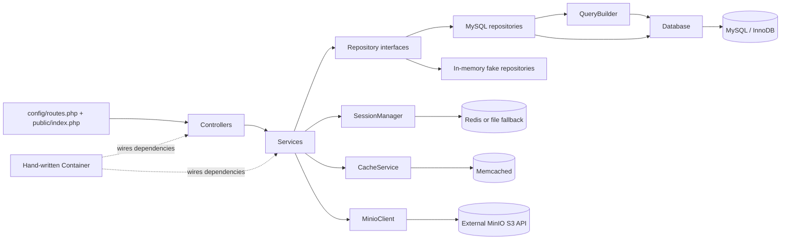
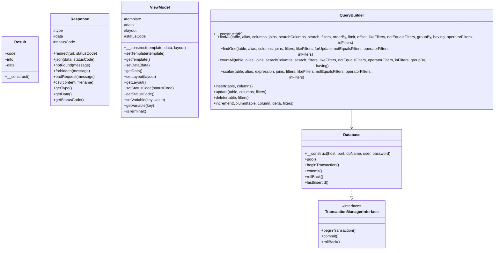

# Class Diagram — As Built

**Source snapshot:** 2026-10-04, current working tree based on HEAD `239a98e`; uncommitted remediation included. This replaces the earlier diagram's guessed Result and fluent QueryBuilder APIs. Method and parameter names below were extracted from the actual PHP declarations. Types are omitted where the implementation does not declare them; diagram visibility describes members, not immutability guarantees.

## Runtime boundaries

The Container memoizes the request database connection. SQL lives in repositories and QueryBuilder. Report queries that need derived tables use prepared PDO statements in ReportMySQLRepository. The current inventory-value KPI is shared through ProductStockRepository::totalInventoryValue(categoryId, warehouseId); report and dashboard retain their own presentation/scope orchestration. CSV uses detailed service export rows, while CsvExportService formats and escapes those rows.

## Core contracts

Sources: [Result](../../app/Core/Result.php), [Response](../../app/Core/Response.php), [ViewModel](../../app/Core/ViewModel.php), [TransactionManagerInterface](../../app/Core/TransactionManagerInterface.php), [Database](../../app/Core/Database.php), [QueryBuilder](../../app/Repository/MySQL/QueryBuilder.php).

## Order and inventory entities

```mermaid
classDiagram
    class Product {
        +id
        +sku
        +barcode
        +name
        +description
        +categoryId
        +unit
        +purchasePrice
        +salePrice
        +reorderPoint
        +imagePath
        +isActive
        +createdAt
        +updatedAt
        +categoryName
        +__construct(id, sku, name, categoryId, unit, purchasePrice, salePrice, reorderPoint, imagePath, isActive, createdAt, updatedAt, categoryName, barcode, description)
        +fromArray(row)
        +toArray()
    }
    class ProductStock {
        +id
        +productId
        +warehouseId
        +quantity
        +updatedAt
        +__construct(id, productId, warehouseId, quantity, updatedAt)
        +fromArray(row)
        +toArray()
    }
    class PurchaseOrder {
        +id
        +supplierId
        +destinationWarehouseId
        +status
        +orderDate
        +note
        +createdBy
        +createdAt
        +updatedAt
        +supplierName
        +destinationWarehouseName
        +createdByName
        +items
        +itemsCount
        +itemsQtyOrdered
        +itemsQtyReceived
        +totalValue
        +receiptProgressPct
        +__construct(id, supplierId, destinationWarehouseId, status, orderDate, note, createdBy, createdAt, updatedAt, supplierName, destinationWarehouseName, createdByName, items)
        +fromArray(row)
        +withItems(items)
        +canBeCancelled()
        +canReceiveGoods()
        +statusLabel()
        +statusLabelFor(status)
        +toArray()
    }
    class PurchaseOrderItem {
        +id
        +purchaseOrderId
        +productId
        +qtyOrdered
        +qtyReceived
        +purchasePrice
        +createdAt
        +updatedAt
        +productName
        +productSku
        +productUnit
        +__construct(id, purchaseOrderId, productId, qtyOrdered, qtyReceived, purchasePrice, createdAt, updatedAt, productName, productSku, productUnit)
        +fromArray(row)
        +qtyRemaining()
        +isFullyReceived()
        +toArray()
    }
    class SalesOrder {
        +id
        +customerId
        +sourceWarehouseId
        +status
        +orderDate
        +note
        +createdBy
        +approvedBy
        +approvedAt
        +issuedBy
        +issuedAt
        +cancellationReason
        +createdAt
        +updatedAt
        +customerName
        +sourceWarehouseName
        +createdByName
        +approvedByName
        +issuedByName
        +items
        +itemsCount
        +itemsQty
        +totalValue
        +__construct(id, customerId, sourceWarehouseId, status, orderDate, note, createdBy, approvedBy, approvedAt, issuedBy, issuedAt, cancellationReason, createdAt, updatedAt, customerName, sourceWarehouseName, createdByName, approvedByName, issuedByName, items)
        +fromArray(row)
        +withItems(items)
        +canIssueGoods()
        +statusLabel()
        +statusLabelFor(status)
        +toArray()
    }
    class SalesOrderItem {
        +id
        +salesOrderId
        +productId
        +qty
        +salePrice
        +createdAt
        +productName
        +productSku
        +productUnit
        +__construct(id, salesOrderId, productId, qty, salePrice, createdAt, productName, productSku, productUnit)
        +fromArray(row)
        +toArray()
    }
    class StockLedgerEntry {
        +id
        +productId
        +warehouseId
        +type
        +qty
        +refType
        +refId
        +note
        +doneByUserId
        +doneAt
        +productName
        +productSku
        +warehouseName
        +userName
        +__construct(id, productId, warehouseId, type, qty, refType, refId, note, doneByUserId, doneAt, productName, productSku, warehouseName, userName)
        +fromArray(row)
        +toArray()
    }
```

Sources: [Product](../../app/Entity/Product.php), [ProductStock](../../app/Entity/ProductStock.php), [PurchaseOrder](../../app/Entity/PurchaseOrder.php), [PurchaseOrderItem](../../app/Entity/PurchaseOrderItem.php), [SalesOrder](../../app/Entity/SalesOrder.php), [SalesOrderItem](../../app/Entity/SalesOrderItem.php), [StockLedgerEntry](../../app/Entity/StockLedgerEntry.php).

## Business workflows

```mermaid
classDiagram
    class PurchaseOrderService {
        +__construct(purchaseOrderRepository, purchaseOrderItemRepository, supplierRepository, warehouseRepository, productRepository, eventLogService, transactionManager)
        +listPurchaseOrders(status)
        +countAll(status, search, warehouseIds, orderNumber, supplierName)
        +findForExport(from, to, warehouseId)
        +findAll(status, limit, offset, search, sortDirection, warehouseIds, orderNumber, supplierName)
        +findById(id)
        +create(input, items, createdByUserId)
        +submit(id, actorId)
        +cancel(id, actorId)
        +recomputeStatus(id)
    }
    class SalesOrderService {
        +__construct(salesOrderRepository, salesOrderItemRepository, customerRepository, warehouseRepository, productRepository, policy, eventLogService, transactionManager)
        +listSalesOrders(userId, filters, limit, offset)
        +countSalesOrders(userId, filters)
        +findForExport(from, to, userId, warehouseId)
        +findById(id)
        +create(input, items, createdByUserId)
        +findEditableDraft(id, actorId, isAdmin)
        +updateDraft(id, input, items, actorId, isAdmin)
        +submitForApproval(id, actorId)
        +approve(id, actorId, isActorAdmin)
        +reject(id, actorId, isActorAdmin, reason)
        +cancel(id, actorId, isAdmin)
    }
    class SalesOrderPolicy {
        +assertCanDecide(isActorAdmin)
        +assertCanCancel(salesOrder, actorId, isAdmin)
        +assertCanIssue(salesOrder)
    }
    class GoodsReceiptService {
        +__construct(transactionManager, purchaseOrderRepository, purchaseOrderItemRepository, productStockRepository, stockLedgerRepository, purchaseOrderService, eventLogService)
        +process(purchaseOrderId, receiptLines, userId)
    }
    class GoodsIssueService {
        +__construct(transactionManager, salesOrderRepository, salesOrderItemRepository, productStockRepository, stockLedgerRepository, policy, eventLogService)
        +issue(salesOrderId, actorUserId)
    }
    class ProductService {
        +__construct(productRepository, categoryRepository, stockRepository, cacheService, eventLogService)
        +listProducts(search, categoryId)
        +countAll(search, categoryIds, warehouseIds, stockStatus, sku, productName)
        +getStockMetrics()
        +findAll(search, limit, offset, categoryIds, warehouseIds, stockStatus, sku, productName, sort)
        +listActiveProducts()
        +findById(id)
        +findBySku(sku)
        +getAvailability(sku)
        +getStockBreakdownByProduct(productId)
        +createProduct(input, imagePath, actorId, initialStockHook)
        +updateProduct(id, input, actorId)
        +updateImagePath(id, imagePath)
        +setActive(id, active, actorId)
    }
    class DashboardService {
        +__construct(productRepository, productStockRepository, purchaseOrderRepository, salesOrderRepository, eventLogRepository)
        +getAdminStats()
        +getSalesStats(userId)
        +getWarehouseStats()
    }
    class ReportService {
        +__construct(reportRepository)
        +normalizeParams(raw)
        +getDashboard(params, warehouses)
    }
    class AuthService {
        +__construct(userRepository, session, eventLogService)
        +login(email, password)
        +logout()
        +currentUser()
    }
    class UserService {
        +__construct(userRepository, eventLogService)
        +listUsers(search, statuses, roles, name, email)
        +findById(id)
        +createUser(input, actorId)
        +updateUser(id, input, actorId)
        +setActive(id, active, actorId)
        +updateProfile(id, name, email)
    }
    class ReportDateRangePolicy {
        +assertValid(from, to)
    }
    SalesOrderService --> ReportDateRangePolicy
    PurchaseOrderService --> ReportDateRangePolicy
    SalesOrderService --> SalesOrderPolicy
    GoodsIssueService --> SalesOrderPolicy
    GoodsReceiptService --> PurchaseOrderService
```

Sources: [ReportDateRangePolicy](../../app/Service/ReportDateRangePolicy.php), [PurchaseOrderService](../../app/Service/PurchaseOrderService.php), [SalesOrderService](../../app/Service/SalesOrderService.php), [SalesOrderPolicy](../../app/Service/SalesOrderPolicy.php), [GoodsReceiptService](../../app/Service/GoodsReceiptService.php), [GoodsIssueService](../../app/Service/GoodsIssueService.php), [ProductService](../../app/Service/ProductService.php), [DashboardService](../../app/Service/DashboardService.php), [ReportService](../../app/Service/ReportService.php), [AuthService](../../app/Service/AuthService.php), [UserService](../../app/Service/UserService.php).

## Repository contracts and implementation parity

Each interface has a MySQL implementation and an in-memory fake. The fake simulates repository behavior; it does not acquire InnoDB locks or provide database transaction rollback. Domain workflow smoke checks therefore prove logical branches/order, while real concurrency and persistence rollback require the integration suite.

| Contract | MySQL | Fake |
|---|---|---|
| [CategoryRepositoryInterface](../../app/Repository/Interface/CategoryRepositoryInterface.php) | [CategoryMySQLRepository](../../app/Repository/MySQL/CategoryMySQLRepository.php) | [CategoryFakeRepository](../../app/Repository/Fake/CategoryFakeRepository.php) |
| [CustomerRepositoryInterface](../../app/Repository/Interface/CustomerRepositoryInterface.php) | [CustomerMySQLRepository](../../app/Repository/MySQL/CustomerMySQLRepository.php) | [CustomerFakeRepository](../../app/Repository/Fake/CustomerFakeRepository.php) |
| [EventLogRepositoryInterface](../../app/Repository/Interface/EventLogRepositoryInterface.php) | [EventLogMySQLRepository](../../app/Repository/MySQL/EventLogMySQLRepository.php) | [EventLogFakeRepository](../../app/Repository/Fake/EventLogFakeRepository.php) |
| [FileValidationRepositoryInterface](../../app/Repository/Interface/FileValidationRepositoryInterface.php) | [FileValidationMySQLRepository](../../app/Repository/MySQL/FileValidationMySQLRepository.php) | [FileValidationFakeRepository](../../app/Repository/Fake/FileValidationFakeRepository.php) |
| [NotificationRepositoryInterface](../../app/Repository/Interface/NotificationRepositoryInterface.php) | [NotificationMySQLRepository](../../app/Repository/MySQL/NotificationMySQLRepository.php) | [NotificationFakeRepository](../../app/Repository/Fake/NotificationFakeRepository.php) |
| [PermissionRepositoryInterface](../../app/Repository/Interface/PermissionRepositoryInterface.php) | [PermissionMySQLRepository](../../app/Repository/MySQL/PermissionMySQLRepository.php) | [PermissionFakeRepository](../../app/Repository/Fake/PermissionFakeRepository.php) |
| [ProductRepositoryInterface](../../app/Repository/Interface/ProductRepositoryInterface.php) | [ProductMySQLRepository](../../app/Repository/MySQL/ProductMySQLRepository.php) | [ProductFakeRepository](../../app/Repository/Fake/ProductFakeRepository.php) |
| [ProductStockRepositoryInterface](../../app/Repository/Interface/ProductStockRepositoryInterface.php) | [ProductStockMySQLRepository](../../app/Repository/MySQL/ProductStockMySQLRepository.php) | [ProductStockFakeRepository](../../app/Repository/Fake/ProductStockFakeRepository.php) |
| [PurchaseOrderItemRepositoryInterface](../../app/Repository/Interface/PurchaseOrderItemRepositoryInterface.php) | [PurchaseOrderItemMySQLRepository](../../app/Repository/MySQL/PurchaseOrderItemMySQLRepository.php) | [PurchaseOrderItemFakeRepository](../../app/Repository/Fake/PurchaseOrderItemFakeRepository.php) |
| [PurchaseOrderRepositoryInterface](../../app/Repository/Interface/PurchaseOrderRepositoryInterface.php) | [PurchaseOrderMySQLRepository](../../app/Repository/MySQL/PurchaseOrderMySQLRepository.php) | [PurchaseOrderFakeRepository](../../app/Repository/Fake/PurchaseOrderFakeRepository.php) |
| [ReportRepositoryInterface](../../app/Repository/Interface/ReportRepositoryInterface.php) | [ReportMySQLRepository](../../app/Repository/MySQL/ReportMySQLRepository.php) | [ReportFakeRepository](../../app/Repository/Fake/ReportFakeRepository.php) |
| [SalesOrderItemRepositoryInterface](../../app/Repository/Interface/SalesOrderItemRepositoryInterface.php) | [SalesOrderItemMySQLRepository](../../app/Repository/MySQL/SalesOrderItemMySQLRepository.php) | [SalesOrderItemFakeRepository](../../app/Repository/Fake/SalesOrderItemFakeRepository.php) |
| [SalesOrderRepositoryInterface](../../app/Repository/Interface/SalesOrderRepositoryInterface.php) | [SalesOrderMySQLRepository](../../app/Repository/MySQL/SalesOrderMySQLRepository.php) | [SalesOrderFakeRepository](../../app/Repository/Fake/SalesOrderFakeRepository.php) |
| [StockLedgerRepositoryInterface](../../app/Repository/Interface/StockLedgerRepositoryInterface.php) | [StockLedgerMySQLRepository](../../app/Repository/MySQL/StockLedgerMySQLRepository.php) | [StockLedgerFakeRepository](../../app/Repository/Fake/StockLedgerFakeRepository.php) |
| [SupplierRepositoryInterface](../../app/Repository/Interface/SupplierRepositoryInterface.php) | [SupplierMySQLRepository](../../app/Repository/MySQL/SupplierMySQLRepository.php) | [SupplierFakeRepository](../../app/Repository/Fake/SupplierFakeRepository.php) |
| [UserRepositoryInterface](../../app/Repository/Interface/UserRepositoryInterface.php) | [UserMySQLRepository](../../app/Repository/MySQL/UserMySQLRepository.php) | [UserFakeRepository](../../app/Repository/Fake/UserFakeRepository.php) |
| [WarehouseRepositoryInterface](../../app/Repository/Interface/WarehouseRepositoryInterface.php) | [WarehouseMySQLRepository](../../app/Repository/MySQL/WarehouseMySQLRepository.php) | [WarehouseFakeRepository](../../app/Repository/Fake/WarehouseFakeRepository.php) |

## Order transition and persistence contracts

PO submit/cancel and SO submit/approve/reject/cancel pass an expected current status to updateStatus. SQL updates include both id and expected status, and an affected-row mismatch returns validation failure. Optional expected-status parameters preserve existing callers that already hold a header lock.

Draft SO editing checks ownership/Admin and Draft status, validates header/items, then locks the existing SO header in the established transaction manager and rechecks Draft before replacing header/items. Failure rolls back. Goods receipt and issue lock the order header first, then lock stock rows by ascending product id; item quantities remain associated with their products after sorting.

Result is a mutable object with public code/info/data and constants CODE_SUCCESS=0, CODE_VALIDATION=1, CODE_INTERNAL=2. It has no ok(), getOrThrow(), message property, or CODE_NOT_FOUND. HTTP errors are represented through Response factories/status, not an invented Result code.

QueryBuilder exposes findAll/findOne/countAll/scalar/insert/update/delete and named-parameter query execution. It is not a fluent select/where/fetchAll builder. ViewModel uses set/getTemplate, set/getData, set/getLayout, set/getStatusCode, and variable setters/getters. Response has factories plus getType/getData/getStatusCode; public/index.php emits the response.

## Verification limits and design history

The original design remains in [class-diagram-initial.md](../planning/class-diagram-initial.md). [ADR-001](adr-001-repository-pattern.md) describes repository boundaries and [ADR-002](adr-002-concurrency-strategy.md) describes locking. The current behavior and unresolved requirement decisions are tracked in the [reference audit](../quality/reference-gap-audit-2026-10-04.md). This source snapshot does not claim an HTTP demo, real database concurrency run, Docker build, or fresh Sonar scan.
