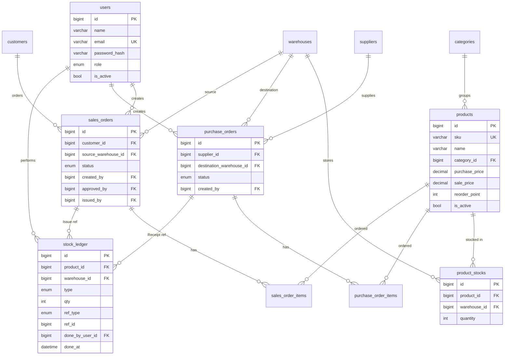

# Database Schema — Detailed Design (Stage 4)

- **Status:** Initial — to be implemented as `database/schema.sql` in Stage 6
- **Date:** 2026-09-01
- **Stage:** 4 / 9 (Technical Design)
- **Engine:** MySQL 8.0+, InnoDB
- **Charset:** utf8mb4 / utf8mb4_unicode_ci
- **Related:** PRD §2 (high-level model), §1 BR-001 s/d BR-022, §9 ARCH-01/02

---

## 1. Conventions

1. **Naming:**
   - Table: snake_case, plural (`users`, `sales_orders`).
   - Column: snake_case singular (`name`, `created_at`).
   - FK column: `<singular_table>_id` (e.g. `product_id`).
   - Index: `idx_<table>_<column>` (e.g. `idx_sales_orders_status`).
   - Unique index: `uniq_<table>_<column>` (e.g. `uniq_products_sku`).

2. **Primary key:** semua tabel menggunakan `id BIGINT UNSIGNED AUTO_INCREMENT PRIMARY KEY`. BIGINT (bukan INT) untuk mencegah kehabisan ID di long-running systems.

3. **Timestamps:** semua entity yang dimutasi user punya `created_at DATETIME` + `updated_at DATETIME`. Default `CURRENT_TIMESTAMP` dan `ON UPDATE CURRENT_TIMESTAMP`.

4. **Soft-delete (deactivation):**
   - Entity master (`users`, `products`, `warehouses`, `suppliers`, `customers`) menggunakan `is_active TINYINT(1)` flag, BUKAN hard-delete.
   - Constraint: BR-005 (product sudah dipakai order tidak boleh hard-delete), BR-019 (master non-aktif tidak muncul di form create).

5. **Money:** gunakan `DECIMAL(15,2)` (15 digit total, 2 desimal — cukup untuk inventory value miliaran).

6. **Quantity:** `INT UNSIGNED` (selalu non-negatif, di-enforce oleh aplikasi + CHECK constraint untuk defense-in-depth).

7. **Audit fields** (untuk transaksi): `created_by INT UNSIGNED`, `approved_by`, `issued_by` — track siapa yang melakukan aksi, untuk traceability.

---

## 2. Entity Reference

> **Note (2026-09-18):** `database/schema.sql` has since gained a `created_by`/`updated_by`
> audit-trail pair (+ their FKs and single-column indexes) on every table, added in a separate
> pass not yet reflected in the column tables below. This section was updated only for the new
> **name/sort/dedupe indexes** requested below — the `created_by`/`updated_by` columns and their
> indexes are a separate, still-open documentation gap (not part of this pass).

### 2.1 `users`

| Column | Type | Constraint | Note |
|--------|------|-----------|------|
| `id` | BIGINT UNSIGNED | PK, AUTO_INCREMENT | |
| `name` | VARCHAR(100) | NOT NULL | |
| `email` | VARCHAR(255) | NOT NULL, **UNIQUE** | BR-004 |
| `password_hash` | VARCHAR(255) | NOT NULL | bcrypt via `password_hash()` |
| `role` | ENUM('Admin','Sales','WarehouseStaff') | NOT NULL | |
| `is_active` | TINYINT(1) | NOT NULL DEFAULT 1 | BR: deactivation |
| `created_at` | DATETIME | NOT NULL DEFAULT CURRENT_TIMESTAMP | |
| `updated_at` | DATETIME | NOT NULL DEFAULT CURRENT_TIMESTAMP ON UPDATE CURRENT_TIMESTAMP | |

| Index | Type | Columns | Note |
|-------|------|---------|------|
| PRIMARY | BTREE | `id` | |
| `uniq_users_email` | UNIQUE BTREE | `email` | BR-004 |
| `idx_users_name` | BTREE | `name` | sort target — `UserMySQLRepository::findAll()` always `ORDER BY name ASC` |

---

### 2.2 `categories`

| Column | Type | Constraint | Note |
|--------|------|-----------|------|
| `id` | BIGINT UNSIGNED | PK | |
| `name` | VARCHAR(100) | NOT NULL, **UNIQUE** | |
| `description` | VARCHAR(500) | NULL | |
| `is_active` | TINYINT(1) | NOT NULL DEFAULT 1 | |
| `created_at` | DATETIME | NOT NULL DEFAULT CURRENT_TIMESTAMP | |
| `updated_at` | DATETIME | NOT NULL DEFAULT CURRENT_TIMESTAMP ON UPDATE CURRENT_TIMESTAMP | |

| Index | Type | Columns |
|-------|------|---------|
| PRIMARY | BTREE | `id` |
| `uniq_categories_name` | UNIQUE BTREE | `name` |

---

### 2.3 `products`

| Column | Type | Constraint | Note |
|--------|------|-----------|------|
| `id` | BIGINT UNSIGNED | PK | |
| `sku` | VARCHAR(50) | NOT NULL, **UNIQUE** | BR-003 |
| `name` | VARCHAR(150) | NOT NULL | |
| `category_id` | BIGINT UNSIGNED | NOT NULL, **FK → categories(id)** ON DELETE RESTRICT | Cegah orphan |
| `unit` | VARCHAR(20) | NOT NULL | mis. 'pcs', 'box' |
| `purchase_price` | DECIMAL(15,2) | NOT NULL DEFAULT 0, **CHECK (purchase_price >= 0)** | |
| `sale_price` | DECIMAL(15,2) | NOT NULL DEFAULT 0, **CHECK (sale_price >= 0)** | |
| `reorder_point` | INT UNSIGNED | NOT NULL DEFAULT 0, **CHECK (reorder_point >= 0)** | PRD-01 FR-4.4 |
| `image_path` | VARCHAR(255) | NULL | mis. '/uploads/products/2026/09/abc.webp' |
| `is_active` | TINYINT(1) | NOT NULL DEFAULT 1 | BR-005, BR-019 |
| `created_at` | DATETIME | NOT NULL DEFAULT CURRENT_TIMESTAMP | |
| `updated_at` | DATETIME | NOT NULL DEFAULT CURRENT_TIMESTAMP ON UPDATE CURRENT_TIMESTAMP | |

| Index | Type | Columns | Note |
|-------|------|---------|------|
| PRIMARY | BTREE | `id` | |
| `uniq_products_sku` | UNIQUE BTREE | `sku` | BR-003 |
| `idx_products_category` | BTREE | `category_id` | |
| `idx_products_active` | BTREE | `is_active` | filter dropdown |
| `idx_products_name` | BTREE | `name` | sort target — every product list/search sorts `name ASC` (`ProductMySQLRepository::findAll/findAllActive/countAll`); also the sort column in `StockLedgerMySQLRepository::findFiltered()` |

---

### 2.4 `warehouses`

| Column | Type | Constraint | Note |
|--------|------|-----------|------|
| `id` | BIGINT UNSIGNED | PK | |
| `code` | VARCHAR(20) | NOT NULL, **UNIQUE** | |
| `name` | VARCHAR(100) | NOT NULL | |
| `location` | VARCHAR(255) | NULL | |
| `is_active` | TINYINT(1) | NOT NULL DEFAULT 1 | |
| `created_at` | DATETIME | NOT NULL DEFAULT CURRENT_TIMESTAMP | |
| `updated_at` | DATETIME | NOT NULL DEFAULT CURRENT_TIMESTAMP ON UPDATE CURRENT_TIMESTAMP | |

| Index | Type | Columns | Note |
|-------|------|---------|------|
| PRIMARY | BTREE | `id` | |
| `uniq_warehouses_code` | UNIQUE BTREE | `code` | |
| `idx_warehouses_name` | BTREE | `name` | sort target — `w.name` is a selectable sort column in `StockLedgerMySQLRepository::findFiltered()` (`sort_col=warehouse`) |

---

### 2.5 `product_stocks`

Inti dari ARCH-02 — di sini `SELECT ... FOR UPDATE` akan dijalankan.

| Column | Type | Constraint | Note |
|--------|------|-----------|------|
| `id` | BIGINT UNSIGNED | PK | |
| `product_id` | BIGINT UNSIGNED | NOT NULL, **FK → products(id)** ON DELETE RESTRICT | |
| `warehouse_id` | BIGINT UNSIGNED | NOT NULL, **FK → warehouses(id)** ON DELETE RESTRICT | |
| `quantity` | INT UNSIGNED | NOT NULL DEFAULT 0, **CHECK (quantity >= 0)** | **BR-002 — hard constraint** |
| `updated_at` | DATETIME | NOT NULL DEFAULT CURRENT_TIMESTAMP ON UPDATE CURRENT_TIMESTAMP | |

| Index | Type | Columns | Note |
|-------|------|---------|------|
| PRIMARY | BTREE | `id` | |
| `uniq_product_warehouse` | **UNIQUE BTREE** | `(product_id, warehouse_id)` | composite — 1 baris per produk+gudang |
| `idx_stocks_product` | BTREE | `product_id` | lookup sum by product |

> **Penting:** Stok TIDAK PERNAH di-update langsung lewat endpoint UI/repository. Mutasi hanya lewat `GoodsReceiptService` / `GoodsIssueService` / `AdjustmentService` (jika ada) di dalam transaction. (BR-002, BR-015)

---

### 2.6 `suppliers`

| Column | Type | Constraint | Note |
|--------|------|-----------|------|
| `id` | BIGINT UNSIGNED | PK | |
| `name` | VARCHAR(150) | NOT NULL | |
| `contact_person` | VARCHAR(100) | NULL | |
| `phone` | VARCHAR(30) | NULL | |
| `email` | VARCHAR(255) | NULL | |
| `is_active` | TINYINT(1) | NOT NULL DEFAULT 1 | |
| `created_at` | DATETIME | NOT NULL DEFAULT CURRENT_TIMESTAMP | |
| `updated_at` | DATETIME | NOT NULL DEFAULT CURRENT_TIMESTAMP ON UPDATE CURRENT_TIMESTAMP | |

| Index | Type | Columns | Note |
|-------|------|---------|------|
| PRIMARY | BTREE | `id` | |
| `idx_suppliers_active` | BTREE | `is_active` | |
| `idx_suppliers_name` | BTREE | `name` | sort target — `SupplierMySQLRepository::findAll()` always `ORDER BY name ASC`; also matched by `PurchaseOrderMySQLRepository::findAll()`'s joined `s.name` search |

---

### 2.7 `customers`

| Column | Type | Constraint | Note |
|--------|------|-----------|------|
| `id` | BIGINT UNSIGNED | PK | |
| `name` | VARCHAR(150) | NOT NULL | |
| `contact_person` | VARCHAR(100) | NULL | |
| `phone` | VARCHAR(30) | NULL | |
| `email` | VARCHAR(255) | NULL | |
| `is_active` | TINYINT(1) | NOT NULL DEFAULT 1 | |
| `created_at` | DATETIME | NOT NULL DEFAULT CURRENT_TIMESTAMP | |
| `updated_at` | DATETIME | NOT NULL DEFAULT CURRENT_TIMESTAMP ON UPDATE CURRENT_TIMESTAMP | |

| Index | Type | Columns | Note |
|-------|------|---------|------|
| PRIMARY | BTREE | `id` | |
| `idx_customers_active` | BTREE | `is_active` | |
| `idx_customers_name` | BTREE | `name` | sort target — `CustomerMySQLRepository::findAll()` always `ORDER BY name ASC`; also matched by `SalesOrderMySQLRepository::findAll()`'s joined `c.name` search |

---

### 2.8 `purchase_orders`

| Column | Type | Constraint | Note |
|--------|------|-----------|------|
| `id` | BIGINT UNSIGNED | PK | |
| `supplier_id` | BIGINT UNSIGNED | NOT NULL, **FK → suppliers(id)** ON DELETE RESTRICT | |
| `destination_warehouse_id` | BIGINT UNSIGNED | NOT NULL, **FK → warehouses(id)** ON DELETE RESTRICT | |
| `status` | ENUM('Draft','Ordered','PartiallyReceived','Received','Cancelled') | NOT NULL DEFAULT 'Draft' | BR-012 |
| `order_date` | DATE | NOT NULL | |
| `note` | VARCHAR(500) | NULL | |
| `created_by` | BIGINT UNSIGNED | NOT NULL, **FK → users(id)** ON DELETE RESTRICT | |
| `created_at` | DATETIME | NOT NULL DEFAULT CURRENT_TIMESTAMP | |
| `updated_at` | DATETIME | NOT NULL DEFAULT CURRENT_TIMESTAMP ON UPDATE CURRENT_TIMESTAMP | |

| Index | Type | Columns | Note |
|-------|------|---------|------|
| PRIMARY | BTREE | `id` | |
| `idx_po_status` | BTREE | `status` | filter list, dashboard |
| `idx_po_order_date` | BTREE | `order_date` | sort + report |
| `idx_po_supplier` | BTREE | `supplier_id` | |
| `idx_po_dest_wh` | BTREE | `destination_warehouse_id` | |

---

### 2.9 `purchase_order_items`

| Column | Type | Constraint | Note |
|--------|------|-----------|------|
| `id` | BIGINT UNSIGNED | PK | |
| `purchase_order_id` | BIGINT UNSIGNED | NOT NULL, **FK → purchase_orders(id) ON DELETE CASCADE** | Hapus PO → hapus items (saat masih Draft) |
| `product_id` | BIGINT UNSIGNED | NOT NULL, **FK → products(id)** ON DELETE RESTRICT | |
| `qty_ordered` | INT UNSIGNED | NOT NULL, **CHECK (qty_ordered > 0)** | |
| `qty_received` | INT UNSIGNED | NOT NULL DEFAULT 0, **CHECK (qty_received >= 0)** | |
| `purchase_price` | DECIMAL(15,2) | NOT NULL, **CHECK (purchase_price >= 0)** | snapshot price saat PO dibuat |
| `created_at` | DATETIME | NOT NULL DEFAULT CURRENT_TIMESTAMP | |
| `updated_at` | DATETIME | NOT NULL DEFAULT CURRENT_TIMESTAMP ON UPDATE CURRENT_TIMESTAMP | |

| Index | Type | Columns |
|-------|------|---------|
| PRIMARY | BTREE | `id` |
| `idx_poi_po` | BTREE | `purchase_order_id` |
| `idx_poi_product` | BTREE | `product_id` |

---

### 2.10 `sales_orders`

| Column | Type | Constraint | Note |
|--------|------|-----------|------|
| `id` | BIGINT UNSIGNED | PK | |
| `customer_id` | BIGINT UNSIGNED | NOT NULL, **FK → customers(id)** ON DELETE RESTRICT | |
| `source_warehouse_id` | BIGINT UNSIGNED | NOT NULL, **FK → warehouses(id)** ON DELETE RESTRICT | |
| `status` | ENUM('Draft','PendingApproval','Approved','Fulfilled','Cancelled') | NOT NULL DEFAULT 'Draft' | BR-011 |
| `order_date` | DATE | NOT NULL | |
| `note` | VARCHAR(500) | NULL | |
| `created_by` | BIGINT UNSIGNED | NOT NULL, **FK → users(id)** ON DELETE RESTRICT | sales who created |
| `approved_by` | BIGINT UNSIGNED | NULL, **FK → users(id)** ON DELETE RESTRICT | BR-001: must differ from created_by |
| `approved_at` | DATETIME | NULL | |
| `issued_by` | BIGINT UNSIGNED | NULL, **FK → users(id)** ON DELETE RESTRICT | warehouse staff who issued |
| `issued_at` | DATETIME | NULL | |
| `cancellation_reason` | VARCHAR(500) | NULL | if rejected/cancelled |
| `created_at` | DATETIME | NOT NULL DEFAULT CURRENT_TIMESTAMP | |
| `updated_at` | DATETIME | NOT NULL DEFAULT CURRENT_TIMESTAMP ON UPDATE CURRENT_TIMESTAMP | |

| Index | Type | Columns | Note |
|-------|------|---------|------|
| PRIMARY | BTREE | `id` | |
| `idx_so_status_creator` | BTREE | `(status, created_by)` | **BR-018** (sales scope: own SO only) + dashboard; leftmost column (`status`) also serves plain filter-list queries — the previously-separate `idx_so_status` was removed 2026-09-18 as redundant |
| `idx_so_order_date` | BTREE | `order_date` | sort + report |
| `idx_so_customer` | BTREE | `customer_id` | |
| `idx_so_source_wh` | BTREE | `source_warehouse_id` | |

> **Composite index `(status, created_by)`** adalah **critical** untuk BR-018 — query "find all SO where status='PendingApproval'" by sales scope butuh ini agar tidak full table scan.

---

### 2.11 `sales_order_items`

| Column | Type | Constraint | Note |
|--------|------|-----------|------|
| `id` | BIGINT UNSIGNED | PK | |
| `sales_order_id` | BIGINT UNSIGNED | NOT NULL, **FK → sales_orders(id) ON DELETE CASCADE** | |
| `product_id` | BIGINT UNSIGNED | NOT NULL, **FK → products(id)** ON DELETE RESTRICT | |
| `qty` | INT UNSIGNED | NOT NULL, **CHECK (qty > 0)** | |
| `sale_price` | DECIMAL(15,2) | NOT NULL, **CHECK (sale_price >= 0)** | snapshot price saat SO dibuat |
| `created_at` | DATETIME | NOT NULL DEFAULT CURRENT_TIMESTAMP | |

| Index | Type | Columns |
|-------|------|---------|
| PRIMARY | BTREE | `id` |
| `idx_soi_so` | BTREE | `sales_order_id` |
| `idx_soi_product` | BTREE | `product_id` |

---

### 2.12 `stock_ledger`

Immutable — INSERT ONLY. Tidak boleh UPDATE/DELETE baris ledger.

| Column | Type | Constraint | Note |
|--------|------|-----------|------|
| `id` | BIGINT UNSIGNED | PK | |
| `product_id` | BIGINT UNSIGNED | NOT NULL, **FK → products(id)** ON DELETE RESTRICT | |
| `warehouse_id` | BIGINT UNSIGNED | NOT NULL, **FK → warehouses(id)** ON DELETE RESTRICT | |
| `type` | ENUM('Receipt','Issue','Adjustment') | NOT NULL | |
| `qty` | INT | NOT NULL | **sign convention: Receipt & positive Adj = +N, Issue & negative Adj = -N** |
| `ref_type` | ENUM('PO','SO','Adjustment') | NULL | |
| `ref_id` | BIGINT UNSIGNED | NULL | ID ke PO/SO refer |
| `note` | VARCHAR(255) | NULL | opsional, e.g. "Initial stock" |
| `done_by_user_id` | BIGINT UNSIGNED | NOT NULL, **FK → users(id)** ON DELETE RESTRICT | BR-015 |
| `done_at` | DATETIME | NOT NULL DEFAULT CURRENT_TIMESTAMP | |

| Index | Type | Columns | Note |
|-------|------|---------|------|
| PRIMARY | BTREE | `id` | |
| `idx_ledger_product_wh_done_at` | BTREE | `(product_id, warehouse_id, done_at)` | laporan rentang waktu |
| `idx_ledger_done_at` | BTREE | `done_at` | REPORT-01 date range filter |
| `idx_ledger_ref` | BTREE | `(ref_type, ref_id)` | lookup by PO/SO |

> **Invariant BR-015 / ARCH-02 AC3:**
> ```
> product_stocks.quantity(pi, wi) == initial_seed + SUM(stock_ledger.qty WHERE product_id=pi AND warehouse_id=wi)
> ```

---

### 2.13 `translation_cache` — **REMOVED 2026-09-18**

Was a bonus-feature table (I18N-02, LibreTranslate) — `id`, `source_text_hash`, `source_lang`,
`target_lang`, `translated_text`, unique on `(source_text_hash, source_lang, target_lang)`. Verified
via `grep -rl translation_cache app/ scripts/ public/` → zero hits before removal: no entity,
repository, or query ever referenced it. The app's actual translation caching goes through
`CacheService` (Memcached), not a database table — this table was dead DDL from the start. Dropped
from `database/schema.sql` on explicit request; kept here as a historical record per this project's
convention of documenting before/after rather than erasing history.

---

### 2.14 `notifications`

Bonus feature (§2 "Scheduled Job — Notifikasi stok rendah", DIPERBOLEHKAN). In-app only,
populated by `scripts/check-low-stock.php` (JOB-01), read by Admin/WarehouseStaff dashboards.
Was previously undocumented in this file — added 2026-09-18 alongside its index update.

| Column | Type | Constraint | Note |
|--------|------|-----------|------|
| `id` | BIGINT UNSIGNED | PK | |
| `type` | VARCHAR(50) | NOT NULL | |
| `message` | VARCHAR(255) | NOT NULL | |
| `product_id` | BIGINT UNSIGNED | NULL, **FK → products(id)** ON DELETE CASCADE | |
| `warehouse_id` | BIGINT UNSIGNED | NULL, **FK → warehouses(id)** ON DELETE CASCADE | |
| `read_at` | DATETIME | NULL | `NULL` = unread |
| `created_at` | DATETIME | NOT NULL DEFAULT CURRENT_TIMESTAMP | |
| `updated_at` | DATETIME | NOT NULL DEFAULT CURRENT_TIMESTAMP ON UPDATE CURRENT_TIMESTAMP | |

| Index | Type | Columns | Note |
|-------|------|---------|------|
| PRIMARY | BTREE | `id` | |
| `idx_notifications_unread_created` | BTREE | `(read_at, created_at)` | **replaces** a plain `read_at` index — covers both the `WHERE read_at IS NULL` predicate and the `ORDER BY created_at DESC` in one pass for `NotificationMySQLRepository::findUnread()`/`countUnread()` (the notification bell, polled on every authenticated page) |
| `idx_notifications_dedupe` | BTREE | `(type, product_id, warehouse_id, read_at)` | covers the exact-match dedupe lookup in `NotificationMySQLRepository::existsUnreadFor()`, called once per low-stock product on every scheduled-job run (JOB-01); its leftmost column (`type`) also covers any plain `WHERE type = ?` lookup, so no separate single-column index on `type` is kept |

---

### 2.15 `event_logs`

Added 2026-09-18. General, insert-only activity/event log — **not** a replacement for
`stock_ledger`. `stock_ledger` remains the sole authoritative record of stock quantity movements
(INV-2/INV-3); `event_logs` is a broader, best-effort trail across the whole system (auth events,
master-data CRUD, PO/SO lifecycle transitions, exports, etc.) for traceability/defense, and is
never read by authorization or stock logic.

| Column | Type | Constraint | Note |
|--------|------|-----------|------|
| `id` | BIGINT UNSIGNED | PK | |
| `user_id` | BIGINT UNSIGNED | NULL, **FK → users(id)** ON DELETE SET NULL | `NULL` = system/unauthenticated actor (e.g. a failed login before identity is known, or the scheduled job) |
| `action` | VARCHAR(60) | NOT NULL | e.g. `login`, `login_failed`, `logout`, `create`, `update`, `deactivate`, `approve`, `reject`, `receive`, `issue`, `export` |
| `entity_type` | VARCHAR(60) | NULL | e.g. `Product`, `SalesOrder`, `User` — `NULL` for non-entity events (login/logout) |
| `entity_id` | BIGINT UNSIGNED | NULL | affected row's id; `NULL` when `entity_type` is `NULL` |
| `description` | VARCHAR(500) | NOT NULL | human-readable summary, resolved at write time (project convention: literal messages, no i18n registry for log text) |
| `ip_address` | VARCHAR(45) | NULL | IPv4 or IPv6 |
| `user_agent` | VARCHAR(255) | NULL | |
| `metadata` | JSON | NULL | optional structured context (e.g. changed fields); informational only, never parsed for business/authorization decisions |
| `created_at` | DATETIME | NOT NULL DEFAULT CURRENT_TIMESTAMP | |

| Index | Type | Columns | Note |
|-------|------|---------|------|
| PRIMARY | BTREE | `id` | |
| `idx_event_logs_user` | BTREE | `user_id` | "show me everything this user did" (defense/incident review) |
| `idx_event_logs_action` | BTREE | `action` | "show me every X action" (e.g. all approve/reject events) |
| `idx_event_logs_entity` | BTREE | `(entity_type, entity_id)` | "show me the history of this one record" — the most common activity-log read pattern |
| `idx_event_logs_created_at` | BTREE | `created_at` | activity feeds and date-range exports always order/filter by `created_at DESC` |

**Wired to the application (2026-09-18)** — `App\Entity\EventLog`, `EventLogRepositoryInterface`
(+ MySQL/Fake implementations), and `EventLogService` (the shared "utility" every other Service
calls into) exist and are injected into every Service with a CUD action: `AuthService`
(login/login_failed/logout), the six master-data Services (create/update/activate/deactivate),
`PurchaseOrderService`/`SalesOrderService` (full lifecycle), and `GoodsReceiptService`/
`GoodsIssueService` (logged after `commit()`, never inside the stock/ledger transaction). See
`docs/quality/tech-debt.md` TDB-013 for the full file list and verification evidence.

---

## 3. Cross-Cutting Constraints

### 3.1 Foreign Keys — ON DELETE Behavior

| Reference | Behavior | Alasan |
|-----------|----------|--------|
| `*.id` → `users.id` | **RESTRICT** | user historis harus tetap terlihat (SO creator tidak hilang) |
| `*.id` → `products.id` (dari PO/SO items) | **RESTRICT** | produk historis harus tetap valid |
| `*.id` → `products.id` (dari product_stocks) | **RESTRICT** | sama |
| `*.id` → `warehouses.id` | **RESTRICT** | gudang historis |
| `*.id` → `suppliers.id` | **RESTRICT** | supplier historis |
| `*.id` → `customers.id` | **RESTRICT** | customer historis |
| `purchase_order_items.purchase_order_id` | **CASCADE** | saat draft PO dihapus, items ikut |
| `sales_order_items.sales_order_id` | **CASCADE** | saat draft SO dihapus, items ikut |

> Note: Master data tidak boleh dihapus (BR-005, BR-019). FK RESTRICT hanya safety net.

### 3.2 CHECK Constraints Summary

| Constraint | Tabel.Kolom | BR |
|-----------|-------------|-----|
| `quantity >= 0` | product_stocks.quantity | BR-002 |
| `qty_ordered > 0` | purchase_order_items.qty_ordered | (defensive) |
| `qty_received >= 0` | purchase_order_items.qty_received | (defensive) |
| `qty > 0` | sales_order_items.qty | (defensive) |
| `purchase_price >= 0` | products.purchase_price, po_items.purchase_price | (defensive) |
| `sale_price >= 0` | products.sale_price, so_items.sale_price | (defensive) |
| `reorder_point >= 0` | products.reorder_point | (defensive) |

MySQL 8.0+ mendukung CHECK constraints. CTE ENFORCED.

### 3.3 ENUM Type Strategy

Kami pakai native MySQL ENUM untuk type yang **benar-benar fixed** dan kecil (Role, Status, LedgerType).

**Alternatif dipertimbangkan:**
- **Lookup table** dengan FK — overkill untuk scope MVP, tambah overhead.
- **VARCHAR + CHECK constraint** — lebih fleksibel tapi tidak ada listing otomatis.

ENUM native cukup. Kalau perlu migration (mis. tambah status baru) → ALTER TABLE dengan new ENUM value.

---

## 4. ERD Overview (Mermaid)



---

## 5. Demo Seed Data Plan (untuk §7.1 Brief)

Minimum data untuk demo 2 halaman + 4 persona:

### Users (4)
1. `rita@example.com` — Rita (Admin), password `admin123`
2. `beni@example.com` — Beni (Sales), password `sales123`
3. `wawan@example.com` — Wawan (Warehouse), password `wh123`
4. `grace@example.com` — Grace (Sales — untuk demo EN default), password `grace123`

### Categories (4)
- Electronics, Office Supplies, Raw Materials, Spare Parts

### Products (30)
- Distribusi across 4 kategori
- Setiap produk punya SKU unik, `purchase_price`, `sale_price`, `reorder_point`

### Warehouses (2-3)
- WH-JKT (Jakarta), WH-BDG (Bandung), WH-SBY (Surabaya)

### Initial Stock
- `product_stocks` TERISI untuk setiap produk × warehouse
- Total = 30 × 2 = 60 baris (atau 30 × 3 = 90 jika 3 gudang)

### Suppliers (5)
- PT Sumber Makmur, CV Mitra Jaya, dll.

### Customers (5)
- Toko Maju, PT Anugrah, dll.

### Purchase Orders (8-10)
- Mix status: Draft 2, Ordered 3, PartiallyReceived 2, Received 2, Cancelled 1

### Sales Orders (10-12)
- Mix status: Draft 2, PendingApproval 2, Approved 3, Fulfilled 3, Cancelled 2
- Beberapa SO dibuat oleh Beni, sebagian lain oleh Grace (untuk demo scope filter BR-018)

### Stock Ledger (50-80 baris)
- Satu baris per setiap goods receipt/issue yang sudah terjadi di seed
- Initial stock entries (ref_type=Adjustment, note='Initial seed')

**Invariant check setelah seed:** Sum ledger per (product, warehouse) + 0 = `product_stocks.quantity`.

---

## 6. Implementation Notes

### 6.1 Migrations vs Single Schema File

Brief §3.1 tidak melarang migration tools, tapi constraint CLAUDE.md Rule #15 = sederhana. Kami pilih:

- **1 file `database/schema.sql`** untuk MVP — berisi `CREATE TABLE` lengkap + seed via `database/seed.sql`.
- Kalau ada perubahan schema di kemudian hari → update file `schema.sql` (idempotent dengan `IF NOT EXISTS`) + script `database/migrations/001_init.sql` dsb. versi versioning via prefix.

### 6.2 Index Strategy Recap

| Query Pattern | Index yang Dipakai |
|---------------|---------------------|
| List SO by creator + status | `idx_so_status_creator (status, created_by)` |
| List PO by status | `idx_po_status` |
| Stock ledger by product+warehouse+date | `idx_ledger_product_wh_done_at` |
| Stock ledger by date range only | `idx_ledger_done_at` |
| Product by SKU | `uniq_products_sku` |
| Product lookup by category | `idx_products_category` |
| Lock stok saat issue | `uniq_product_warehouse` (leading product_id) |
| Product/supplier/customer/warehouse/user list sort (`name ASC`, every master-data screen) | `idx_products_name`, `idx_suppliers_name`, `idx_customers_name`, `idx_warehouses_name`, `idx_users_name` |
| Notification bell: unread list + count | `idx_notifications_unread_created (read_at, created_at)` |
| Scheduled job dedupe check (JOB-01, per low-stock product) | `idx_notifications_dedupe (type, product_id, warehouse_id, read_at)` |

### 6.3 Foreign Key Constraint Names

Semua FK diberi nama eksplisit `fk_<table>_<col>` untuk mudah di-debug:

```sql
FOREIGN KEY (category_id) REFERENCES categories(id)
  ON DELETE RESTRICT ON UPDATE CASCADE
```

### 6.4 Connection Setup (PDO)

```php
$pdo = new PDO(
    sprintf('mysql:host=%s;port=%d;dbname=%s;charset=utf8mb4',
        $_ENV['DB_HOST'], $_ENV['DB_PORT'], $_ENV['DB_NAME']
    ),
    $_ENV['DB_USER'],
    $_ENV['DB_PASSWORD'],
    [
        PDO::ATTR_ERRMODE => PDO::ERRMODE_EXCEPTION,  // PENTING — biar exception bukan silent
        PDO::ATTR_DEFAULT_FETCH_MODE => PDO::FETCH_ASSOC,
        PDO::ATTR_EMULATE_PREPARES => false,         // real prepared statements
    ]
);
```

### 6.5 Transaction Isolation

- Default: REPEATABLE READ (InnoDB default).
- `SELECT ... FOR UPDATE` acquires **X lock** pada row.
- Tidak perlu explicit `SET TRANSACTION ISOLATION LEVEL`.

---

## References
- `docs/planning/prd.md` §1 Business Rules, §2 Data Model, §6 PO-01, §6 SO-01
- `docs/architecture/adr-002-concurrency-strategy.md` (FOR UPDATE)
- `docs/architecture/adr-004-image-webp-strategy.md` (image_path)
- MySQL 8 docs: <https://dev.mysql.com/doc/refman/8.0/en/create-table.html>
