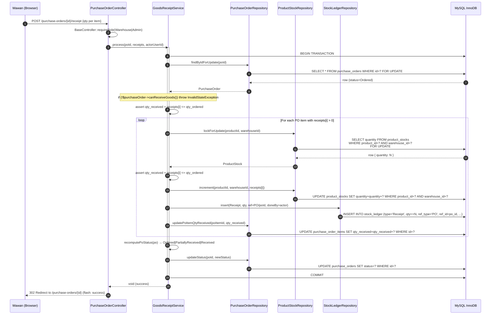
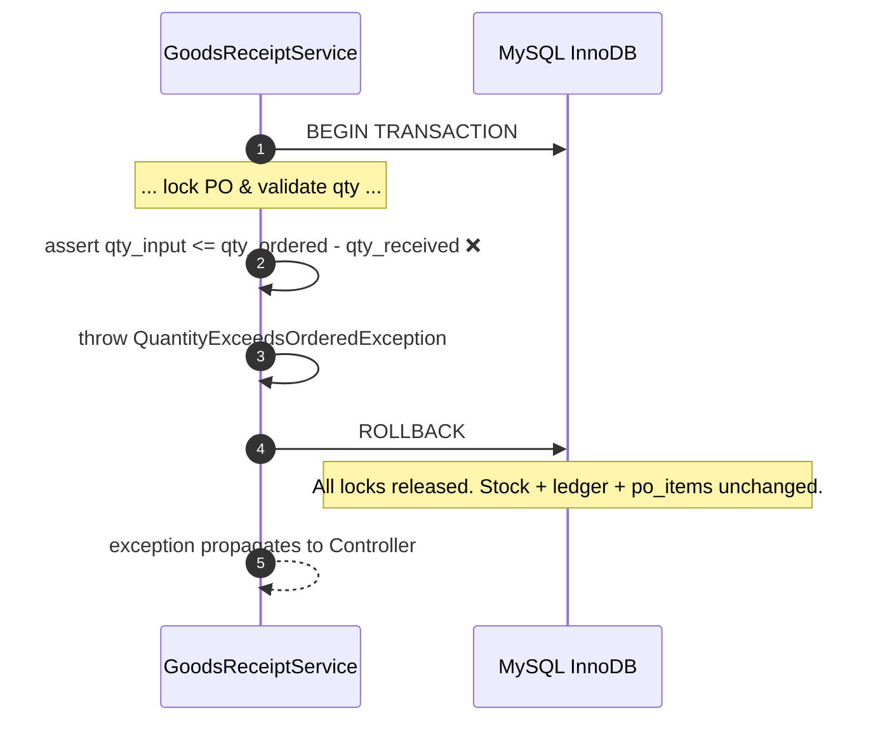
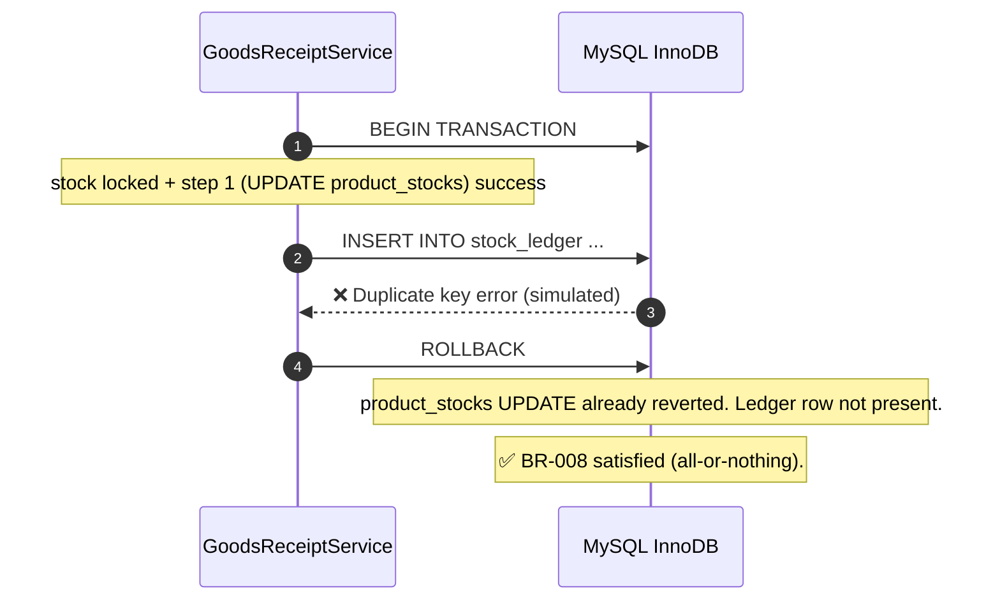
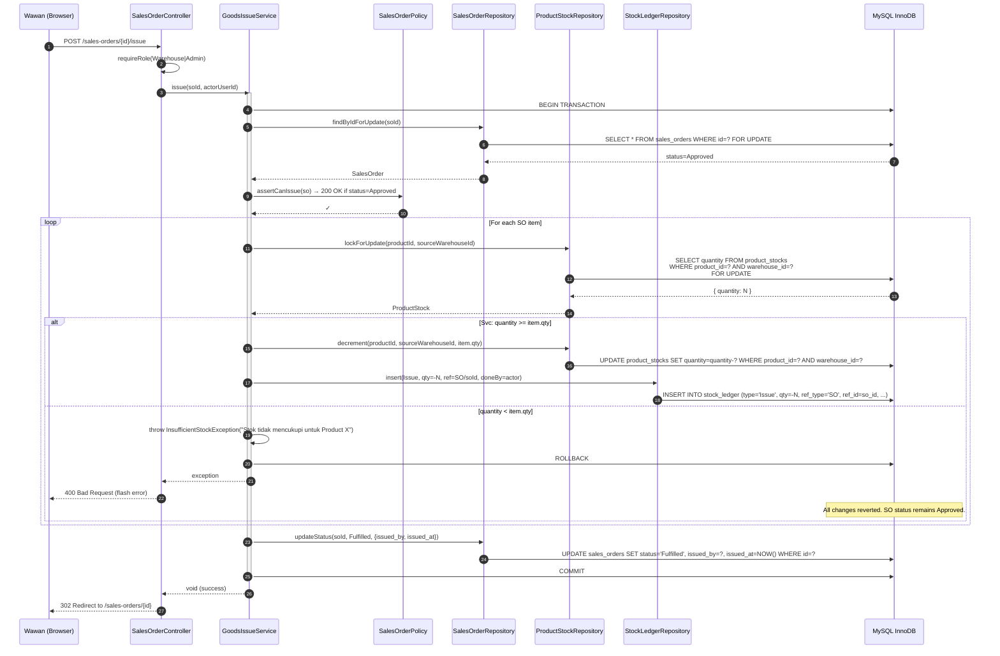
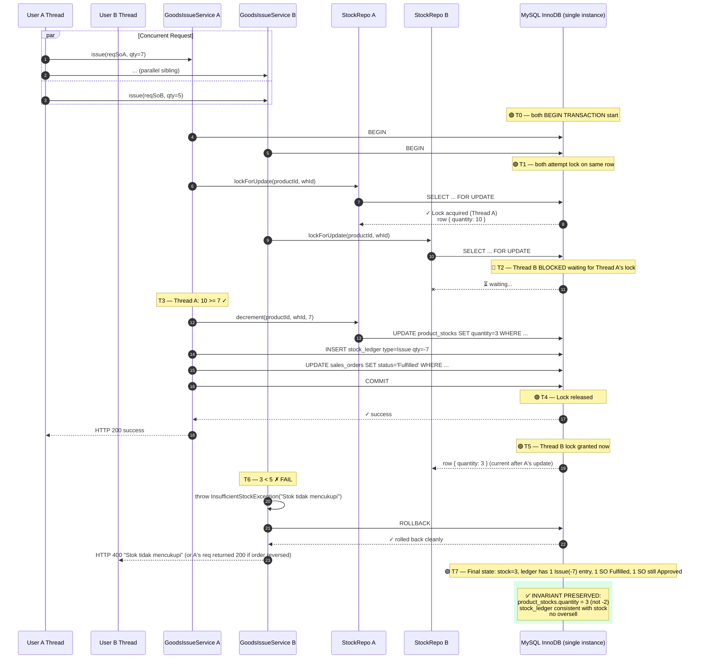
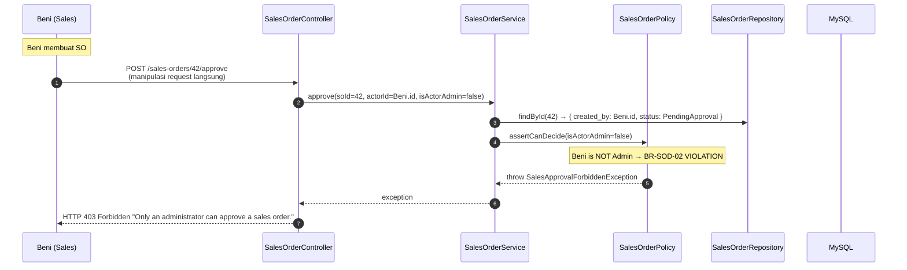

# Sequence Diagram — Goods Receipt & Goods Issue (Transaksional)

- **Status:** Initial — to be verified against implementation in Stage 6
- **Date:** 2026-09-01
- **Stage:** 4 / 9 (Technical Design)
- **Related:** PRD §6 PO-01, §6 SO-01, §9 ARCH-02, ADR-002

---

## 1. Goods Receipt (PO → Stock)

### Skenario Normal
PO status `Ordered` atau `PartiallyReceived`, Warehouse Staff memproses receipt barang: input qty received per line.

### Alur Error — Insufficient Quota (qty > qty_ordered − qty_received)

### Alur Error — Random DB Exception mid-transaction

---

## 2. Goods Issue (SO → Stock Out)

### Skenario Normal — Stok Cukup

### Skenario CRITICAL — ARCH-02 Concurrent Goods Issue (BR-010)

Dua request Goods Issue simultan untuk product+warehouse yang sama. Stok = 10. Req A qty=7, Req B qty=5. Salah satu harus sukses, yang lain ditolak.

**Catatan urutan (yang mana duluan sukses):**
- Bisa A dulu baru B (skenario di atas), atau B dulu baru A.
- Hasil akhir: stock = 3 (kalau A sukses) atau stock = 5 (kalau B sukses).
- TIDAK PERNAH kedua sukses.
- Yang ditolak return HTTP 400 dengan pesan jelas "Stok tidak mencukupi".

### Skenario Approval — Segregation of Duties (BR-001)

---

## 3. Transaksi Lifecycle Checklist

Per transaksi multi-tabel, selalu confirm:

| Step | Goods Receipt | Goods Issue |
|------|---------------|-------------|
| 1. Lock parent doc | `SELECT * FROM purchase_orders WHERE id=? FOR UPDATE` | `SELECT * FROM sales_orders WHERE id=? FOR UPDATE` |
| 2. Assert state | status in ['Ordered', 'PartiallyReceived'] | status = 'Approved' |
| 3. Lock + read stock per line | `SELECT quantity FROM product_stocks WHERE ... FOR UPDATE` | `SELECT quantity FROM product_stocks WHERE ... FOR UPDATE` |
| 4. Check quota (for issue only) | n/a | if quantity < item.qty → throw + ROLLBACK |
| 5. Mutate stock | UPDATE product_stocks SET quantity = quantity + N | UPDATE product_stocks SET quantity = quantity - N |
| 6. Write ledger | INSERT stock_ledger (type='Receipt', qty=+N) | INSERT stock_ledger (type='Issue', qty=-N) |
| 7. Update line | UPDATE po_items SET qty_received += N | (no qty on SO items) |
| 8. Update parent status | recompute status | UPDATE sales_orders SET status='Fulfilled' |
| 9. Commit | COMMIT | COMMIT |

Setiap langkah 3-7 terjadi **dalam transaksi yang sama**. Jika ada exception, SEMUA rollback.

---

## 4. Lock Duration Budget

Estimasi waktu kritis antara `BEGIN` dan `COMMIT`:

| Operation | Steps | Expected Duration |
|-----------|-------|-------------------|
| Goods Receipt, 10 line items | 10 × (1 SELECT + 1 UPDATE + 1 INSERT + 1 UPDATE) = 40 query | < 100 ms |
| Goods Issue, 5 line items | 5 × (1 SELECT + 1 UPDATE + 1 INSERT) + 1 UPDATE parent = 16 query | < 50 ms |
| Approval only (no stock op) | 1 SELECT + 1 UPDATE | < 10 ms |

**Throughput:** Single user lock hold < 100 ms = aman untuk 10-50 req/sec per entity+warehouse pair (lebih dari cukup untuk scope mid-warehouse).

**Tidak ada long-running lock.**

---

## 5. Failure Modes & Recovery

| Failure | Mode | Recovery |
|---------|------|----------|
| DB connection lost mid-transaction | InnoDB rollback otomatis | Client sees exception; retry safe (idempotent check via service) |
| Network timeout to PHP | Depends on driver | Default `PDO::ATTR_TIMEOUT` ensures PHP detects |
| Application exception in service | `try/catch` → manual ROLLBACK | Application-level recovery |
| Deadlock detected by InnoDB | InnoDB rolls back loser | Application should retry (rare with our query pattern) |
| Power outage | InnoDB recovery on restart | WAL log applies pending; rolled back txns cleaned |

> Idempotency untuk Goods Issue: client retry dengan SO id yang sama, service cek status — kalau sudah Fulfilled, return success tanpa reprocess.

---

## References
- `docs/planning/prd.md` §6 PO-01 FR-6.8, §6 SO-01 FR-7.10, §9 ARCH-02
- `docs/architecture/adr-002-concurrency-strategy.md`
- `docs/architecture/db-schema-design.md` (lock-related fields)
- MySQL InnoDB locking: <https://dev.mysql.com/doc/refman/8.0/en/innodb-locking.html>
