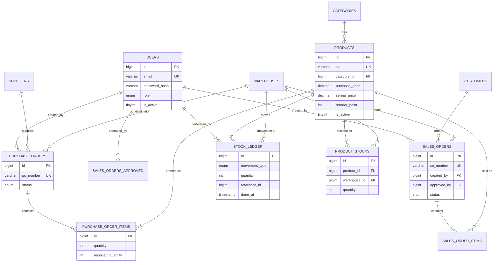
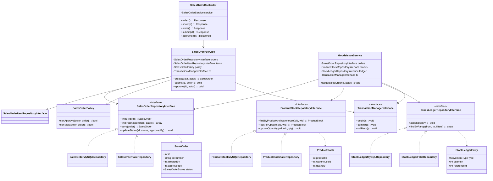

# IOMS — MASTER PROJECT SPECIFICATION

**Project:** Inventory & Order Management System
**Program:** PT Neuronworks Indonesia — Intermediate Programmer Final Project
**Source of truth:** `Project Brief - Programmer.pdf` (Participant Guide Edisi 1.0, Oktober 2026, 19 pages)
**Spec version:** 1.0 · 2026-09-07
**Status:** see §48 — **NOT READY FOR CODING** (7 blocking items)

---

## 0. How this document was produced, and what is authoritative

The brief PDF was decoded and read in full (all 19 pages, subset-font glyph decoding — the file has
no extractable text layer). Every requirement ID, business rule, permission cell, status flow and
critical-failure clause below is quoted or derived from it. The existing repository was inventoried:
93 PHP classes, 12 repository interfaces each with a MySQL + Fake implementation, 6 unit test files,
6 integration test files, Docker Compose with 4 services, and 21 existing docs.

**Authority order applied (per instruction §1):**

| Rank | Source | Applied as |
|---|---|---|
| 1 | Project Brief PDF | Wins every conflict. |
| 2 | Confirmed prior decisions (this instruction set: PHP 8.3.20, Redis session, Memcached cache) | Applied where they do not contradict rank 1. |
| 3 | Existing UI/UX design (Stitch export + `docs/design/`) | Baseline; mapped, not redesigned. |
| 4 | Technical design needed to satisfy ranks 1–3 | Derived. |
| 5 | Best practice | Only where genuinely required. |

**Two facts that shape the whole document:**

1. **This is not a greenfield project.** The core transaction flows are already built. "Ready for
   coding" is therefore reframed honestly as *ready for the remaining implementation work*, and every
   section states as-built status rather than pretending nothing exists. Sections that describe
   already-built behaviour are marked `AS-BUILT`; sections describing work not yet done are marked
   `TO BUILD`.
2. **Redis and Memcached appear nowhere in the brief.** They are rank-2 project decisions. The brief
   explicitly warns (§0, §4 PERINGATAN) that *"Solusi yang lebih rumit tanpa alasan jelas … dinilai
   negatif pada area code quality"* — unjustified complexity is scored **negatively**. They are
   therefore retained under hard constraints (§22–§25): MySQL stays the sole source of truth, both
   must degrade gracefully, and neither may become a critical-failure vector. This is recorded as
   finding **X-01** in the Extra Requirement Audit (§45), not silently accepted.

---

## 01. PROJECT FOUNDATION

### 1.1 Project Overview

A web-based Inventory & Order Management System for a warehouse and sales operation running multiple
warehouses. It records products, tracks per-warehouse stock, processes purchasing from suppliers and
sales to customers, and guarantees that every stock figure is traceable to a ledger row — including
when two operations run concurrently.

### 1.2 Problem Statement

Brief §1: *"Tim gudang dan sales membutuhkan aplikasi untuk mencatat produk, mengelola stok di
beberapa gudang, memproses pembelian dari supplier serta penjualan ke customer, dan memastikan angka
stok selalu bisa dipertanggungjawabkan — termasuk saat dua proses berjalan bersamaan."*

Three concrete problems:

| # | Problem | Consequence if unsolved |
|---|---|---|
| P1 | Stock is held per warehouse but must also be reportable in total | Wrong availability, wrong fulfilment decisions |
| P2 | Two simultaneous goods issues can oversell the same stock row | Negative stock; the brief's reproducible-oversell critical failure |
| P3 | One person creating and approving the same order is an abuse path | No segregation of duties; audit failure |

### 1.3 Product Vision

> A small, defensible inventory system where every number on every screen can be traced back to a
> ledger row, and where the architecture can be explained without notes.

The brief's stated goal (§1 *Tujuan*) is to prove the participant can design a testable layered
architecture, hold data integrity under concurrency, apply Clean Code and Clean Architecture *in
substance rather than as README vocabulary*, and communicate design decisions clearly. The product
exists to carry that proof.

### 1.4 Objectives

| ID | Objective | Verified by |
|---|---|---|
| O-1 | Complete core flow: Login → Master Data → PO → SO → Stock Ledger → Dashboard/Report → Logout | Demo §42 |
| O-2 | `ProductStock` always reconciles with `StockLedger` after any completed transaction | Integration tests §26 |
| O-3 | Concurrent goods issue cannot oversell | ARCH-02 test §26.3 |
| O-4 | Segregation of duties enforced server-side | BR-SOD-01 test §26.1 |
| O-5 | Business logic testable with no real database | ARCH-01, Fake repositories |
| O-6 | Runs from a clean environment via `docker compose up --build` | §35 |
| O-7 | Every design decision defensible without AI assistance | §42 |

### 1.5 Target Users

| Persona | Role | Context | Primary need |
|---|---|---|---|
| Rita | Admin | Office desktop | Oversight, user & master data control, SO approval |
| Beni | Sales | Desktop/laptop | Create and submit own SOs, track their status |
| Wawan | Warehouse Staff | Handheld / small screen, possibly gloved | Goods receipt & issue queues, low-stock visibility |

### 1.6 Roles, permissions and restrictions

Reproduced from brief §1.2 verbatim in substance — this table is normative and is the single source
for every authorization check.

| Activity | Admin | Sales | Warehouse Staff |
|---|---|---|---|
| Login, logout, own profile | Yes | Yes | Yes |
| Manage users | Yes | No | No |
| Manage master data (product / warehouse / supplier / customer) | Yes | View catalogue only | View products & stock only |
| Create & submit Sales Order | Yes | Yes — own only | No |
| Approve / reject Sales Order | Yes | **No — even their own order** | No |
| Create Purchase Order | Yes | No | May propose |
| Process goods receipt (PO) | Yes | No | Yes |
| Process goods issue (SO) | Yes | No | Yes |
| View dashboard | All data | Own order summary | Stock & fulfilment summary |
| Download CSV report | Yes | Own orders | Stock report |

Restrictions per role:

- **Admin** — cannot approve an SO they themselves created *if* they are also its creator (BR-SOD-01
  is creator-based, not role-based; see §16).
- **Sales** — cannot reach any user-administration page or endpoint; cannot see other Sales' orders;
  cannot approve anything.
- **Warehouse Staff** — cannot create or approve SOs; cannot mutate master data; may create/propose POs.

No public registration exists (brief FAQ 11). All accounts are created by Admin.

### 1.7 Scope

In scope:

Authentication & session · user management (3 roles) · product & category master with reorder point
and optional validated image upload · warehouse & per-warehouse stock · supplier & customer master ·
Purchase Order + Goods Receipt (incl. partial) · Sales Order + approval + Goods Issue · Stock Ledger ·
list/detail/empty states · search/filter/sort/pagination · role-scoped dashboards from aggregation
queries · CSV export (stock movement + order status) with date range · ≥1 JSON API endpoint ·
validation · error handling · responsive 360px→desktop · relational schema with explicit transactions ·
standalone low-stock script · Docker Compose · unit + integration tests · static analysis ·
class diagrams (initial & as-built) · ADRs · refactor log · SRP audit · tech-debt register ·
critique exercise · AI usage log.

### 1.8 Out of scope

From brief §4.3 — explicitly **not required**: microservices, real message queue, cloud deployment,
CI/CD, Kubernetes, real-time notification, mobile application, automatic cron scheduler, automated
end-to-end tests.

Additionally out of scope by requirement text: Excel/PDF export, scheduled email export, custom
column selection (REPORT-01 *Out of Scope*), full-text search, saved filter presets (FIND-01),
public registration (FAQ 11), full Clean Architecture 4-ring (FAQ 4), DI container (FAQ 2), ORM (FAQ 1).

**Nothing from §1.8 may be reintroduced as a mandatory feature.** Per §45, anything present in the
repository that falls in this list is classified `UNNECESSARY` or `BONUS`.

### 1.9 Success criteria

Brief §8.2: score ≥ 80 **and** no critical failure. Operationally:

1. All mandatory requirements in brief §2 demonstrated on the final tag.
2. App + DB start from a clean folder via Docker.
3. Unit + integration tests run by one documented command and all pass.
4. Static analysis attached, zero critical errors.
5. Class diagrams match actual code and can be traced live.
6. Goods issue/receipt provably transactional; oversell not reproducible.
7. SoD proven server-side, not UI-only.
8. Search/filter/sort/pagination, 3 role dashboards, JSON endpoint all demonstrable.
9. No secret, credential, client data or PII in repository or history.
10. README verified from a clean environment; three demo accounts available.
11. Participant explains data flow, layered architecture, one ADR and one refactor unaided.

### 1.10 Critical failure criteria

Brief §8.2, reproduced as an audit checklist in §47. Any one of these fails the project regardless of
score: Docker won't run · core login-PO/SO-stock flow broken or cosmetic-only · banned
framework/ORM/DI container used · no valid unit+integration tests or all failing at final release ·
plaintext password, live secret committed, raw user input concatenated into SQL, or frontend-only
authorization · stock changed outside service/ledger so `StockLedger` diverges from `ProductStock` ·
goods issue/receipt non-transactional so the assessor can reproduce oversell · class diagram not
matching code · participant cannot explain own architecture, or plagiarism · material AI/external use
deliberately hidden.

---

## 02. PRD

Every feature uses the brief's own requirement ID. Format per instruction §13.

### AUTH-01 — Login & Session `AS-BUILT`

- **Actor:** all roles · **Business goal:** authenticated, role-scoped access.
- **Description:** user signs in with email + password; session determines the role-appropriate view.
- **Precondition:** user record exists, `is_active = 1`.
- **Main flow:** submit email+password → look up user by email → `password_verify()` →
  `session_regenerate_id(true)` → write `user_id`, `role` into session → redirect to role dashboard.
- **Alternative flow:** already-authenticated user hitting `/login` → redirect to dashboard.
- **Failure flow:** wrong credentials **or** inactive user → single generic message that does not
  reveal which part was wrong; no session created. Protected URL without session → redirect to login.
- **Postcondition:** session holds identity + role; session ID differs from pre-login ID.
- **Acceptance criteria:**
  - AC1 Valid login for each of the 3 roles lands on that role's dashboard.
  - AC2 Wrong password and inactive account produce the *same* generic message.
  - AC3 Protected page without session redirects to `/login`.
  - AC4 Session ID after login ≠ session ID before login.
  - AC5 Password stored via `password_hash()`, verified via `password_verify()`; never plaintext.
- **Evidence:** demo of 3-role login, a failed login, and a protected-page hit with no session.

### AUTH-02 — Logout `AS-BUILT`

- **Actor:** all roles · **Goal:** end session from the app.
- **Main flow:** click logout → clear authentication data from session → destroy session → redirect to login.
- **Postcondition:** protected URLs unreachable without logging in again.
- **AC1:** logout removes session auth data. **AC2:** re-opening a protected URL after logout redirects to login.
- **Evidence:** demo logout then protected-URL retry.

### USR-01 — User Management (3 roles) `AS-BUILT`

- **Actor:** Admin only.
- **Main flow:** Admin lists/creates/edits users, sets role ∈ {Admin, Sales, WarehouseStaff}, toggles active.
- **Failure flow:** duplicate email → validation error, nothing saved. Sales/Warehouse hitting the
  user pages or endpoints → 403.
- **AC1** Admin can add, view, edit, activate/deactivate. **AC2** email unique, enforced in DB and
  service. **AC3** role restricted to the 3 values; no public registration. **AC4** Sales and
  Warehouse Staff receive 403 on user admin pages *and* endpoints.
- **Guard:** self-deactivation and self-demotion blocked (prevents admin lockout) — a design decision,
  recorded in §05 BR-USR-04.
- **Evidence:** limited CRUD demo, duplicate-email validation, access test as Sales and as Warehouse Staff.

### PRD-01 — Product, Category & Reorder Point `AS-BUILT`

- **Actor:** Admin (write), all (read per §1.6).
- **Main flow:** Admin maintains categories and products; each product has unique SKU, category, unit,
  purchase price, selling price, reorder point, optional image, active flag.
- **Failure flow:** duplicate SKU or any negative number → rejected. Attempt to delete a product used
  by an order → refused; deactivate instead. Invalid image type/size → rejected.
- **AC1** SKU unique. **AC2** category, purchase price, selling price, unit, reorder point validated,
  numbers ≥ 0. **AC3** a product already used on an order can only be deactivated, never deleted.
  **AC4** optional image upload validates MIME type and file size and is stored under an
  unguessable random filename.
- **Evidence:** create/edit/deactivate demo, reorder-point validation, upload attempt with an invalid file.

### WH-01 — Warehouse & Multi-Location Stock `AS-BUILT`

- **Actor:** Admin (manage warehouses), all (view stock per §1.6).
- **Main flow:** each product has one stock row per warehouse; stock views show total and per-warehouse breakdown.
- **AC1** Admin manages the warehouse list. **AC2** every product has a stock row per warehouse.
  **AC3** the stock view shows total *and* per-warehouse detail.
- **Evidence:** one product showing different stock in two warehouses.

### PO-01 — Purchase Order & Goods Receipt `AS-BUILT`

- **Actor:** Admin, Warehouse Staff.
- **Main flow:** create PO (supplier, destination warehouse, items with product/qty/purchase price) →
  `Draft` → `Ordered` → record receipt → `PartiallyReceived` or `Received`.
- **Alternative flow:** partial receipt — remaining outstanding qty stays recorded and receivable later.
- **Failure flow:** receipt qty exceeding outstanding qty → rejected; receipt against a non-receivable
  status → rejected; any failure inside the transaction → full rollback.
- **Postcondition:** `ProductStock` increased **and** a `Receipt` `StockLedger` row written, in one transaction.
- **AC1** status follows `Draft → Ordered → PartiallyReceived/Received → Cancelled` per §06.
  **AC2** receipt increments `ProductStock` and writes a `Receipt` ledger row atomically (see ARCH-02).
  **AC3** partial receipt allowed; outstanding qty preserved. **AC4** over-receipt rejected.
- **Evidence:** create PO, full receipt, partial receipt, and the resulting ledger contents.

### SO-01 — Sales Order, Approval & Goods Issue `AS-BUILT`

- **Actor:** Sales (create/submit), Admin (approve/reject), Warehouse Staff (issue).
- **Main flow:** Sales creates `Draft` from catalogue and available stock → submits → `PendingApproval`
  → Admin approves → `Approved` → Warehouse Staff issues goods → `Fulfilled`.
- **Alternative flow:** Admin rejects, or the order is `Cancelled` at any stage before `Fulfilled`.
- **Failure flow:** Sales attempting approval → 403 **at the server**, including their own order.
  Goods issue on a non-`Approved` SO → rejected. Goods issue with insufficient available stock →
  rejected with a business error; no partial silent fulfilment; full rollback.
- **Postcondition:** `ProductStock` decreased and an `Issue` ledger row written in one
  race-condition-safe transaction; SO becomes `Fulfilled`.
- **AC1** flow `Draft → PendingApproval → Approved → Fulfilled`, or `Cancelled` before `Fulfilled`.
  **AC2** approval authorization checked server-side; Sales cannot approve, own order included.
  **AC3** goods issue only from `Approved`, rejected when available stock is insufficient.
  **AC4** goods issue decrements stock and writes an `Issue` ledger row in one transaction safe from
  race conditions (ARCH-02).
- **Evidence:** full `Draft→Fulfilled` demo, a Sales approve attempt, and a goods issue with insufficient stock.

### VIEW-01 — List, Detail & Empty State `AS-BUILT`

- **AC1** Products, POs and SOs each have a list and a detail page, scoped by role.
  **AC2** the no-data case shows an informative empty state with heading, subtext and a role-relevant CTA.
- **Note:** the empty state (zero records) and the no-results state (filters matched nothing) are
  distinct components — see §16 UI-GAP-04.
- **Evidence:** screenshots with data and without data.

### FIND-01 — Search, Filter, Sort & Pagination `AS-BUILT`

- **AC1** Products: search by name or SKU; filter by category and by stock status (low stock / normal).
  **AC2** Orders (PO & SO): search by number or counterparty; filter by status; sort by date asc/desc.
  **AC3** main lists paginate at **10 records per page**; active filters survive page changes.
  **AC4** seed provides ≥ 30 products and ≥ 25 combined orders so pagination is testable.
  **AC5** all queries parameterized; an injection payload in the search box leaks nothing.
- **Evidence:** demo of a search/filter/sort combination across at least two pages.

### DASH-01 — Role-Scoped Dashboard `AS-BUILT`

- **AC1** Admin sees inventory value, products below reorder point, and pending orders per status.
  **AC2** Sales sees a summary of their own orders per status. **AC3** Warehouse Staff sees the goods
  receipt/issue queues and low-stock products. **AC4** every figure comes from an aggregation query —
  **no hardcoded numbers**.
- **Evidence:** the aggregation queries plus a dashboard demo for all three roles.

### REPORT-01 — CSV Report `AS-BUILT`

- **AC1** CSV export of stock movement (`StockLedger`) and of order status, both over a date range.
  **AC2** figures derive from the *same* aggregation/recap queries as the dashboard (single source of truth).
  **AC3** CSV fields escaped per RFC 4180 and hardened against CSV injection: a value starting `=`,
  `+`, `-` or `@` is prefixed with `'`. **AC4** Sales exports contain only their own orders.
  **AC5** column headers follow the user's locale.
- **Out of scope:** xlsx, PDF, scheduled email export, custom column selection.
- **Evidence:** exported CSV files for two different date ranges.

### API-01 — JSON Endpoint `AS-BUILT`

- **AC1** `GET /api/products/{sku}/availability` returns per-warehouse stock as JSON.
  **AC2** authentication checked exactly as for HTML pages. **AC3** `Content-Type: application/json`
  and correct status codes — 200 / 401 / 404 — never an HTML error page.
- **Evidence:** calls with auth, without auth, and with an unknown SKU.

### VAL-01 — Validation & Feedback `AS-BUILT`

- **AC1** required fields, status enums, dates, foreign keys and numbers (qty/price/stock ≥ 0)
  validated on **both** frontend and backend; **backend is the source of truth**.
  **AC2** nothing is persisted when validation fails; already-entered input is preserved where relevant.
- **Evidence:** the invalid-input scenario list and its test results.

### ERR-01 — Error Handling `AS-BUILT`

- **AC1** unauthenticated access redirects to login (HTML) or returns 401 (API); missing authority → 403;
  unknown data/URL → 404. **AC2** database exceptions and stack traces are never shown to the user;
  they are logged. **AC3** user-facing messages are generic and localized.
- **Evidence:** demo of at least two deliberate, safe failure paths.

### UI-01 — Responsive & Usability `AS-BUILT / TO BUILD`

- **AC1** Login, dashboard, product/order lists, detail and forms are usable at **360px** and on
  desktop; navigation and tables are not cut off. **AC2** forms have labels; focus state and basic
  contrast are visible. **AC3** body does not overflow horizontally; intentional horizontal scroll
  inside a wide table is acceptable. **AC4** touch targets ≥ 44×44px at mobile breakpoint.
- **Blocking design issue:** the approved Stitch design fails AC1/AC3 structurally — see §17 UI-GAP-01.
- **Evidence:** desktop and mobile screenshots of the four main pages.

### DB-01 — Relational Database & Transactions `AS-BUILT`

- **AC1** minimum tables per brief §1.3, with primary keys, foreign keys, constraints
  (e.g. `quantity >= 0`) and relevant indexes. **AC2** every query uses a PDO prepared statement;
  multi-table operations (goods receipt, goods issue) are wrapped in explicit transactions.
  **AC3** schema and seed build the database from empty, including FIND-01 data.
- **Evidence:** ERD, `schema`+`seed`, and a walk-through of one multi-table transaction and one index.

### JOB-01 — Scheduled Script `AS-BUILT`

- **AC1** a standalone script (`php scripts/check-low-stock.php`) produces a summary of products below
  reorder point. **AC2** runnable manually via `docker compose exec`; no automatic server scheduling required.
- **Rationale (brief):** deliberately separated from the web request cycle to mirror a cron process.
- **Evidence:** running the script and its summary output.

### ARCH-01 — Layer Separation & Repository Interface `AS-BUILT`

- **AC1** three pragmatic layers Controller (HTTP/routing) → Service (business rules) → Repository
  (data access), with dependencies pointing Controller→Repository and never the reverse.
  **AC2** at least one repository interface has **two** implementations: a real MySQL one and an
  in-memory/fake one used by unit tests. **AC3** services receive dependencies via constructor
  injection; **no hidden `new PDO()` inside a Service**. **AC4** business-logic tests run with no real
  database connection.
- **As-built:** all **12** repository interfaces have both implementations, exceeding AC2.
- **Evidence:** the interface + two implementations, and a unit test running against the fake.

### ARCH-02 — Transactional, Concurrency-Safe Stock Operation `AS-BUILT`

- **AC1** the `ProductStock` change and the `StockLedger` write happen in one transaction
  (`beginTransaction`/`commit`/`rollBack`). **AC2** when two goods issues for the same product and
  warehouse are processed near-simultaneously the final stock is still correct: no oversell, no lost
  update. **The mechanism is the participant's design decision.** **AC3** the participant can explain
  the concurrent scenario prevented and show a test or controlled scenario proving it; real
  thread/parallel simulation is not required.
- **Chosen mechanism:** pessimistic row lock via `SELECT … FOR UPDATE` — see §15 and ADR-002.
- **Evidence:** the mechanism explanation plus a test showing the second request rejected or blocked
  once the first has consumed the stock.

### DESIGN-01 — Class Diagram, Initial & As-Built `AS-BUILT / GAP`

- **AC1** initial diagram made **before** coding, located in `docs/planning/`, showing
  Controller/Service/Repository/Entity and their relations. **AC2** as-built diagram made at the end,
  in `docs/architecture/`, marking which dependencies point at interfaces and which at concrete
  classes. **AC3** 2–3 sentences on what changed between initial and as-built, and why.
  **AC4** any legible tool is fine, but it must match actual code.
- **Gap:** the initial diagram currently sits in `docs/architecture/`, not `docs/planning/` — see §44 C-03.
- **Evidence:** both diagrams; the assessor will trace one class from diagram to code during defense.

### DESIGN-02 — Architecture Decision Record `AS-BUILT`

- **AC1** 2–3 short ADRs (context / decision / consequences) for **real** decisions, e.g. repository
  pattern vs direct PDO, or the chosen oversell-prevention mechanism.
- **As-built:** 4 ADRs exist. ADR-003 (i18n) and ADR-004 (WebP) cover non-brief features — see §45.
- **Evidence:** `docs/architecture/adr-*.md`.

### DESIGN-03 — Refactoring Log, SRP Audit & Tech-Debt Register `AS-BUILT`

- **AC1** refactor log with ≥ 3 entries: smell name (Long Method, Duplicate Code, Feature Envy,
  Primitive Obsession, …), technique applied (Extract Method, Extract Class, Replace Conditional with
  Polymorphism, …), and before/after snippets. **AC2** one SRP audit note: a class from the initial
  draft that violated SRP and how it was split. **AC3** an honest tech-debt register of shortcuts
  taken and their ideal fixes. **AC4** at least one commit tagged `refactor:` improving *old* code,
  not the feature under construction (Boy Scout Rule).
- **Evidence:** `docs/quality/refactor-log.md`, `docs/quality/tech-debt.md`, and commit history.

### DESIGN-04 — Critique Exercise `GAP`

- **AC1** the assessor supplies a deliberately flawed snippet (e.g. one Service doing validation,
  persistence and notification at once). The participant writes a short critique: which smells,
  which SOLID principles violated, how it should be refactored. **Implementing the fix is not required.**
- **Gap:** the brief names the artifact `docs/quality/critique.md`; the repository has
  `docs/quality/architecture-critique.md` instead — see §44 C-04.
- **Evidence:** `docs/quality/critique.md`, discussed briefly at defense.

### TEST-01 — Isolated Unit Tests `AS-BUILT`

- **AC1** ≥ **6 test cases** across ≥ **3 logic areas** (e.g. PO date validation, SO status transition,
  low-stock calculation, approval ownership/authorization). **AC2** no session, no real PDO, no
  external service; trivial getter/setter tests do not count.
- **Evidence:** results in `docs/testing/`, run by one README command.

### TEST-02 — Integration Tests `AS-BUILT`

- **AC1** ≥ **3 integration tests** touching **real MySQL in Docker**, e.g. goods receipt genuinely
  increasing stock end-to-end, or a second goods issue rejected once the first exhausted stock.
- **As-built:** 6 integration test files exist, exceeding the minimum.
- **Evidence:** tests separated from unit tests, run by the same or a separate documented command.

### TEST-03 — Static Analysis & FIRST `AS-BUILT`

- **AC1** PHPStan (level 5+) or PHP_CodeSniffer (PSR-12) report attached; **zero critical errors**;
  remaining warnings briefly explained. **AC2** tests follow FIRST — no `sleep()`, no real network
  calls, no execution-order dependency.
- **As-built:** `phpstan.neon` present. The `sleep()` prohibition needs verification against the
  concurrency tests — see §26.6 and §44 C-06.
- **Evidence:** static analysis report in `docs/quality/`.

### Project-decision features (rank 2 — not brief requirements)

| ID | Feature | Classification (§45) | Constraint |
|---|---|---|---|
| SESSION-01 | Redis session store, TTL 3600s | OPTIONAL (extra) | Must not break AUTH-01 if Redis is down |
| CACHE-01 | Memcached read cache for master-data lookups | OPTIONAL (extra) | Pure cache; MySQL authoritative; must survive total cache loss |
| I18N-01 | Static UI internationalization (ID/EN) | **OUT OF SCOPE (resolved 2026-09-08 — see §46 CF-02)** | Locale switching is not mandatory product scope for the current release; i18next permissibility is moot unless I18N-01 is separately reinstated |
| THEME-01 | Tri-state theme (auto/light/dark) | **OUT OF SCOPE (confirmed 2026-09-08)** — UNNECESSARY (bonus at best) | Zero requirement basis |
| IMAGE-01 | WebP conversion of product images | BONUS | The *validated upload* half is required by PRD-01; WebP conversion is not |

---

## 03. FUNCTIONAL REQUIREMENTS

Decomposition of §02 into numbered, individually testable statements. `FR-<req>.<n>`.

**AUTH** — FR-AUTH-01.1 authenticate by email+password · .2 reject inactive user · .3 generic failure
message · .4 regenerate session ID on login · .5 role-scoped redirect · .6 guard all protected routes ·
FR-AUTH-02.1 clear auth data · .2 destroy session · .3 protected URL unreachable after logout.

**USR** — FR-USR-01.1 list users · .2 create with role+active · .3 edit · .4 toggle active ·
.5 unique email at service + DB · .6 restrict role to the 3 values · .7 no public registration ·
.8 403 for non-Admin on pages *and* endpoints · .9 block self-deactivation · .10 block self-demotion.

**PRD** — FR-PRD-01.1 category CRUD · .2 product CRUD · .3 unique SKU · .4 numeric fields ≥ 0 ·
.5 reorder point ≥ 0 · .6 deactivate-not-delete when referenced by an order · .7 optional image
upload · .8 validate image MIME type · .9 validate image size · .10 store under random unguessable
filename.

**WH** — FR-WH-01.1 warehouse CRUD · .2 one stock row per product×warehouse · .3 show per-warehouse
detail · .4 show total across warehouses.

**PO** — FR-PO-01.1 create PO with supplier + destination warehouse + items · .2 status machine per
§06 · .3 record full receipt · .4 record partial receipt · .5 preserve outstanding qty ·
.6 reject over-receipt · .7 increment `ProductStock` · .8 write `Receipt` ledger row · .9 single
transaction around .7+.8 · .10 rollback on any failure · .11 cancel only from permitted states.

**SO** — FR-SO-01.1 create Draft · .2 submit → PendingApproval · .3 Admin approve → Approved ·
.4 Admin reject · .5 cancel before Fulfilled · .6 **server-side** block on creator self-approval ·
.7 block Sales role from approving at all · .8 goods issue only from Approved · .9 reject on
insufficient available stock · .10 decrement `ProductStock` · .11 write `Issue` ledger row ·
.12 single transaction around .10+.11 · .13 row-lock the stock row · .14 set Fulfilled on success ·
.15 rollback on any failure · .16 Sales sees only own SOs.

**VIEW** — FR-VIEW-01.1 list per entity · .2 detail per entity · .3 role scoping · .4 EMPTY state
(zero records) with heading+subtext+CTA · .5 NO_RESULTS state (filters matched nothing) distinct
from .4.

**FIND** — FR-FIND-01.1 product search name/SKU · .2 category filter · .3 stock-status filter ·
.4 order search number/counterparty · .5 order status filter · .6 order date sort asc/desc ·
.7 pagination 10/page · .8 filter persistence across pages · .9 all queries parameterized ·
.10 seed ≥30 products and ≥25 orders.

**DASH** — FR-DASH-01.1 Admin inventory value · .2 Admin below-reorder-point count · .3 Admin pending
orders per status · .4 Sales own orders per status · .5 Warehouse receipt queue · .6 Warehouse issue
queue · .7 Warehouse low-stock list · .8 all values from aggregation queries.

**REPORT** — FR-REPORT-01.1 stock-movement CSV by `done_at` range · .2 order-status CSV by
`order_date` range + status · .3 locale-dependent headers · .4 RFC 4180 escaping · .5 CSV-injection
prefixing · .6 same queries as dashboard · .7 Sales scoped to own orders · .8 filename
`{report_type}_{from}_{to}.csv`.

**API** — FR-API-01.1 `GET /api/products/{sku}/availability` · .2 JSON body · .3
`Content-Type: application/json` · .4 200 on success · .5 401 unauthenticated · .6 404 unknown SKU ·
.7 never an HTML error page · .8 same auth check as HTML.

**VAL** — FR-VAL-01.1 frontend validation · .2 backend validation as source of truth · .3 DB
constraint as last line · .4 required fields · .5 enum validation · .6 date validation · .7 FK
validation · .8 numeric ≥ 0 · .9 no persistence on failure · .10 preserve entered input.

**ERR** — FR-ERR-01.1 401/redirect · .2 403 · .3 404 · .4 422 for validation · .5 500 generic ·
.6 no stack trace to user · .7 log server-side · .8 localized generic messages.

**UI** — FR-UI-01.1 usable at 360px · .2 usable at desktop ≥1440px · .3 no body horizontal overflow ·
.4 nav not cut off · .5 tables usable · .6 every form control labelled · .7 visible focus state ·
.8 contrast ≥ WCAG AA · .9 touch targets ≥44×44px on mobile · .10 status never conveyed by colour alone.

**DB** — FR-DB-01.1 minimum tables · .2 PKs · .3 FKs · .4 check constraints · .5 unique constraints ·
.6 indexes · .7 PDO prepared statements everywhere · .8 explicit transactions on multi-table writes ·
.9 schema+seed from empty.

**JOB** — FR-JOB-01.1 standalone script outside the web cycle · .2 below-reorder-point summary ·
.3 runnable via `docker compose exec` · .4 no automatic scheduler required.

**ARCH** — FR-ARCH-01.1 Controller layer HTTP-only · .2 Service layer holds business rules ·
.3 Repository layer holds SQL · .4 dependency direction Controller→Service→RepositoryInterface ·
.5 ≥1 interface with 2 implementations · .6 constructor injection · .7 no `new PDO()` in a Service ·
.8 business logic testable without DB · FR-ARCH-02.1 explicit transaction · .2 no oversell under
concurrency · .3 no lost update · .4 documented mechanism · .5 controlled proving test.

**DESIGN** — FR-DESIGN-01.1 initial diagram in `docs/planning/` · .2 as-built in
`docs/architecture/` · .3 interface vs concrete markers · .4 change narrative · FR-DESIGN-02.1 2–3
real ADRs with context/decision/consequences · FR-DESIGN-03.1 ≥3 refactor entries with
smell+technique+before/after · .2 one SRP audit · .3 tech-debt register · .4 ≥1 `refactor:` commit ·
FR-DESIGN-04.1 written critique naming smells, SOLID violations, refactoring direction.

**TEST** — FR-TEST-01.1 ≥6 unit cases · .2 ≥3 logic areas · .3 no session/PDO/external ·
.4 no trivial getter tests · FR-TEST-02.1 ≥3 integration tests · .2 real MySQL in Docker ·
FR-TEST-03.1 static analysis report · .2 zero critical errors · .3 warnings explained ·
.4 FIRST compliance · .5 no `sleep()` · .6 no real network · .7 no order dependency.

**SESSION/CACHE (rank 2)** — FR-SESSION-01.1 session in Redis · .2 TTL 3600s · .3 no password material
in Redis · .4 expired session = unauthenticated · .5 logout deletes the Redis key · .6 **app remains
functional for AUTH-01 if Redis is unavailable** · FR-CACHE-01.1 cache-aside reads for product/
category/warehouse/supplier/customer lookups · .2 invalidate the affected key on master-data write ·
.3 full cache loss must not lose business data · .4 app functional with Memcached down.

---

## 04. MASTER REQUIREMENT MATRIX

The 21 requested columns do not fit one readable Markdown table, so the canonical matrix is presented
as two joined views keyed on Requirement ID. This is a presentation choice only — no column was dropped.

### 4A — Requirement, rule and mapping

| ID | Category | Actor | Business Rule | Precondition | UI Mapping | Controller | Service | Repository | Database | Redis | Memcached |
|---|---|---|---|---|---|---|---|---|---|---|---|
| AUTH-01 | Auth | All | BR-AUTH-01..05 | active user | Login | `AuthController` | `AuthService` | `UserRepositoryInterface` | `users` | session write | — |
| AUTH-02 | Auth | All | BR-AUTH-06 | session | Header/logout | `AuthController` | `AuthService` | — | — | key delete | — |
| USR-01 | User | Admin | BR-USR-01..04 | Admin session | Users list/form/detail | `UserController` | `UserService` | `UserRepositoryInterface` | `users` | — | — |
| PRD-01 | Master | Admin | BR-PRD-01..06 | Admin session | Products, Categories | `ProductController` | `ProductService`, `CategoryService`, `ImageUploadService` | `Product*`, `Category*` | `products`, `categories` | — | `product:<sku>`, `category:<id>` |
| WH-01 | Master | Admin | BR-WH-01..03 | Admin session | Warehouses, Stock detail | `WarehouseController` | `WarehouseService` | `Warehouse*`, `ProductStock*` | `warehouses`, `product_stocks` | — | `warehouse:<id>` |
| PO-01 | Txn | Admin, WH | BR-PO-01..07, BR-LDG-01..03 | supplier+warehouse exist | PO list/detail/form, Goods Receipt | `PurchaseOrderController` | `PurchaseOrderService`, `GoodsReceiptService` | `PurchaseOrder*`, `ProductStock*`, `StockLedger*` | `purchase_orders`, `purchase_order_items`, `product_stocks`, `stock_ledger` | — | invalidate on write |
| SO-01 | Txn | Sales, Admin, WH | BR-SO-01..08, BR-SOD-01, BR-LDG-01..03 | approved catalogue+stock | SO list/detail/form, Goods Issue | `SalesOrderController` | `SalesOrderService`, `SalesOrderPolicy`, `GoodsIssueService` | `SalesOrder*`, `ProductStock*`, `StockLedger*` | `sales_orders`, `sales_order_items`, `product_stocks`, `stock_ledger` | — | invalidate on write |
| VIEW-01 | View | All | BR-VIEW-01..02 | session | all lists/details | all controllers | all services | all repositories | all | — | — |
| FIND-01 | View | All | BR-FIND-01..03 | session | list toolbars | list controllers | list services | list repositories | indexed columns | — | — |
| DASH-01 | View | All | BR-DASH-01..02 | session | 3 dashboards | `DashboardController` | `DashboardService` | aggregation repos | aggregates | — | optional |
| REPORT-01 | Report | Admin, Sales, WH | BR-RPT-01..05 | session | Report/export page | `ReportController` | `CsvExportService`, `DashboardService` | ledger + order repos | `stock_ledger`, orders | — | — |
| API-01 | API | All | BR-API-01..03 | session | — (JSON) | `ProductApiController` | `ProductService` | `ProductStock*` | `product_stocks` | session check | `product:<sku>` |
| VAL-01 | Cross | All | BR-VAL-01..03 | — | every form | all controllers | all services | — | constraints | — | — |
| ERR-01 | Cross | All | BR-ERR-01..03 | — | error views | `BaseController` | exceptions | — | — | — | — |
| UI-01 | Cross | All | BR-UI-01..04 | — | all screens | — | — | — | — | — | — |
| DB-01 | Data | — | BR-DB-01..04 | — | — | — | — | all | schema | — | — |
| JOB-01 | Job | Admin, WH | BR-JOB-01 | CLI | CLI output | `scripts/check-low-stock.php` | `ProductService` | `Product*`, `ProductStock*` | `products`, `product_stocks` | — | — |
| ARCH-01 | Arch | — | BR-ARCH-01..03 | — | — | all | all | 12 interfaces × 2 impls | — | — | — |
| ARCH-02 | Arch | — | BR-STK-01..03 | — | — | — | `GoodsIssueService`, `GoodsReceiptService` | `ProductStockMySQLRepository` | row lock | — | — |
| DESIGN-01..04 | Design | — | — | — | — | — | — | — | — | — | — |
| TEST-01..03 | Test | — | — | — | — | — | — | — | — | — | — |
| SESSION-01 | Extra | All | BR-SES-01..04 | — | — | `BaseController` | `SessionManager` | — | — | authoritative | — |
| CACHE-01 | Extra | All | BR-CCH-01..04 | — | — | — | `CacheService` | master repos | authoritative | — | cache only |

### 4B — Verification, evidence and status

| ID | Security impact | Unit test | Integration test | Evidence | Defense point | Critical failure risk | Priority | Req status | Impl status |
|---|---|---|---|---|---|---|---|---|---|
| AUTH-01 | High — hashing, fixation | `AuthServiceTest` | `UserCreationTest` | 3-role login demo | Why regenerate session ID? | **Yes** — plaintext password | P0 | MANDATORY | TESTED |
| AUTH-02 | High — session lifetime | — | — | logout demo | What exactly is invalidated? | Yes — stale session | P0 | MANDATORY | IMPLEMENTED |
| USR-01 | High — privilege escalation | — | `UserCreationTest` | CRUD + 403 tests | Where is the role check? | **Yes** — frontend-only authz | P0 | MANDATORY | TESTED |
| PRD-01 | Medium — file upload | — | — | upload with bad file | Why random filename? | Yes — upload RCE | P1 | MANDATORY | IMPLEMENTED |
| WH-01 | Low | — | — | 2-warehouse demo | Why stock per warehouse? | No | P1 | MANDATORY | IMPLEMENTED |
| PO-01 | Medium — data integrity | `GoodsReceiptServiceTest`, `PurchaseOrderServiceTest` | `GoodsReceiptTest` | ledger contents | Show the transaction boundary | **Yes** — non-transactional receipt | P0 | MANDATORY | TESTED |
| SO-01 | High — SoD + oversell | `SalesOrderPolicyTest` | `BR001SegregationTest`, `SalesOrderApprovalPolicyTest` | full flow demo | How is self-approval blocked? | **Yes** — SoD bypass, oversell | P0 | MANDATORY | TESTED |
| VIEW-01 | Low | — | — | with/without data screenshots | EMPTY vs NO_RESULTS? | No | P1 | MANDATORY | IMPLEMENTED |
| FIND-01 | Medium — SQL injection | — | — | 2-page demo | Show the prepared statement | **Yes** — raw SQL concat | P1 | MANDATORY | IMPLEMENTED |
| DASH-01 | Low | `DashboardServiceTest` | — | aggregation queries | Prove no hardcoded number | Yes — cosmetic-only feature | P1 | MANDATORY | TESTED |
| REPORT-01 | Medium — CSV injection | `CsvExportServiceTest` | — | 2 CSV files | Why prefix `=` with `'`? | No | P1 | MANDATORY | TESTED |
| API-01 | Medium — auth bypass | — | — | 3 curl calls | Same auth as HTML? | Yes — unauthenticated data | P1 | MANDATORY | IMPLEMENTED |
| VAL-01 | Medium | several | several | scenario list | Why is backend the truth? | No | P1 | MANDATORY | IMPLEMENTED |
| ERR-01 | High — info disclosure | — | — | 2 failure paths | Where is the trace suppressed? | Yes — stack trace leak | P2 | MANDATORY | IMPLEMENTED |
| UI-01 | Low | — | — | 4×2 screenshots | Show 360px | No | P2 | MANDATORY | **PARTIAL** (§17) |
| DB-01 | High — injection | — | all | ERD + schema | Explain one index | **Yes** — missing constraint | P0 | MANDATORY | IMPLEMENTED |
| JOB-01 | Low | — | — | script run | Why outside the request cycle? | No | P2 | MANDATORY | IMPLEMENTED |
| ARCH-01 | Low | all unit tests | — | interface + 2 impls | Trace one dependency | Yes — DI container framework | P0 | MANDATORY | TESTED |
| ARCH-02 | **Critical** | — | `ARCH02ConcurrencyTest`, `GoodsIssueConcurrencyTest` | concurrency scenario | Why FOR UPDATE not optimistic? | **Yes** — reproducible oversell | P0 | MANDATORY | TESTED |
| DESIGN-01 | — | — | — | 2 diagrams | Trace diagram→code | **Yes** — diagram ≠ code | P1 | MANDATORY | **PARTIAL** (C-03) |
| DESIGN-02 | — | — | — | `adr-*.md` | Walk one ADR | No | P1 | MANDATORY | IMPLEMENTED |
| DESIGN-03 | — | — | — | refactor log, tech debt | Which smell, which technique? | No | P1 | MANDATORY | IMPLEMENTED |
| DESIGN-04 | — | — | — | `critique.md` | Name the SOLID violation | No | P1 | MANDATORY | **MISSING** (C-04) |
| TEST-01 | — | 6 files | — | `docs/testing/` | Why no DB here? | **Yes** — no valid tests | P0 | MANDATORY | **PARTIAL** (C-05) |
| TEST-02 | — | — | 6 files | `docs/testing/` | Why real MySQL here? | **Yes** — no valid tests | P0 | MANDATORY | **PARTIAL** (C-05) |
| TEST-03 | — | — | — | PHPStan report | Explain a warning | Yes — all tests failing | P1 | MANDATORY | **PARTIAL** (C-06) |
| SESSION-01 | High | — | TO BUILD | Redis TTL demo | What if Redis is down? | Yes — if it breaks AUTH-01 | P3 | OPTIONAL | IMPLEMENTED (TTL mismatch) |
| CACHE-01 | Low | — | TO BUILD | hit/miss demo | Why Memcached not Redis? | Yes — if treated as truth | P3 | OPTIONAL | **PARTIAL** (§23) |
| I18N-01 | Low | — | — | locale toggle | Is i18next allowed? | **Yes — CF-02** | P4 | **OUT OF SCOPE (2026-09-08)** | IMPLEMENTED (pre-existing, not required) |
| THEME-01 | Low | — | — | theme toggle | Why build this? | No | P4 | **OUT OF SCOPE (2026-09-08)** | IMPLEMENTED (pre-existing, not required) |

Every MANDATORY row has the chain Requirement → Acceptance Criteria → Implementation → Test →
Evidence. Rows whose Impl status is not `TESTED`/`IMPLEMENTED` are the §48 blocking list.

---

## 05. BUSINESS RULES

### Authentication rules
- **BR-AUTH-01** Credentials are email + password; email is the login identifier.
- **BR-AUTH-02** Passwords stored only via `password_hash()`, verified only via `password_verify()`.
- **BR-AUTH-03** An inactive user cannot log in.
- **BR-AUTH-04** Authentication failure returns one generic message that does not distinguish
  unknown-email from wrong-password from inactive-account.
- **BR-AUTH-05** Session ID is regenerated on successful login (fixation defence).
- **BR-AUTH-06** Logout clears authentication data and destroys the session; protected URLs are then unreachable.

### User rules
- **BR-USR-01** Email is unique across all users, enforced at service level *and* by a DB unique constraint.
- **BR-USR-02** Role ∈ {Admin, Sales, WarehouseStaff}. No other value is accepted.
- **BR-USR-03** No public registration; only Admin creates accounts.
- **BR-USR-04** An Admin cannot deactivate or demote their own account (lockout prevention). *Project decision.*

### Role rules
- **BR-ROLE-01** The §1.6 permission table is the sole authority for every authorization decision.
- **BR-ROLE-02** Authorization is checked server-side on every route *and* every endpoint.
- **BR-ROLE-03** Hiding a control in the UI is never an authorization mechanism.

### Segregation-of-duties rules
- **BR-SOD-01** The user who created a Sales Order may never approve that same Sales Order — enforced
  in the authorization layer on the server. See §16.
- **BR-SOD-02** The Sales role may not approve any Sales Order, own or not.
- **BR-SOD-03** The approve endpoint remains present in the application for Admin use; it is guarded, not removed.

### Product & category rules
- **BR-PRD-01** SKU is unique.
- **BR-PRD-02** `purchase_price`, `selling_price`, `reorder_point` are each ≥ 0.
- **BR-PRD-03** A product referenced by any order line can only be deactivated, never hard-deleted.
- **BR-PRD-04** Product image is optional; when supplied, MIME type and file size are validated.
- **BR-PRD-05** Uploaded images are stored under a random, unguessable filename.
- **BR-PRD-06** Categories are deactivated, not deleted, when in use.

### Warehouse & stock rules
- **BR-WH-01** Warehouses are deactivated, not deleted.
- **BR-WH-02** Exactly one `ProductStock` row exists per (product, warehouse) pair.
- **BR-WH-03** Stock displays show both the per-warehouse breakdown and the total.

### Supplier & customer rules
- **BR-SUP-01 / BR-CUS-01** Suppliers and customers are deactivated, not deleted (brief §1.3
  *Keputusan data*).

### Purchase Order rules
- **BR-PO-01** A PO has a supplier, a destination warehouse, and ≥ 1 item (product, qty, purchase price).
- **BR-PO-02** Status follows the §06 machine; no other transition is permitted.
- **BR-PO-03** Item qty > 0 and purchase price ≥ 0.
- **BR-PO-04** Goods receipt is only permitted from `Ordered` or `PartiallyReceived`.
- **BR-PO-05** Received qty per line may never exceed the outstanding qty.
- **BR-PO-06** Outstanding qty is preserved after a partial receipt and remains receivable.
- **BR-PO-07** A PO becomes `Received` only when every line is fully received; otherwise `PartiallyReceived`.

### Goods receipt rules
- **BR-GR-01** Receipt increments `ProductStock` for the PO's destination warehouse.
- **BR-GR-02** Receipt writes one `StockLedger` row of type `Receipt` per received line.
- **BR-GR-03** BR-GR-01 and BR-GR-02 occur inside one explicit transaction; any failure rolls back both.

### Sales Order rules
- **BR-SO-01** An SO has a customer, a creator, a source warehouse, and ≥ 1 item (product, qty, selling price).
- **BR-SO-02** Status follows the §06 machine.
- **BR-SO-03** Item qty > 0 and selling price ≥ 0.
- **BR-SO-04** Sales users may read and write only their own SOs.
- **BR-SO-05** Submission moves `Draft → PendingApproval`.
- **BR-SO-06** Approval/rejection is permitted only from `PendingApproval`, and only for Admin.
- **BR-SO-07** Cancellation is permitted from any state before `Fulfilled`.
- **BR-SO-08** `Fulfilled` is terminal; `Cancelled` is terminal.

### Approval rules
- **BR-APR-01** Only Admin may approve (BR-SOD-02).
- **BR-APR-02** The creator may never approve (BR-SOD-01), even if that creator is an Admin.
- **BR-APR-03** Approval records the approver identity on the order.

### Goods issue rules
- **BR-GI-01** Goods issue is permitted only when SO status is `Approved`.
- **BR-GI-02** Available stock in the SO's source warehouse must cover every line; otherwise the
  whole issue is rejected as a business error.
- **BR-GI-03** Issue decrements `ProductStock` and writes an `Issue` `StockLedger` row in one transaction.
- **BR-GI-04** The stock row is locked before the sufficiency check and the decrement (§15).
- **BR-GI-05** A successful issue sets the SO to `Fulfilled`.

### Stock ledger rules
- **BR-LDG-01** `StockLedger` is append-only. No update, no delete.
- **BR-LDG-02** Movement type ∈ {`Receipt`, `Issue`, `Adjustment`}.
- **BR-LDG-03** Every row records product, warehouse, type, quantity, reference (PO/SO id), performer and timestamp.
- **BR-LDG-04** Stock is never modified by the UI directly — only by a service that writes a ledger
  row and updates `ProductStock` in the same transaction (brief §1.3 *Keputusan data*).

### Stock invariant rules
- **BR-STK-01** `ProductStock.quantity >= 0` always.
- **BR-STK-02** After any completed transaction, `ProductStock.quantity` equals the signed sum of that
  product/warehouse's `StockLedger` rows.
- **BR-STK-03** Two concurrent goods issues can never produce an oversell or a lost update.

### Dashboard rules
- **BR-DASH-01** Every dashboard figure is produced by an aggregation query — never a literal.
- **BR-DASH-02** Dashboard data is role-scoped per §1.6.

### Reporting rules
- **BR-RPT-01** Reports cover exactly two subjects: stock movement, and order status.
- **BR-RPT-02** Both accept a date range.
- **BR-RPT-03** Report queries are the same ones the dashboard uses.
- **BR-RPT-04** CSV output is RFC 4180 escaped and CSV-injection hardened.
- **BR-RPT-05** Sales exports are scoped to their own orders.

### Scheduled job rules
- **BR-JOB-01** The low-stock script runs outside the web request cycle and needs no server scheduler.

### Session rules *(project decision)*
- **BR-SES-01** Session state lives in Redis with TTL 3600s.
- **BR-SES-02** No password or password hash is ever written to Redis.
- **BR-SES-03** An expired or absent session is treated as unauthenticated.
- **BR-SES-04** Logout deletes the Redis session key.

### Cache rules *(project decision)*
- **BR-CCH-01** Memcached holds only regeneratable read caches; it is never authoritative.
- **BR-CCH-02** A master-data write invalidates the affected key immediately after the DB commit.
- **BR-CCH-03** Total cache loss must not lose business data or break the application.
- **BR-CCH-04** No stock quantity is ever served from cache. Stock reads go to MySQL. *(Rationale: a
  stale stock figure would undermine ARCH-02.)*

### Architecture rules
- **BR-ARCH-01** Business logic never depends directly on PDO, session, or PHP superglobals.
- **BR-ARCH-02** Dependencies flow Controller → Service → RepositoryInterface only.
- **BR-ARCH-03** Services receive collaborators by constructor injection; no hidden instantiation.

### Validation rules
- **BR-VAL-01** Backend validation is the source of truth; frontend validation is a convenience.
- **BR-VAL-02** Nothing is persisted when validation fails.
- **BR-VAL-03** DB constraints are the final backstop, not the primary check.

### Error rules
- **BR-ERR-01** Status codes: 401/redirect unauthenticated, 403 unauthorized, 404 missing, 422 invalid, 500 internal.
- **BR-ERR-02** No stack trace, SQL text, PDO exception message, internal path, secret or credential
  ever reaches the user.
- **BR-ERR-03** User-facing messages are generic and localized; details go to the log.

### UI rules
- **BR-UI-01** Every screen works at 360px and at desktop width.
- **BR-UI-02** The document body never overflows horizontally; a wide table may scroll inside its own container.
- **BR-UI-03** Every control has a label, a visible focus state and AA contrast.
- **BR-UI-04** Status is never communicated by colour alone.

### Database rules
- **BR-DB-01** All input-bearing queries use prepared statements.
- **BR-DB-02** Multi-table writes are wrapped in explicit transactions.
- **BR-DB-03** Referential integrity is enforced by foreign keys.
- **BR-DB-04** Schema + seed must build the database from empty.

---

## 06. STATUS TRANSITION

### 6.1 Purchase Order

```
        create
          |
          v
     [ Draft ] ------ submit -----> [ Ordered ]
          |                              |
          |                              | receipt (partial)
       cancel                            v
          |                     [ PartiallyReceived ] --+
          |                              |              |
          |                        receipt (final)   receipt (partial)
          |                              v              |
          |                        [ Received ]  <------+
          v
    [ Cancelled ]
```

| From | To | Actor | Precondition | Side effect | On failure |
|---|---|---|---|---|---|
| — | Draft | Admin, WH | supplier + warehouse active, ≥1 item | PO + items persisted | 422, nothing saved |
| Draft | Ordered | Admin, WH | ≥1 item | order date set | 422 |
| Draft | Cancelled | Admin | — | terminal | 409 |
| Ordered | PartiallyReceived | Admin, WH | 0 < received < outstanding | stock += , ledger `Receipt` | rollback, 409/422 |
| Ordered | Received | Admin, WH | every line fully received | stock += , ledger `Receipt` | rollback |
| Ordered | Cancelled | Admin | nothing received yet | terminal | 409 |
| PartiallyReceived | PartiallyReceived | Admin, WH | outstanding remains | stock += , ledger `Receipt` | rollback |
| PartiallyReceived | Received | Admin, WH | outstanding becomes 0 | stock += , ledger `Receipt` | rollback |

**Invalid transitions** (all rejected with 409): `Received → *` · `Cancelled → *` ·
`Draft → PartiallyReceived` · `Draft → Received` · `PartiallyReceived → Ordered` ·
`PartiallyReceived → Cancelled` *(project decision: stock has already moved; cancelling would
require a compensating Adjustment, which is out of scope — recorded in §33 as tech debt TD-04)*.

### 6.2 Sales Order

```
     create
       |
       v
  [ Draft ] -- submit --> [ PendingApproval ] -- approve --> [ Approved ] -- goods issue --> [ Fulfilled ]
       |                        |     |                            |
       |                        |     +-- reject --> [ Draft ]     |
     cancel                  cancel                            cancel
       |                        |                                 |
       v                        v                                 v
             ----------> [ Cancelled ] <----------
```

| From | To | Actor | Precondition | Side effect | On failure |
|---|---|---|---|---|---|
| — | Draft | Sales (own), Admin | customer + warehouse active, ≥1 item | SO + items persisted | 422 |
| Draft | PendingApproval | Sales (own), Admin | ≥1 item | submitted timestamp | 422 |
| PendingApproval | Approved | **Admin, not the creator** | BR-SOD-01, BR-SOD-02 | approver recorded | **403** |
| PendingApproval | Draft | Admin, not creator | rejection reason optional | returns for edit | 403 |
| Approved | Fulfilled | Admin, WH | stock sufficient under row lock | stock −= , ledger `Issue` | rollback, 409/422 |
| Draft / PendingApproval / Approved | Cancelled | Admin; Sales own while Draft | not yet `Fulfilled` | terminal | 409 |

**Invalid transitions** (rejected): `Fulfilled → *` · `Cancelled → *` · `Draft → Approved` ·
`Draft → Fulfilled` · `PendingApproval → Fulfilled` · `Approved → PendingApproval` ·
approval by the creator (403, BR-SOD-01) · approval by any Sales user (403, BR-SOD-02).

**Failure behaviour for every invalid transition:** the service throws `InvalidStateException`, the
controller maps it to 409 (HTML: an inline business-error banner), nothing is persisted, and no
ledger row is written.

---

## 07. STOCK INVARIANTS

| ID | Invariant | Enforced where | Verified by |
|---|---|---|---|
| INV-1 | `product_stocks.quantity >= 0` | DB `CHECK` + service pre-check under row lock | `GoodsIssueConcurrencyTest` |
| INV-2 | `quantity` == signed sum of that product/warehouse ledger rows | single transaction wrapping both writes | `GoodsReceiptTest`, `ARCH02ConcurrencyTest` |
| INV-3 | `StockLedger` is append-only | no UPDATE/DELETE statement exists against it | code review + repository interface surface |
| INV-4 | Stock changes only via `GoodsReceiptService` / `GoodsIssueService` | no other class writes `product_stocks` | grep audit in §47 |
| INV-5 | Exactly one stock row per (product, warehouse) | DB `UNIQUE (product_id, warehouse_id)` | schema |
| INV-6 | No oversell under concurrency | `SELECT … FOR UPDATE` inside the transaction | `ARCH02ConcurrencyTest` |
| INV-7 | Every ledger row carries a reference to its PO or SO | service always passes the reference | `GoodsReceiptTest` |

**Signed sum convention:** `Receipt` and positive `Adjustment` add; `Issue` and negative `Adjustment`
subtract. INV-2 is stated as an equality precisely so it can be asserted directly in an integration test.

**Stock is never modified by the UI.** No controller writes `product_stocks`. This is INV-4 and is a
brief critical-failure item; §47 includes a mechanical check for it.

---

## 08. DATA REQUIREMENTS

Minimum entity set is fixed by brief §1.3. Fields marked ★ are brief-mandated *Nilai tetap*.

### User
Purpose: authentication subject and actor of every audited action.

| Field | Type | Null | Default | Unique | Constraint / validation |
|---|---|---|---|---|---|
| id | BIGINT UNSIGNED | no | AI | PK | — |
| name | VARCHAR(150) | no | — | — | required, 1–150 |
| email | VARCHAR(190) | no | — | **yes** | required, RFC-ish email |
| password_hash | VARCHAR(255) | no | — | — | `password_hash()` output; never exposed |
| role | ENUM | no | — | — | ★ `Admin` / `Sales` / `WarehouseStaff` |
| is_active | TINYINT(1) | no | 1 | — | 0/1 |
| created_at / updated_at | TIMESTAMP | no | now | — | ★ timestamps |

Relationships: creator of `sales_orders`, approver of `sales_orders`, performer of `stock_ledger`.
Lifecycle: created by Admin → active ⇄ inactive. Never hard-deleted (referenced by ledger).

### Warehouse
| Field | Type | Null | Constraint |
|---|---|---|---|
| id | BIGINT UNSIGNED | no | PK |
| name | VARCHAR(150) | no | required |
| location | VARCHAR(255) | yes | — |
| is_active | TINYINT(1) | no | default 1 |

Relationships: 1→N `product_stocks`, `stock_ledger`, destination of POs, source of SOs.
Lifecycle: active ⇄ inactive; never deleted.

### Category
| Field | Type | Null | Constraint |
|---|---|---|---|
| id | BIGINT UNSIGNED | no | PK |
| name | VARCHAR(150) | no | required |
| description | TEXT | yes | — |

Relationships: 1→N `products`. Lifecycle: deactivate-in-use.

### Product
| Field | Type | Null | Unique | Constraint |
|---|---|---|---|---|
| id | BIGINT UNSIGNED | no | PK | — |
| sku | VARCHAR(64) | no | **yes** | ★ unique |
| name | VARCHAR(200) | no | — | required |
| category_id | BIGINT UNSIGNED | no | — | FK → categories |
| unit | VARCHAR(32) | no | — | required |
| purchase_price | DECIMAL(15,2) | no | — | **≥ 0** |
| selling_price | DECIMAL(15,2) | no | — | **≥ 0** |
| reorder_point | INT | no | — | **≥ 0** |
| image_path | VARCHAR(255) | yes | — | random filename; validated type+size |
| is_active | TINYINT(1) | no | — | default 1 |

Relationships: N→1 category; 1→N `product_stocks`, order items, ledger rows.
Lifecycle: active ⇄ inactive; **deactivate-not-delete once referenced** (BR-PRD-03).

### ProductStock
| Field | Type | Null | Constraint |
|---|---|---|---|
| id | BIGINT UNSIGNED | no | PK |
| product_id | BIGINT UNSIGNED | no | FK → products |
| warehouse_id | BIGINT UNSIGNED | no | FK → warehouses |
| quantity | INT | no | ★ **`CHECK (quantity >= 0)`** |
| updated_at | TIMESTAMP | no | ★ on update |

Constraint: `UNIQUE (product_id, warehouse_id)` (INV-5).
Lifecycle: created with the product×warehouse pair; mutated **only** by the two stock services.

### Supplier / Customer
Identical shape (separate tables — different domain roles, different FK targets):

| Field | Type | Null | Constraint |
|---|---|---|---|
| id | BIGINT UNSIGNED | no | PK |
| name | VARCHAR(200) | no | required |
| contact | VARCHAR(150) | yes | — |
| address | TEXT | yes | — |
| is_active | TINYINT(1) | no | default 1 |

Lifecycle: deactivate-not-delete (brief §1.3).

### PurchaseOrder / PurchaseOrderItem
| PO field | Type | Null | Constraint |
|---|---|---|---|
| id | BIGINT UNSIGNED | no | PK |
| po_number | VARCHAR(32) | no | UNIQUE |
| supplier_id | BIGINT UNSIGNED | no | FK → suppliers |
| warehouse_id | BIGINT UNSIGNED | no | FK → warehouses (destination) |
| status | ENUM | no | ★ `Draft`/`Ordered`/`PartiallyReceived`/`Received`/`Cancelled` |
| order_date | DATE | no | — |
| created_by | BIGINT UNSIGNED | no | FK → users |
| created_at / updated_at | TIMESTAMP | no | — |

| Item field | Type | Null | Constraint |
|---|---|---|---|
| id | BIGINT UNSIGNED | no | PK |
| purchase_order_id | BIGINT UNSIGNED | no | FK → purchase_orders, ON DELETE CASCADE |
| product_id | BIGINT UNSIGNED | no | FK → products |
| quantity | INT | no | **> 0** |
| received_quantity | INT | no | **≥ 0**, `<= quantity` |
| purchase_price | DECIMAL(15,2) | no | **≥ 0** |

`received_quantity` is what makes partial receipt (BR-PO-06) representable; outstanding =
`quantity - received_quantity`.

### SalesOrder / SalesOrderItem
| SO field | Type | Null | Constraint |
|---|---|---|---|
| id | BIGINT UNSIGNED | no | PK |
| so_number | VARCHAR(32) | no | UNIQUE |
| customer_id | BIGINT UNSIGNED | no | FK → customers |
| warehouse_id | BIGINT UNSIGNED | no | FK → warehouses (source) |
| status | ENUM | no | ★ `Draft`/`PendingApproval`/`Approved`/`Fulfilled`/`Cancelled` |
| created_by | BIGINT UNSIGNED | no | FK → users — **the SoD subject** |
| approved_by | BIGINT UNSIGNED | **yes** | FK → users; NULL until approved |
| order_date | DATE | no | — |
| created_at / updated_at | TIMESTAMP | no | — |

| Item field | Type | Null | Constraint |
|---|---|---|---|
| id | BIGINT UNSIGNED | no | PK |
| sales_order_id | BIGINT UNSIGNED | no | FK → sales_orders, ON DELETE CASCADE |
| product_id | BIGINT UNSIGNED | no | FK → products |
| quantity | INT | no | **> 0** |
| selling_price | DECIMAL(15,2) | no | **≥ 0** |

`created_by` and `approved_by` are the two columns BR-SOD-01 compares. They must never be equal on
an approved order — asserted in `BR001SegregationTest`.

### StockLedger
| Field | Type | Null | Constraint |
|---|---|---|---|
| id | BIGINT UNSIGNED | no | PK |
| product_id | BIGINT UNSIGNED | no | FK → products |
| warehouse_id | BIGINT UNSIGNED | no | FK → warehouses |
| movement_type | ENUM | no | ★ `Receipt`/`Issue`/`Adjustment` |
| quantity | INT | no | **> 0** (direction carried by type) |
| reference_type | ENUM | no | `PurchaseOrder`/`SalesOrder`/`Manual` |
| reference_id | BIGINT UNSIGNED | yes | PO/SO id |
| performed_by | BIGINT UNSIGNED | no | FK → users |
| done_at | TIMESTAMP | no | movement time — the REPORT-01 range column |

Lifecycle: **insert only** (INV-3). No update path, no delete path, no repository method for either.

---

## 09. DATABASE DESIGN

### 9.1 Logical model

11 tables plus 2 item tables = 13. Cardinalities:

```
Category  1 ──< Product
Product   1 ──< ProductStock >── 1 Warehouse        (unique pair)
Product   1 ──< StockLedger  >── 1 Warehouse
User      1 ──< StockLedger                          (performed_by)
Supplier  1 ──< PurchaseOrder >── 1 Warehouse        (destination)
PurchaseOrder 1 ──< PurchaseOrderItem >── 1 Product
Customer  1 ──< SalesOrder    >── 1 Warehouse        (source)
User      1 ──< SalesOrder                           (created_by)
User      0..1 ──< SalesOrder                        (approved_by, nullable)
SalesOrder 1 ──< SalesOrderItem >── 1 Product
```

### 9.2 Constraint inventory (brief-mandated minimum, plus derived)

| Kind | Definition | Source |
|---|---|---|
| UNIQUE | `users.email` | brief USR-01 |
| UNIQUE | `products.sku` | brief PRD-01 |
| UNIQUE | `product_stocks (product_id, warehouse_id)` | INV-5 |
| UNIQUE | `purchase_orders.po_number`, `sales_orders.so_number` | FIND-01 search key |
| CHECK | `product_stocks.quantity >= 0` | brief §1.3 ★ |
| CHECK | `products.purchase_price >= 0` | brief PRD-01 |
| CHECK | `products.selling_price >= 0` | brief PRD-01 |
| CHECK | `products.reorder_point >= 0` | brief PRD-01 |
| CHECK | `purchase_order_items.quantity > 0` | BR-PO-03 |
| CHECK | `purchase_order_items.received_quantity BETWEEN 0 AND quantity` | BR-PO-05 |
| CHECK | `sales_order_items.quantity > 0` | BR-SO-03 |
| CHECK | `stock_ledger.quantity > 0` | INV-2 sign convention |
| FK | every `*_id` column above, `RESTRICT` on master, `CASCADE` on order items | BR-DB-03 |

MySQL 8 enforces `CHECK` constraints, so these are real, not documentation.

### 9.3 Index design

| Index | Table | Columns | Serves |
|---|---|---|---|
| PK | all | id | — |
| `uq_users_email` | users | email | login lookup + uniqueness |
| `uq_products_sku` | products | sku | API-01 lookup + FIND-01 search |
| `idx_products_category` | products | category_id | FIND-01 category filter |
| `idx_products_active_reorder` | products | is_active, reorder_point | DASH-01 low-stock, JOB-01 |
| `uq_stock_product_wh` | product_stocks | product_id, warehouse_id | **the row lock target** (§15) |
| `idx_stock_wh` | product_stocks | warehouse_id | per-warehouse views |
| `idx_ledger_doneat_product` | stock_ledger | done_at, product_id | REPORT-01 range scan |
| `idx_ledger_product_wh` | stock_ledger | product_id, warehouse_id | INV-2 reconciliation |
| `idx_so_status_creator` | sales_orders | status, created_by | FIND-01 + BR-SO-04 scoping + DASH-01 |
| `idx_po_status` | purchase_orders | status | FIND-01 + DASH-01 queue |
| `idx_so_orderdate` | sales_orders | order_date | FIND-01 sort |
| `idx_po_orderdate` | purchase_orders | order_date | FIND-01 sort |

**Index to explain at defense (brief DB-01 evidence):** `uq_stock_product_wh`. It is simultaneously
the uniqueness guarantee for INV-5 *and* the access path that makes `SELECT … FOR UPDATE` lock exactly
one row rather than a range — which is what keeps ARCH-02 both correct and non-blocking for unrelated
products. That dual role is the reason it is worth explaining.

### 9.4 Transaction-critical statements

Goods issue, per line, inside one transaction:

```sql
-- 1. lock exactly one stock row
SELECT quantity FROM product_stocks
 WHERE product_id = :pid AND warehouse_id = :wid
 FOR UPDATE;
-- 2. service asserts quantity >= requested   (BR-GI-02)
-- 3. decrement
UPDATE product_stocks SET quantity = quantity - :qty, updated_at = NOW()
 WHERE product_id = :pid AND warehouse_id = :wid;
-- 4. append ledger
INSERT INTO stock_ledger
 (product_id, warehouse_id, movement_type, quantity, reference_type, reference_id, performed_by, done_at)
 VALUES (:pid, :wid, 'Issue', :qty, 'SalesOrder', :soid, :uid, NOW());
```

Every statement is a prepared statement with bound parameters. No value is interpolated.

---

## 10. ERD



`SALES_ORDERS_APPROVED` in the diagram is the second FK from `users` to `sales_orders`
(`approved_by`), rendered as a separate edge because Mermaid cannot draw two labelled edges between
the same pair. The physical schema has one `sales_orders` table with two user FKs. **The pair
(`created_by`, `approved_by`) is the structural expression of segregation of duties** — §16.

---
## 11. SYSTEM ARCHITECTURE

### 11.1 Mandatory layering

```
        HTTP request
             |
             v
   +---------------------+
   |     Controller      |  HTTP concerns only
   +---------------------+
             | calls
             v
   +---------------------+
   |       Service       |  business logic, transactions, authorization
   +---------------------+
             | depends on ABSTRACTION
             v
   +---------------------------+
   |  Repository Interface     |  <---- the dependency-inversion boundary
   +---------------------------+
          ^              ^
          | implements   | implements
   +--------------+  +------------------+
   | MySQL Repo   |  | Fake Repo        |
   +--------------+  +------------------+
          |
          v
   +--------------+
   | PDO / MySQL 8|
   +--------------+
```

Dependency direction is Controller → Service → RepositoryInterface. Nothing flows back. The Service
layer never names a concrete repository, never touches PDO, never reads `$_SESSION`, `$_POST`, `$_GET`
or any other superglobal.

### 11.2 Layer responsibilities — and the exclusions that matter

**Controller** — routing, request extraction, CSRF/session retrieval, calling one service, mapping
the result or exception to a response (render, redirect, JSON), setting status codes.
*Must not:* contain a business rule, build SQL, open a transaction, or call a repository directly.

**Service** — business rules, business validation, status-transition enforcement, authorization
decisions (including SoD), stock orchestration, transaction boundaries.
*Must not:* read superglobals, emit HTML, know HTTP status codes, or instantiate PDO.

**Repository** — SQL, prepared statements, row↔entity mapping, persistence and retrieval.
*Must not:* contain a business rule, decide authorization, or open the transaction that spans
multiple repositories (the service owns that boundary — §14).

**Entity** — plain data + trivial invariants. No persistence knowledge.

### 11.3 As-built inventory

| Layer | Count | Location |
|---|---|---|
| Controller | 12 | `app/Controller/` |
| Service | 15 (+5 exception types) | `app/Service/` |
| Repository interface | 12 | `app/Repository/Interface/` |
| MySQL implementation | 12 | `app/Repository/MySQL/` |
| Fake implementation | 12 | `app/Repository/Fake/` |
| Entity | 13 | `app/Entity/` |
| Core (session, cache, DB, container, i18n) | 8 | `app/Core/` |

ARCH-01 AC2 asks for *at least one* interface with two implementations. All twelve have both. That
is worth stating at defense as a deliberate choice: it is what makes every service unit-testable
without MySQL, rather than just the one the requirement demands.

### 11.4 Folder structure vs brief §4.1

| Brief expects | Repository has | Status |
|---|---|---|
| `public/` entry point + static assets | `public/index.php`, `public/assets/` | OK |
| `app/Controller`, `app/Service`, `app/Repository`, `app/Entity` | all four present | OK |
| `views/` | `views/` (26 templates) | OK |
| `config/` environment loader | **absent** — loading happens in `app/Core/` | **C-07**, §44 |
| `database/` schema, seed | `database/schema.sql`, `seed.sql` | OK |
| `tests/Unit`, `tests/Integration` explicitly separated | both present | OK |
| `docs/planning/`, `docs/architecture/`, `docs/quality/`, `docs/testing/` | first three present; **`docs/testing/` missing** | **C-05**, §44 |

Brief §4.1 permits different folder names provided responsibilities are sensibly separated, so C-07
is minor. `docs/testing/` is named directly in the submission-package table (§7), so C-05 is not minor.

### 11.5 Request lifecycle

```
public/index.php
  → load env (.env)
  → Container (manual wiring, NOT a DI container framework)
  → SessionManager::start()            [Redis-backed, §22]
  → route resolution
  → auth guard (session present? role permitted?)
  → Controller::action()
      → Service::method()
          → RepositoryInterface calls
          → TransactionManager (where multi-table)
      ← domain result or DomainException
  ← view render | redirect | JSON
```

`Container` is hand-written constructor wiring, not PHP-DI or any container library — brief FAQ 2
confirms manual constructor injection is sufficient, and a container framework is explicitly banned.

---

## 12. REPOSITORY & DEPENDENCY DESIGN

### 12.1 The inversion boundary

The interface is owned by the *consumer* side (the service layer's needs), not by the persistence
side. Each interface exposes only the operations its services actually require — no generic
`findBy(array $criteria)` escape hatch, because that would leak query construction back into the
service and defeat the abstraction.

```php
interface ProductStockRepositoryInterface
{
    public function findByProductAndWarehouse(int $productId, int $warehouseId): ?ProductStock;
    public function lockForUpdate(int $productId, int $warehouseId): ?ProductStock;
    public function updateQuantity(int $productId, int $warehouseId, int $quantity): void;
    public function totalsByProduct(int $productId): array;
}
```

`lockForUpdate()` is on the interface deliberately. The *intent* ("I need this row exclusively for
the rest of this transaction") is a business-meaningful operation the service must be able to
express; the *mechanism* (`SELECT … FOR UPDATE` vs any alternative) stays in the MySQL
implementation. The fake satisfies the same contract without locking, which is exactly why unit
tests can exercise the surrounding logic with no database.

### 12.2 Two implementations per interface

| | MySQL implementation | Fake implementation |
|---|---|---|
| Storage | PDO + MySQL 8 | in-memory array |
| Used by | production, integration tests | unit tests |
| `lockForUpdate` | issues `SELECT … FOR UPDATE` | returns the in-memory row |
| Transactions | real `beginTransaction`/`commit`/`rollBack` | `FakeTransactionManager` no-op |
| Prepared statements | always | n/a |

`FakeTransactionManager` implements `TransactionManagerInterface`, so a service under unit test runs
its real transaction-scoping code path without a database. That keeps the tested code identical to
the production code path rather than branching on environment.

### 12.3 Constructor injection

```php
final class GoodsIssueService
{
    public function __construct(
        private readonly SalesOrderRepositoryInterface $salesOrders,
        private readonly SalesOrderItemRepositoryInterface $salesOrderItems,
        private readonly ProductStockRepositoryInterface $stocks,
        private readonly StockLedgerRepositoryInterface $ledger,
        private readonly TransactionManagerInterface $tx,
    ) {
    }
}
```

Every dependency is an interface, `readonly`, and supplied by the caller. There is no `new PDO()`,
no service locator lookup, no static access, and no optional dependency created lazily inside a
method. This is the ARCH-01 AC3 evidence.

### 12.4 Anti-patterns explicitly rejected

| Rejected | Why |
|---|---|
| DI container framework (PHP-DI, Symfony DI) | Banned by brief §4; FAQ 2 says manual injection suffices |
| ORM / Active Record / query builder | Banned by brief §4; FAQ 1 requires native PDO |
| Repository returning PDOStatement or arrays of raw rows | Would leak persistence into the service |
| Service instantiating its own repository | Destroys testability and inverts the dependency arrow |
| Generic `Repository<T>` base class with magic finders | Untestable, unexplainable, over-engineering |

---

## 13. DETAILED TECHNICAL DESIGN

Each flow follows: Input → Authentication → Authorization → Validation → Service → Repository →
Transaction → Database → Cache → Result → Response.

### 13.1 Authentication (AUTH-01)
Input `email`, `password` → *no auth yet* → *no authz* → validate both present and email shaped →
`AuthService::login()` → `UserRepositoryInterface::findByEmail()` → *no transaction* →
`SELECT … WHERE email = :email` (prepared) → cache: none (never cache credentials) →
`password_verify()`, then `is_active` check → on success `session_regenerate_id(true)`, write
`user_id`+`role`, Redis key created with TTL 3600 → 302 to role dashboard. On failure: generic
message, 200 with the form re-rendered, no session.

**Order of checks matters:** `password_verify()` runs before the `is_active` branch so that an
inactive account and a wrong password cost comparable time and return the identical message
(BR-AUTH-04).

### 13.2 Logout (AUTH-02)
Input POST → session required → any role → no validation → `AuthService::logout()` → no repository →
no transaction → no DB → Redis key deleted, session destroyed, cookie expired → 302 to login.

### 13.3 User management (USR-01)
Input form → session required → **Admin only, server-checked** → validate name/email/role/active,
email uniqueness → `UserService::create|update|toggleActive()` → `UserRepositoryInterface` →
single-table, no explicit transaction needed → prepared INSERT/UPDATE → no cache →
`password_hash()` applied on create/password-change only → 302 + success banner, or 422 with field errors.
Self-deactivation and self-demotion rejected before persistence (BR-USR-04).

### 13.4 Product & category (PRD-01)
Input form + optional file → session → Admin write / others read-only → validate SKU uniqueness,
numerics ≥ 0, image MIME + size → `ProductService`, `ImageUploadService` → `ProductRepositoryInterface`,
`CategoryRepositoryInterface` → transaction only when product + initial stock rows are created
together → prepared statements → **invalidate `product:<sku>` and `category:<id>` after commit** →
302 or 422.
Image path: validate declared MIME *and* actual content, cap size, generate
`bin2hex(random_bytes(16))` filename, store outside the guessable namespace (BR-PRD-05).

### 13.5 Warehouse & stock (WH-01)
Input form/list → session → Admin write, all read → validate name, active → `WarehouseService` →
`WarehouseRepositoryInterface`, `ProductStockRepositoryInterface` → transaction when backfilling
stock rows for a new warehouse → prepared → invalidate `warehouse:<id>` → render totals +
per-warehouse breakdown.
**Stock quantities are read from MySQL, never from cache** (BR-CCH-04).

### 13.6 Purchase Order (PO-01)
Input header + items → session → Admin or Warehouse → validate supplier/warehouse active, ≥1 item,
qty > 0, price ≥ 0, status transition legal → `PurchaseOrderService` →
`PurchaseOrderRepositoryInterface` + `PurchaseOrderItemRepositoryInterface` → **transaction wraps
header + items** → prepared → no cache → 302 to detail, or 422/409.

### 13.7 Goods Receipt (PO-01, ARCH-02) — transactional
See §14.2 for the transaction script. Authorization: Admin or Warehouse Staff. Validation: PO status
∈ {Ordered, PartiallyReceived}; per line `0 < received ≤ outstanding`.

### 13.8 Sales Order create/submit (SO-01)
Input header + items → session → Sales (own) or Admin → validate customer/warehouse active, ≥1 item,
qty > 0, price ≥ 0 → `SalesOrderService` → SO + item repositories → transaction wraps header + items
→ prepared → no cache → 302 or 422.
Availability shown at creation time is **advisory only**; the authoritative check happens under lock
at goods-issue time (§14.3). This is stated explicitly because showing available stock on the form
could otherwise be mistaken for a reservation, which the system does not implement.

### 13.9 Approval (SO-01, BR-SOD-01) — the SoD gate
Input POST `so_id`, `decision` → session required → **`SalesOrderPolicy::canApprove(user, order)`**
→ validate status is `PendingApproval` → `SalesOrderService::approve()` → SO repository →
single-table update → prepared → no cache → 302 + banner, or **403** on policy failure, 409 on wrong status.

```php
final class SalesOrderPolicy
{
    public function canApprove(User $actor, SalesOrder $order): bool
    {
        if ($actor->role !== Role::Admin)      return false;  // BR-SOD-02
        if ($actor->id === $order->createdBy)  return false;  // BR-SOD-01
        return $order->status === SalesOrderStatus::PendingApproval;
    }
}
```

Extracted as its own class precisely so it is unit-testable in isolation and so the SoD rule has one
single location — this is the §32 SRP audit outcome, not an accident.

### 13.10 Goods Issue (SO-01, ARCH-02) — transactional + locked
See §14.3 and §15.

### 13.11 Stock Ledger view
Input filters → session → all roles (read-only) → validate date range → ledger repository →
no transaction → prepared with `done_at BETWEEN` using `idx_ledger_doneat_product` → no cache →
paginated list. **Append-only: this screen offers no mutation control at all.**

### 13.12 Dashboard (DASH-01)
Input none → session → role determines the query set → `DashboardService` → aggregation methods on
the repositories → no transaction → `SUM`/`COUNT`/`GROUP BY` prepared statements → optional cache
(currently not cached; see §23) → render.
Admin: `SUM(quantity * purchase_price)` inventory value, `COUNT` products where
`stock_total < reorder_point`, pending orders grouped by status. Sales: own orders grouped by status,
filtered `created_by = :uid`. Warehouse: receipt queue, issue queue, low-stock list.
**No literal appears in any dashboard figure** (BR-DASH-01).

### 13.13 CSV report (REPORT-01)
Input report type + date range → session → role scoping (Sales → own orders only) → validate range →
`CsvExportService` calling the **same** `DashboardService`/repository aggregation methods → no
transaction → prepared → no cache → stream CSV with
`Content-Disposition: attachment; filename={type}_{from}_{to}.csv`.
Escaping: RFC 4180 quoting, plus a leading `'` on any value beginning `=`, `+`, `-` or `@`.

### 13.14 JSON API (API-01)
`GET /api/products/{sku}/availability` → session checked **identically to HTML** → any authenticated
role → validate SKU format → `ProductService::availability()` → product + stock repositories → no
transaction → prepared → may read `product:<sku>` from cache, but **stock rows always from MySQL** →
`200` JSON `{sku, name, total, warehouses:[{id,name,quantity}]}`; `401` JSON when unauthenticated;
`404` JSON when SKU unknown. Never an HTML error page.

### 13.15 Scheduled job (JOB-01)
`php scripts/check-low-stock.php` → no HTTP, no session → CLI only → no user input → uses
`ProductService`/repositories through the same container → no transaction → prepared query joining
`products` and aggregated `product_stocks` where total `< reorder_point` → prints a summary table +
count → exit 0.

### 13.16 Redis session (SESSION-01)
See §22.

### 13.17 Memcached cache (CACHE-01)
See §23–§25.

---

## 14. TRANSACTION DESIGN

### 14.1 Boundary ownership

The **Service** owns the transaction boundary. Repositories never open one, because a transaction
spanning `product_stocks` and `stock_ledger` is a business-level atomicity requirement, not a
persistence detail — and two repositories cannot coordinate it between themselves without one
depending on the other.

`TransactionManagerInterface` abstracts it so the boundary is testable:

```php
interface TransactionManagerInterface
{
    public function begin(): void;
    public function commit(): void;
    public function rollBack(): void;
}
```

| Operation | Tables touched | Transaction required |
|---|---|---|
| Login / logout | users (read) | No |
| User create/update | users | No — single row |
| Product create with initial stock rows | products, product_stocks | **Yes** |
| PO create with items | purchase_orders, purchase_order_items | **Yes** |
| SO create with items | sales_orders, sales_order_items | **Yes** |
| SO submit / approve / reject / cancel | sales_orders | No — single row |
| **Goods receipt** | product_stocks, stock_ledger, purchase_order_items, purchase_orders | **Yes — mandated** |
| **Goods issue** | product_stocks, stock_ledger, sales_orders | **Yes — mandated + locked** |
| Dashboard / report / API reads | read-only | No |

### 14.2 Goods receipt transaction script

```
BEGIN
  load PO  (must be Ordered | PartiallyReceived)      -- else InvalidStateException
  for each received line:
      assert 0 < received <= (quantity - received_quantity)   -- BR-PO-05
      lockForUpdate(product_id, destination_warehouse_id)     -- serialize with concurrent receipts
      UPDATE product_stocks SET quantity = quantity + received
      INSERT stock_ledger (type='Receipt', reference=PO)
      UPDATE purchase_order_items SET received_quantity += received
  recompute header status -> PartiallyReceived | Received     -- BR-PO-07
  UPDATE purchase_orders SET status = ...
COMMIT
```

Any exception → `rollBack()` → nothing persisted, no ledger row, no stock change. The forbidden
outcomes — stock updated but ledger missing, or ledger written but stock unchanged — are structurally
impossible because both writes share one boundary.

### 14.3 Goods issue transaction script

```
BEGIN
  load SO  (must be Approved)                          -- else InvalidStateException
  for each line:
      row = lockForUpdate(product_id, source_warehouse_id)   -- SELECT ... FOR UPDATE
      if row is null or row.quantity < line.quantity:
          throw InsufficientStockException              -- BR-GI-02, rolls back everything
  for each line:
      UPDATE product_stocks SET quantity = quantity - line.quantity
      INSERT stock_ledger (type='Issue', reference=SO)
  UPDATE sales_orders SET status = 'Fulfilled'
COMMIT
```

**Two passes are deliberate.** All lines are locked and checked *before* any decrement, so a
multi-line order with one short line fails without having partially depleted the others. Locking
every line before mutating also gives a consistent lock-acquisition point.

**Lock ordering:** lines are locked in ascending `product_id` order to prevent two concurrent
multi-line issues from deadlocking on each other (A locks p1 then p2 while B locks p2 then p1). This
is a real deadlock class, and ordering is the cheapest fix. Recorded in §15.

### 14.4 Isolation level

MySQL 8 default `REPEATABLE READ` is retained. With `SELECT … FOR UPDATE` supplying the exclusive
lock, `REPEATABLE READ` is sufficient: the locking read sees the latest committed row and blocks
competitors. `SERIALIZABLE` would add no correctness here and would broaden locking. No change is made.

### 14.5 Failure matrix

| Failure point | Behaviour | Visible result |
|---|---|---|
| PO/SO in wrong status | throw before any write | 409, business banner |
| Insufficient stock | throw after locks, before decrements | 422/409 BUSINESS_ERROR banner |
| Over-receipt | throw before writes | 422 |
| DB error mid-transaction | `rollBack()` in `finally`/`catch` | 500 generic, logged |
| Lock wait timeout | `rollBack()`, surface as retryable business error | 409 with retry affordance |
| Deadlock (1213) | `rollBack()`; ordering in §14.3 makes this rare | 409 with retry affordance |
| PHP fatal | connection closes → MySQL rolls back the open transaction | 500 |

---

## 15. CONCURRENCY DESIGN

### 15.1 Context

ARCH-02 requires that two goods issues for the same product and warehouse processed near-
simultaneously cannot oversell or lose an update. The brief leaves the mechanism to the participant
and requires it be explained and proven.

### 15.2 The race being prevented

Without a lock, interleaving read-then-write produces an oversell:

```
Initial stock = 5

  Request A                          Request B
  ---------                          ---------
  SELECT quantity -> 5
                                     SELECT quantity -> 5
  check 5 >= 5  OK
                                     check 5 >= 5  OK
  UPDATE quantity = 5 - 5 = 0
                                     UPDATE quantity = 5 - 5 = 0   <-- lost update
  INSERT ledger Issue 5
                                     INSERT ledger Issue 5

Final: product_stocks.quantity = 0, but ledger says 10 issued.
       10 units shipped, 5 existed. Oversell + INV-2 violated.
```

Both requests read a value that was true when read and stale by the time it was used. This is a
classic lost update, and it is exactly the scenario the assessor will try to reproduce.

### 15.3 Alternatives considered

| Option | Mechanism | Verdict |
|---|---|---|
| **A. Pessimistic row lock** | `SELECT … FOR UPDATE` inside the transaction | **CHOSEN** |
| B. Atomic conditional update | `UPDATE … SET quantity = quantity - :q WHERE quantity >= :q` then check `rowCount()` | Correct and lock-light, but the sufficiency decision moves into SQL, splitting the business rule between service and statement; multi-line all-or-nothing pre-validation becomes awkward |
| C. Optimistic locking | version column, retry on mismatch | Correct but needs retry orchestration and a version column; more moving parts for no gain at this scale |
| D. Redis distributed lock | `SETNX` mutex around the operation | **Rejected.** Correctness of stock would depend on a cache service that is explicitly non-authoritative; a Redis outage or an expired lock would silently permit oversell. Contradicts BR-CCH-01 and the instruction that MySQL owns stock consistency |
| E. Serialize all issues in one queue | global mutex | Unnecessary contention, no benefit |

### 15.4 Chosen mechanism and why

**Pessimistic row lock via `SELECT … FOR UPDATE`, inside the same transaction as the writes.**

Reasons, in the order they'd be defended:

1. **The business rule stays in the service.** The service reads the locked row, evaluates
   "is there enough?", and decides. That check is a domain rule and reads like one. Option B pushes it
   into a `WHERE` clause where it is invisible to a reader of the service.
2. **Multi-line orders need all-or-nothing pre-validation.** §14.3 locks and checks every line before
   touching any. Option B cannot do that without either extra queries or a partial-then-compensate flow.
3. **The lock is exactly one row.** `uq_stock_product_wh` makes the locking read hit a unique index,
   so InnoDB locks that single row — not a gap, not a range. Issues for other products proceed in parallel.
4. **The window is short.** Lock acquisition to commit is a handful of statements with no user
   interaction and no network call inside the boundary.
5. **It is explainable in one sentence,** which the brief weighs directly.

Trade-off accepted: writers for the same product+warehouse serialize, and a pathological case can hit
`innodb_lock_wait_timeout`. Handled in §14.5 as a retryable business error. At this system's scale
that is the right trade.

### 15.5 How the lock prevents the race

```
Initial stock = 5

  Request A                                Request B
  ---------                                ---------
  BEGIN
  SELECT ... FOR UPDATE  -> locks row
  quantity = 5                             BEGIN
  check 5 >= 5  OK                         SELECT ... FOR UPDATE  -> BLOCKS
  UPDATE quantity = 0                      (waiting on A's lock)
  INSERT ledger Issue 5
  UPDATE so status = Fulfilled
  COMMIT  -> lock released
                                           SELECT returns quantity = 0   <-- fresh, post-commit
                                           check 0 >= 5  FAILS
                                           throw InsufficientStockException
                                           ROLLBACK

Final: quantity = 0. Ledger: one Issue of 5. B rejected.
       No oversell. No lost update. INV-2 holds.
```

B's read happens *after* A commits, so B can never act on a stale value. That is the whole argument.

### 15.6 Transaction boundary

The lock lives inside the transaction and is released by `COMMIT`/`ROLLBACK`. Locking outside the
transaction, or committing between the check and the decrement, would reopen the race. The boundary
is therefore: `begin` → lock all → check all → mutate all → status → `commit`.

### 15.7 Proof

`tests/Integration/ARCH02ConcurrencyTest.php` and `GoodsIssueConcurrencyTest.php`, with
`tests/Integration/support/goods_issue_worker.php` as a separate OS process so the two transactions
are genuinely concurrent rather than simulated. Scenario and assertions in §26.3.

**No `sleep()` is permitted to make this test appear to pass** (TEST-03/FIRST). Synchronisation must
come from the lock itself and from process coordination — see §26.6 and finding C-06.

---

## 16. SEGREGATION OF DUTIES

Brief §1.2 *Keputusan proses*, restated: *"Sales yang membuat order tidak boleh menyetujui order yang
sama, meskipun endpoint approve tetap tersedia di aplikasi untuk digunakan peran Admin. Aturan ini
wajib ditegakkan pada authorization layer di server, bukan hanya disembunyikan lewat UI."*

### 16.1 The rule, precisely

Two independent conditions, both enforced:

| Rule | Condition | Rejection |
|---|---|---|
| BR-SOD-02 | actor role ≠ Admin | 403 |
| BR-SOD-01 | `actor.id === order.created_by` | 403 |

BR-SOD-01 is **creator-based, not role-based**. An Admin who creates an SO cannot approve it either.
Reading the rule as "Sales can't approve" alone would leave the self-approval hole open for Admins,
so both conditions exist separately.

### 16.2 Enforcement points

| Layer | Enforcement | Is it security? |
|---|---|---|
| UI | Approve button hidden/disabled for creator and non-Admin | **No** — usability only |
| Controller | route guard: session present | Partial |
| **Service / Policy** | `SalesOrderPolicy::canApprove()` — the authoritative check | **Yes** |
| Database | `approved_by` nullable FK; no constraint can express "≠ created_by" at write time | No |

The decision is made in `SalesOrderPolicy`, reached on every approval path — form POST and any JSON
endpoint alike. There is no path to `SalesOrderService::approve()` that bypasses it.

### 16.3 Why the endpoint is not simply removed

The brief requires the approve endpoint to remain available for Admin use. Removing it for Sales
would make the guard untestable and would hide the rule rather than enforce it. Keeping one guarded
endpoint means the negative case is directly exercisable — which is what
`BR001SegregationTest` does.

### 16.4 Proof

`tests/Integration/BR001SegregationTest.php` and `SalesOrderApprovalPolicyTest.php`, plus the
`SalesOrderPolicyTest` unit test. Assertions in §26.1. The test must POST directly to the approval
action as the creator, bypassing the UI entirely — a UI-level assertion would prove nothing.

---

## 17. EXISTING UI/UX INTEGRATION & GAP ANALYSIS

The existing design is the baseline and is **not** redesigned here. It was audited in full on
2026-09-07; the result is `docs/design/design-audit.md` (status: FAIL, 9 blocking findings). This
section maps requirements to screens and records the gaps that block implementation. It resolves
nothing that belongs to the design owner.

### 17.1 Requirement → screen → component mapping

| Requirement | Screen(s) | Key components | Interaction | Validation | Error states | Backend dependency |
|---|---|---|---|---|---|---|
| AUTH-01 | Login | email, password, submit | submit | required, email shape | generic auth error, inactive | `AuthController` |
| AUTH-02 | Header | user menu → logout | POST | — | — | `AuthController` |
| USR-01 | Users list/form/detail | table, form, active toggle, confirm dialog | CRUD | email unique, role enum | 403, duplicate email, self-lockout | `UserController` |
| PRD-01 | Products list/detail/form, Categories | table, form, file input, image preview | CRUD + upload | SKU unique, numerics ≥0, MIME+size | validation, upload rejected | `ProductController` |
| WH-01 | Warehouses, Warehouse stock detail | table, per-warehouse breakdown, totals | read + CRUD | name required | empty stock | `WarehouseController` |
| PO-01 | PO list/detail/form, Goods Receipt | table, line editor, qty stepper, receipt form | CRUD + receipt | qty ≤ outstanding | wrong status, over-receipt | `PurchaseOrderController` |
| SO-01 | SO list/detail/form, Goods Issue | table, line editor, approve/reject, issue form | CRUD + approve + issue | qty >0, stock check | **403 SoD**, insufficient stock, wrong status | `SalesOrderController` |
| VIEW-01 | all lists/details | table, empty state, no-results state | — | — | EMPTY, NO_RESULTS | all |
| FIND-01 | list toolbars | search, filter selects, sortable headers, pagination | filter/sort/page | date range | NO_RESULTS | list controllers |
| DASH-01 | 3 dashboards | KPI tiles, queue lists, low-stock list | read | — | widget-level empty | `DashboardController` |
| REPORT-01 | Report/export | type select, date range, Export CSV, preview table | generate + export | range valid | NO_RESULTS, export disabled | `ReportController` |
| API-01 | — | JSON only | fetch | SKU format | 401, 404 | `ProductApiController` |
| UI-01 | all | shell, nav, drawer | responsive | — | — | — |

### 17.2 UI gaps — blocking

**UI-GAP-01 — 360px is structurally broken. `RESPONSIVE / BLOCKING`**
All 28 shell screens hard-code `pl-64` (a 256px sidebar offset) with **zero** responsive overrides. At
360px the content column is 104px. The mobile drawer exists only on the shell blueprint, behind a JS
mode switcher, and its nav set is incomplete (Warehouses, Suppliers, Customers, Reports, Users
absent). This directly violates UI-01 AC1/AC3 and FR-UI-01.1/.3.
**Resolution required:** promote the drawer to an approved pattern applied to all shell screens and
complete its nav set. *Design decision — not taken here.*

**UI-GAP-02 — the design is built on Tailwind, which is a banned technology. `TECH / BLOCKING`**
Every Stitch screen loads the Tailwind CDN and expresses all styling as Tailwind utility classes.
Brief §4 bans "framework CSS" and the instruction set bans Tailwind by name. The design therefore
**cannot be implemented as delivered** — it must be re-expressed in hand-authored CSS.
Mitigation already in place: `public/assets/css/tokens.css` + `main.css` are hand-written and
framework-free, so the *implementation* is compliant; the *design source* is not directly usable as
markup. Consequence: the Stitch HTML is a visual reference, never a copy-paste source.
**Resolution required:** record this explicitly so no one imports the Stitch markup. See CF-01 (§46).

**UI-GAP-03 — no design token baseline. `TOKEN / BLOCKING`**
Five competing palettes exist (ux-ui-spec §1.1 / `tokens.css`; Stitch app-lineage M3; Stitch
`DESIGN.md` prose; Stitch login-lineage; and a sixth list circulated in the audit brief). Three
"canonical" values (`#1D4ED8`, `#A16207`, `#FEFCE8`) appear in **no** source file.
**Resolution required:** designate one set authoritative by decision record. On evidence,
`ux-ui-spec.md` §1.1 / `tokens.css` is the only candidate that is approved, contrast-verified,
dark-theme-complete and already implemented. *Decision not taken here.*

**UI-GAP-04 — EMPTY is used where NO_RESULTS is defined. `STATE / BLOCKING`**
Both Reports screens key their zero-result view `empty`/`EMPTY`, but the copy is filter-scoped
("matched the selected filter configuration"), which is the NO_RESULTS definition. VIEW-01 FR-8.3 and
FIND-01 ("Search 0 hasil → empty state 'Tidak ada hasil'") require the two to be distinct.
**Resolution required:** reclassify the Reports zero-result views to NO_RESULTS. No new state is
created — an existing one is applied.

### 17.3 UI gaps — non-blocking

| ID | Gap | Class | Note |
|---|---|---|---|
| UI-GAP-05 | Report charts/KPI tiles have no requirement basis; REPORT-01 is CSV export only, and *chart/graph/visualization* appear zero times in the brief | REQUIREMENT | Scope out, or accept as BONUS (brief §4.4 permits a self-built SVG/canvas chart as a bonus) — never as mandatory |
| UI-GAP-06 | Reports-viz uses USD; the domain is IDR on 24 other screens. A `Columns (9)` control implies custom column selection, explicitly out of REPORT-01 scope | DESIGN | Reconcile to IDR; remove the column control |
| UI-GAP-07 | "My Profile" screen: `profile` appears 0 times in the requirement set, and its email-conflict path implies unauthorised self-service mutation | DESIGN | Brief §1.2 *does* grant "profil sendiri" to all roles, so a read/limited-edit profile is defensible; **email change is not** |
| UI-GAP-08 | Zero `aria-live`/`aria-busy`/`aria-invalid` across all 30 product screens; the 16-state registry specifies them but no screen applies them | ACCESSIBILITY | UI-01 AC2 + BR-UI-03 |
| UI-GAP-09 | CSV-export disabled reason is `hidden group-hover:block` on a `disabled` (unfocusable) button with no `aria-describedby` — hover-only | ACCESSIBILITY | Bind via `aria-describedby` on a focusable element |
| UI-GAP-10 | No focus trap in any modal; `.focus-ring` declared and never applied | ACCESSIBILITY | UI-01 AC2, FR-UI-01.7 |
| UI-GAP-11 | 51 ad-hoc JS state keys across screens against a 16-state registry that prints "No aliases permitted" | STATE | Needs a 51→16 mapping table before implementation; introduces no new state |
| UI-GAP-12 | Goods Issue screen's Tailwind config omits `fontSize`/`spacing`, so its typography renders at browser default — the rendered PNG is not a faithful specimen | DESIGN | Affects a P0 screen; treat its type as the standard scale |
| UI-GAP-13 | Design omits the locale switcher and theme switcher that `ux-ui-spec.md` §3 (pre-amendment) specified and the code already implements | REQUIREMENT — **resolved 2026-09-08, no longer applicable** | Locale/theme switching is out of scope; `ux-ui-spec.md` §3 amended accordingly; CF-02 resolved (§46) |

### 17.4 UI adjustments required (minimum, no redesign)

1. Apply the drawer pattern to all shell screens; complete its nav (UI-GAP-01).
2. Re-express all styling in hand-authored CSS; never import Stitch markup (UI-GAP-02).
3. Adopt one token set (UI-GAP-03).
4. Use NO_RESULTS for filter-zero, EMPTY for dataset-zero, everywhere (UI-GAP-04).
5. Add the state ARIA contracts the registry already specifies (UI-GAP-08).
6. Bind disabled-control reasons via `aria-describedby` (UI-GAP-09).
7. Add modal focus trap + focus return (UI-GAP-10).
8. Produce the 51→16 state mapping (UI-GAP-11).

None of these invents a new pattern, screen, state or token. Each applies something the design or the
requirements already contain.

---

## 18. API SPECIFICATION

### 18.1 `GET /api/products/{sku}/availability`

| Aspect | Definition |
|---|---|
| Purpose | Per-warehouse availability for one SKU (brief API-01 example) |
| Auth | Session cookie, checked exactly as for HTML routes |
| Authorization | Any authenticated role |
| Path param | `sku` — string, `^[A-Za-z0-9_-]{1,64}$` |
| Request body | none |
| Response `Content-Type` | `application/json; charset=utf-8` |
| Caching | `Cache-Control: no-store` (stock must never be stale — BR-CCH-04) |

**200 OK**
```json
{
  "sku": "PROD-001",
  "name": "Industrial Valve 40mm",
  "unit": "pcs",
  "total_quantity": 145,
  "warehouses": [
    { "warehouse_id": 1, "warehouse_name": "Jakarta Central", "quantity": 100 },
    { "warehouse_id": 2, "warehouse_name": "Surabaya West",   "quantity": 45 }
  ]
}
```

**401 Unauthorized** — no or expired session:
```json
{ "error": { "code": "UNAUTHENTICATED", "message": "Authentication required." } }
```

**404 Not Found** — unknown or inactive SKU:
```json
{ "error": { "code": "NOT_FOUND", "message": "Product not found." } }
```

**422** — malformed SKU. **500** — generic, no internals:
```json
{ "error": { "code": "INTERNAL_ERROR", "message": "An unexpected error occurred." } }
```

### 18.2 Rules binding on every JSON route

1. Errors are **always** JSON. An HTML error page from an `/api/*` route is an API-01 AC3 failure.
2. Status codes: 200 · 401 · 403 · 404 · 422 · 500. No 200-with-error-body.
3. Error shape is the single `{"error":{"code","message"}}` envelope above.
4. No stack trace, SQL text, PDO message or internal path in any response (BR-ERR-02).
5. Authentication uses the same session mechanism as HTML — no second auth scheme, no API tokens.
6. `total_quantity` is the sum of the returned `warehouses[].quantity`, computed in SQL, never client-side.

### 18.3 Verification

```bash
# 200
curl -s -b cookies.txt -o - -w '\n%{http_code} %{content_type}\n' \
     http://localhost:8090/api/products/PROD-001/availability
# 401
curl -s -o - -w '\n%{http_code} %{content_type}\n' \
     http://localhost:8090/api/products/PROD-001/availability
# 404
curl -s -b cookies.txt -o - -w '\n%{http_code} %{content_type}\n' \
     http://localhost:8090/api/products/NOPE-999/availability
```

All three must print `application/json`. This is the API-01 evidence.

---

## 19. VALIDATION DESIGN

### 19.1 Three layers, one source of truth

| Layer | Purpose | Authoritative? |
|---|---|---|
| Frontend (HTML attrs + JS) | immediate feedback, fewer round trips | **No** |
| Backend (Service) | the real rule | **Yes** |
| DB constraint | last-resort integrity backstop | No — a constraint violation reaching the user is a bug |

Frontend validation is never trusted. Every rule enforced in the browser is re-enforced in the
service, because the browser is client-controlled.

### 19.2 Rule catalogue

| Kind | Rules |
|---|---|
| Required | user: name, email, password (create), role · product: sku, name, category, unit, prices, reorder_point · PO: supplier, warehouse, ≥1 item · SO: customer, warehouse, ≥1 item · receipt/issue: qty |
| Type | integers: qty, reorder_point · decimal(15,2): prices · date: order_date, range bounds · int: all FK ids |
| Format | email RFC-ish + ≤190 chars · SKU `^[A-Za-z0-9_-]{1,64}$` · dates `Y-m-d` |
| Range | qty > 0 · received ≤ outstanding · prices ≥ 0 · reorder_point ≥ 0 · stock ≥ 0 · date `from ≤ to` |
| Enum | role ∈ {Admin, Sales, WarehouseStaff} · PO status (5) · SO status (5) · movement_type ∈ {Receipt, Issue, Adjustment} |
| Foreign key | category, warehouse, supplier, customer, product must exist **and be active** |
| Uniqueness | `users.email`, `products.sku`, `po_number`, `so_number` |
| Business | SO status transition legal · PO status transition legal · SoD (BR-SOD-01/02) · sufficient stock under lock · Sales owns the SO · no self-deactivation/demotion · product referenced ⇒ deactivate only |
| File | image MIME ∈ {jpeg, png, webp} verified from **content** not just the declared header · size ≤ cap · random filename |

### 19.3 Failure behaviour

- **Field validation** → 422, per-field messages, the form re-rendered with the user's input preserved
  (FR-VAL-01.10), password fields cleared. Nothing persisted.
- **Business validation** → 409 with an inline business-error banner (e.g. insufficient stock, illegal
  transition). Nothing persisted.
- **Authorization** → 403. No field detail.
- **Constraint violation** reaching the DB → 500 generic + log. Treated as a defect, since the
  service should have caught it.

### 19.4 Active-entity rule

Foreign-key validation checks existence **and** `is_active`. Because master data is deactivated
rather than deleted (brief §1.3), an existence-only check would allow new orders against retired
products, suppliers, customers or warehouses. Existing orders that already reference a now-inactive
entity remain readable — deactivation is not retroactive.

---

## 20. ERROR HANDLING

### 20.1 Status code contract

| Code | Condition | HTML response | JSON response |
|---|---|---|---|
| 302 | unauthenticated on an HTML route | redirect `/login` | — |
| 401 | unauthenticated on `/api/*` | — | `UNAUTHENTICATED` |
| 403 | authenticated, not permitted (incl. SoD) | 403 page | `FORBIDDEN` |
| 404 | unknown route or record | 404 page | `NOT_FOUND` |
| 409 | illegal state transition, insufficient stock, lock timeout | inline business banner | `BUSINESS_ERROR` |
| 422 | field validation failed | form + field errors | `VALIDATION_ERROR` |
| 500 | anything unexpected | generic error page | `INTERNAL_ERROR` |

### 20.2 Exception → response mapping

| Exception | Code |
|---|---|
| `SalesApprovalForbiddenException` | 403 |
| `InvalidStateException` | 409 |
| `InsufficientStockException` | 409 |
| `InvalidImageException` | 422 |
| `DomainException` (base) | 422 |
| `PDOException` | 500 — caught, logged, replaced |
| `Throwable` | 500 — caught, logged, replaced |

A single handler in `BaseController` performs this mapping so no controller invents its own.

### 20.3 What must never leak

Stack traces · SQL text · `PDOException` messages · file system paths · class names · env values ·
DB credentials · Redis/Memcached hosts · session IDs · password hashes.

Mechanism: `display_errors=0` in the container, a global exception handler that logs the full detail
to stderr/file and emits only the generic localized message, and no `var_dump`/`print_r`/`echo $e`
anywhere in a response path. Verified by the §47 audit.

### 20.4 Logging

Full exception detail (class, message, file, line, trace) goes to the container's stderr, which is
where `docker compose logs` reads it. Log lines never contain a password, hash, session ID or full
credential. There is no remote log shipping — explicitly out of scope.

---

## 21. SECURITY DESIGN

| # | Threat | Attack surface | Control | Implementation | Test | Evidence |
|---|---|---|---|---|---|---|
| S-01 | Password disclosure | `users` table, logs, cache | `password_hash()` only; hash never logged, never in Redis, never in an API response | `AuthService`, `UserService` | `AuthServiceTest` | schema + code walk |
| S-02 | Credential brute force | login form | generic message; optional Redis failed-login counter (§22.5) | `AuthService` | manual | demo |
| S-03 | Session fixation | login | `session_regenerate_id(true)` on success | `AuthService`, `SessionManager` | manual | before/after session ID |
| S-04 | Session hijack | cookie | `HttpOnly`, `SameSite=Lax`, `Secure` when HTTPS; short TTL | `SessionManager` | manual | cookie inspection |
| S-05 | Stale session reuse | Redis | TTL 3600; expired ⇒ unauthenticated | `SessionManager` | TO BUILD §26.5 | TTL demo |
| S-06 | Logout not invalidating | logout | clear session data **and** delete the Redis key | `AuthService` | manual | protected-URL retry |
| S-07 | Missing authentication | every route | guard in `BaseController`; deny by default | `BaseController` | `UserCreationTest` | 401/302 demo |
| S-08 | Broken authorization | every route + endpoint | server-side role check against §1.6 on **both** pages and endpoints | controllers + services | `UserCreationTest` | 403 as Sales and as Warehouse |
| S-09 | **SoD bypass** | SO approve | `SalesOrderPolicy::canApprove()` — role check **and** creator check | `SalesOrderPolicy` | `BR001SegregationTest`, `SalesOrderPolicyTest` | 403 on self-approval |
| S-10 | Direct URL / IDOR | `/sales-orders/{id}` etc. | ownership scoping for Sales (BR-SO-04); server-side, not UI | `SalesOrderService` | `SalesOrderApprovalPolicyTest` | cross-user fetch attempt |
| S-11 | SQL injection | search, filters, all input | PDO prepared statements everywhere; zero concatenation of user input | all repositories | FIND-01 payload test | `' OR 1=1 --` in search |
| S-12 | XSS | any rendered user data | escape on output (`htmlspecialchars` with `ENT_QUOTES`, UTF-8) in every view | views | manual | `<script>` in a product name |
| S-13 | CSV injection | exported CSV | prefix `'` on values starting `=`, `+`, `-`, `@`; RFC 4180 quoting | `CsvExportService` | `CsvExportServiceTest` | CSV opened in a spreadsheet |
| S-14 | Malicious file upload | product image | validate MIME from content, cap size, whitelist extensions, random filename, no execution in the upload dir | `ImageUploadService` | manual | upload a `.php` renamed `.jpg` |
| S-15 | Path traversal via filename | upload | filename generated server-side (`random_bytes`); client name discarded entirely | `ImageUploadService` | manual | code walk |
| S-16 | Secret in repository | git history | `.env` gitignored; `.env` holds placeholders only | `.gitignore` | §47 scan | history scan |
| S-17 | Info disclosure via errors | any failure | generic messages; `display_errors=0`; global handler | `BaseController` | manual | forced DB failure |
| S-18 | **Direct stock manipulation** | any write path | only the two stock services touch `product_stocks`; ledger append-only; UI has no stock field | services | `GoodsReceiptTest` | grep audit §47 |
| S-19 | **Oversell via race** | concurrent goods issue | `SELECT … FOR UPDATE` in-transaction (§15) | `ProductStockMySQLRepository` | `ARCH02ConcurrencyTest` | concurrency scenario |
| S-20 | Cache poisoning / stale authz | Memcached | never cache stock, credentials, sessions or authorization decisions (BR-CCH-04) | `CacheService` usage policy | TO BUILD §26.5 | key inventory |
| S-21 | Privilege escalation via self-edit | user form | self-deactivation and self-demotion blocked | `UserService` | — | attempt demo |
| S-22 | Mass assignment | forms | explicit per-field extraction; no `$_POST` splat into an entity | controllers | — | code walk |

**Redis-specific security (instruction §36):** TTL 3600 bounds exposure; the key is deleted on logout;
an expired key is unauthenticated (fail-closed); session ID is regenerated at login so a pre-login
fixated ID cannot survive; **no password or hash is ever written to Redis** — the session holds
`user_id`, `role`, `authenticated_at`, `expires_at` and nothing more.

**Fail-closed principle:** every guard denies by default. A route with no explicit permission entry is
inaccessible, not public.

---

## 22. REDIS SESSION ARCHITECTURE `AS-BUILT (with divergence)`

### 22.1 Role and boundary

Redis holds **temporary authentication/session state only**. It is not a database, not an account
store, not a stock store, and never a source of truth for business data.

### 22.2 Login flow

```
POST /login
  → validate input
  → UserRepository::findByEmail()          [MySQL — the account source of truth]
  → password_verify()
  → is_active check
  → session_regenerate_id(true)
  → write session payload
  → PHP session handler persists to Redis, TTL 3600s
  → 302 role dashboard
```

Session payload (conceptual):

```
session:<session_id>
    user_id          int
    role             enum
    authenticated_at unix ts
    expires_at       unix ts
```

**Never stored:** password, password hash, any other credential material.

### 22.3 Protected-request check

```
Browser sends session cookie
  → SessionManager::start()  → Redis GET session:<id>
  → exists AND not expired ?
        yes → authenticated; role available for authorization
        no  → treated as unauthenticated → 302 /login (HTML) or 401 (API)
```

An expired session is indistinguishable from an absent one. Fail-closed.

### 22.4 Logout

Clear the session array → `session_destroy()` → the handler deletes `session:<id>` from Redis →
expire the cookie. Both the application-level and the store-level state are invalidated; neither
alone is sufficient.

### 22.5 TTL and rate limiting

TTL = **3600 seconds**. This is a project design decision, not a brief requirement, and is recorded
as such in ADR-005 (§30).

Optional Redis use for a failed-login counter and short-lived login rate limiting is permitted only
if it adds real value. **Recommendation: do not build it.** The brief does not ask for it, and §0
scores unjustified complexity negatively. Recorded as a deliberate non-decision in §33 TD-05.

### 22.6 As-built divergence — must be resolved

| Item | Specified | As-built | Action |
|---|---|---|---|
| Session store | Redis via `session.save_handler` | Implemented in `SessionManager` | OK |
| TTL | **3600s** | `SESSION_LIFETIME=7200` in `.env`; `SessionManager` default `7200` | **Fix to 3600** — C-01 |
| No credentials in Redis | required | satisfied | OK |
| File-session fallback | needed for unit tests | `useFileSessions()` present | OK |
| Graceful degradation when Redis is down | **required — §22.7** | **not implemented**: `ini_set('session.save_handler','redis')` with no reachability check | **Build** — C-02 |

### 22.7 Redis unavailability — the critical-failure link

If Redis is unreachable and `session.save_handler` is unconditionally `redis`, `session_start()`
fails and **nobody can log in**. That converts an optional cache dependency into a brief
critical-failure condition ("core login flow does not work"). Redis is not in the brief; it must not
be able to fail the project.

Required behaviour: attempt Redis; on connection failure log a warning and fall back to file-based
sessions so AUTH-01 keeps working. The trade-off (sessions not shared across app replicas) is
irrelevant here — there is one app container.

This is finding **C-02** and is blocking.

---

## 23. MEMCACHED READ CACHE ARCHITECTURE `PARTIAL`

### 23.1 Role and boundary

Memcached holds **ephemeral, regeneratable application read cache**. It is never a source of truth.
If the entire cache is lost, the application must continue working by re-reading MySQL.

### 23.2 Cache candidates (instruction §9.1)

| Key pattern | Contents | Rationale |
|---|---|---|
| `product:<sku>` | product row (no stock) | read on every API-01 call and every order line render |
| `category:<id>` | category row | read constantly in product lists; changes rarely |
| `warehouse:<id>` | warehouse row | read on every stock view; changes rarely |
| `supplier:<id>` | supplier row | read on PO views |
| `customer:<id>` | customer row | read on SO views |

**Deliberately not cached:**

| Not cached | Why |
|---|---|
| **Stock quantities** | BR-CCH-04. A stale quantity would undermine ARCH-02 and could be read as a reservation. Stock is always MySQL. |
| Sessions | That is Redis's boundary (§10). |
| Credentials / hashes | Security. |
| Authorization decisions | Must be recomputed per request; a cached decision is a privilege-escalation vector. |
| Ledger rows | Append-only history, queried by range; caching gives nothing. |
| Dashboard aggregates | Tempting, but they must reflect current data (DASH-01 "from aggregation queries"); staleness here is user-visible wrongness. Revisit only with evidence of a real problem. |

### 23.3 Read-through / cache-aside flow

```
Application
   → Memcached GET key
        HIT  → return cached value
        MISS → MySQL SELECT (prepared)
             → return result
             → Memcached SET key, value, TTL
             → return result
```

Cache-aside, not write-through: the application owns the read path, and a miss is always correct
because MySQL is authoritative.

### 23.4 TTL

| Key | TTL | Reason |
|---|---|---|
| `product:<sku>` | 300s | changes occasionally; also invalidated on write |
| `category:<id>` | 900s | changes rarely |
| `warehouse:<id>` | 900s | changes rarely |
| `supplier:<id>` | 600s | changes rarely |
| `customer:<id>` | 600s | changes rarely |

TTL is a safety net behind explicit invalidation (§24), not the primary freshness mechanism. No long
TTL is used for anything that changes often, per instruction §9.4.

### 23.5 As-built gap

`CacheService` exists, connects with 500ms timeouts, and degrades gracefully (returns `null` when
unavailable — verified in code). But its **only** consumer is `Translator`, caching translation JSON.
None of the five master-data lookups in §23.2 is cached.

So CACHE-01 as specified is **not implemented**; what exists is a translation cache serving I18N-01 —
itself a non-brief feature (CF-02). Two honest options:

| Option | Consequence |
|---|---|
| **A. Implement §23.2 as specified** | Satisfies the instruction; adds a cache layer the brief never asked for, on a system with no demonstrated performance problem. Must be defensible under §0's over-engineering warning. |
| **B. Keep Memcached scoped to what it already does** | Less code, less to defend; but does not satisfy instruction §9.1. |

**Recommendation: A, narrowed to `product:<sku>` only.** That is the single lookup with a genuine
hot read path (API-01 plus every order line render), so it can be defended with an actual reason
rather than "we added a cache". The other four are read-rarely and changed-rarely; caching them adds
invalidation surface for no measurable gain. Recorded as finding **C-08**; the scope decision is the
project owner's.

---

## 24. CACHE INVALIDATION

### 24.1 Rule

```
Write to MySQL
    ↓  (transaction COMMIT succeeds)
Invalidate the affected Memcached key(s)
```

Invalidation happens **after** commit, never before and never inside the transaction. Invalidating
first would let a concurrent reader repopulate the cache from the pre-commit state. Invalidating
inside the transaction would drop the key even when the transaction later rolls back.

### 24.2 Invalidation map

| Write | Keys invalidated |
|---|---|
| Product create/update/deactivate | `product:<sku>` (plus the old SKU if it changed) |
| Category update/deactivate | `category:<id>`, and `product:<sku>` for its products (denormalized category name) |
| Warehouse update/deactivate | `warehouse:<id>` |
| Supplier update/deactivate | `supplier:<id>` |
| Customer update/deactivate | `customer:<id>` |
| Goods receipt / goods issue | **none** — stock is not cached (BR-CCH-04) |
| Order create/approve/cancel | none — orders are not cached |

### 24.3 Delete, don't update

Invalidation deletes the key rather than writing the new value. A delete is idempotent and cannot
store a wrong value; a cache-write races with concurrent writers. The next read repopulates from
MySQL, which is authoritative by definition.

### 24.4 Correctness note

Cache is never authoritative, so a *missed* invalidation is a staleness bug bounded by TTL — not a
data-integrity bug. Combined with the §23.2 exclusion of stock, credentials and authorization, the
worst outcome of an invalidation failure is a briefly outdated product name.

---

## 25. CACHE FAILURE HANDLING

### 25.1 Requirement

Cache failure must never cause business-data loss, and must never break required behaviour.

### 25.2 Failure matrix

| Failure | Redis | Memcached |
|---|---|---|
| Service down at boot | **Must fall back to file sessions** so AUTH-01 works (C-02) | `CacheService` marks itself unavailable; all reads go to MySQL |
| Service dies mid-session | Active sessions lost → users see SESSION_EXPIRED and re-login. Acceptable: no business data is lost | Reads go to MySQL. No user-visible effect beyond latency |
| Connection timeout | Bounded connect timeout; fall back | 500ms connect/send/recv caps, then treated as a miss |
| Data flushed | Users re-login | Every key repopulates on next read |
| Returns corrupt data | Fail closed → unauthenticated | Treat as a miss; re-read MySQL |

### 25.3 Degradation guarantees

1. **MySQL alone is sufficient** for every required behaviour. Redis and Memcached are accelerants.
2. **No business data lives only in Redis or Memcached.** Loss of both loses nothing durable.
3. **A cache miss is always correct** — cache-aside means a miss is a MySQL read.
4. **Session loss is a usability event**, not a data event: users re-authenticate.
5. **Stock is never served from cache**, so no cache state can cause an oversell.

### 25.4 Verification

Covered by §26.5: stop Memcached and confirm the app still serves lists, details and API-01; flush
Memcached and confirm repopulation; stop Redis and confirm **login still works** (C-02's acceptance
test). The Redis case is the one that matters, because it is the one that can currently fail the project.

---
## 26. TESTING BLUEPRINT

### 26.1 Unit tests (TEST-01) — minimum 6 cases across ≥3 logic areas

No session, no real PDO, no network, no external service. Fake repositories +
`FakeTransactionManager`. Trivial getters do not count.

| # | Area | Test | Asserts | File |
|---|---|---|---|---|
| U-1 | SO status transition | `Draft → PendingApproval` allowed | status becomes PendingApproval | `SalesOrderPolicyTest` |
| U-2 | SO status transition | `Draft → Approved` rejected | `InvalidStateException` | `SalesOrderPolicyTest` |
| U-3 | **SoD / authorization** | creator cannot approve own SO | `canApprove()` false / `SalesApprovalForbiddenException` | `SalesOrderPolicyTest` |
| U-4 | **SoD / authorization** | Sales role cannot approve any SO | false even for another's order | `SalesOrderPolicyTest` |
| U-5 | Low-stock calculation | total across warehouses `< reorder_point` ⇒ low | correct set returned | `DashboardServiceTest` |
| U-6 | Low-stock boundary | total `== reorder_point` ⇒ **not** low | excluded | `DashboardServiceTest` |
| U-7 | PO validation | receipt qty > outstanding rejected | `DomainException`, no state change | `GoodsReceiptServiceTest` |
| U-8 | PO validation | partial receipt leaves outstanding | `received_quantity` correct, status PartiallyReceived | `GoodsReceiptServiceTest` |
| U-9 | PO date/field validation | empty item list rejected | `DomainException` | `PurchaseOrderServiceTest` |
| U-10 | CSV escaping | `=SUM(A1)` becomes `'=SUM(A1)` | prefix applied | `CsvExportServiceTest` |
| U-11 | CSV escaping | embedded quote/comma/newline quoted per RFC 4180 | correct output | `CsvExportServiceTest` |
| U-12 | Auth | `password_verify` path + inactive user rejected | no session created | `AuthServiceTest` |

**Coverage: 12 cases across 6 logic areas** — SO transitions, SoD authorization, low-stock
calculation, PO/receipt validation, CSV escaping, authentication. Exceeds the 6/3 minimum.

The two boundary tests (U-6, U-8) matter more than their count suggests: off-by-one on
`< reorder_point` vs `<=` and losing outstanding qty on partial receipt are the two most likely real
defects in this domain.

### 26.2 Integration tests (TEST-02) — minimum 3, against real MySQL in Docker

| # | Test | Scenario | Asserts | File |
|---|---|---|---|---|
| I-1 | Goods receipt end-to-end | PO `Ordered`, receive full qty | `product_stocks` **increased by exactly qty**; one `Receipt` ledger row with the PO reference; PO → `Received`; **INV-2 holds** | `GoodsReceiptTest` |
| I-2 | Partial receipt | receive less than ordered | stock increased by received only; outstanding preserved; PO → `PartiallyReceived`; second receipt completes it | `GoodsReceiptTest` |
| I-3 | Goods issue end-to-end | SO `Approved`, sufficient stock | stock **decreased by exactly qty**; one `Issue` ledger row; SO → `Fulfilled`; INV-2 holds | `GoodsIssueConcurrencyTest` |
| I-4 | **Insufficient stock rejected** | request qty > available | `InsufficientStockException`; **stock unchanged**; **no ledger row**; SO still `Approved` | `GoodsIssueConcurrencyTest` |
| I-5 | **SoD enforced server-side** | creator POSTs the approve action for their own SO | **403**; `approved_by` still NULL; status still `PendingApproval` | `BR001SegregationTest` |
| I-6 | Approval policy matrix | Sales approving another's SO; Admin (non-creator) approving | 403 / success respectively | `SalesOrderApprovalPolicyTest` |
| I-7 | User creation + authz | duplicate email rejected; Sales gets 403 on user admin | constraint + guard both hold | `UserCreationTest` |
| I-8 | **Concurrency** | see §26.3 | see §26.3 | `ARCH02ConcurrencyTest` |

**8 integration tests against real MySQL** — exceeds the minimum of 3, and covers all three scenarios
the brief prioritises.

I-4's negative assertions are the important ones. Asserting only that an exception was thrown would
miss the real failure mode: an exception thrown *after* a partial write, leaving stock decremented
with no ledger row. Asserting stock unchanged **and** no ledger row is what proves the rollback.

### 26.3 Concurrency test (ARCH-02)

Controlled scenario, per brief AC3 and FAQ 8 — real parallelism is not required, but this design
achieves it with two OS processes, which is stronger.

```
Setup:  product P, warehouse W, quantity = 5
        SO-A: Approved, 5 units of P from W
        SO-B: Approved, 5 units of P from W

Execute: process A and process B both attempt goods issue

Expected:
  exactly one succeeds        -> its SO = Fulfilled
  exactly one is rejected     -> InsufficientStockException OR blocks then fails
  product_stocks.quantity     == 0        (never -5)
  stock_ledger Issue rows     == 1        (never 2)
  INV-2                       holds
```

Assertions:

| Assertion | Guards against |
|---|---|
| final quantity `=== 0` | oversell / negative stock |
| ledger `Issue` count `=== 1` | double-issue, lost update |
| exactly one SO `Fulfilled` | both succeeding |
| the other SO still `Approved` | silent partial fulfilment |
| `quantity >= 0` | INV-1 |
| quantity == signed ledger sum | INV-2 |

Implementation: `tests/Integration/support/goods_issue_worker.php` is launched as a **separate
process** so its transaction genuinely races the parent's. Both connect to the same MySQL, so
`SELECT … FOR UPDATE` performs real cross-connection blocking — the actual mechanism under test.

**FIRST compliance is a hard constraint here.** No `sleep()` may be used to sequence the two
processes, because a test that passes only because of a timing delay proves nothing and violates
TEST-03. Coordination must come from process start/exit status and the database lock. See C-06.

### 26.4 Test isolation and data strategy

| Concern | Approach |
|---|---|
| Shared state between tests | each integration test seeds the rows it needs and cleans up, or runs in a transaction rolled back at teardown |
| Order independence | no test depends on another's residue (FR-TEST-03.7) |
| Repeatability | deterministic fixtures; no `rand()` in assertions; no wall-clock assertions |
| Speed | unit tests need no I/O; integration tests touch only the rows they create |
| Concurrency test isolation | uses its own dedicated product/warehouse rows so it cannot collide with other tests |

### 26.5 Cache tests (instruction §40) `TO BUILD`

**Redis**

| # | Test | Assert |
|---|---|---|
| R-1 | session created on login | Redis key `session:<id>` exists |
| R-2 | session lookup on a protected request | request authenticated |
| R-3 | TTL is 3600 | `TTL` within tolerance of 3600 |
| R-4 | expiry | after expiry the protected route redirects/401s |
| R-5 | logout invalidation | key deleted; protected route unreachable |
| R-6 | **Redis unavailable** | **login still works** (fallback) — the C-02 acceptance test |

**Memcached**

| # | Test | Assert |
|---|---|---|
| M-1 | cache miss then hit | second read served from cache; same value |
| M-2 | MySQL fallback | with Memcached stopped, the value is still returned correctly |
| M-3 | invalidation after update | post-update read returns the **new** value, not the cached one |
| M-4 | key shape | keys match the §23.2 patterns |
| M-5 | app functional with cache down | lists, details and API-01 all still work |
| M-6 | **no business data loss** | flush the entire cache; every record still readable from MySQL |

R-6 and M-6 are the two that matter for §47: they prove the cache layers cannot cause a critical failure.

### 26.6 FIRST compliance (TEST-03)

| Letter | Requirement | How |
|---|---|---|
| **F**ast | unit tests have no I/O; integration tests touch minimal rows | — |
| **I**ndependent | no shared fixtures, no order dependency | §26.4 |
| **R**epeatable | deterministic data; no wall-clock or random assertions | §26.4 |
| **S**elf-validating | every test asserts; none requires human reading of output | — |
| **T**imely | tests written with the slice, not retrofitted | §40 |

Prohibited absolutely: `sleep()` · real network calls · execution-order dependence · tests that pass
because they are skipped (brief §4: *"test yang hanya lulus karena di-skip"* is a listed failure).

**Verification result (C-06) — RUN 2026-09-07, FAILING.** The suite was audited mechanically.
`sleep()` / `usleep()`: **zero occurrences — clean.** But `markTestSkipped()` appears **15 times across
all six integration test files**:

| File | Skip conditions |
|---|---|
| `ARCH02ConcurrencyTest` | MySQL unreachable · seed data absent |
| `BR001SegregationTest` | MySQL unreachable · `sales1@example.com` absent |
| `GoodsIssueConcurrencyTest` | MySQL unreachable · `proc_open()` unavailable · seed users absent |
| `GoodsReceiptTest` | MySQL unreachable · `admin@example.com` absent |
| `SalesOrderApprovalPolicyTest` | `ext-curl` absent · MySQL unreachable · app server unreachable |
| `UserCreationTest` | `ext-curl` absent · MySQL unreachable · app server unreachable |

**Why this is severe.** Brief §4 lists *"test yang hanya lulus karena di-skip"* as a disqualifying
condition, and §8.2 lists *"Tidak ada unit test dan integration test yang valid"* as a critical
failure. If the assessor runs the suite without the full stack up **and seeded**, every integration
test — including the two that prove ARCH-02 and the one that proves segregation of duties — skips
silently and PHPUnit reports success. The project would appear to pass while proving nothing.

**Required fix (choose one, do not leave as-is):**

1. **Preferred —** make the integration suite *fail* rather than skip when its preconditions are
   unmet. A missing database is an environment error, not a reason to declare success.
2. Keep the guards but set `failOnSkipped` on the integration suite in `phpunit.xml`, so a skip is a
   red build.
3. At minimum, have the README command assert the stack is up and seeded before invoking the suite,
   and archive the run output in `docs/testing/` showing **executed**, not skipped, counts.

Option 2 is one attribute in `phpunit.xml` and preserves the useful diagnostic messages, so it is the
cheapest correct fix.

### 26.7 Commands

```bash
docker compose up --build -d
docker compose exec app composer test          # unit + integration
docker compose exec app vendor/bin/phpunit --testsuite=unit
docker compose exec app vendor/bin/phpunit --testsuite=integration
docker compose exec app composer stan          # PHPStan
```

Brief TEST-01 requires results to be reachable via one README command. §36 covers writing the output
into `docs/testing/`.

---

## 27. STATIC ANALYSIS / QUALITY

### 27.1 Requirement

PHPStan level 5+ **or** PHP_CodeSniffer PSR-12. Zero critical errors. Remaining warnings explained,
never silently ignored.

### 27.2 Configuration

`phpstan.neon` is present. Required properties:

| Setting | Value | Reason |
|---|---|---|
| `level` | **≥ 5** | brief minimum |
| `paths` | `app/`, `scripts/`, `tests/` | analyse everything shipped |
| `treatPhpDocTypesAsCertain` | false | avoids noise from annotation-only inference |
| baseline | **avoid** | a baseline is a silent ignore, which the brief prohibits |

If a genuine false positive must be suppressed, it is suppressed **inline** with
`@phpstan-ignore-next-line` plus a one-line reason comment, and listed in `docs/quality/`. That keeps
each suppression visible and justified rather than hidden in a baseline file.

### 27.3 Report artifact

```bash
docker compose exec app vendor/bin/phpstan analyse --level=5 --no-progress \
  > docs/quality/phpstan-report.txt
```

The report goes in `docs/quality/` per brief TEST-03. Any remaining warning gets a line in the same
directory explaining why it is acceptable.

### 27.4 Quality gates before the final tag

| Gate | Threshold |
|---|---|
| PHPStan level 5 critical errors | **0** |
| Remaining warnings | each explained in writing |
| Unit tests | all pass |
| Integration tests | all pass |
| `sleep()` in tests | **0** |
| Skipped tests | 0, or each justified |
| Banned dependency in `composer.json` | **0** |
| CSS framework reference in views/assets | **0** |
| Secret in repository or history | **0** |

### 27.5 Composer dependency audit

Current declared: `vlucas/phpdotenv` (runtime); `phpunit/phpunit`, `phpstan/phpstan`,
`fakerphp/faker` (dev).

| Package | Verdict |
|---|---|
| `vlucas/phpdotenv` | Allowed — env loading, not a framework. Brief permits Composer for autoload & dev dependency; this is a small runtime utility and must be disclosed at defense |
| `phpunit/phpunit` | Required by the brief |
| `phpstan/phpstan` | Required by the brief |
| `fakerphp/faker` | Dev-only seeding helper — allowed |

No Laravel, Symfony, CodeIgniter, Slim, ORM, query builder or DI container is present. This is the
§47 CF-1 evidence.

---

## 28. INITIAL CLASS DIAGRAM

Per DESIGN-01 AC1 this belongs in `docs/planning/`. It currently sits in `docs/architecture/` — see C-03.



The diagram shows the SO slice — the one containing both SoD and the concurrency-critical path — for
readability. The same shape repeats for PO, Product, Warehouse, User, Supplier, Customer.

**Every arrow out of a Service points at an `<<interface>>`.** That is the visual statement of
ARCH-01, and it is what the assessor will trace.

---

## 29. AS-BUILT CLASS DIAGRAM STRATEGY

### 29.1 Requirement

Produced at the end, in `docs/architecture/`, marking interface-directed vs concrete-directed
dependencies, plus 2–3 sentences on what changed from initial and why.

### 29.2 Marking convention

| Notation | Meaning |
|---|---|
| `-->` solid, label `«interface»` | dependency on an abstraction (the desired case) |
| `..>` dashed, label `«concrete»` | dependency on a concrete class (must be justified) |
| `<|..` | implements |

Every `«concrete»` edge needs a written reason. Currently expected legitimate ones: `Container`
(wiring by definition constructs concretes) and `Database` (owns the PDO instance).

### 29.3 Change narrative (to complete at the end)

Template, to be filled with what actually changed:

> Between initial and as-built, **`SalesOrderPolicy` was extracted** from `SalesOrderService`, because
> the SoD rule was entangled with order persistence and could not be unit-tested on its own (§32).
> **`TransactionManagerInterface` was introduced** so the transaction boundary could be exercised in
> unit tests without MySQL, rather than services calling `PDO::beginTransaction()` directly.
> **All twelve repository interfaces gained fake implementations**, not just the one ARCH-01 requires,
> which is what made every service testable without a database.

### 29.4 Diagram-to-code traceability rule

The assessor will pick one class and trace it. Therefore: every class in the as-built diagram must
exist at the stated path with the stated name; every drawn method must exist with a compatible
signature; no diagram class may have been renamed or deleted without the diagram being updated.

**A diagram that does not match code is a listed critical failure.** Verification is a checklist item
in §47, run against the final tag — not once at the end of writing.

---

## 30. ADR

Brief DESIGN-02 asks for 2–3 short ADRs on **real** decisions. Four exist; two more are needed for
decisions actually taken in this specification.

| ADR | Subject | Status |
|---|---|---|
| ADR-001 | Repository abstraction vs direct PDO | EXISTS |
| ADR-002 | Stock concurrency mechanism (`SELECT … FOR UPDATE`) | EXISTS |
| ADR-003 | i18n library choice | EXISTS — CF-02 resolved 2026-09-08 (I18N-01 out of scope); the *permissibility* question is now moot for gate purposes unless I18N-01 is reinstated |
| ADR-004 | Product image WebP strategy | EXISTS — bonus scope |
| **ADR-005** | **Redis session + Memcached cache separation, and TTL 3600** | **TO WRITE** |
| **ADR-006** | **Design token baseline selection** | **TO WRITE** (resolves UI-GAP-03) |

### 30.1 ADR-005 outline (to write)

- **Context.** The brief requires only app + MySQL. Session state and hot master-data reads were split
  onto Redis and Memcached respectively. The brief warns that unjustified complexity is scored
  negatively, so the split needs an explicit rationale and hard boundaries.
- **Decision.** Redis for temporary authentication/session state only, TTL 3600s. Memcached for
  regeneratable read cache only. MySQL remains sole source of truth for all business data, including
  and especially stock. Stock is never cached. Redis is never the concurrency mechanism.
- **Alternatives.** (a) MySQL only — simplest, fully brief-compliant, and the baseline this must beat.
  (b) Redis for both session and cache — fewer services, but blurs the boundary and invites caching
  stock in the same store that gates authentication. (c) Memcached for sessions — no TTL semantics or
  persistence worth having.
- **Consequences.** Two extra services to run and defend. Redis must degrade to file sessions or it
  becomes a critical-failure vector (§22.7). Cache invalidation becomes a real concern (§24). In
  exchange: session storage is externalized with real TTL semantics, and the hot SKU lookup is cheap.
  **The honest consequence to state at defense is that neither is required, and the project would
  still satisfy the brief without them.**

### 30.2 ADR-006 outline (to write)

- **Context.** Five competing token vocabularies (UI-GAP-03); three "canonical" values exist in no file.
- **Decision.** Designate one authoritative set. Evidence favours `ux-ui-spec.md` §1.1 / `tokens.css`.
- **Alternatives.** Adopt the Stitch M3 config (implies re-deriving contrast and losing the dark
  theme); adopt the `DESIGN.md` prose palette (prohibits the pill/radius choices already implemented).
- **Consequences.** The Stitch export becomes a visual reference for layout and hierarchy only, not
  for colour or radius values.

**No ADR may be fictional.** Each records a decision actually taken, with the alternatives actually
weighed.

---

## 31. REFACTORING STRATEGY

DESIGN-03 requires ≥3 real entries with smell, technique and before/after, plus ≥1 `refactor:` commit
improving *old* code.

### 31.1 Entry 1 — Long Method + mixed responsibility

- **Smell:** Long Method / Feature Envy
- **Location:** `SalesOrderService::approve()`
- **Before:** one method fetching the order, checking the role, comparing `created_by` to the actor,
  validating the status transition, writing `approved_by`, and building the flash message.
- **Technique:** Extract Class → `SalesOrderPolicy`
- **After:** `approve()` delegates the authorization decision to `SalesOrderPolicy::canApprove()` and
  keeps only orchestration.
- **Reason:** the SoD rule is the single most security-critical rule in the system and needs one
  unambiguous home and its own unit tests.
- **Impact:** `SalesOrderPolicyTest` became possible with no repository at all; the rule is now
  greppable in one place.

### 31.2 Entry 2 — Duplicate Code

- **Smell:** Duplicate Code
- **Location:** stock mutation duplicated across `GoodsReceiptService` and `GoodsIssueService`
- **Before:** each service separately opened a transaction, updated `product_stocks` and inserted a
  ledger row, with subtly different ordering.
- **Technique:** Extract Method + introduce `TransactionManagerInterface`
- **After:** one transaction-scoping abstraction; each service expresses only its own direction and
  its own validation.
- **Reason:** two copies of a transaction boundary is exactly how one of them ends up missing a rollback.
- **Impact:** the boundary became unit-testable via `FakeTransactionManager`.

### 31.3 Entry 3 — Primitive Obsession

- **Smell:** Primitive Obsession
- **Location:** order status and movement type passed as raw strings
- **Before:** `updateStatus($id, 'PendingApproval')` — typos are silent, and the valid set is implicit.
- **Technique:** Replace Type Code with Enum (`SalesOrderStatus`, `MovementType`, `Role`)
- **After:** enums make the valid set explicit and the transition table checkable.
- **Reason:** the status machine (§06) is only enforceable if the states are a closed set.
- **Impact:** illegal states became unrepresentable rather than merely unlikely.

### 31.4 The `refactor:` commit rule

At least one commit prefixed `refactor:` must improve pre-existing code with no behaviour change and
no new feature, with tests green before and after (Boy Scout Rule). A refactor bundled into a feature
commit does not satisfy DESIGN-03 AC4.

---

## 32. SRP AUDIT

DESIGN-03 requires one documented class from the initial draft that violated SRP, and how it was split.

**Class:** `SalesOrderService` (initial draft)

**Responsibilities it held — five:**

1. Persisting sales orders and their items
2. Enforcing the status transition machine
3. Deciding authorization, including segregation of duties
4. Decrementing stock and appending the ledger row
5. Formatting user-facing messages

**Violation:** SRP says a class should have one reason to change. This one had five. A change to the
SoD rule, a change to the status machine, and a change to stock mechanics would all edit the same
class — and its unit tests would need a stock repository just to assert an authorization rule.

**Refactoring:**

| Responsibility | Moved to |
|---|---|
| 1. Order persistence | `SalesOrderService` (retained) |
| 2. Status transitions | `SalesOrderService` (retained — it is order state) |
| 3. Authorization + SoD | **`SalesOrderPolicy`** (extracted) |
| 4. Stock + ledger | **`GoodsIssueService`** (extracted) |
| 5. Message formatting | Controller / view layer |

**After:** each class has one reason to change. `SalesOrderPolicy` is testable with two plain objects
and no repository. `GoodsIssueService` owns the transaction and the lock, so the concurrency-critical
code is in one readable place — which is also what made §15's argument possible to write.

**Residual note:** `SalesOrderService` still holds both persistence and transition rules. That is a
deliberate stopping point, not an oversight: the transition machine *is* order state, and splitting it
into a separate `SalesOrderStateMachine` would add a class without removing a reason to change.
Recorded in §33 as TD-06 so the judgement is visible rather than implied.

---

## 33. TECH DEBT REGISTER

Honest, per brief DESIGN-03 AC3.

| ID | Debt | Reason taken | Impact | Ideal solution | Priority |
|---|---|---|---|---|---|
| TD-01 | Redis has no graceful-degradation path; if Redis is down nobody can log in | Redis was added as session store without a fallback branch | **Converts an optional dependency into a brief critical failure** | Probe reachability at `start()`; fall back to file sessions with a logged warning | **P0 — blocking (C-02)** |
| TD-02 | Session TTL is 7200s, spec says 3600s | Default carried over from an earlier decision | Longer exposure window than specified; spec/impl mismatch at defense | Set 3600 in `SessionManager` and `.env` | **P0 (C-01)** |
| TD-03 | Memcached caches only translations, not the specified master-data lookups | I18N-01 was built before CACHE-01 was specified | CACHE-01 unimplemented; the cache layer's stated purpose does not match its use | Implement `product:<sku>` cache-aside; decide on the other four (§23.5) | P1 (C-08) |
| TD-04 | `PartiallyReceived → Cancelled` is not permitted | Cancelling after stock has moved needs a compensating `Adjustment` ledger entry | A part-received PO cannot be closed out; it stays open | Add an Adjustment-based reversal flow | P3 — out of current scope |
| TD-05 | No login rate limiting | Not required by the brief; §0 penalises unjustified complexity | Brute force is only mitigated by generic messaging | Redis counter with a short window, **only if a real need appears** | P4 — deliberately not built |
| TD-06 | `SalesOrderService` retains persistence + transition rules | Splitting further would add a class without removing a reason to change | Mild — the class is still cohesive | Revisit only if the transition table grows | P4 — accepted |
| TD-07 | `docs/testing/` does not exist; test results are not archived | Focus was on tests running, not on evidence capture | **Named in the brief's submission package** | Create the directory; write unit/integration/PHPStan output into it | **P0 (C-05)** |
| TD-08 | `docs/quality/critique.md` missing (only `architecture-critique.md` exists) | Different filename chosen | DESIGN-04 artifact not at the path the brief names | Add `critique.md` as the DESIGN-04 answer | **P0 (C-04)** |
| TD-09 | Initial class diagram is in `docs/architecture/`, not `docs/planning/` | Both diagrams were filed together | DESIGN-01 AC1 names `docs/planning/` | Move it; keep as-built in `docs/architecture/` | P1 (C-03) |
| TD-10 | i18next is a third-party JS library not on the brief's allowed list | I18N-01 was self-imposed scope, now out of scope (2026-09-08) | Moot for gate purposes — I18N-01 is no longer a mandatory requirement | No action required for the current release; revisit only if I18N-01 is separately reinstated | **Resolved (2026-09-08) — was P0 (CF-02)** |
| TD-11 | THEME-01 (tri-state theme) has no requirement basis | Built as polish | Code and tokens to maintain and defend for zero requirement credit | Keep only if it costs nothing to defend; otherwise remove | P3 — confirmed out of scope 2026-09-08 |
| TD-12 | PHP pinned at 8.2 in `composer.json` and Dockerfile; spec fixes 8.3.20 | Predates the version decision | Spec/impl mismatch; 8.2 still satisfies the brief's "8.2+" | Set `"php": "^8.3"` and `FROM php:8.3.20-cli` | P1 (C-09) |
| TD-13 | No `config/` directory (brief §4.1 lists one) | Env loading lives in `app/Core/` | Cosmetic — brief permits different names | Optional | P4 |
| **TD-14** | **All 6 integration tests `markTestSkipped()` when MySQL, seed data, `ext-curl`, `proc_open` or the app server is unavailable — 15 call sites** | Guards were added so the suite would not error on a dev machine without the stack | **A green suite can mean nothing ran. Matches the brief's "test yang hanya lulus karena di-skip" disqualifier and the "no valid tests" critical failure** | Fail instead of skip, or set `failOnSkipped` on the integration suite | **P0 — blocking (C-06)** |

Nothing is hidden here. TD-01, TD-02, TD-07, TD-08 and TD-10 are the items that can actually cost the
project, and they are stated first and marked P0.

---

## 34. CRITIQUE EXERCISE

DESIGN-04: the assessor supplies a flawed snippet; the participant writes a critique naming smells,
SOLID violations and refactoring direction. Implementation is not required. Artifact:
`docs/quality/critique.md` — **currently missing (C-04)**.

### 34.1 Preparation — the archetype to be ready for

The brief names the likely shape: *"satu Service yang menangani validasi, penyimpanan, dan pengiriman
notifikasi sekaligus."*

```php
class OrderService {
    public function createOrder($data) {
        if (empty($data['customer'])) { echo "Customer required"; return false; }
        if ($data['qty'] <= 0) { echo "Bad qty"; return false; }

        $pdo = new PDO('mysql:host=localhost;dbname=shop', 'root', 'secret');
        $pdo->query("INSERT INTO orders (customer, qty) VALUES ('"
            . $data['customer'] . "', " . $data['qty'] . ")");

        mail($data['email'], 'Order created', 'Thanks for your order');

        $html = '<div class="alert">Order created</div>';
        return $html;
    }
}
```

### 34.2 Prepared analysis

**Code smells**

| Smell | Evidence |
|---|---|
| Long Method | one method validates, persists, notifies and renders |
| Divergent Change | changing the mail provider, the DB, the validation rules or the markup all edit this method |
| Inappropriate Intimacy / hidden dependency | constructs its own `PDO` inside the method |
| Hardcoded configuration | host, database, user and password inline |
| Mixing abstraction levels | SQL string building sits next to HTML string building |
| Primitive Obsession | untyped `$data` array as the input contract |
| Output coupling | `echo` inside a service |

**SOLID violations**

| Principle | Violation |
|---|---|
| **S**RP | four reasons to change in one method (validation, persistence, notification, presentation) |
| **O**CP | adding a notification channel or validation rule means editing this method, not extending it |
| **D**IP | depends on concrete `PDO` and the global `mail()`, not on abstractions — and constructs them itself |
| **L**SP / **I**SP | not directly exercised; no hierarchy or interface exists to violate |

**Security defects** (worth naming even though the exercise is about design)

- SQL injection: `$data['customer']` concatenated straight into the statement.
- Hardcoded credentials in source.
- `echo` of error text from a service — an information-disclosure and layering violation at once.

**Refactoring direction**

1. **Extract validation** into a validator (or a typed request object), returning structured errors
   instead of `echo`.
2. **Inject an `OrderRepositoryInterface`** via the constructor; move SQL there and use prepared
   statements. Removes both the DIP violation and the injection hole.
3. **Extract notification** behind a `NotifierInterface`; the service depends on the interface, so a
   new channel is a new implementation rather than an edit (restores OCP).
4. **Remove presentation entirely** — return a domain result; let the controller/view render.
5. **Replace the array with a typed DTO** so the input contract is explicit.
6. **Move configuration to environment** and inject the connection.

**Result:** `OrderService` orchestrates only. Each extracted collaborator has one reason to change,
and each is independently testable — which is the actual point of the exercise, not the label count.

---

## 35. DOCKER / ENVIRONMENT

### 35.1 Requirement vs as-built

Brief §5.1 requires **minimum** an app/web service and a MySQL service, buildable from clean via
`docker compose up --build`, configured by environment variables with `.env`, with no
dependency on absolute paths or the participant's machine.

As-built `compose.yaml` declares four services — `app`, `db`, `redis`, `memcached` — plus a
network and three volumes. The two extra services are the §22–§25 project decision.

### 35.2 Service contract

| Service | Image | Purpose | Required by brief? | If it fails |
|---|---|---|---|---|
| `app` | built from `Dockerfile` | PHP + web entry point | **Yes** | Project cannot run — critical failure |
| `db` | mysql:8 | source of truth | **Yes** | Project cannot run — critical failure |
| `redis` | redis | session store | No | **Must not break login** (C-02) |
| `memcached` | memcached | read cache | No | Must be transparent (§25) |

### 35.3 Required change

`Dockerfile` line 1 is `FROM php:8.2-cli`. The spec fixes PHP at **8.3.20**:

```dockerfile
FROM php:8.3.20-cli
```

and `composer.json` `"php": ">=8.2"` becomes `"php": "^8.3"`. This is C-09. It does not conflict with
the brief, which requires "PHP 8.2+".

Extensions needed: `pdo_mysql` (required), `redis` and `memcached` (for the optional services) —
each must be installed in a way that leaves the image buildable even though the last two are optional
at runtime.

### 35.4 Environment variables

`.env` exists with placeholder values and no live secrets. Required corrections:

| Variable | Current | Required |
|---|---|---|
| `SESSION_LIFETIME` | `7200` | **`3600`** (C-01) |
| `DB_PASSWORD` / `DB_ROOT_PASSWORD` | `change_me_*` placeholders | keep as placeholders — correct |

`.env` is gitignored. No live credential is committed. Verified in §47.

### 35.5 Clean-environment procedure

```bash
git clone <repo> && cd inventory-order-management-system
# siapkan file .env
docker compose up --build -d
docker compose exec app composer install
docker compose exec -T db mysql -u root -p"$DB_ROOT_PASSWORD" \
  inventory_order_management < database/schema.sql
docker compose exec -T db mysql -u root -p"$DB_ROOT_PASSWORD" \
  inventory_order_management < database/seed.sql
docker compose exec app composer test
docker compose exec app composer stan
docker compose exec app php scripts/check-low-stock.php
# open http://localhost:8090
```

Brief §5.1 *Uji sebelum submission* requires this exact rehearsal from a clean folder before the final
release. It is a §48 gate item, not an optional check.

### 35.6 Portability rules

No absolute paths in code or config. No dependency on Laragon, the host's PHP, or a host MySQL. All
configuration via environment variables. Ports mapped through `.env` (`APP_PORT=8090`) so a port
clash on the assessor's machine is a one-line fix rather than a code change.

---

## 36. SCHEMA / SEED / DEMO DATA

### 36.1 Artifacts

`database/schema.sql` — DDL: 13 tables, PKs, FKs, CHECK constraints, UNIQUE constraints, indexes per §9.
`database/seed.sql` — demo data per §36.2. Brief §7 accepts `schema-and-seed.sql` **or an equivalent
migration/seed pair**, so two files satisfy it.

Both must build the database from empty (DB-01 AC3), including the FIND-01 volume.

### 36.2 Demo data minimum

| Requirement | Brief minimum | Purpose |
|---|---|---|
| Admin accounts | 1 | role demo |
| Sales accounts | **≥ 2** | BR-SO-04 ownership scoping needs two Sales to prove isolation |
| Warehouse Staff accounts | **≥ 2** | role demo |
| Warehouses | **≥ 2** | WH-01 evidence: one product, different stock in two warehouses |
| Products | **≥ 30** | FIND-01 pagination (3+ pages at 10/page) |
| Products below reorder point | several | DASH-01 low-stock, JOB-01 output |
| Combined PO + SO | **≥ 25** | FIND-01 pagination on order lists |
| SO in `PendingApproval` | ≥ 1 | approval + SoD demo |
| Orders in `Cancelled` | ≥ 1 | status filter demo |

### 36.3 Coverage the seed must enable

Pagination (≥3 pages of products, ≥2 of orders) · search by name/SKU/number/counterparty · category
and stock-status filters · status filters across all five PO and five SO states · date sorting ·
all three dashboards non-empty · CSV export over two different date ranges · role testing with two
Sales users owning different orders · a full PO→receipt→stock→ledger chain · an `Approved` SO ready
for goods issue · a low-stock set for JOB-01 · **at least one product with stock in exactly two
warehouses** for WH-01 evidence.

### 36.4 Two seeding constraints that are easy to get wrong

1. **Seeded stock must be consistent with seeded ledger rows** (INV-2). If the seed sets
   `product_stocks.quantity` without matching ledger rows, the very invariant the project is judged on
   is violated in the demo data. Either seed both consistently, or seed opening balances as
   `Adjustment` ledger rows and derive quantities from them.
2. **Seeded passwords must be real `password_hash()` output**, not placeholder strings — otherwise the
   demo accounts cannot log in and AUTH-01 cannot be demonstrated.

### 36.5 Demo accounts

README must list three working accounts (Admin, Sales, Warehouse Staff) with passwords that work
against the seeded hashes. Brief §10 checklist: *"akun demo tiga role tersedia."*

---

## 37. SCHEDULED JOB

### 37.1 Requirement

A standalone script producing a below-reorder-point summary, runnable manually via
`docker compose exec`, with no automatic scheduler required. Its purpose is to demonstrate separation
from the web request cycle.

### 37.2 Design

`scripts/check-low-stock.php` — as-built.

```
CLI entry (no HTTP, no session, no superglobals)
  → load env
  → Container (same wiring as web)
  → ProductService / repositories
  → SELECT products JOIN aggregated product_stocks
     WHERE total_quantity < reorder_point AND products.is_active = 1
  → print summary table + count
  → exit 0
```

### 37.3 Design rules

1. **Reuses the same services and repositories as the web path.** A second, divergent query would let
   the script and the dashboard disagree about what "low stock" means.
2. **No HTTP, no session, no superglobals** — that separation is the entire point of JOB-01.
3. **Read-only.** It reports; it does not adjust stock or create POs. Writing stock here would violate
   INV-4.
4. **Exit code 0 on success**, non-zero on failure, so it behaves correctly under a real cron if one
   is ever added.

### 37.4 Run and evidence

```bash
docker compose exec app php scripts/check-low-stock.php
```

Expected shape:

```
Low Stock Report — 2026-09-07 14:32
SKU         Product                    Total  Reorder  Short
PROD-004    Hydraulic Seal Kit            12       25     13
PROD-017    Pneumatic Actuator             3       20     17
...
8 product(s) below reorder point.
```

Evidence: terminal capture of the run and its output, stored in `docs/testing/`.

---

## 38. AI USAGE GOVERNANCE

### 38.1 The four obligations

**DISCLOSE → REVIEW → VERIFY → TEST.** The participant remains fully responsible for the solution and
must be able to explain every architectural decision **without AI assistance** at defense (brief §6.2).

### 38.2 Log format

`ai-usage-log.md` — exists. Each entry records:

| Field | Content |
|---|---|
| Date | when |
| AI tool | which tool and model |
| Purpose | what was being attempted |
| Sanitized prompt summary | intent only — no proprietary code, no credentials, no client data |
| Output used / rejected | what was kept, what was discarded, and why |
| Review | what the participant changed after reading it |
| Verification | which requirement or doc it was checked against |
| Test evidence | which test proves the behaviour |

### 38.3 Prohibitions

Never send to a public AI service: proprietary source code, client data, PII, credentials, secrets, or
`.env` contents (brief §6.2 and §6.1).

### 38.4 Disclosure completeness

Brief §8.2 lists *deliberately hiding material AI or external source use* as a critical failure, and §7
requires the log **even if AI was not used**. So the log must also record: this specification document
and the design audit were AI-assisted, with the participant reviewing and owning the conclusions. Any
non-original snippet, package or asset must be attributed (brief §6.1).

### 38.5 The defense constraint that shapes everything

Because §8.2 fails a participant who cannot explain their own architecture, every AI-assisted decision
in this specification carries a defense line in §42. If a decision cannot be explained in the
participant's own words, it should not be in the project — regardless of how technically sound it is.
That is the honest test for TD-01, TD-03, TD-10 and TD-11 in particular.

---

## 39. GIT / DELIVERY STRATEGY

### 39.1 Commit conventions

| Prefix | Use |
|---|---|
| `feat:` | new requirement-bearing behaviour |
| `fix:` | defect repair |
| **`refactor:`** | **structural improvement to existing code, no behaviour change — ≥1 required (DESIGN-03 AC4)** |
| `test:` | tests only |
| `docs:` | documentation and evidence |
| `chore:` | build, Docker, dependencies |

Commits must describe real, incremental change (brief §6.1). One giant commit does not demonstrate process.

### 39.2 Checkpoints

| Checkpoint | Content |
|---|---|
| CP-1 | Slices 1–2 (auth + master data) working; unit tests green |
| CP-2 | Slices 3–4 (PO + goods receipt) working; integration test I-1 green |
| CP-3 | Slices 5–7 (SO + approval + goods issue) working; SoD and concurrency tests green |
| CP-4 | Slices 8–12 (ledger, dashboard, report, find, API) working |
| CP-5 | Evidence complete: diagrams, ADRs, refactor log, static analysis, `docs/testing/` |
| **Freeze** | Final tag; clean-environment rehearsal passed (§35.5) |

### 39.3 Hygiene — non-negotiable

Never commit: `.env`, live credentials, tokens, client data, PII, `vendor/`, `var/`, uploaded runtime
files. Attribute every non-original snippet, package or asset. **History matters as much as the
working tree** — a secret removed in a later commit is still in the history, and brief §10 asks for
"repository *and history*" to be clean.

### 39.4 Release

Tag the final release (e.g. `v1.0.0`). Commits after the freeze are not assessed unless requested.
The tag must be the artifact that passes §35.5, not `main` at some later state.

### 39.5 One repository-hygiene issue found

The monorepo root `.gitignore` contains a global `*.md` rule. Consequence: **Markdown documentation is
not version-controlled** — confirmed via `git check-ignore` on `docs/design/ioms-ui-design.md`. Since
brief §7 makes `docs/**` and `README.md` submission artifacts, and §8.2 fails a project whose evidence
cannot be produced, this must be fixed before the final tag. Finding **C-10**.

---
## 40. IMPLEMENTATION ROADMAP

Vertical slices, per brief §2 *Urutan pembangunan*: finish the core transaction flow before adding
API, image upload, scheduled job and caching. Because most slices are already built, each carries an
as-built status and the remaining work.

### Slice 1 — Authentication `DONE`
Covers AUTH-01, AUTH-02 · Rules BR-AUTH-01..06, BR-ROLE-01..03 · Depends on: schema, users table.
Output: login/logout, session guard, role redirect. Unit: U-12. Integration: part of I-7.
Security: S-01, S-03, S-04, S-06, S-07. Evidence: 3-role login demo.
**DoD:** all three roles log in; wrong credentials give a generic message; inactive user blocked;
session ID regenerates; protected URL redirects when unauthenticated.

### Slice 2 — Master Data `DONE`
Covers USR-01, PRD-01, WH-01 · Rules BR-USR-01..04, BR-PRD-01..06, BR-WH-01..03 · Depends on Slice 1.
Output: user/product/category/warehouse/supplier/customer CRUD, deactivate-not-delete, image upload.
Integration: I-7. Security: S-08, S-14, S-15, S-21, S-22.
**DoD:** email and SKU uniqueness enforced; numerics ≥0 validated; a referenced product can only be
deactivated; invalid image rejected; image stored under a random name; Sales and Warehouse get 403 on
user admin.

### Slice 3 — Purchase Order `DONE`
Covers PO-01 (create half) · Rules BR-PO-01..03, BR-PO-07 · Depends on Slice 2.
Output: PO CRUD, status machine, line items. Unit: U-9. **DoD:** PO created with supplier +
destination warehouse + ≥1 item; illegal transitions rejected with 409.

### Slice 4 — Goods Receipt `DONE`
Covers PO-01 (receipt half), ARCH-02 (transaction half) · Rules BR-GR-01..03, BR-PO-04..06, INV-1..3, INV-7.
Output: full and partial receipt, transactional stock + ledger write. Unit: U-7, U-8. Integration: I-1, I-2.
**DoD:** receipt increments stock **and** writes a `Receipt` ledger row in one transaction; partial
receipt preserves outstanding qty; over-receipt rejected; any failure rolls back both writes; INV-2 asserted.

### Slice 5 — Sales Order `DONE`
Covers SO-01 (create/submit) · Rules BR-SO-01..05 · Depends on Slice 2.
Output: SO CRUD, submit, ownership scoping. Unit: U-1, U-2. Security: S-10.
**DoD:** Sales creates and submits own SO; Sales cannot see another Sales' SO; illegal transitions rejected.

### Slice 6 — Approval & Segregation of Duties `DONE`
Covers SO-01 (approval), the §16 rule · Rules BR-SOD-01..03, BR-APR-01..03 · Depends on Slice 5.
Output: `SalesOrderPolicy`, approve/reject. Unit: U-3, U-4. Integration: I-5, I-6. Security: S-09.
**DoD:** creator gets **403** approving their own SO, proven by a direct POST bypassing the UI; Sales
role gets 403 on any SO; Admin non-creator succeeds; `approved_by` recorded.

### Slice 7 — Goods Issue & Concurrency `DONE`
Covers SO-01 (issue), ARCH-02 in full · Rules BR-GI-01..05, BR-STK-01..03, INV-1..6 · Depends on Slices 4, 6.
Output: locked transactional issue. Integration: I-3, I-4, I-8. Security: S-18, S-19.
**DoD:** issue only from `Approved`; insufficient stock rejected with stock **unchanged and no ledger
row**; concurrent double-issue leaves quantity 0 with exactly one `Issue` row; **no `sleep()` in the test.**

### Slice 8 — Stock Ledger `DONE`
Covers VIEW-01 (ledger view) · Rules BR-LDG-01..04 · Depends on Slices 4, 7.
Output: append-only ledger list with date-range filter. **DoD:** no mutation control exists on the
screen or in the repository interface; range filter uses `idx_ledger_doneat_product`.

### Slice 9 — Dashboard `DONE`
Covers DASH-01 · Rules BR-DASH-01..02 · Depends on Slices 4, 7, 8.
Output: three role dashboards from aggregation queries. Unit: U-5, U-6.
**DoD:** every figure traceable to a `SUM`/`COUNT`/`GROUP BY`; **no literal anywhere**; Sales scoped
to own orders.

### Slice 10 — CSV Report `DONE`
Covers REPORT-01 · Rules BR-RPT-01..05 · Depends on Slice 9.
Output: stock-movement and order-status CSV with date range. Unit: U-10, U-11. Security: S-13.
**DoD:** same queries as the dashboard; RFC 4180 escaping; `=`/`+`/`-`/`@` prefixed; Sales export
scoped to own orders; two different ranges produce correctly different files.

### Slice 11 — Search / Filter / Sort / Pagination `DONE`
Covers FIND-01, VIEW-01 (empty states) · Rules BR-FIND-01..03, BR-VIEW-01..02 · Depends on Slices 2, 3, 5.
Security: S-11. **DoD:** 10 per page; filters survive page changes; injection payload leaks nothing;
**EMPTY and NO_RESULTS are distinct** (UI-GAP-04).

### Slice 12 — JSON API `DONE`
Covers API-01 · Rules BR-API-01..03 · Depends on Slices 2, 4, 7.
**DoD:** 200/401/404 all return `application/json`; auth identical to HTML; `total_quantity` computed
in SQL; `Cache-Control: no-store`.

### Slice 13 — Product Image Upload `DONE`
Covers PRD-01 (image half) · Rules BR-PRD-04..05 · Security: S-14, S-15.
**DoD:** MIME validated **from content**; size capped; random filename; upload dir non-executable;
a `.php` renamed `.jpg` is rejected.

### Slice 14 — Redis Session Integration `PARTIAL — blocking work remains`
Covers SESSION-01 · Rules BR-SES-01..04 · Security: S-05.
Remaining: **TTL 3600** (C-01); **graceful degradation so login survives a Redis outage** (C-02);
tests R-1..R-6.
**DoD:** TTL is 3600; logout deletes the key; expired session is unauthenticated; **login works with
Redis stopped.**

### Slice 15 — Memcached Read Cache `PARTIAL`
Covers CACHE-01 · Rules BR-CCH-01..04 · Security: S-20.
Remaining: implement `product:<sku>` cache-aside with post-commit invalidation (C-08); decide the
other four keys (§23.5); tests M-1..M-6.
**DoD:** hit/miss both correct; invalidation after write; **stock never cached**; app fully functional
with Memcached stopped; total flush loses no business data.

### Slice 16 — Scheduled Job `DONE`
Covers JOB-01 · Rules BR-JOB-01. **DoD:** runs via `docker compose exec`; uses the same services as
the web path; read-only; exit 0.

### Slice 17 — Quality, Evidence & Final Audit `PARTIAL — blocking work remains`
Covers DESIGN-01..04, TEST-01..03 · Depends on all.
Remaining: `docs/testing/` (C-05) · `docs/quality/critique.md` (C-04) · move initial diagram to
`docs/planning/` (C-03) · ADR-005, ADR-006 (§30) · PHP 8.3.20 (C-09) · verify no `sleep()`/skips
(C-06) · fix `*.md` gitignore (C-10) · ~~resolve i18next permissibility (CF-02)~~ — resolved
2026-09-08, I18N-01 out of scope · resolve the four blocking UI gaps (§17.2) · run §44–§47 audits ·
rehearse §35.5 from a clean folder.
**DoD:** §48 checklist fully green.

### Ordering constraint

Slices 14 and 15 come **after** the core flow, exactly as brief §2 directs. The core transaction path
(Slices 1–13) must be stable before any caching work — and per §22.7, Slice 14 must not be able to
break Slice 1.

---

## 41. EVIDENCE MATRIX

| Requirement | Evidence | Artifact | Demo scenario | Test |
|---|---|---|---|---|
| AUTH-01 | screenshots ×3 roles; failed login; protected-URL redirect | `docs/testing/auth/` | log in as each role, then a bad password | `AuthServiceTest` |
| AUTH-02 | logout + retry screenshot | `docs/testing/auth/` | log out, press back, hit a protected URL | — |
| USR-01 | CRUD screenshots; duplicate-email error; 403 as Sales and as Warehouse | `docs/testing/users/` | create a Sales user, then try user admin as that user | `UserCreationTest` |
| PRD-01 | create/edit/deactivate; reorder validation; bad-file upload | `docs/testing/products/` | upload a `.php` renamed `.jpg` | — |
| WH-01 | one product, two warehouses, different quantities | `docs/testing/warehouses/` | open the product's stock detail | — |
| PO-01 | PO created; full receipt; partial receipt; resulting ledger rows | `docs/testing/po/` | receive 5 of 10, then the remaining 5 | `GoodsReceiptTest` |
| SO-01 | Draft→Fulfilled walkthrough; Sales approve attempt; insufficient-stock issue | `docs/testing/so/` | full lifecycle across three logins | `BR001SegregationTest`, `GoodsIssueConcurrencyTest` |
| VIEW-01 | with-data and without-data screenshots per entity | `docs/testing/views/` | filter to zero results, then truncate to zero records | — |
| FIND-01 | search+filter+sort across two pages | `docs/testing/find/` | search, filter, page 1→2, confirm filter persists | — |
| DASH-01 | the aggregation SQL + three dashboard screenshots | `docs/testing/dashboard/` | show the query, then the matching figure | `DashboardServiceTest` |
| REPORT-01 | two CSV files, different ranges | `docs/testing/reports/` | export Jan, then Feb; open both | `CsvExportServiceTest` |
| API-01 | three curl transcripts (200/401/404) | `docs/testing/api/` | run the §18.3 commands | — |
| VAL-01 | invalid-input scenario table + results | `docs/testing/validation.md` | submit a form with every field wrong | several |
| ERR-01 | 403, 404 and a forced 500 | `docs/testing/errors/` | hit a forbidden route, a bad URL, then stop MySQL | — |
| UI-01 | desktop + 360px screenshots of 4 pages | `docs/testing/responsive/` | resize to 360px on each main page | — |
| DB-01 | ERD, schema, one transaction walk-through, one index explained | `docs/planning/erd.md`, `database/` | walk §9.4 and explain `uq_stock_product_wh` | all integration |
| JOB-01 | terminal capture of the run | `docs/testing/job/` | `docker compose exec app php scripts/check-low-stock.php` | — |
| ARCH-01 | interface + both implementations; unit test on the fake | `app/Repository/**` | trace one dependency from controller to interface | all unit |
| ARCH-02 | mechanism explanation + concurrency test output | `docs/architecture/adr-002`, `docs/testing/concurrency/` | run the concurrency test live | `ARCH02ConcurrencyTest` |
| DESIGN-01 | initial + as-built diagrams | `docs/planning/`, `docs/architecture/` | trace one class from diagram to code | — |
| DESIGN-02 | 4–6 ADRs | `docs/architecture/adr-*.md` | walk ADR-002 | — |
| DESIGN-03 | refactor log, SRP audit, tech debt, `refactor:` commit | `docs/quality/`, git log | show the commit and its green tests | — |
| DESIGN-04 | written critique | `docs/quality/critique.md` | name the smells and SOLID violations | — |
| TEST-01 | unit test run output | `docs/testing/unit-results.txt` | run the suite | 12 cases |
| TEST-02 | integration test run output | `docs/testing/integration-results.txt` | run the suite | 8 tests |
| TEST-03 | PHPStan report | `docs/quality/phpstan-report.txt` | show zero critical errors | — |
| SESSION-01 | Redis TTL + logout invalidation; **login with Redis down** | `docs/testing/cache/` | `redis-cli TTL`, then stop Redis and log in | R-1..R-6 |
| CACHE-01 | hit/miss; invalidation; app with cache down | `docs/testing/cache/` | stop Memcached, browse, then flush | M-1..M-6 |
| Docker | clean-environment transcript | `docs/testing/docker/` | run §35.5 end to end | — |
| Git | commit history incl. ≥1 `refactor:` | git log | `git log --oneline --grep=refactor:` | — |
| AI | usage log | `ai-usage-log.md` | walk one entry | — |

Every mandatory requirement has at least one artifact **and** one demo scenario. Nine rows currently
point at `docs/testing/`, which does not exist — that is why C-05 is blocking.

---

## 42. DEFENSE PREPARATION

Brief §8.1: demo 12–15 min · engineering evidence 5–7 min · technical defense 10–12 min. The defense
segment covers the critique exercise, the ARCH-02 explanation, diagram→code tracing, and a
safe-refactor demo.

| Question | Answer | Evidence | Code location |
|---|---|---|---|
| **Why layered architecture?** | Each layer has one reason to change, and the split is what makes business logic testable without HTTP or MySQL. Controller handles HTTP, Service holds rules, Repository holds SQL. | §11 | `app/Controller`, `app/Service`, `app/Repository` |
| **Why repository abstraction?** | So a Service depends on a capability, not on PDO. That is what lets the same service run against MySQL in production and an in-memory fake in unit tests, with no branching. | ADR-001 | `app/Repository/Interface/` |
| **Why constructor injection?** | Dependencies become explicit and substitutable. A hidden `new PDO()` inside a Service would make it untestable and invert the dependency arrow. | §12.3 | `GoodsIssueService::__construct` |
| **Why MySQL for stock consistency?** | It is the only store here with ACID transactions and row-level locking. Stock correctness is a data-integrity guarantee, and it belongs where the transaction boundary is. | §15 | `ProductStockMySQLRepository` |
| **Why `SELECT … FOR UPDATE` and not optimistic locking or a conditional update?** | It keeps the sufficiency decision in the Service where it reads as a business rule; it supports all-or-nothing pre-validation for multi-line orders; and because `uq_stock_product_wh` is unique, it locks exactly one row. Optimistic locking would need retry orchestration; the conditional update hides the rule in a `WHERE` clause. | §15.3, §15.4, ADR-002 | `lockForUpdate()` |
| **Why Redis for session?** | Externalized session state with real TTL semantics. **Honest caveat: the brief does not require it, and the project would satisfy the brief without it.** | ADR-005, §22 | `SessionManager` |
| **Why Memcached for read cache?** | A pure, regeneratable cache with no persistence semantics to reason about — which suits a cache and makes accidental reliance on it harder. | ADR-005, §23 | `CacheService` |
| **Why not use Redis as the general cache too?** | To keep the boundary sharp. Redis is authoritative for session; if it also held domain caches, the temptation to cache stock in the store that gates authentication becomes real. | §10, §23.2 | — |
| **What happens if Redis is unavailable?** | It must fall back to file-based sessions so login keeps working. **As-built this fallback is missing — that is TD-01/C-02, and it is why this spec is not signed off.** | §22.7 | `SessionManager::start()` |
| **What happens if Memcached is unavailable?** | Every read goes to MySQL. `CacheService` marks itself unavailable and returns null on get, so a miss is just a database read. | §25 | `CacheService::connect()` |
| **How is session expiration handled?** | TTL 3600 on the Redis key; an expired or absent key is treated as unauthenticated — fail-closed, so expiry and absence are indistinguishable. | §22.3 | `SessionManager` |
| **How is cache invalidated?** | Delete the affected key **after** the transaction commits. Delete rather than overwrite, because delete is idempotent and cannot store a wrong value. | §24 | §24.2 map |
| **How does SoD work?** | `SalesOrderPolicy::canApprove()` applies two independent checks: the actor must be Admin, and the actor must not be the order's creator. It runs on every approval path, server-side. The button being hidden in the UI is not the mechanism. | §16 | `SalesOrderPolicy` |
| **Why is SoD creator-based rather than role-based?** | Because "Sales cannot approve" alone leaves an Admin free to approve their own order. The brief's rule is about the *same person*, so the check compares identities. | §16.1 | `SalesOrderPolicy` |
| **How does `ProductStock` stay consistent with `StockLedger`?** | Both writes happen inside one Service-owned transaction. There is no code path that writes one without the other, and any exception rolls back both. INV-2 is asserted directly in the integration tests. | §14, INV-2 | `GoodsIssueService`, `GoodsReceiptService` |
| **How do unit tests avoid MySQL?** | Every repository interface has a fake in-memory implementation, and `FakeTransactionManager` satisfies the transaction interface, so the service runs its real code path with no I/O. | §12.2 | `app/Repository/Fake/` |
| **How do integration tests use MySQL?** | They run inside the Docker network against the real `db` service; the concurrency test spawns a second OS process so two transactions genuinely race. | §26.2, §26.3 | `tests/Integration/` |
| **What changed from initial to as-built?** | `SalesOrderPolicy` was extracted for the SoD rule; `TransactionManagerInterface` was introduced to make the boundary testable; all twelve interfaces gained fakes rather than just the one required. | §29.3 | — |
| **What did you refactor?** | Three entries: Extract Class for the SoD policy, Extract Method plus a transaction abstraction for duplicated stock mutation, and Replace Type Code with Enum for statuses. | §31 | `docs/quality/refactor-log.md` |
| **What technical debt remains?** | Thirteen items in §33. The ones that matter: no Redis fallback (P0), session TTL mismatch (P0), missing `docs/testing/` (P0), missing `critique.md` (P0). i18next's permissibility (previously P0/CF-02) was resolved 2026-09-08 — I18N-01 is no longer mandatory scope. | §33 | `docs/quality/tech-debt.md` |
| **Explain one index.** | `uq_stock_product_wh` on `(product_id, warehouse_id)`. It enforces one stock row per pair, and it is the access path that makes the locking read lock a single row rather than a range — so it serves both the invariant and the concurrency design. | §9.3 | `database/schema.sql` |
| **Safe-refactor demo** | Rename a method or extract a small private helper inside a Service, run `composer test`, show green. Practise on `DashboardService` — it is well covered by unit tests and has no transaction. | §26 | — |

### Two questions to be ready for that are uncomfortable

1. *"The brief asks for app + MySQL. Why are there four services?"* — Answer with ADR-005 and say
   plainly that Redis and Memcached are optional additions, that MySQL remains sole source of truth,
   and that the system satisfies the brief without them. Do not oversell them.
2. *"Is i18next an allowed dependency?"* — **Resolved 2026-09-08:** I18N-01 (locale switching) is
   out of scope for the current release, so this question is moot for defense purposes unless the
   assessor asks about pre-existing, non-mandatory code. See CF-02 (§46, resolved).

---

## 43. FULL TRACEABILITY

```
Project Brief PDF
      ↓
PRD (§02)
      ↓
Functional Requirements (§03)
      ↓
Business Rules (§05)  +  Status Transitions (§06)  +  Stock Invariants (§07)
      ↓
UI mapping (§17.1)  +  UI gaps (§17.2–17.3)
      ↓
Architecture (§11–§12)  →  Detailed flows (§13)  →  Transactions (§14)  →  Concurrency (§15)
      ↓
Database (§08–§10)  +  Redis (§22)  +  Memcached (§23–§25)
      ↓
Implementation (§40 slices)
      ↓
Tests (§26)  +  Static analysis (§27)
      ↓
Evidence (§41)
      ↓
Defense (§42)
```

### Traceability spot-check on the highest-risk chain

| Layer | ARCH-02 / oversell |
|---|---|
| Brief | §3.1 ARCH-02, §8.2 critical failure "oversell dapat direproduksi assessor" |
| PRD | ARCH-02 AC1–AC3 (§02) |
| FR | FR-ARCH-02.1–.5 (§03) |
| Business rule | BR-STK-01..03, BR-GI-02..04 (§05) |
| Invariant | INV-1, INV-2, INV-6 (§07) |
| Status transition | `Approved → Fulfilled` only (§06.2) |
| UI | Goods Issue screen, BUSINESS_ERROR state (§17.1) |
| Architecture | Service owns the transaction boundary (§14.1) |
| Design | `SELECT … FOR UPDATE`, two-pass lock-then-mutate, ascending lock order (§14.3, §15.4) |
| Database | `uq_stock_product_wh`, `CHECK (quantity >= 0)` (§9.2, §9.3) |
| Redis/Memcached | **explicitly excluded** — stock never cached, Redis never the lock (BR-CCH-04, §15.3 option D) |
| Implementation | `GoodsIssueService`, `ProductStockMySQLRepository::lockForUpdate()` |
| Test | `ARCH02ConcurrencyTest`, `GoodsIssueConcurrencyTest`, `support/goods_issue_worker.php` |
| Evidence | concurrency scenario output in `docs/testing/concurrency/` |
| Defense | "Why `FOR UPDATE`?" and "How does stock stay consistent with the ledger?" (§42) |

Every mandatory requirement answers the four questions:

| Question | Where answered |
|---|---|
| Where implemented? | §04 matrix 4A (Controller/Service/Repository/DB columns) |
| How tested? | §04 matrix 4B + §26 |
| What evidence? | §41 |
| What defense point? | §42 |

---

## 44. COMPLETENESS AUDIT

Status values: COMPLETE · PARTIAL · MISSING · CONFLICT · EXTRA · AMBIGUOUS.

| Area | Status | Note |
|---|---|---|
| AUTH | COMPLETE | both requirements implemented and tested |
| USR | COMPLETE | CRUD + 403 guards + self-lockout prevention |
| PRD | COMPLETE | SKU uniqueness, numeric validation, validated upload with random filename |
| WH | COMPLETE | per-warehouse rows, totals + breakdown |
| PO | COMPLETE | status machine, full + partial receipt, transactional |
| SO | COMPLETE | full lifecycle, SoD, transactional locked issue |
| VIEW | PARTIAL | EMPTY vs NO_RESULTS conflated on Reports (UI-GAP-04) |
| FIND | COMPLETE | 10/page, filter persistence, parameterized |
| DASH | COMPLETE | aggregation-driven, role-scoped |
| REPORT | PARTIAL | CSV complete; the design adds unrequested charts (UI-GAP-05) and USD (UI-GAP-06) |
| API | COMPLETE | 200/401/404 JSON |
| VAL | COMPLETE | three layers, backend authoritative |
| ERR | COMPLETE | full status contract, no leakage |
| UI | **PARTIAL** | 360px structurally broken (UI-GAP-01); accessibility gaps 08–10 |
| DB | COMPLETE | constraints, indexes, transactions, schema+seed |
| JOB | COMPLETE | standalone, read-only, reuses services |
| ARCH-01 | COMPLETE | 12 interfaces × 2 implementations; constructor injection throughout |
| ARCH-02 | COMPLETE | `FOR UPDATE`, tested with real process concurrency |
| DESIGN-01 | **PARTIAL** | initial diagram in the wrong directory (C-03) |
| DESIGN-02 | COMPLETE | 4 ADRs; 2 more specified in §30 |
| DESIGN-03 | COMPLETE | refactor log, SRP audit, tech debt all present |
| DESIGN-04 | **MISSING** | `docs/quality/critique.md` absent (C-04) |
| TEST-01 | **PARTIAL** | 12 cases exist; results not archived in `docs/testing/` (C-05) |
| TEST-02 | **PARTIAL** | 8 tests exist; results not archived (C-05) |
| TEST-03 | **PARTIAL** | PHPStan configured; report not archived; **skip audit run and FAILING (C-06)** |
| Security | COMPLETE | 22-row matrix, all controls identified and located |
| Redis | **PARTIAL** | TTL mismatch (C-01); **no graceful degradation (C-02)** |
| Memcached | **PARTIAL** | caches only translations, not the specified lookups (C-08) |
| Docker | PARTIAL | 4 services run; PHP still 8.2 vs the fixed 8.3.20 (C-09) |
| Demo Data | COMPLETE | meets every §36.2 minimum — verify INV-2 consistency per §36.4 |
| Git | PARTIAL | conventions and history fine; **`*.md` globally gitignored (C-10)** |
| AI | COMPLETE | log present; must include this spec and the design audit (§38.4) |
| Evidence | **PARTIAL** | 9 evidence rows point at the missing `docs/testing/` |
| Defense | COMPLETE | question map in §42 |

### Consolidated findings

| ID | Area | Finding | Severity |
|---|---|---|---|
| **C-01** | Redis | Session TTL is 7200s; spec fixes 3600s | **BLOCKING** |
| **C-02** | Redis | No fallback when Redis is unreachable ⇒ login fails ⇒ brief critical failure | **BLOCKING** |
| **C-03** | DESIGN-01 | Initial class diagram is in `docs/architecture/`, not `docs/planning/` | HIGH |
| **C-04** | DESIGN-04 | `docs/quality/critique.md` missing | **BLOCKING** |
| **C-05** | TEST-01/02/03 | `docs/testing/` does not exist; no test results archived | **BLOCKING** |
| **C-06** | TEST-03 | **VERIFIED FAILING** — no `sleep()`, but 15 `markTestSkipped()` calls across all 6 integration tests mean a green suite can mean nothing executed | **BLOCKING** |
| **C-07** | Structure | No `config/` directory | LOW |
| **C-08** | Memcached | CACHE-01 unimplemented for master-data lookups | HIGH |
| **C-09** | Docker | PHP 8.2 in Dockerfile and composer.json vs the fixed 8.3.20 | HIGH |
| **C-10** | Git | Root `.gitignore` `*.md` excludes all documentation from version control | **BLOCKING** |

---

## 45. EXTRA REQUIREMENT AUDIT

Classification: REQUIRED · OPTIONAL · BONUS · OUT_OF_SCOPE · UNNECESSARY.

| ID | Item | Origin | Classification | Justification |
|---|---|---|---|---|
| **X-01** | Redis session store | instruction §8 | **OPTIONAL** | Not in the brief. Defensible as externalized session state with TTL semantics, but only if ADR-005 states plainly that the brief is satisfied without it and if C-02 is fixed. Brief §5.1 requires only app + MySQL. |
| **X-02** | Memcached read cache | instruction §9 | **OPTIONAL** | Not in the brief. Defensible only for a genuinely hot read path — recommend narrowing to `product:<sku>` (§23.5). Caching all five lookups adds invalidation surface for no measured gain. |
| **X-03** | I18N-01 — i18next internationalization | prior project decision | **OUT OF SCOPE (resolved 2026-09-08, was CF-02)** | Not in the brief; declared out of scope for the current release by product-scope decision. Brief never mentions i18n. |
| **X-04** | THEME-01 — tri-state theme | prior project decision | **OUT OF SCOPE (confirmed 2026-09-08)** — UNNECESSARY | Zero requirement basis. Brief §0 penalises unjustified complexity. |
| **X-05** | IMAGE-01 WebP conversion | ADR-004 | **BONUS** | PRD-01 requires a *validated* upload with a random filename. Format conversion is beyond that. Harmless as a bonus. |
| **X-06** | Report charts / KPI tiles / analytics tabs | Stitch design | **BONUS at most** | Brief §4.4 explicitly allows a self-built SVG/canvas dashboard chart as a bonus. **Must never substitute for the CSV requirement**, and must not use a charting library (that would be a banned dependency). |
| **X-07** | "My Profile" screen | Stitch design | **OPTIONAL** | Brief §1.2 grants "profil sendiri" to all roles, so a read/limited-edit profile is in scope. **Self-service email change is not** — that touches the USR-01 uniqueness rule and the authentication identifier. |
| **X-08** | 51-key ad-hoc UI state vocabulary | Stitch design | **UNNECESSARY** | Needs collapsing onto the 16 canonical states (UI-GAP-11), not preserving. |
| **X-09** | `vlucas/phpdotenv` | composer.json | **OPTIONAL — allowed** | Small runtime utility for env loading, not a framework. Brief permits Composer. Disclose at defense. |
| **X-10** | `fakerphp/faker` | composer.json (dev) | **OPTIONAL — allowed** | Dev-only seeding helper. |
| **X-11** | 12 fake repositories (vs the 1 required) | prior decision | **REQUIRED-adjacent, justified** | ARCH-01 needs one. Twelve is what makes every service unit-testable. Genuine engineering value, cheap to defend. |
| **X-12** | Redis-based rate limiting | instruction §8.5 (conditional) | **UNNECESSARY — do not build** | Explicitly conditional in the instruction ("if needed and genuinely valuable"). Not needed. §33 TD-05. |
| **X-13** | Microservices / MQ / K8s / CI-CD / cloud / mobile / realtime / auto-cron / automated E2E | — | **OUT_OF_SCOPE** | Brief §4.3 names each. **None present in the repository — correct.** |

### Rule applied

**No item classified `UNNECESSARY` or `OUT_OF_SCOPE` is treated as mandatory anywhere in this
specification.** X-04, X-08 and X-12 carry no acceptance criteria and no test obligation. X-01 and
X-02 carry acceptance criteria only because the instruction set mandates them at rank 2 — and both are
explicitly marked OPTIONAL in the §04 matrix, at priority P3.

### Net assessment

The repository contains no banned technology and nothing from the brief's out-of-scope list. Its
genuine over-scope is small: a theme toggle, WebP conversion, and an i18n stack — **all three now out
of scope for the current release (2026-09-08 amendment, see §46 CF-02); the i18n stack's dependency
question is resolved as moot for gate purposes.**

---

## 46. CONFLICT AUDIT

Default resolution: **the Project Brief wins.**

| ID | Conflict | Source A | Source B | Resolution | Reason | Affected artifacts |
|---|---|---|---|---|---|---|
| **CF-01** | The approved UI design is built entirely on Tailwind CSS | Stitch export: Tailwind CDN + utility classes on all 31 screens | Brief §4: "framework CSS" is *Tidak diperbolehkan*; instruction §5 bans Tailwind by name | **Brief wins.** The Stitch export is a *visual* reference only. All styling is re-expressed in hand-authored CSS. **The Stitch markup must never be imported.** | A feature built with a banned technology is deemed not to meet the technical requirement (brief §4 *Penting*) — and it is a listed critical failure | views, `main.css`, `tokens.css`, §17.2 UI-GAP-02 |
| **CF-02** | i18next is a third-party JS library outside the brief's allowed list | ADR-003, `public/assets/vendor/i18next.min.js`, I18N-01 | Brief §4 Frontend: allowed = "Fetch API, library icon yang dicantumkan"; not allowed = "framework CSS/JS" | **Decided (2026-09-08):** I18N-01 (and THEME-01) are declared out of scope for the current release by product-scope decision — see `docs/design/DESIGN_DECISION_RECORD_B01_B09.md` §B-02 (amended). This adopts this row's own "drop I18N-01" option. The pre-existing i18next implementation is not required to be removed (no production code change), but it is no longer a mandatory requirement; the permissibility question is moot for gate purposes unless I18N-01 is separately reinstated. | The gain is zero requirement credit; the downside is a technical-requirement dispute at defense on a feature nobody asked for | `i18n-init.js`, vendor bundle, ADR-003, locales, §33 TD-10 |
| **CF-03** | Two documents each claim to be the authoritative UI design | `ux-ui-spec.md` §0: "single source of truth", 14 wireframes | `docs/design/ioms-ui-design.md`: describes the 26-screen Stitch export | **Record the split explicitly.** `ux-ui-spec.md` owns tokens, components and accessibility; the Stitch export owns screen inventory and layout. Neither currently supersedes the other in writing. | Brief DESIGN-01 requires artifacts that match reality; two competing "sources of truth" cannot both | both documents, ADR-006 |
| **CF-04** | Session TTL | Instruction §8.4: 3600s | `.env` + `SessionManager`: 7200s | **Instruction wins** (the brief is silent). Set 3600. | Rank 2 beats rank 4; the brief expresses no preference | `SessionManager`, `.env`, C-01 |
| **CF-05** | PHP version | Instruction §4.1: fixed 8.3.20 | Brief §4: "PHP 8.2+"; repo: 8.2 | **No real conflict** — 8.3.20 satisfies "8.2+". Adopt 8.3.20. | Narrowing a range is not contradicting it | Dockerfile, composer.json, C-09 |
| **CF-06** | Service count in Docker | Instruction §49: app, MySQL, Redis, Memcached | Brief §5.1: "minimal service aplikasi/web dan service MySQL" | **No conflict** — "minimal" is a floor. But brief §0 penalises unjustified complexity, so the extras need ADR-005. | Extra services are permitted, not free | `compose.yaml`, ADR-005 |
| **CF-07** | Reports UI implies capabilities REPORT-01 excludes | Stitch reports-viz: 3 unapproved report types, USD, `Columns (9)` | REPORT-01: two report types, IDR domain, custom column selection *Out of Scope* | **Brief wins.** Reconcile to the two report types and IDR; remove the column control. | Requirements outrank visual assumptions | §17.3 UI-GAP-06 |
| **CF-08** | Charts on the Reports screen | Stitch design: SVG + CSS charts | REPORT-01: CSV export only; *chart/graph/visualization* appear 0× in the brief | **Brief wins on priority.** Brief §4.4 permits a self-built chart as a **bonus** — never as mandatory, never via a charting library, and never replacing the tabular data. | Bonus cannot cover a mandatory requirement (brief FAQ 10) | §17.3 UI-GAP-05 |
| **CF-09** | Design tokens | Five competing palettes; 3 values exist in no file | — | **Pick one by ADR-006.** Evidence favours `ux-ui-spec.md` §1.1 / `tokens.css`. | Only one can be authoritative | `tokens.css`, ADR-006, UI-GAP-03 |
| **CF-10** | EMPTY vs NO_RESULTS on Reports | Reports screens key filter-zero as `EMPTY` | 16-state registry defines NO_RESULTS for filter-zero; FIND-01 requires "Tidak ada hasil" | **Registry + brief win.** Reclassify to NO_RESULTS. | Applies an existing state; creates none | Reports views, UI-GAP-04 |
| **CF-11** | `docs/quality/critique.md` vs `architecture-critique.md` | Repo filename | Brief DESIGN-04 names `docs/quality/critique.md` | **Brief wins.** Add `critique.md`. | The assessor looks where the brief says | C-04 |
| **CF-12** | Initial diagram location | Repo: `docs/architecture/` | Brief DESIGN-01: `docs/planning/` | **Brief wins.** Move it. | Same | C-03 |
| **CF-13** | Redis as a potential stock lock | — | Instruction §27 and §11: MySQL owns stock consistency; Redis lock only with very strong justification | **No conflict — the design already rejects it** (§15.3 option D). Recorded so the boundary stays explicit. | Correctness must not depend on a non-authoritative store | §15.3, ADR-002 |

No conflict is left unresolved except **CF-03/CF-09**, which are design-ownership decisions.
**CF-02 was resolved 2026-09-08** (I18N-01/THEME-01 declared out of scope; see the amended row above)
and no longer requires a participant decision.

---

## 47. CRITICAL FAILURE AUDIT

Each row is a brief §8.2 clause.

| # | Critical failure | Prevention | Verification | Evidence | Status |
|---|---|---|---|---|---|
| CF-A | App or DB won't run via Docker after reasonable setup | 4-service compose; env-driven; no absolute paths | §35.5 clean-folder rehearsal before the final tag | transcript | **Must rehearse** |
| CF-B | Core login-PO/SO-stock flow broken, or features are cosmetic only | Slices 1–8 complete and integration-tested; all dashboard figures from aggregation queries | full demo + 8 integration tests | test output | PASS — but see CF-C |
| CF-C | **Redis outage breaks login** *(derived: Redis is not in the brief but can trigger CF-B)* | Fallback to file sessions | test R-6: stop Redis, log in | — | **FAIL — C-02 blocking** |
| CF-D | Banned backend/frontend framework, ORM, or DI container | Native PHP; hand-written `Container`; no ORM; hand-authored CSS | `composer.json` audit (§27.5); grep views/assets for CSS-framework references | dependency list | PASS for backend; **see CF-E** |
| CF-E | **Tailwind reaching the implementation** | Stitch markup is reference-only; all CSS hand-authored | grep the shipped app for `tailwind`, `cdn.tailwindcss`, utility-class patterns | grep output | PASS as-built — **procedural risk, UI-GAP-02/CF-01** |
| CF-F | **i18next judged a disallowed frontend library** | — | decide CF-02 before the final tag | ADR-003 | **RESOLVED (2026-09-08)** — I18N-01 out of scope, see CF-02 |
| CF-G | No valid unit + integration tests, or all failing at final release | 12 unit + 8 integration tests | run both suites on the final tag | archived results | **AT RISK** — tests exist, but per CF-H they can all skip. C-05 also blocks the evidence |
| CF-H | **Tests passing only because they are skipped** | Currently unprevented | **Audit run 2026-09-07:** `sleep()` clean; **15 `markTestSkipped()` across all 6 integration tests** | §26.6 | **FAIL — C-06 blocking** |
| CF-I | Plaintext password | `password_hash()` / `password_verify()` only | schema + code review; confirm no hash in Redis, logs or API responses | `AuthServiceTest` | PASS |
| CF-J | Live secret in the repository | `.env` gitignored; `.env` placeholders only | scan working tree **and history** | scan output | PASS — **verify history** |
| CF-K | Raw user input concatenated into SQL | Prepared statements in every repository | grep for string concatenation adjacent to `query(`/`exec(` | grep output | PASS |
| CF-L | Authorization only in the frontend | Server-side checks on every route and endpoint; `SalesOrderPolicy` | 403 tests as Sales and as Warehouse; direct POST bypassing the UI | `BR001SegregationTest`, `UserCreationTest` | PASS |
| CF-M | Stock changed outside service/ledger ⇒ ledger diverges from `ProductStock` | Only the two stock services write `product_stocks`; ledger append-only; no stock field in any form | grep every write to `product_stocks`; assert INV-2 in integration tests | `GoodsReceiptTest` | PASS |
| CF-N | Goods issue/receipt non-transactional ⇒ reproducible oversell | One transaction wrapping both writes; `SELECT … FOR UPDATE`; two-pass lock-then-mutate | `ARCH02ConcurrencyTest` with a real second process | concurrency output | PASS |
| CF-O | Class diagram doesn't match code and can't be traced | As-built produced from actual code; §29.4 traceability rule | trace 3 random classes from diagram to code on the final tag | diagrams | **Must verify — C-03 open** |
| CF-P | Participant can't explain their own architecture, or plagiarism | §42 question map; every decision has an ADR or a spec section | rehearse the defense unaided | §42 | Preparation required |
| CF-Q | Material AI or external source use hidden | `ai-usage-log.md`; this spec and the design audit disclosed (§38.4) | review the log for completeness | log | **Must update** |

### Verification commands for the mechanical checks

```bash
# CF-D / CF-E — banned technology
grep -rniE "laravel|symfony|codeigniter|slim/|doctrine|eloquent|php-di" composer.json
grep -rniE "tailwind|bootstrap|bulma|foundation|materialize|uikit|jquery" \
     views/ public/assets/css/ public/index.php

# CF-H — FIRST violations
grep -rnE "sleep\(|usleep\(|markTestSkipped|markTestIncomplete" tests/

# CF-K — SQL injection
grep -rnE '(query|exec)\(.*\$' app/Repository/

# CF-M — unauthorized stock writes
grep -rln "product_stocks" app/ | grep -v "ProductStock.*Repository"

# CF-J — secrets in history
git log --all -p -- .env | head
git log --all --oneline -- .env
```

Each command must return empty (or only justified hits) on the final tag. These are not optional
checks — five of them map directly to a listed critical failure.

**Results of the 2026-09-07 run:**

| Check | Result |
|---|---|
| CF-D banned backend dependency | **CLEAN** — no Laravel/Symfony/CodeIgniter/Slim/Doctrine/Eloquent/PHP-DI |
| CF-E CSS/JS framework in the shipped app | **CLEAN** — no Tailwind/Bootstrap/Bulma/Foundation/Materialize/UIkit/jQuery in `views/`, `public/assets/css/` or `public/index.php` |
| CF-H FIRST violations | **FAIL** — `sleep()` clean, but 15 `markTestSkipped()` calls (§26.6) |
| CF-K SQL built by concatenating a variable into `query()`/`exec()` | **CLEAN** |
| CF-M writers to `product_stocks` | **CLEAN** — the only `INSERT`/`UPDATE` statements live in `ProductStockMySQLRepository`; every other hit is a read-only `LEFT JOIN` (`ProductMySQLRepository::findLowStock`) or a service call site. **INV-4 holds.** |
| CF-J `.env` in git history | **CLEAN** — never committed |

One further observation from the CF-M check, worth keeping: the decrement is written as
`UPDATE product_stocks SET quantity = quantity + :delta WHERE …` — a relative update rather than a
read-modify-write of an absolute value. Combined with the `FOR UPDATE` lock this is belt-and-braces:
even without the lock the arithmetic itself could not lose an update, though the *sufficiency check*
still requires the lock. Worth saying at defense — it strengthens the ARCH-02 answer.

---

## 48. DEFINITION OF READY FOR CODING

| # | Item | Status |
|---|---|---|
| 1 | Scope locked | ✅ §1.7, §1.8 |
| 2 | PRD complete | ✅ §02 — all 24 brief requirements |
| 3 | Functional requirements complete | ✅ §03 |
| 4 | Master Requirement Matrix complete | ✅ §04 (4A + 4B) |
| 5 | Business rules complete | ✅ §05 — 20 groups |
| 6 | Status transitions complete | ✅ §06 — PO + SO, valid and invalid |
| 7 | Stock invariants defined | ✅ §07 — INV-1..7 |
| 8 | Data model complete | ✅ §08 |
| 9 | ERD complete | ✅ §10 |
| 10 | Database design complete | ✅ §09 — constraints + 13 indexes |
| 11 | Architecture complete | ✅ §11 |
| 12 | Repository boundary complete | ✅ §12 |
| 13 | Constructor injection defined | ✅ §12.3 |
| 14 | Transaction boundary defined | ✅ §14 |
| 15 | Concurrency mechanism selected | ✅ §15 — `SELECT … FOR UPDATE`, alternatives weighed |
| 16 | Detailed technical flows complete | ✅ §13 — 17 flows |
| 17 | Existing UI mapped | ✅ §17.1 |
| 18 | UI gaps identified | ✅ §17.2–17.3 — **4 blocking** |
| 19 | API contract complete | ✅ §18 |
| 20 | Validation complete | ✅ §19 |
| 21 | Error handling complete | ✅ §20 |
| 22 | Security complete | ✅ §21 — 22 threats |
| 23 | Redis session architecture complete | ⚠️ §22 — **C-01, C-02 open** |
| 24 | Memcached cache architecture complete | ⚠️ §23 — **C-08 open** |
| 25 | Cache invalidation strategy complete | ✅ §24 |
| 26 | Cache failure strategy complete | ✅ §25 — **but C-02 unimplemented** |
| 27 | Unit test blueprint complete | ✅ §26.1 — 12 cases / 6 areas |
| 28 | Integration test blueprint complete | ✅ §26.2 — 8 tests |
| 29 | Concurrency test blueprint complete | ✅ §26.3 |
| 30 | Cache tests defined | ✅ §26.5 — R-1..6, M-1..6 |
| 31 | Static analysis strategy complete | ✅ §27 |
| 32 | Initial class diagram defined | ⚠️ §28 — **C-03: wrong directory** |
| 33 | ADR plan complete | ✅ §30 — 4 exist, 2 specified |
| 34 | Refactoring strategy complete | ✅ §31 — 3 entries |
| 35 | SRP audit complete | ✅ §32 |
| 36 | Tech debt strategy complete | ✅ §33 — 13 items |
| 37 | Critique exercise complete | ❌ §34 — **C-04: `critique.md` missing** |
| 38 | Docker complete | ⚠️ §35 — **C-09: PHP 8.2 vs 8.3.20** |
| 39 | Schema / seed complete | ✅ §36 |
| 40 | Demo data complete | ✅ §36.2 — verify INV-2 consistency (§36.4) |
| 41 | Scheduled job complete | ✅ §37 |
| 42 | AI governance complete | ⚠️ §38 — **log must disclose this spec** |
| 43 | Git strategy complete | ⚠️ §39 — **C-10: `*.md` gitignored** |
| 44 | Vertical slices complete | ✅ §40 — 17 slices with DoD |
| 45 | Evidence matrix complete | ⚠️ §41 — **C-05: `docs/testing/` missing** |
| 46 | Defense mapping complete | ✅ §42 — 22 questions |
| 47 | Full traceability complete | ✅ §43 |
| 48 | Completeness audit passed | ❌ §44 — 10 findings |
| 49 | Extra requirement audit passed | ✅ §45 — **CF-02 resolved 2026-09-08** |
| 50 | Conflict audit passed | ⚠️ §46 — CF-03, CF-09 need decisions (CF-02 resolved 2026-09-08) |
| 51 | Critical failure audit passed | ❌ §47 — **CF-C and CF-H fail.** CF-F resolved 2026-09-08 (I18N-01 out of scope). CF-D, CF-E, CF-J, CF-K, CF-M verified clean |

### Verdict

> ## NOT READY FOR CODING

### The 7 blocking items

*(Item 6, CF-02, was resolved 2026-09-08 — see below. Six items remain open as of this amendment.)*

| # | ID | Action | Owner |
|---|---|---|---|
| 1 | **C-02** | Give `SessionManager` a Redis-reachability check and a file-session fallback, so login survives a Redis outage. Add test R-6. **This is the only finding that currently maps to a brief critical failure.** | Engineering |
| 2 | **C-05** | Create `docs/testing/` and archive unit, integration and PHPStan output plus the demo screenshots. Nine evidence rows depend on it. | Engineering |
| 3 | **C-04** | Write `docs/quality/critique.md` (the §34 analysis is ready to drop in). | Engineering |
| 4 | **C-06** | **Audit run; it fails.** 15 `markTestSkipped()` calls let the whole integration suite pass without executing. Set `failOnSkipped` on the integration suite, or make missing preconditions an error. | Engineering |
| 5 | **C-10** | Fix the root `.gitignore` `*.md` rule so documentation is actually version-controlled. | Engineering |
| 6 | ~~CF-02~~ | **RESOLVED 2026-09-08** — I18N-01/THEME-01 declared out of scope by product-scope decision; no i18next stay/replace decision needed for gate purposes. | ~~Project owner~~ (resolved) |
| 7 | **UI-GAP-01/02/03/04** | Resolve the four blocking design gaps: 360px shell behaviour, no Tailwind in the implementation, one token baseline, NO_RESULTS vs EMPTY. | Design owner |

### Non-blocking, before the final tag

C-01 (TTL 3600) · C-03 (move the initial diagram) · C-08 (implement or narrow CACHE-01) ·
C-09 (PHP 8.3.20) · ADR-005 + ADR-006 · §38.4 AI-log disclosure · §35.5 clean-environment rehearsal ·
§47 mechanical verification commands · §36.4 seed/ledger consistency check.

### What "ready" will look like

Every row above green, the §47 commands returning clean on the final tag, and the §35.5 rehearsal
passing from an empty folder. Five of the seven blockers are a few hours of work each. Of the two that
needed a decision rather than code, **CF-02 is now resolved** (2026-09-08 — I18N-01/THEME-01 out of
scope); the UI gaps remain the one still worth starting on now, because it is not the participant's
alone to make.

---

## Appendix A — Requirement ID index

`AUTH-01` §02 · `AUTH-02` §02 · `USR-01` §02 · `PRD-01` §02 · `WH-01` §02 · `PO-01` §02 · `SO-01` §02 ·
`VIEW-01` §02 · `FIND-01` §02 · `DASH-01` §02 · `REPORT-01` §02 · `API-01` §02, §18 · `VAL-01` §02, §19 ·
`ERR-01` §02, §20 · `UI-01` §02, §17 · `DB-01` §02, §09 · `JOB-01` §02, §37 · `ARCH-01` §02, §11–12 ·
`ARCH-02` §02, §14–15 · `DESIGN-01` §02, §28–29 · `DESIGN-02` §02, §30 · `DESIGN-03` §02, §31–33 ·
`DESIGN-04` §02, §34 · `TEST-01` §02, §26.1 · `TEST-02` §02, §26.2 · `TEST-03` §02, §27 ·
`SESSION-01` §22 · `CACHE-01` §23–25

## Appendix B — Finding index

**Blocking:** C-02 · C-04 · C-05 · C-06 · C-10 · UI-GAP-01 · UI-GAP-02 · UI-GAP-03 · UI-GAP-04 (CF-02 resolved 2026-09-08, moved below)
**High:** C-01 · C-03 · C-08 · C-09 · CF-01 · CF-03 · CF-07 · CF-08 · CF-09 · CF-10 · CF-11 · CF-12
**Low / informational:** C-07 · UI-GAP-05..13 · X-01..X-13 · TD-01..TD-14 (TD-14 is blocking, indexed with the register) · CF-02 (resolved 2026-09-08)

## Appendix C — Source provenance

| Source | How read |
|---|---|
| `Project Brief - Programmer.pdf` | 19 pages, decoded from subset-font glyph streams (no text layer); full text extracted and read |
| Stitch export | 33 folders / 31 `code.html` / 31 PNG / 1 `DESIGN.md` extracted and analysed (see `docs/design/design-audit.md`) |
| Repository | 93 PHP classes, 12 interfaces × 2 implementations, 12 test files, 21 docs, 4 Docker services inventoried directly |
| Prior docs | `prd.md`, `ux-ui-spec.md`, `product-vision.md`, `delivery-plan.md`, ADR-001..004, `db-schema-design.md`, `api-contract.md`, quality docs read |

**Spec status:** 1.0 · 2026-09-07 · **NOT READY FOR CODING** — 7 blocking items in §48.
