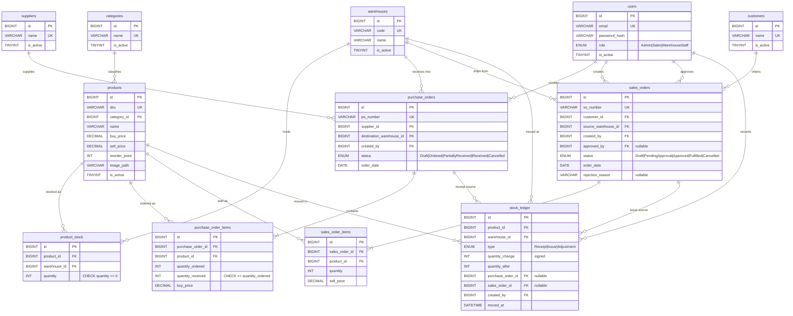
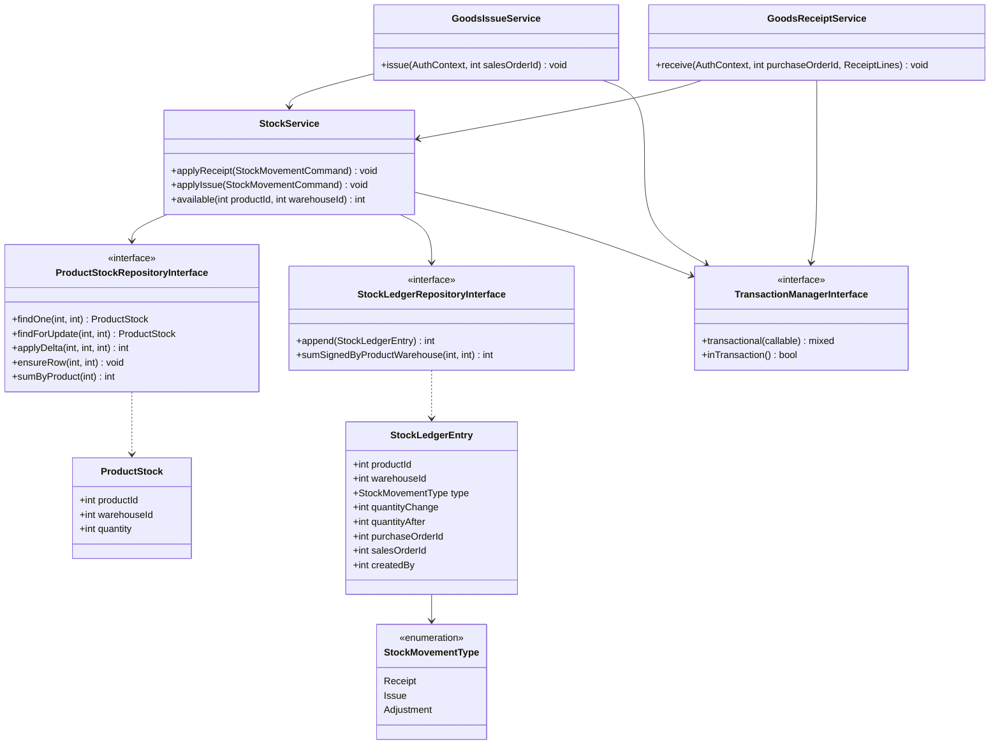
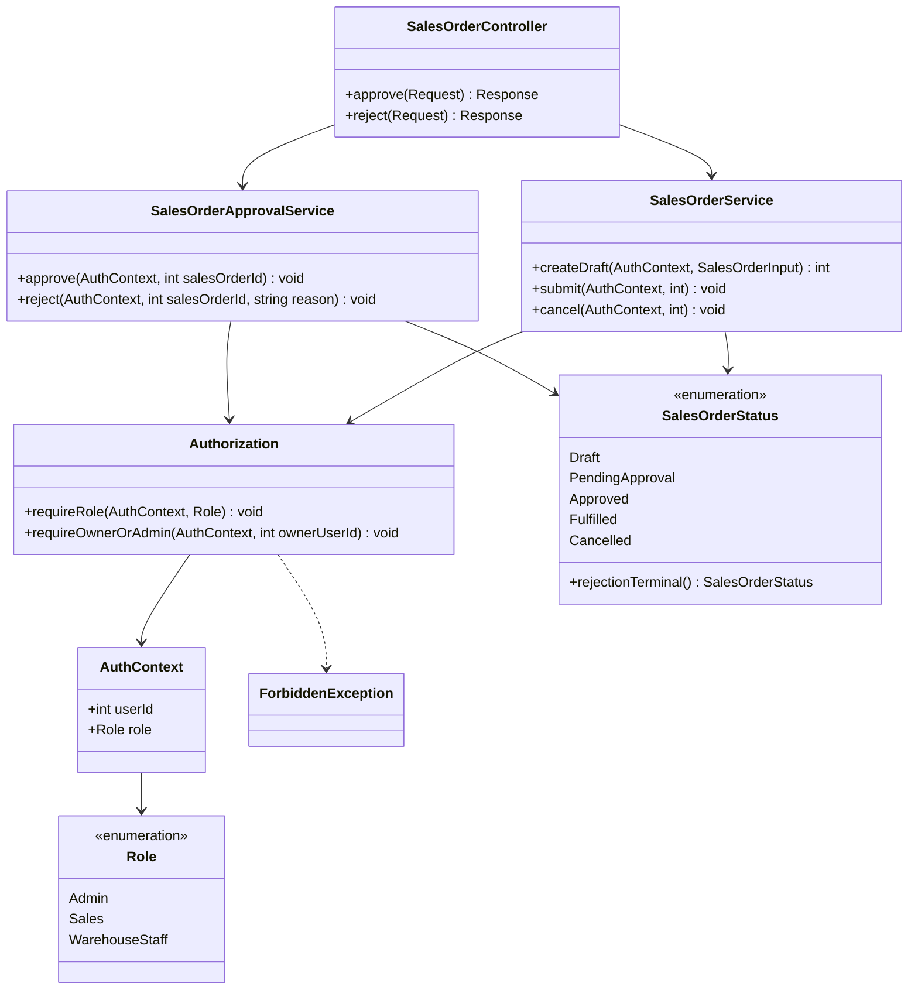

# PHASE 2 — ARCHITECTURE & DETAILED DESIGN BLUEPRINT

Project: **Inventory & Order Management System — Intermediate Programmer Final Project**
Governing specification: the approved Phase 2 prompt, executed as-is.
Output structure: the approved §27 structure (25 sections). No second structure.

Prerequisites verified before execution:

```text
PRE-CODING PRODUCT & SYSTEM ANALYSIS = COMPLETE   (docs/planning/pre-coding-analysis.md)
PHASE 1                              = COMPLETE / FROZEN
                                       (docs/planning/phase1-baseline.md — 31 sections,
                                        28 requirements, 16 decisions, 4 conflicts closed,
                                        3 assumptions, 90/90 audit conditions PASS)
```

Inputs consumed:

```text
1. Project Brief - Programmer.pdf          → SRC-001  (official brief, highest authority)
2. docs/planning/pre-coding-analysis.md    → SRC-004  (derived analysis, non-authoritative)
3. docs/planning/phase1-baseline.md        → frozen requirements & decision baseline
4. The approved Phase 2 prompt              → this document's governing specification
```

Authority rule applied throughout: **Phase 2 defines HOW the system is structured. It does not
redefine WHAT the requirements are.** Every design element below carries a Phase 1 origin. Where a
design element has no Phase 1 origin, it is declared in §24 rather than absorbed silently.

Notation:

- `REQ-ID` in a **Requirement References** column always resolves to a canonical row in
  `phase1-baseline.md` §11. No requirement is restated here in requirement form.
- `DEC-###`, `CON-###`, `ASM-###` resolve to `phase1-baseline.md` §04, §05, §06.
- `ADR-###` resolves to §21 of this document.
- Class, service, repository, and method names introduced here are **design names**, not
  requirements. They may be refined during implementation; the boundaries they express may not.

---

# 01. PHASE 2 SUMMARY

| Metric | Value |
|---|---|
| Phase 1 requirements consumed | 28 (17 Product + 11 Technical) |
| Requirements given explicit design coverage | 28 of 28 |
| New requirements created | **0** |
| New requirement IDs created | **0** |
| Phase 1 requirements, business rules, roles, statuses, or decisions changed | **0** |
| Architectural layers | 5 (Controller → Service → Repository Interface → Concrete Repository → PDO/MySQL) |
| Components designed | 18 |
| Use cases designed | 19 (the full Phase 2 §8 minimum list) |
| Repository interfaces designed | 11 |
| Database tables designed | 12 |
| Mandatory transaction boundaries designed | 2 (Goods Receipt, Goods Issue) |
| Concurrency scenarios designed | 4 invariants across 5 scenarios |
| ADRs produced | 3 |
| Design gaps found | 6 — 5 RESOLVED, 1 CARRIED (`GAP-007`, non-mandatory) |
| Open mandatory assumptions | 1 — `ASM-001`, preserved **OPEN**, explicitly traced |
| Prohibited technologies introduced | **0** |
| Design Consistency Check | PASS |
| Design Gap Check | PASS |

**PHASE 2 STATUS: COMPLETE.** See §25 for the exit-criteria evaluation.

### Headline design outcomes

1. **`StockService` is the single writer of stock.** No other Service, Controller, Repository, or
   script may mutate `ProductStock`. `GoodsReceiptService` and `GoodsIssueService` orchestrate
   their use cases and delegate the stock mutation plus its ledger append to `StockService` inside
   one transaction. This is how `ARCH-02`, `PO-01` and `SO-01` stock invariants become
   structurally enforced rather than merely documented.

2. **Transactions are orchestrated by the Service layer through `TransactionManagerInterface`**, so
   a Service never names PDO. This is what makes `ARCH-01` ("business logic must not depend on
   PDO") and `DB-01` ("explicit transactions") satisfiable at the same time.

3. **Pessimistic row locking (`SELECT … FOR UPDATE`) is selected** as the concurrency mechanism for
   stock mutation, resolving the choice Phase 1 §22.3 explicitly delegated to Phase 2. Recorded as
   `ADR-002`.

4. **One canonical aggregation repository** (`AggregationRepositoryInterface`) serves the dashboard,
   the CSV reports, and the low-stock script. This is a direct structural answer to `REPORT-01`'s
   rule that report and dashboard cannot disagree, and to `JOB-01`'s low-stock definition.
   Recorded as `ADR-003`.

5. **Segregation of duties is a Service-layer authorization decision**, taken before any state
   transition, in `SalesOrderApprovalService`. Sales is denied approve and reject unconditionally
   (`DEC-012`). No UI element participates in the decision.

6. **`ASM-001` remains OPEN.** The rejected-order terminal status is isolated behind a single
   transition method and a single enum value, so a trainer ruling costs one enum value, one
   transition, and one badge — exactly the blast radius Phase 1 recorded. No status was invented to
   close the assumption.

---

# 02. ARCHITECTURE OVERVIEW

## 2.1 Request Path (approved, unchanged)

```text
HTTP Request
    ↓
Controller                 HTTP concerns only
    ↓
Service                    business rules, authorization, transaction orchestration
    ↓
Repository Interface       persistence contract
    ↓
Concrete Repository        PDO, SQL, prepared statements, result mapping
    ↓
PDO / MySQL                permanent business source of truth
```

Dependency direction is one-way: Controller → Service → Repository Interface. A Concrete Repository
is bound to the interface at the composition root and is never named by a Service.
Origin: `ARCH-01`, `phase1-baseline.md` §09.

## 2.2 Composition Root

`ARCH-01` forbids a DI container framework (`phase1-baseline.md` §08) and forbids a Service
instantiating its own infrastructure. Both are satisfied by a single hand-written composition root
per entry point:

```text
public/index.php          web entry     → Router → Controller (dependencies constructed here)
public/api.php            API entry     → Router → Api Controller
scripts/check-low-stock.php  CLI entry  → Service (no Controller, no session)
tests/                    test entry    → Service + in-memory repository
```

The composition root is the only place where `new PDO(...)`, `new Redis(...)`,
`new Memcached(...)` and `new MySql*Repository(...)` appear. Every layer above receives its
collaborators by constructor injection. Origin: `ARCH-01`, `phase1-baseline.md` §08 rows
"DI Container Framework", "Hidden Infrastructure Creation", "Global Infrastructure Singleton".

## 2.3 Infrastructure Roles (approved boundaries, unchanged)

```text
MySQL       permanent business source of truth              [DEC-004]
Redis       authentication/session + temporary security      [DEC-005, TTL 3600 s]
            state — never business data, never stock
Memcached   ephemeral read cache for master data only        [DEC-006]
            — never business state, never a figure
```

Correctness never depends on Redis or Memcached. Both are degradable: a total Redis outage makes
users unauthenticated (a safe-deny state), and a total Memcached outage makes every read go to
MySQL. Neither can produce a wrong stock figure, because neither participates in the stock path.
Origin: `DEC-004`, `DEC-005`, `DEC-006`, `CON-002`, `CON-003`, `phase1-baseline.md` §19.8, §19.9,
§20, §21, §22.

## 2.4 Frontend

```text
HTML5                    server-rendered pages from the Controller layer
Custom CSS               participant-authored; existing UI/UX baseline is binding [DEC-007]
Vanilla JavaScript       progressive behaviour only
Fetch API                for the JSON contract (API-01) and in-page refreshes
```

No CSS framework, no JS framework, no admin template, no UI kit. Origin: `phase1-baseline.md` §07,
§08, `DEC-002`, `DEC-003`, `DEC-007`.

## 2.5 Directory Structure (design intent, not implementation)

```text
public/          index.php · api.php · assets (css, js, img)
src/
  Http/          Router · Request · Response · Controller/*  · Middleware/*
  Service/       one class per use-case family
  Domain/        Entity/* · Enum/* · Exception/*
  Repository/    *RepositoryInterface.php
  Persistence/   MySql/*Repository.php · PdoTransactionManager · Connection
  Session/       SessionInterface · RedisSession
  Cache/         CacheInterface · MemcachedCache · NullCache
scripts/         check-low-stock.php
tests/           Unit/* · Integration/*
docs/            planning/ · architecture/ · quality/
```

`Repository/` holds only interfaces; `Persistence/` holds only implementations. The physical
separation makes an `ARCH-01` violation visible in a diff: a `use App\Persistence\...` statement
inside `src/Service/` is a boundary breach by inspection alone.

## 2.6 Architecture Invariants

| # | Invariant | Origin | How the structure enforces it |
|---|---|---|---|
| AI-1 | No business rule in a Controller | `ARCH-01`, §09 | Controllers hold no branch on domain state; they marshal input, call one Service method, map the outcome to a response |
| AI-2 | No business rule in a Repository | `ARCH-01`, §09 | Repositories expose persistence operations only; no repository method takes a role or decides an outcome |
| AI-3 | No PDO in a Service | `ARCH-01`, §08 | Services depend on `*RepositoryInterface` and `TransactionManagerInterface` only |
| AI-4 | No superglobal in a Service | `ARCH-01`, §08 | Session values are read at the Controller boundary and passed inward as an `AuthContext` value object |
| AI-5 | Stock is mutated in exactly one place | `ARCH-02`, `DB-01`, §08 "Direct Stock Mutation" | Only `StockService` calls `ProductStockRepositoryInterface::applyDelta()` and `StockLedgerRepositoryInterface::append()` |
| AI-6 | Every authorization decision is server-side | `SO-01` SoD-1/SoD-2, §19.4 | Authorization is asserted in the Service before any mutation; the view never decides |
| AI-7 | Cache and session never hold business truth | `DEC-004`, `DEC-005`, `DEC-006` | `CacheInterface` is only injected into master-data read paths; `SessionInterface` only into the authentication boundary |
| AI-8 | Every entry point reaches business rules through the same Service | `API-01`, `JOB-01`, Phase 2 §22 | Web, API and CLI composition roots construct the same Service classes |

---

# 03. ARCHITECTURAL RESPONSIBILITY MATRIX

Derived from `phase1-baseline.md` §09 (canonical owner of layer boundaries). This matrix expresses
the same boundaries at component granularity for design use; it introduces no new boundary.

| Layer / Component | Responsibility | May Depend On | Must Not Depend On |
|---|---|---|---|
| `public/index.php` (web composition root) | Construct PDO, Redis, Memcached, concrete repositories, transaction manager; wire Controllers; dispatch to Router | Everything | — (it is the root; nothing depends on it) |
| `public/api.php` (API composition root) | Same, for the JSON contract; forces `Content-Type: application/json` on every outcome including failures | Everything | HTML view rendering |
| `Http\Router` | Map method + path to a Controller action; produce 404 for an unknown route | Controller | Service; Repository; PDO |
| `Http\Middleware\AuthenticationBoundary` | Resolve the session cookie to an `AuthContext`; redirect unauthenticated HTML requests to login; return 401 JSON for unauthenticated API requests | `SessionInterface`; `Request`; `Response` | Business rules; Repository; PDO; role decisions beyond "authenticated or not" |
| `Http\Middleware\CsrfBoundary` | Issue and verify the per-session CSRF token for state-changing HTML form submissions | `SessionInterface` | Business rules; Repository; PDO |
| `Http\Controller\*` | Parse and marshal HTTP input; invoke exactly one Service method; select HTTP status; select representation (HTML or JSON); render view or JSON | Service; `Request`; `Response`; view templates | PDO; SQL; concrete Repository; business rules; transaction orchestration; stock logic; role tables |
| `Service\*` | Business rules; use-case orchestration; **authorization decisions**; **segregation of duties**; **transaction orchestration**; validation as the authoritative pass | `*RepositoryInterface`; `TransactionManagerInterface`; other Services where a real use case requires it; `CacheInterface` (master-data read paths only); `AuthContext` value object | PDO; SQL; `$_SESSION`, `$_POST`, `$_GET`, `$_FILES`; HTTP status codes; Controller; concrete Repository; Redis or Memcached clients directly |
| `Service\StockService` | The **only** writer of `ProductStock` and `StockLedger`; enforces `quantity >= 0`, ledger-append pairing, and locked read-before-write | `ProductStockRepositoryInterface`; `StockLedgerRepositoryInterface` | Order workflow rules; approval rules; HTTP; PDO |
| `Repository\*RepositoryInterface` | Persistence contract expressed in domain terms | `Domain\Entity\*`; `Domain\Enum\*` | Business rules; HTTP; session; PDO types; SQL |
| `Persistence\MySql\*Repository` | PDO persistence; prepared statements; SQL; row-to-Entity mapping; `FOR UPDATE` locking where the interface declares a locked read | PDO; MySQL; the interface it implements; `Domain\Entity\*` | Controller; Service; business rules; authorization; HTTP |
| `Persistence\PdoTransactionManager` | `beginTransaction` / `commit` / `rollBack`; run a callable inside one transaction; guarantee rollback on any throwable | PDO | Business rules; Repository contracts; Controller |
| `Domain\Entity\*` | Business data structure and intrinsic invariants | `Domain\Enum\*`; `Domain\Exception\*` | Controller; PDO; Repository; HTTP; session; cache |
| `Domain\Enum\*` | Closed status and role vocabularies fixed by SRC-001 §1.3 | — | Everything else |
| `Session\RedisSession` | Store and retrieve authentication session state and temporary security state under TTL 3600 s | Redis client | Business data; stock; MySQL; being read as a source of truth |
| `Cache\MemcachedCache` | Regeneratable master-data read cache with bounded expiry and explicit invalidation | Memcached client | Business state; write-path correctness; being read as a source of truth |
| MySQL | Permanent business truth; referential integrity; `quantity >= 0`; transaction and row-level concurrency control | — | Redis; Memcached; application availability |
| `Http\View\*` (templates) | Presentation and interaction; 360px and desktop layout; labels, focus state, contrast; empty states | Data passed by the Controller | Authorization enforcement; business rules; direct data access |
| `scripts/check-low-stock.php` | CLI entry point outside the web request cycle | Service; Repository interface; composition root | HTTP lifecycle; session; Controller; cache |

### 3.1 Boundary Rules Restated as Prohibitions

| # | Prohibition | Detection in review |
|---|---|---|
| BR-1 | No business logic in a Controller | A Controller action containing a domain conditional or a status comparison |
| BR-2 | No business logic in a Repository | A repository method whose name or body encodes a rule (e.g. `approveIfAdmin`) |
| BR-3 | No `PDO` type, `PDO` import, or SQL string in `src/Service/` | Grep `PDO` and `SELECT|INSERT|UPDATE|DELETE` under `src/Service/` |
| BR-4 | No superglobal in `src/Service/` | Grep `$_SESSION`, `$_POST`, `$_GET`, `$_FILES`, `$_SERVER` under `src/Service/` |
| BR-5 | No `use App\Persistence\` in `src/Service/` | Grep import path |
| BR-6 | No `ProductStock` write outside `StockService` | Grep `applyDelta` callers; grep `product_stock` UPDATE statements |
| BR-7 | No `new PDO`, `new Redis`, `new Memcached` outside a composition root | Grep instantiation sites |
| BR-8 | No `Content-Type: text/html` on an API failure path | Inspect `public/api.php` error handling |

Every prohibition above already exists as a Phase 1 record in `phase1-baseline.md` §08 or §09; this
table is the reviewable form, not a new rule.

---

# 04. COMPONENT MAP

Each component below exists because a Phase 1 requirement demands the behaviour it owns. No
component exists solely to create an abstraction layer; the **Justification** column states the
concrete reason, and §24 records the review that confirmed none is gratuitous.

| # | Component | Responsibility | Primary Service | Primary Repository | Important Dependencies | Requirement References | Justification |
|---|---|---|---|---|---|---|---|
| C-01 | Authentication | Verify credentials, reject inactive accounts, establish and terminate session state, regenerate the session identifier | `AuthService` | `UserRepositoryInterface` | `SessionInterface` (Redis), PHP password API | AUTH-01, AUTH-02, ERR-01, API-01 | Owns the only credential-verification path; required by `AUTH-01` |
| C-02 | User Management | Create, view, edit, activate/deactivate Sales and Warehouse Staff accounts; unique email; no public registration | `UserService` | `UserRepositoryInterface` | — | USR-01, VAL-01, ERR-01 | Distinct actor (Admin-only) and distinct invariants from C-01 |
| C-03 | Product | Product catalogue with SKU uniqueness, numeric validation, reorder point, deactivate-not-delete, validated image upload under an unguessable name | `ProductService` | `ProductRepositoryInterface` | `CategoryRepositoryInterface`, `CacheInterface`, `FileStorageInterface` | PRD-01, VAL-01, FIND-01, ERR-01 | Central master entity referenced by every transaction flow |
| C-04 | Category | Category list used by `PRD-01` and by the `FIND-01` category filter | `CategoryService` | `CategoryRepositoryInterface` | `CacheInterface` | PRD-01, FIND-01 | A product cannot reference a category that does not exist (`PRD-01` rule) |
| C-05 | Warehouse | Warehouse list; guarantees exactly one `ProductStock` row per product per warehouse | `WarehouseService` | `WarehouseRepositoryInterface` | `ProductStockRepositoryInterface`, `CacheInterface` | WH-01, VAL-01 | Owns the per-warehouse stock-row provisioning rule of `WH-01` |
| C-06 | Supplier | Supplier records; deactivate-not-delete; inactive supplier not selectable for a new PO | `SupplierService` | `SupplierRepositoryInterface` | `CacheInterface` | MSTR-01, PO-01, VAL-01 | Mandated by `MSTR-01`; distinct selectability rule from Customer |
| C-07 | Customer | Customer records; deactivate-not-delete; inactive customer not selectable for a new SO | `CustomerService` | `CustomerRepositoryInterface` | `CacheInterface` | MSTR-01, SO-01, VAL-01 | Mandated by `MSTR-01`; distinct selectability rule from Supplier |
| C-08 | Product Stock | Authoritative per-product-per-warehouse quantity; the single mutation point; enforces `quantity >= 0` and locked read-before-write | `StockService` | `ProductStockRepositoryInterface` | `StockLedgerRepositoryInterface` | WH-01, PRD-01, PO-01, SO-01, ARCH-02, DB-01 | Concentrating every stock write in one component is what makes `ARCH-02` structurally enforceable |
| C-09 | Purchase Order | PO composition and lifecycle `Draft → Ordered → PartiallyReceived/Received → Cancelled`; outstanding-quantity tracking | `PurchaseOrderService` | `PurchaseOrderRepositoryInterface` | `SupplierRepositoryInterface`, `WarehouseRepositoryInterface`, `ProductRepositoryInterface`, `TransactionManagerInterface` | PO-01, VAL-01, VIEW-01, FIND-01 | Owns the PO lifecycle rules of `PO-01` |
| C-10 | Goods Receipt | The receipt transaction: bound received quantity by outstanding, increase stock, append a `Receipt` ledger row, recompute PO status — atomically | `GoodsReceiptService` | `PurchaseOrderRepositoryInterface` | `StockService`, `TransactionManagerInterface` | PO-01, ARCH-02, DB-01, VAL-01 | A mandatory transaction boundary with its own invariants and its own failure set; separating it from C-09 keeps `PurchaseOrderService` single-responsibility (`DESIGN-03`) |
| C-11 | Sales Order | SO composition and lifecycle `Draft → PendingApproval → Approved → Fulfilled`, plus `Cancelled` before `Fulfilled`; records creator | `SalesOrderService` | `SalesOrderRepositoryInterface` | `CustomerRepositoryInterface`, `WarehouseRepositoryInterface`, `ProductRepositoryInterface`, `TransactionManagerInterface` | SO-01, VAL-01, VIEW-01, FIND-01 | Owns the SO lifecycle rules of `SO-01` |
| C-12 | Approval | Approve or reject a `PendingApproval` Sales Order; **the segregation-of-duties decision point** | `SalesOrderApprovalService` | `SalesOrderRepositoryInterface` | `TransactionManagerInterface` | SO-01 (SoD-1, SoD-2), ERR-01, **ASM-001** | SoD is the highest-risk rule in the system (CF-8); giving it a dedicated component makes the denial one auditable method rather than a scattered condition |
| C-13 | Goods Issue | The issue transaction: require `Approved`, validate available stock **inside** the transaction under a row lock, decrease stock, append an `Issue` ledger row, set `Fulfilled` — atomically and race-safely | `GoodsIssueService` | `SalesOrderRepositoryInterface` | `StockService`, `TransactionManagerInterface` | SO-01, ARCH-02, DB-01 | The second mandatory transaction boundary and the only oversell-capable path; isolating it is what makes `ARCH-02` testable (`TEST-02`) |
| C-14 | Stock Ledger | Append-only movement history of type `Receipt`, `Issue`, `Adjustment`; the reconstruction basis for every stock figure | (written only via `StockService`) | `StockLedgerRepositoryInterface` | — | PRD-01, PO-01, SO-01, ARCH-02, REPORT-01, DB-01 | Append-only history is required by `PRD-01`/`ARCH-02` and is the source of the `REPORT-01` stock-movement export |
| C-15 | Dashboard | Role-scoped live figures produced by aggregation queries only | `DashboardService` | `AggregationRepositoryInterface` | — | DASH-01, VIEW-01 | `DASH-01` forbids any stored or hard-coded figure, which requires a dedicated aggregation path |
| C-16 | Report | CSV export of stock movement and of order status within a date range, from the same aggregation basis as the dashboard | `ReportService` | `AggregationRepositoryInterface` | `CsvWriterInterface` | REPORT-01, DASH-01 | `REPORT-01` requires report and dashboard to be unable to disagree — satisfied by sharing C-15's repository (`ADR-003`) |
| C-17 | JSON API | `GET /api/products/{sku}/availability`; JSON representation, correct status codes, never an HTML error page | `AvailabilityService` | `ProductRepositoryInterface` | `ProductStockRepositoryInterface`, `CacheInterface` | API-01, AUTH-01, ERR-01 | `API-01` requires a contract distinct from HTML pages while reusing the same authentication rule |
| C-18 | Low-Stock Script | CLI summary of products below reorder point, runnable outside the web request cycle | `LowStockService` | `AggregationRepositoryInterface` | — | JOB-01, PRD-01, FIND-01, DASH-01 | `JOB-01` requires web-independent execution; sharing C-15's low-stock definition prevents three divergent definitions of "low stock" |

### 4.1 Components Deliberately **Not** Created

| Not created | Why not | Where the behaviour lives instead |
|---|---|---|
| `PurchaseOrderItemService` / `SalesOrderItemService` | Order items have no lifecycle independent of their order; a separate service would be abstraction without a use case | Inside C-09 / C-11 as part of the order aggregate |
| `StockAdjustmentService` | `DEC-010` places no adjustment workflow in Phase 1 scope. Creating the service would invent product scope | Nowhere. The `Adjustment` enum value is retained; see §09.4 |
| `NotificationService` | No Phase 1 requirement asks for a notification. `JOB-01` requires a summary, not delivery | C-18 writes its summary to standard output |
| `PermissionService` / policy engine | Three roles and a closed capability table (`phase1-baseline.md` §13, §19.4) do not justify a policy engine; it would be "unnecessary architecture" under `phase1-baseline.md` §08 | An `Authorization` guard trait/helper used by each Service, asserting against `AuthContext` |
| `AuditLogService` | No Phase 1 requirement asks for a general audit log | `StockLedger` (C-14) already records stock history; order rows record creator and approver |
| Generic `CrudService` base class | Would couple unrelated invariants and defeat the SRP evidence `DESIGN-03` requires | Each master-data Service states its own rules |

---

# 05. USE-CASE / SERVICE DESIGN

Nineteen use cases — the complete Phase 2 §8 minimum list — each mapped to a Service responsibility. Business rules are **referenced**, never
redefined: every rule cited here has its canonical statement in `phase1-baseline.md` §11.

### UC-A1 · Login

| Field | Design |
|---|---|
| Actor | Admin, Sales, Warehouse Staff |
| Preconditions | No authenticated session, or an existing session being replaced |
| Service Responsibility | `AuthService::authenticate(email, plainPassword)` — find the user by email, refuse an inactive account, verify with `password_verify()`, build an `AuthContext`, instruct the session boundary to establish a **new** session identifier |
| Repository Dependencies | `UserRepositoryInterface::findByEmail()` |
| Authorization | None (entry point). Active-status check is part of the rule, not of authorization |
| Transaction | None — session establishment is not a database transaction (§19.6) |
| Failure Conditions | Unknown email; wrong password; inactive account — all three return one indistinguishable failure outcome carrying no field-level detail; session store unavailable → treated as authentication failure |
| Outcome | `AuthContext{userId, role, displayName}` and a regenerated session identifier, or a generic failure |
| Requirement References | AUTH-01, VAL-01, ERR-01 |

### UC-A2 · Logout

| Field | Design |
|---|---|
| Actor | Admin, Sales, Warehouse Staff |
| Preconditions | Authenticated session |
| Service Responsibility | `AuthService::logout(sessionId)` — instruct the session boundary to delete the authentication state |
| Repository Dependencies | None |
| Authorization | Own session only |
| Transaction | None |
| Failure Conditions | Session-store deletion failure → the request still terminates the session at the application boundary; a stale key must never re-authenticate |
| Outcome | Session terminated; protected URLs are re-guarded |
| Requirement References | AUTH-02, ERR-01 |

### UC-B1 · Create User

| Field | Design |
|---|---|
| Actor | Admin |
| Preconditions | Authenticated as Admin |
| Service Responsibility | `UserService::create(AuthContext, UserInput)` — assert Admin; validate required fields, email format and role membership of `{Admin, Sales, WarehouseStaff}`; assert email uniqueness; hash the password with `password_hash()`; persist |
| Repository Dependencies | `UserRepositoryInterface::existsByEmail()`, `::save()` |
| Authorization | Admin only; Sales and Warehouse Staff → 403 (§19.4) |
| Transaction | Recommended — single-row write (§19.6) |
| Failure Conditions | Non-Admin requester; missing required field; invalid role value; duplicate email; nothing is persisted on any failure |
| Outcome | A new active user account |
| Requirement References | USR-01, VAL-01, ERR-01, AUTH-01 |

### UC-B2 · Deactivate User

| Field | Design |
|---|---|
| Actor | Admin |
| Preconditions | Authenticated as Admin; target user exists |
| Service Responsibility | `UserService::setActive(AuthContext, userId, bool)` — assert Admin; flip the active flag. Deactivation is the only removal mechanism; no user row is deleted |
| Repository Dependencies | `UserRepositoryInterface::findById()`, `::save()` |
| Authorization | Admin only |
| Transaction | Recommended |
| Failure Conditions | Non-Admin requester; unknown user → 404 |
| Outcome | The account can no longer authenticate (`AUTH-01` inactive rule) |
| Requirement References | USR-01, AUTH-01, ERR-01 |

### UC-C1 · Create Product

| Field | Design |
|---|---|
| Actor | Admin |
| Preconditions | Authenticated as Admin; at least one category exists |
| Service Responsibility | `ProductService::create(AuthContext, ProductInput, ?UploadedImage)` — assert Admin; validate required fields; assert SKU uniqueness; assert buy price, sell price and reorder point are numeric and ≥ 0; assert the referenced category exists; if an image is supplied, validate type and size and store it under a randomly generated non-guessable name; persist; invalidate the product and category read cache |
| Repository Dependencies | `ProductRepositoryInterface::existsBySku()`, `::save()`; `CategoryRepositoryInterface::exists()` |
| Authorization | Admin write; all roles read (§13) |
| Transaction | Recommended — product row plus image reference |
| Failure Conditions | Non-Admin; duplicate SKU; negative or non-numeric price or reorder point; unknown category; invalid image type or size — nothing persisted, and a stored image is removed if the row write fails |
| Outcome | A new active product available to `PO-01` and `SO-01` composition |
| Requirement References | PRD-01, VAL-01, ERR-01 |

### UC-C2 · Update Product

| Field | Design |
|---|---|
| Actor | Admin |
| Preconditions | Authenticated as Admin; product exists |
| Service Responsibility | `ProductService::update(AuthContext, productId, ProductInput, ?UploadedImage)` — same rule set as UC-C1, with SKU uniqueness evaluated excluding the product itself; invalidate cache on success |
| Repository Dependencies | `ProductRepositoryInterface::findById()`, `::existsBySkuExcept()`, `::save()`; `CategoryRepositoryInterface::exists()` |
| Authorization | Admin only |
| Transaction | Recommended |
| Failure Conditions | As UC-C1, plus unknown product → 404 |
| Outcome | Updated product; **no stock quantity is touched** — quantity is not a product field |
| Requirement References | PRD-01, VAL-01, ERR-01 |

### UC-C3 · Deactivate Product

| Field | Design |
|---|---|
| Actor | Admin |
| Preconditions | Authenticated as Admin; product exists |
| Service Responsibility | `ProductService::setActive(AuthContext, productId, bool)` — assert Admin; flip the active flag; invalidate cache. **Deletion is not offered by the interface at all**, so the `PRD-01` "referenced product must not be deleted" rule cannot be violated by a future caller |
| Repository Dependencies | `ProductRepositoryInterface::findById()`, `::save()` |
| Authorization | Admin only |
| Transaction | Recommended |
| Failure Conditions | Non-Admin; unknown product → 404 |
| Outcome | Product excluded from new order composition; existing orders and ledger history unaffected |
| Requirement References | PRD-01, VIEW-01, ERR-01 |

### UC-D1 · Create Purchase Order

| Field | Design |
|---|---|
| Actor | Admin (create); Warehouse Staff (propose) |
| Preconditions | Authenticated as Admin or Warehouse Staff; an active supplier and an active destination warehouse exist |
| Service Responsibility | `PurchaseOrderService::createDraft(AuthContext, PurchaseOrderInput)` — assert the requester is Admin or Warehouse Staff and is not Sales; assert exactly one supplier and one destination warehouse; assert at least one item; assert each item quantity and buy price are numeric and ≥ 0; assert the supplier is active and each product exists; persist the PO and its items as one aggregate in `Draft` |
| Repository Dependencies | `PurchaseOrderRepositoryInterface::save()`; `SupplierRepositoryInterface::findActiveById()`; `WarehouseRepositoryInterface::findActiveById()`; `ProductRepositoryInterface::findAllByIds()` |
| Authorization | Admin, Warehouse Staff; **Sales → 403** (§19.4) |
| Transaction | Recommended — PO header and items written together |
| Failure Conditions | Sales requester; no items; inactive or unknown supplier; unknown warehouse; unknown product; negative quantity or price |
| Outcome | A `Draft` Purchase Order with recorded outstanding quantities equal to the ordered quantities |
| Requirement References | PO-01, VAL-01, ERR-01, MSTR-01, WH-01 |

### UC-D2 · Order Purchase Order

| Field | Design |
|---|---|
| Actor | Admin |
| Preconditions | Authenticated as Admin; PO exists in `Draft` with ≥ 1 item, supplier and destination warehouse set |
| Service Responsibility | `PurchaseOrderService::markOrdered(AuthContext, purchaseOrderId)` — assert Admin; assert current status is exactly `Draft`; assert the composition preconditions; transition to `Ordered` |
| Repository Dependencies | `PurchaseOrderRepositoryInterface::findById()`, `::updateStatus()` |
| Authorization | Admin only (§19.3) |
| Transaction | Recommended — status update (§19.6) |
| Failure Conditions | Non-Admin; status not `Draft`; empty item list |
| Outcome | PO becomes receivable. **No stock moves** — ordering is not a stock movement |
| Requirement References | PO-01, VAL-01, ERR-01 |

### UC-D3 · Receive Goods

| Field | Design |
|---|---|
| Actor | Warehouse Staff, Admin |
| Preconditions | Authenticated as Warehouse Staff or Admin; PO is `Ordered` or `PartiallyReceived` |
| Service Responsibility | `GoodsReceiptService::receive(AuthContext, purchaseOrderId, ReceiptLines)` — assert role; open one transaction; re-read the PO and its lines **under a row lock**; assert every received quantity is > 0 and ≤ that line's outstanding quantity; for each line delegate to `StockService::applyReceipt()` which increases `ProductStock` at the PO destination warehouse and appends a `Receipt` ledger row referencing the PO; decrement outstanding; recompute the PO status to `Received` when every line is fully received, otherwise `PartiallyReceived`; commit |
| Repository Dependencies | `PurchaseOrderRepositoryInterface::findByIdForUpdate()`, `::saveReceivedQuantities()`, `::updateStatus()`; via `StockService`: `ProductStockRepositoryInterface`, `StockLedgerRepositoryInterface` |
| Authorization | Warehouse Staff, Admin; **Sales → 403** |
| Transaction | **MANDATORY** — see §10, transaction `TX-1` |
| Failure Conditions | Non-authorised role; PO not in a receivable status; received quantity ≤ 0; received quantity exceeds outstanding; unknown PO line; any write failure — the whole transaction rolls back and **neither** stock nor ledger changes |
| Outcome | Stock increased, `Receipt` ledger rows appended, outstanding reduced, PO status recomputed — all atomically |
| Requirement References | PO-01, ARCH-02, DB-01, VAL-01, ERR-01, WH-01 |

### UC-E1 · Create Sales Order

| Field | Design |
|---|---|
| Actor | Sales (own), Admin |
| Preconditions | Authenticated as Sales or Admin; an active customer and an active source warehouse exist |
| Service Responsibility | `SalesOrderService::createDraft(AuthContext, SalesOrderInput)` — assert the requester is Sales or Admin; assert exactly one customer and one source warehouse; assert at least one item; assert quantities and sell prices are numeric and ≥ 0; assert the customer is active; **record the creator's user id from `AuthContext`, never from request input**; persist as `Draft` |
| Repository Dependencies | `SalesOrderRepositoryInterface::save()`; `CustomerRepositoryInterface::findActiveById()`; `WarehouseRepositoryInterface::findActiveById()`; `ProductRepositoryInterface::findAllByIds()` |
| Authorization | Sales (own data), Admin; **Warehouse Staff → 403** (§13, §19.4) |
| Transaction | Recommended |
| Failure Conditions | Warehouse Staff requester; no items; inactive or unknown customer; unknown warehouse or product; negative quantity or price |
| Outcome | A `Draft` Sales Order whose creator is recorded. **No stock is reserved** — Phase 1 defines no reservation |
| Requirement References | SO-01, VAL-01, ERR-01, MSTR-01, WH-01 |

### UC-E2 · Submit Sales Order

| Field | Design |
|---|---|
| Actor | Sales (own), Admin |
| Preconditions | SO is `Draft` with ≥ 1 item, customer and source warehouse set |
| Service Responsibility | `SalesOrderService::submit(AuthContext, salesOrderId)` — assert the requester is Admin, or Sales **and** the recorded creator of this order; assert current status is `Draft`; transition to `PendingApproval` |
| Repository Dependencies | `SalesOrderRepositoryInterface::findById()`, `::updateStatus()` |
| Authorization | Admin, or Sales on its **own** order — ownership is evaluated in the Service against the stored creator id (§19.4 ownership rule) |
| Transaction | Recommended |
| Failure Conditions | Sales requester who is not the creator → 403; status not `Draft`; empty item list |
| Outcome | SO awaits Admin approval |
| Requirement References | SO-01, VAL-01, ERR-01 |

### UC-E3 · Approve Sales Order

| Field | Design |
|---|---|
| Actor | **Admin only** |
| Preconditions | SO is `PendingApproval` |
| Service Responsibility | `SalesOrderApprovalService::approve(AuthContext, salesOrderId)` — **first statement asserts the requester role is exactly `Admin`**; Sales is denied unconditionally, with the recorded creator identity playing no part in the decision (`DEC-012`); then assert the current status is `PendingApproval`; record the approver's user id; transition to `Approved` |
| Repository Dependencies | `SalesOrderRepositoryInterface::findById()`, `::recordApproval()` |
| Authorization | Admin only. **SoD-1**: Sales denied entirely, including on its own order. **SoD-2**: enforcement is in this Service, before any transition; hiding the UI control is not enforcement (§19.4) |
| Transaction | Recommended — status update plus approver assignment as one unit (§19.6) |
| Failure Conditions | Sales or Warehouse Staff requester → **403 with no transition performed**; status not `PendingApproval`; unknown SO → 404 |
| Outcome | SO becomes issuable; approver recorded for audit |
| Requirement References | SO-01 (SoD-1, SoD-2), ERR-01, AUTH-01 |

### UC-E4 · Reject Sales Order

| Field | Design |
|---|---|
| Actor | **Admin only** |
| Preconditions | SO is `PendingApproval` |
| Service Responsibility | `SalesOrderApprovalService::reject(AuthContext, salesOrderId, ?reason)` — identical authorization assertion to UC-E3; assert status is `PendingApproval`; transition to the **rejection terminal status**, which per `DEC-009` is `Cancelled`, **carried as open mandatory assumption `ASM-001`** |
| Repository Dependencies | `SalesOrderRepositoryInterface::findById()`, `::recordRejection()` |
| Authorization | Admin only; SoD-1 and SoD-2 as UC-E3 |
| Transaction | Recommended |
| Failure Conditions | Sales or Warehouse Staff requester → 403 with no transition; status not `PendingApproval` |
| Outcome | SO terminates at `Cancelled` (`DEC-009`, **`ASM-001` OPEN**). The terminal value is produced by one method, `SalesOrderStatus::rejectionTerminal()`, so a trainer ruling changes exactly one enum value and one transition row — the blast radius Phase 1 recorded |
| Requirement References | SO-01, ERR-01, **ASM-001**, `DEC-009` |

### UC-E5 · Issue Goods

| Field | Design |
|---|---|
| Actor | Warehouse Staff, Admin |
| Preconditions | SO status is exactly `Approved` |
| Service Responsibility | `GoodsIssueService::issue(AuthContext, salesOrderId)` — assert the requester is Warehouse Staff or Admin; open one transaction; re-read the SO **under a row lock** and assert its status is `Approved` **inside** the transaction; for each line, delegate to `StockService::applyIssue()` which reads the `ProductStock` row for that product and the SO source warehouse **`FOR UPDATE`**, asserts `current − requested >= 0`, writes the decrement, and appends an `Issue` ledger row referencing the SO; transition the SO to `Fulfilled`; commit |
| Repository Dependencies | `SalesOrderRepositoryInterface::findByIdForUpdate()`, `::updateStatus()`; via `StockService`: `ProductStockRepositoryInterface::findForUpdate()`, `::applyDelta()`, `StockLedgerRepositoryInterface::append()` |
| Authorization | Warehouse Staff, Admin; **Sales → 403** |
| Transaction | **MANDATORY** — see §10, transaction `TX-2` |
| Failure Conditions | Non-authorised role; SO status not `Approved`; **insufficient available stock for any line** — the whole issue is refused and rolled back, so a multi-line issue never partially fulfils; a competing concurrent issue that exhausted the stock first; `quantity >= 0` constraint violation as a database backstop; any write failure |
| Outcome | Stock decreased, `Issue` ledger rows appended, SO `Fulfilled` — atomically, with no oversell and no lost update |
| Requirement References | SO-01, ARCH-02, DB-01, ERR-01, WH-01 |

### UC-F1 · View Dashboard

| Field | Design |
|---|---|
| Actor | Admin, Sales, Warehouse Staff |
| Preconditions | Authenticated |
| Service Responsibility | `DashboardService::forRole(AuthContext)` — select the role-appropriate metric set and delegate each figure to an aggregation query; return a `DashboardView` value object. **No figure is stored, cached, or hard-coded** |
| Repository Dependencies | `AggregationRepositoryInterface` (see §17 for the per-metric mapping) |
| Authorization | All roles, scoped: Admin all data; Sales only its own orders; Warehouse Staff stock and fulfilment scope. **Scope is applied in the query, not in the template** (§19.4) |
| Transaction | None |
| Failure Conditions | Unauthenticated → redirect to login; aggregation failure → generic error, never a stack trace |
| Outcome | Live role-scoped figures |
| Requirement References | DASH-01, VIEW-01, AUTH-01, ERR-01 |

### UC-F2 · Generate CSV Report

| Field | Design |
|---|---|
| Actor | Admin (all); Sales (own orders); Warehouse Staff (stock report) |
| Preconditions | Authenticated; a valid date range |
| Service Responsibility | `ReportService::stockMovement(AuthContext, DateRange)` and `::orderStatus(AuthContext, DateRange)` — validate the range; apply the role scope; call **the same `AggregationRepositoryInterface` methods the dashboard uses**; stream rows through `CsvWriterInterface` |
| Repository Dependencies | `AggregationRepositoryInterface` |
| Authorization | Scoped server-side; an out-of-scope request receives 403 (§19.4) |
| Transaction | None — read-only |
| Failure Conditions | Invalid or inverted date range; Sales requesting another user's orders → 403; unauthenticated → redirect |
| Outcome | A CSV whose figures cannot disagree with the dashboard, because both read one aggregation basis (`ADR-003`) |
| Requirement References | REPORT-01, DASH-01, VAL-01, ERR-01 |

### UC-G1 · Check Product Availability (API)

| Field | Design |
|---|---|
| Actor | Authenticated API consumer |
| Preconditions | Valid session presented on the API request |
| Service Responsibility | `AvailabilityService::bySku(AuthContext, sku)` — resolve the product by SKU; return per-warehouse quantities read from MySQL; return a not-found outcome when the SKU does not exist |
| Repository Dependencies | `ProductRepositoryInterface::findBySku()`; `ProductStockRepositoryInterface::findByProduct()` |
| Authorization | Any authenticated role; the authentication rule is the same object as for HTML pages (`AuthenticationBoundary`) |
| Transaction | None — read-only |
| Failure Conditions | No valid session → 401 JSON; unknown SKU → 404 JSON; internal failure → 500 JSON — never an HTML error page |
| Outcome | 200 JSON with per-warehouse availability |
| Requirement References | API-01, AUTH-01, ERR-01, WH-01 |

### UC-G2 · Check Low Stock (CLI)

| Field | Design |
|---|---|
| Actor | Script operator with container access |
| Preconditions | Database reachable; no HTTP request, no session |
| Service Responsibility | `LowStockService::summary()` — call the **same** low-stock aggregation the dashboard uses, format a text summary, return an exit code |
| Repository Dependencies | `AggregationRepositoryInterface::lowStockProducts()` |
| Authorization | Not reachable over HTTP; execution requires container access (§19.4) |
| Transaction | None — read-only |
| Failure Conditions | Database unreachable → non-zero exit code and a message on standard error; no stack trace in normal output |
| Outcome | A printed summary of products below reorder point |
| Requirement References | JOB-01, PRD-01, DASH-01, FIND-01 |

### 5.1 Cross-Cutting Service Rules

| # | Rule | Origin |
|---|---|---|
| SR-1 | Every Service method that changes state takes `AuthContext` as its first parameter and asserts authority before any read-for-write or write | `SO-01` SoD-2, §19.4 |
| SR-2 | Validation runs in the Service and is authoritative; a frontend pass never substitutes for it | `VAL-01` |
| SR-3 | On any validation or authorization failure, nothing is persisted and no transaction is opened | `VAL-01`, §19.6 |
| SR-4 | A Service throws a domain exception; the Controller maps it to an HTTP status. A Service never selects a status code | `ERR-01`, §09 |
| SR-5 | Ownership is evaluated against the stored creator id, never against a value supplied in the request | `SO-01`, §19.4 |
| SR-6 | Status transitions are expressed as explicit guarded methods, never as a settable status field | §19.3 |
| SR-7 | A Service reads authoritative stock only through `StockService`, and only inside the transaction that will mutate it | `ARCH-02`, §19.7 |

---

# 06. REPOSITORY CONTRACT DESIGN

Eleven repository interfaces. Each exists because at least one designed use case needs persistence
operations expressed in domain terms. **No repository is created per table**: order items belong to
their order aggregate, and no `PurchaseOrderItemRepository` or `SalesOrderItemRepository` exists.
No ORM, no query builder framework (`phase1-baseline.md` §08).

Operations are stated as contract intent. Every implementation uses PDO prepared statements
(`DB-01`); no operation accepts a raw SQL fragment or an unbounded free-text predicate.

### R-01 · `UserRepositoryInterface`

| Field | Design |
|---|---|
| Purpose | Persist and retrieve user accounts for authentication and administration |
| Entity / Aggregate | `User` |
| Operations | `findById(int): ?User` · `findByEmail(string): ?User` · `existsByEmail(string): bool` · `existsByEmailExcept(string, int): bool` · `save(User): int` · `paginate(UserFilter, Page): PagedResult` |
| Used By | `AuthService` (UC-A1), `UserService` (UC-B1, UC-B2) |
| Requirement References | AUTH-01, USR-01, VIEW-01, FIND-01 |
| Notes | No `delete()`. `USR-01` offers deactivation only, so the contract does not expose deletion |

### R-02 · `ProductRepositoryInterface`

| Field | Design |
|---|---|
| Purpose | Persist and retrieve the product catalogue |
| Entity / Aggregate | `Product` |
| Operations | `findById(int): ?Product` · `findBySku(string): ?Product` · `findAllByIds(int[]): Product[]` · `existsBySku(string): bool` · `existsBySkuExcept(string, int): bool` · `save(Product): int` · `setActive(int, bool): void` · `paginate(ProductFilter, Page): PagedResult` |
| Used By | `ProductService` (UC-C1…C3), `PurchaseOrderService`, `SalesOrderService`, `AvailabilityService` |
| Requirement References | PRD-01, FIND-01, VIEW-01, API-01, PO-01, SO-01 |
| Notes | No `delete()` — `PRD-01` forbids deleting a referenced product, and omitting the operation makes the rule unbreakable by a future caller. `ProductFilter` carries name/SKU search, category, and low-stock/normal classification for `FIND-01` |

### R-03 · `CategoryRepositoryInterface`

| Field | Design |
|---|---|
| Purpose | Provide the category vocabulary products reference and `FIND-01` filters by |
| Entity / Aggregate | `Category` |
| Operations | `findById(int): ?Category` · `exists(int): bool` · `findAllActive(): Category[]` · `save(Category): int` · `setActive(int, bool): void` |
| Used By | `CategoryService`, `ProductService`, `DashboardService` label resolution |
| Requirement References | PRD-01, FIND-01 |

### R-04 · `WarehouseRepositoryInterface`

| Field | Design |
|---|---|
| Purpose | Provide the warehouse list and support per-warehouse stock provisioning |
| Entity / Aggregate | `Warehouse` |
| Operations | `findById(int): ?Warehouse` · `findActiveById(int): ?Warehouse` · `findAllActive(): Warehouse[]` · `save(Warehouse): int` · `setActive(int, bool): void` |
| Used By | `WarehouseService`, `PurchaseOrderService`, `SalesOrderService`, `AvailabilityService` |
| Requirement References | WH-01, PO-01, SO-01, API-01 |

### R-05 · `SupplierRepositoryInterface`

| Field | Design |
|---|---|
| Purpose | Persist supplier records and expose only active suppliers for new PO composition |
| Entity / Aggregate | `Supplier` |
| Operations | `findById(int): ?Supplier` · `findActiveById(int): ?Supplier` · `findAllActive(): Supplier[]` · `save(Supplier): int` · `setActive(int, bool): void` · `paginate(PartnerFilter, Page): PagedResult` |
| Used By | `SupplierService`, `PurchaseOrderService` |
| Requirement References | MSTR-01, PO-01, VIEW-01, FIND-01 |
| Notes | No `delete()` — `MSTR-01` permits deactivation only |

### R-06 · `CustomerRepositoryInterface`

| Field | Design |
|---|---|
| Purpose | Persist customer records and expose only active customers for new SO composition |
| Entity / Aggregate | `Customer` |
| Operations | `findById(int): ?Customer` · `findActiveById(int): ?Customer` · `findAllActive(): Customer[]` · `save(Customer): int` · `setActive(int, bool): void` · `paginate(PartnerFilter, Page): PagedResult` |
| Used By | `CustomerService`, `SalesOrderService` |
| Requirement References | MSTR-01, SO-01, VIEW-01, FIND-01 |
| Notes | No `delete()` |

### R-07 · `ProductStockRepositoryInterface` — **the two-implementation interface**

| Field | Design |
|---|---|
| Purpose | Read and mutate the authoritative per-product-per-warehouse quantity |
| Entity / Aggregate | `ProductStock` |
| Operations | `findByProduct(int productId): ProductStock[]` · `findOne(int productId, int warehouseId): ?ProductStock` · **`findForUpdate(int productId, int warehouseId): ?ProductStock`** · **`applyDelta(int productId, int warehouseId, int delta): int`** · `ensureRow(int productId, int warehouseId): void` · `sumByProduct(int productId): int` |
| Used By | **`StockService` only** for `findForUpdate` and `applyDelta`; read-only methods also by `AvailabilityService` and `WarehouseService` |
| Requirement References | WH-01, PRD-01, PO-01, SO-01, ARCH-02, DB-01, API-01 |
| Notes | This is the interface `ARCH-01` requires to have **two implementations**: `MySqlProductStockRepository` (real, using `SELECT … FOR UPDATE` for `findForUpdate`) and `InMemoryProductStockRepository` (fake, used by unit tests so business-logic tests run with no database). `applyDelta` returns the resulting quantity so the Service can assert the invariant after the write. `findForUpdate` is named for its locking semantics so a reviewer can see at the call site that the read is locked (`ADR-002`) |

### R-08 · `StockLedgerRepositoryInterface`

| Field | Design |
|---|---|
| Purpose | Append and read the immutable stock movement history |
| Entity / Aggregate | `StockLedger` |
| Operations | **`append(StockLedgerEntry): int`** · `findByProduct(int productId, DateRange): StockLedgerEntry[]` · `sumSignedByProductWarehouse(int productId, int warehouseId): int` |
| Used By | **`StockService` only** for `append`; read paths by `ReportService` via aggregation and by stock reconciliation checks |
| Requirement References | PRD-01, PO-01, SO-01, ARCH-02, REPORT-01, DB-01 |
| Notes | **The contract exposes no update and no delete.** Append-only is therefore a property of the interface, not a convention. `sumSignedByProductWarehouse` exists to reconcile `ProductStock` against the ledger — the verification `phase1-baseline.md` §19.7 requires |

### R-09 · `PurchaseOrderRepositoryInterface`

| Field | Design |
|---|---|
| Purpose | Persist and retrieve the Purchase Order aggregate (header plus items plus received quantities) |
| Entity / Aggregate | `PurchaseOrder` **aggregate**, including `PurchaseOrderItem` |
| Operations | `findById(int): ?PurchaseOrder` · **`findByIdForUpdate(int): ?PurchaseOrder`** · `save(PurchaseOrder): int` · `updateStatus(int, PurchaseOrderStatus): void` · `saveReceivedQuantities(int, array<itemId,int>): void` · `paginate(OrderFilter, Page): PagedResult` |
| Used By | `PurchaseOrderService` (UC-D1, UC-D2), `GoodsReceiptService` (UC-D3) |
| Requirement References | PO-01, VIEW-01, FIND-01, ARCH-02, DB-01 |
| Notes | Items are loaded and saved with their order; no separate item repository. `findByIdForUpdate` gives the receipt transaction a locked read so two concurrent receipts against one PO line cannot double-count (§19.7) |

### R-10 · `SalesOrderRepositoryInterface`

| Field | Design |
|---|---|
| Purpose | Persist and retrieve the Sales Order aggregate, including creator and approver identity |
| Entity / Aggregate | `SalesOrder` **aggregate**, including `SalesOrderItem` |
| Operations | `findById(int): ?SalesOrder` · **`findByIdForUpdate(int): ?SalesOrder`** · `save(SalesOrder): int` · `updateStatus(int, SalesOrderStatus): void` · `recordApproval(int, int approverUserId): void` · `recordRejection(int, int approverUserId, ?string reason): void` · `paginate(OrderFilter, Page): PagedResult` |
| Used By | `SalesOrderService` (UC-E1, UC-E2), `SalesOrderApprovalService` (UC-E3, UC-E4), `GoodsIssueService` (UC-E5) |
| Requirement References | SO-01, VIEW-01, FIND-01, ARCH-02, DB-01, **ASM-001** |
| Notes | `recordRejection` writes the terminal status returned by `SalesOrderStatus::rejectionTerminal()`. It does **not** hard-code `Cancelled`, so `ASM-001` has exactly one resolution point. `OrderFilter` carries number/counterparty search, status filter and date sort for `FIND-01` |

### R-11 · `AggregationRepositoryInterface` — **the single aggregation basis** (`ADR-003`)

| Field | Design |
|---|---|
| Purpose | Provide every aggregated figure the system reports, from live queries, in one place |
| Entity / Aggregate | Read model — owns no entity |
| Operations | `inventoryValue(RoleScope): Money` · `lowStockProducts(RoleScope): LowStockRow[]` · `orderCountsByStatus(RoleScope, ?DateRange): array<status,int>` · `receiptQueue(RoleScope): QueueRow[]` · `issueQueue(RoleScope): QueueRow[]` · `stockMovementRows(RoleScope, DateRange): MovementRow[]` · `orderStatusRows(RoleScope, DateRange): OrderStatusRow[]` |
| Used By | `DashboardService` (UC-F1), `ReportService` (UC-F2), `LowStockService` (UC-G2) |
| Requirement References | DASH-01, REPORT-01, JOB-01, FIND-01, PRD-01 |
| Notes | Justification for a read-model repository: an aggregate figure spans several tables and belongs to no single entity, so placing these queries on entity repositories would either duplicate them or force an entity repository to know about unrelated tables. Sharing one interface across the dashboard, the exports and the CLI job is the structural guarantee behind `REPORT-01`'s rule that report and dashboard cannot disagree, and behind one single definition of "below reorder point". `RoleScope` is a value object built by the Service from `AuthContext`, so scope reaches SQL as a bound parameter — never as string concatenation |

### 6.1 Supporting Contracts (not repositories)

These are infrastructure abstractions the Service layer depends on so that `ARCH-01` holds. Each is
minimal and exists to keep a named prohibition satisfiable.

| Contract | Purpose | Implementations | Origin |
|---|---|---|---|
| `TransactionManagerInterface` | `transactional(callable): mixed` — run a unit of work inside one explicit database transaction, committing on return and rolling back on any throwable | `PdoTransactionManager` (real) · `NullTransactionManager` (unit tests) | `DB-01`, `ARCH-01`, `ARCH-02` — lets the Service own the transaction boundary without naming PDO |
| `SessionInterface` | `get`, `put`, `forget`, `regenerateId` for authentication session state and temporary security state | `RedisSession` (TTL 3600 s) · `ArraySession` (tests) | `AUTH-01`, `AUTH-02`, `DEC-005` — keeps `$_SESSION` and the Redis client out of Services |
| `CacheInterface` | `get`, `set(key, value, ttl)`, `forget(key)`, `forgetPrefix(prefix)` for master-data reads | `MemcachedCache` · `NullCache` (fallback and tests) | `DEC-006`, §19.9 — keeps the Memcached client out of Services and makes cache-off a supported configuration |
| `FileStorageInterface` | Validate and store an uploaded image under a randomly generated non-guessable name; delete an orphaned file | `LocalFileStorage` | `PRD-01` |
| `CsvWriterInterface` | Stream rows as CSV | `StreamCsvWriter` | `REPORT-01` |
| `ClockInterface` | `now(): DateTimeImmutable` | `SystemClock` · `FrozenClock` (tests) | `TEST-01`, `TEST-03` — date-dependent rules must be testable without `sleep()` |

`NullCache` and `NullTransactionManager` are not speculative abstraction: `NullCache` is the
`DEC-006`-mandated fallback behaviour when Memcached is unavailable (§19.9), and
`NullTransactionManager` is what lets `TEST-01` unit tests run with no database while still
exercising the Service's transaction orchestration.

---

# 07. DATABASE DESIGN

Twelve tables — exactly the SRC-001 §1.3 minimum set, no speculative entity, no speculative business
field. MySQL 8, InnoDB, `utf8mb4`. Every table has a primary key; every relationship is enforced by
a foreign key; `product_stock.quantity` carries a database-level non-negative constraint
(`DB-01`, `ARCH-02`).

Conventions: surrogate `BIGINT UNSIGNED AUTO_INCREMENT` primary keys; `snake_case` identifiers;
statuses and roles stored as the exact SRC-001 §1.3 string values; money as `DECIMAL(15,2)` (IDR,
per `DEC-013`); quantities as `INT` with non-negative checks; `created_at`/`updated_at` timestamps.

### T-01 · `users`

| Field | Design |
|---|---|
| Purpose | Authentication identity and role assignment |
| Primary Key | `id` |
| Foreign Keys | — |
| Important Attributes | `name`, `email`, `password_hash`, `role`, `is_active`, `created_at`, `updated_at` |
| Constraints | `role` restricted to `Admin`, `Sales`, `WarehouseStaff` (`DEC-011`); `is_active` NOT NULL default 1; `password_hash` NOT NULL |
| Unique Constraints | `uq_users_email (email)` |
| Indexes | `idx_users_role (role)`, `idx_users_active (is_active)` |
| Relationships | 1:N `sales_orders.created_by`; 1:N `sales_orders.approved_by`; 1:N `stock_ledger.created_by` |
| Requirement References | AUTH-01, AUTH-02, USR-01, SO-01, DB-01 |
| Notes | No plaintext password column exists. No `deleted_at` — `USR-01` deactivates rather than deletes |

### T-02 · `warehouses`

| Field | Design |
|---|---|
| Purpose | Stock location identity |
| Primary Key | `id` |
| Foreign Keys | — |
| Important Attributes | `code`, `name`, `address`, `is_active`, timestamps |
| Constraints | `is_active` NOT NULL default 1 |
| Unique Constraints | `uq_warehouses_code (code)` |
| Indexes | `idx_warehouses_active (is_active)` |
| Relationships | 1:N `product_stock`; 1:N `purchase_orders.destination_warehouse_id`; 1:N `sales_orders.source_warehouse_id`; 1:N `stock_ledger` |
| Requirement References | WH-01, PO-01, SO-01, DB-01 |

### T-03 · `categories`

| Field | Design |
|---|---|
| Purpose | Product classification used by `PRD-01` and the `FIND-01` category filter |
| Primary Key | `id` |
| Foreign Keys | — |
| Important Attributes | `name`, `is_active`, timestamps |
| Constraints | `name` NOT NULL |
| Unique Constraints | `uq_categories_name (name)` |
| Indexes | `idx_categories_active (is_active)` |
| Relationships | 1:N `products` |
| Requirement References | PRD-01, FIND-01, DB-01 |

### T-04 · `products`

| Field | Design |
|---|---|
| Purpose | Product catalogue referenced by every transaction flow |
| Primary Key | `id` |
| Foreign Keys | `category_id` → `categories.id` (RESTRICT on delete) |
| Important Attributes | `sku`, `name`, `unit`, `buy_price`, `sell_price`, `reorder_point`, `image_path`, `is_active`, timestamps |
| Constraints | `chk_products_buy_price` `buy_price >= 0`; `chk_products_sell_price` `sell_price >= 0`; `chk_products_reorder_point` `reorder_point >= 0`; `category_id` NOT NULL |
| Unique Constraints | `uq_products_sku (sku)` |
| Indexes | `idx_products_category (category_id)`, `idx_products_active (is_active)`, `idx_products_name (name)`, `idx_products_reorder_point (reorder_point)` |
| Relationships | 1:N `product_stock`; 1:N `purchase_order_items`; 1:N `sales_order_items`; 1:N `stock_ledger` |
| Requirement References | PRD-01, FIND-01, VIEW-01, API-01, JOB-01, DB-01 |
| Notes | `products` holds **no quantity column**. Quantity lives only in `product_stock`, so `WH-01`'s "total is never stored as an independent figure" is structurally true. `image_path` stores the randomly generated name produced by `FileStorageInterface`. `idx_products_name` supports the `FIND-01` name search; SKU search uses the unique index |

### T-05 · `product_stock`

| Field | Design |
|---|---|
| Purpose | **The authoritative per-product-per-warehouse quantity** |
| Primary Key | `id` |
| Foreign Keys | `product_id` → `products.id` (RESTRICT); `warehouse_id` → `warehouses.id` (RESTRICT) |
| Important Attributes | `quantity`, `updated_at` |
| Constraints | **`chk_product_stock_quantity` `quantity >= 0`** — the `DB-01`/`ARCH-02` database-level backstop; `quantity` NOT NULL default 0 |
| Unique Constraints | **`uq_product_stock_product_warehouse (product_id, warehouse_id)`** — enforces `WH-01`'s "exactly one row per product per warehouse" and blocks the duplicate-row race in §19.7 |
| Indexes | `idx_product_stock_warehouse (warehouse_id)`; the unique index serves the `(product_id, warehouse_id)` locked lookup |
| Relationships | N:1 `products`; N:1 `warehouses` |
| Requirement References | WH-01, PRD-01, PO-01, SO-01, ARCH-02, DB-01, API-01, JOB-01 |
| Notes | Rows are provisioned by `WarehouseService`/`ProductService` via `ensureRow()`. The `FOR UPDATE` read in `TX-2` locks exactly one row of this table, which is what makes `ARCH-02` hold |

### T-06 · `suppliers`

| Field | Design |
|---|---|
| Purpose | Purchase counterparty |
| Primary Key | `id` |
| Foreign Keys | — |
| Important Attributes | `name`, `contact`, `address`, `is_active`, timestamps |
| Constraints | `name` NOT NULL; `is_active` NOT NULL default 1 |
| Unique Constraints | `uq_suppliers_name (name)` |
| Indexes | `idx_suppliers_active (is_active)` |
| Relationships | 1:N `purchase_orders` |
| Requirement References | MSTR-01, PO-01, DB-01 |

### T-07 · `customers`

| Field | Design |
|---|---|
| Purpose | Sales counterparty |
| Primary Key | `id` |
| Foreign Keys | — |
| Important Attributes | `name`, `contact`, `address`, `is_active`, timestamps |
| Constraints | `name` NOT NULL; `is_active` NOT NULL default 1 |
| Unique Constraints | `uq_customers_name (name)` |
| Indexes | `idx_customers_active (is_active)` |
| Relationships | 1:N `sales_orders` |
| Requirement References | MSTR-01, SO-01, DB-01 |

### T-08 · `purchase_orders`

| Field | Design |
|---|---|
| Purpose | Purchase Order header and lifecycle state |
| Primary Key | `id` |
| Foreign Keys | `supplier_id` → `suppliers.id` (RESTRICT); `destination_warehouse_id` → `warehouses.id` (RESTRICT); `created_by` → `users.id` (RESTRICT) |
| Important Attributes | `po_number`, `status`, `order_date`, `notes`, timestamps |
| Constraints | `status` restricted to `Draft`, `Ordered`, `PartiallyReceived`, `Received`, `Cancelled` (SRC-001 §1.3); `supplier_id`, `destination_warehouse_id` NOT NULL |
| Unique Constraints | `uq_purchase_orders_number (po_number)` |
| Indexes | `idx_po_status (status)`, `idx_po_supplier (supplier_id)`, `idx_po_order_date (order_date)`, `idx_po_warehouse (destination_warehouse_id)` |
| Relationships | 1:N `purchase_order_items`; N:1 `suppliers`, `warehouses`, `users` |
| Requirement References | PO-01, VIEW-01, FIND-01, DB-01 |
| Notes | `idx_po_status` and `idx_po_order_date` serve the `FIND-01` status filter and date sort and the `DASH-01` status counts. Exactly one supplier and one destination warehouse are structurally guaranteed by the two NOT NULL scalar FKs |

### T-09 · `purchase_order_items`

| Field | Design |
|---|---|
| Purpose | PO lines with ordered and received quantities — the outstanding-quantity basis |
| Primary Key | `id` |
| Foreign Keys | `purchase_order_id` → `purchase_orders.id` (CASCADE); `product_id` → `products.id` (RESTRICT) |
| Important Attributes | `quantity_ordered`, `quantity_received`, `buy_price` |
| Constraints | `chk_poi_qty_ordered` `quantity_ordered >= 0`; `chk_poi_qty_received` `quantity_received >= 0`; **`chk_poi_received_le_ordered` `quantity_received <= quantity_ordered`** — the database backstop for `PO-01`'s "received must not exceed outstanding"; `chk_poi_buy_price` `buy_price >= 0` |
| Unique Constraints | `uq_poi_order_product (purchase_order_id, product_id)` — one line per product per PO, so outstanding is unambiguous |
| Indexes | `idx_poi_order (purchase_order_id)`, `idx_poi_product (product_id)` |
| Relationships | N:1 `purchase_orders`, `products` |
| Requirement References | PO-01, VAL-01, DB-01 |
| Notes | Outstanding is `quantity_ordered − quantity_received`, computed rather than stored, so it cannot drift. `CASCADE` on the order FK is safe because a PO and its items form one aggregate; `products` is `RESTRICT`, which is what makes `PRD-01`'s deactivate-not-delete enforceable at the database as well as the Service |

### T-10 · `sales_orders`

| Field | Design |
|---|---|
| Purpose | Sales Order header, lifecycle state, and the identities SoD depends on |
| Primary Key | `id` |
| Foreign Keys | `customer_id` → `customers.id` (RESTRICT); `source_warehouse_id` → `warehouses.id` (RESTRICT); `created_by` → `users.id` (RESTRICT); `approved_by` → `users.id` (RESTRICT, nullable) |
| Important Attributes | `so_number`, `status`, `order_date`, `approved_at`, `rejection_reason`, `notes`, timestamps |
| Constraints | `status` restricted to `Draft`, `PendingApproval`, `Approved`, `Fulfilled`, `Cancelled` (SRC-001 §1.3); `customer_id`, `source_warehouse_id`, `created_by` NOT NULL; `approved_by` NULL until an approval or rejection is recorded |
| Unique Constraints | `uq_sales_orders_number (so_number)` |
| Indexes | `idx_so_status (status)`, `idx_so_customer (customer_id)`, `idx_so_created_by (created_by)`, `idx_so_order_date (order_date)`, `idx_so_warehouse (source_warehouse_id)` |
| Relationships | 1:N `sales_order_items`; N:1 `customers`, `warehouses`; N:1 `users` twice (`created_by`, `approved_by`) |
| Requirement References | SO-01, VIEW-01, FIND-01, DASH-01, DB-01, **ASM-001** |
| Notes | `created_by` is the ownership basis for `SO-01`'s Sales-own-order rule and is what `idx_so_created_by` supports for the Sales-scoped dashboard and export. `approved_by` records the approver for audit. **No `Rejected` status value exists** — the enum is exactly SRC-001 §1.3, and a rejection is written as the terminal value `DEC-009` selects, with `rejection_reason` retaining why. `rejection_reason` is not a new requirement; it is the design's storage for the optional reason UC-E4 accepts, and it carries no lifecycle meaning |

### T-11 · `sales_order_items`

| Field | Design |
|---|---|
| Purpose | SO lines |
| Primary Key | `id` |
| Foreign Keys | `sales_order_id` → `sales_orders.id` (CASCADE); `product_id` → `products.id` (RESTRICT) |
| Important Attributes | `quantity`, `sell_price` |
| Constraints | `chk_soi_quantity` `quantity >= 0`; `chk_soi_sell_price` `sell_price >= 0` |
| Unique Constraints | `uq_soi_order_product (sales_order_id, product_id)` |
| Indexes | `idx_soi_order (sales_order_id)`, `idx_soi_product (product_id)` |
| Relationships | N:1 `sales_orders`, `products` |
| Requirement References | SO-01, VAL-01, DB-01 |
| Notes | No `quantity_issued` column: `SO-01` fulfils an SO in one atomic issue (`Approved → Fulfilled`), with no partial-issue status in the SRC-001 §1.3 set. Adding a partial-issue column would imply a lifecycle the brief does not define |

### T-12 · `stock_ledger`

| Field | Design |
|---|---|
| Purpose | **Append-only** record of every stock movement; the reconstruction basis for every stock figure and the source of the `REPORT-01` stock-movement export |
| Primary Key | `id` |
| Foreign Keys | `product_id` → `products.id` (RESTRICT); `warehouse_id` → `warehouses.id` (RESTRICT); `created_by` → `users.id` (RESTRICT); `purchase_order_id` → `purchase_orders.id` (RESTRICT, nullable); `sales_order_id` → `sales_orders.id` (RESTRICT, nullable) |
| Important Attributes | `type`, `quantity_change`, `quantity_after`, `moved_at`, `notes` |
| Constraints | `type` restricted to `Receipt`, `Issue`, `Adjustment` (SRC-001 §1.3); `chk_ledger_quantity_after` `quantity_after >= 0`; `chk_ledger_change_nonzero` `quantity_change <> 0`; **`chk_ledger_reference`** — a `Receipt` row must carry `purchase_order_id` and no `sales_order_id`; an `Issue` row must carry `sales_order_id` and no `purchase_order_id`; an `Adjustment` row carries neither |
| Unique Constraints | — (a product may legitimately move many times) |
| Indexes | `idx_ledger_product_warehouse (product_id, warehouse_id)`, `idx_ledger_moved_at (moved_at)`, `idx_ledger_type (type)`, `idx_ledger_po (purchase_order_id)`, `idx_ledger_so (sales_order_id)` |
| Relationships | N:1 `products`, `warehouses`, `users`; N:1 `purchase_orders` (optional), `sales_orders` (optional) |
| Requirement References | PRD-01, PO-01, SO-01, ARCH-02, REPORT-01, DB-01, VIEW-01 |
| Notes | Immutability is enforced by three layers: the repository contract exposes no update or delete (R-08), the Service layer has no code path that would call one, and no application database user privilege is required beyond `INSERT` on this table. `quantity_change` is signed — positive for `Receipt`, negative for `Issue` — so `sum(quantity_change)` reconciles against `product_stock.quantity`, the check §19.7 requires. `quantity_after` records the post-movement quantity observed inside the transaction, which is what makes a lost update visible in the history after the fact. `Adjustment` is a permitted enum value with **no writing code path in Phase 2** (`DEC-010`); the `chk_ledger_reference` clause defines its shape so the constraint is total, not so a workflow is implied |

### 7.1 Seed and Demo Data Design

`DB-01` fixes the minimums; this is the design that satisfies them, not a new requirement.

| Item | Design | Origin |
|---|---|---|
| Users | 1 Admin, 2 Sales, 2 Warehouse Staff, all with hashed passwords; at least one inactive account so the `AUTH-01` inactive-login demo is possible | DB-01, AUTH-01, USR-01 |
| Warehouses | 2 active warehouses | DB-01, WH-01 |
| Categories | At least 4, so the `FIND-01` category filter is meaningful | DB-01, FIND-01 |
| Products | At least 30, with varied reorder points and some products deliberately below reorder point | DB-01, FIND-01, JOB-01 |
| Product stock | One row per product per warehouse (60+ rows), quantities varied including zero | DB-01, WH-01 |
| Suppliers / Customers | At least 3 each, including one inactive of each, so the `MSTR-01` selectability rule is demonstrable | DB-01, MSTR-01 |
| Orders | At least 25 combined POs and SOs spanning every status value, explicitly including `PendingApproval` and `Cancelled` | DB-01, FIND-01 |
| Stock ledger | Rows consistent with every seeded receipt and issue, so `sum(quantity_change)` equals the seeded `product_stock.quantity` for every row | DB-01, ARCH-02 |

Schema and seed are separate idempotent scripts so the database can be built from empty
(`DB-01`, `ENV-01`).

### 7.2 Fields Deliberately **Not** Added

| Not added | Why |
|---|---|
| `products.stock_quantity` | Would create a second stock authority and contradict `WH-01` |
| `sales_orders.rejected` boolean or a `Rejected` status value | Would invent a status outside SRC-001 §1.3 and silently close `ASM-001` |
| `sales_order_items.quantity_issued` | Implies a partial-issue lifecycle the brief does not define |
| `product_stock.reserved_quantity` | Phase 1 defines no reservation; adding one would invent a business rule |
| `users.last_login_at`, `login_attempts` columns | No Phase 1 requirement; login throttle state, where used, is temporary security state in Redis (`DEC-005`) |
| Soft-delete `deleted_at` columns | `PRD-01`, `MSTR-01` and `USR-01` deactivate; a second removal concept would be ambiguous |
| A generic `audit_log` table | No Phase 1 requirement asks for one |

---

# 08. ERD

## 8.1 Design ERD



Cardinality notes:

- `purchase_orders ||--|{ purchase_order_items` and `sales_orders ||--|{ sales_order_items` are
  **one-to-one-or-many**, expressing `PO-01`/`SO-01`'s "must carry at least one item".
- `users ||--o{ sales_orders` appears twice: once as creator (mandatory) and once as approver
  (optional until an approval or rejection is recorded). Two distinct relationships to one table is
  what makes the `SO-01` SoD evidence storable.
- `stock_ledger` references `purchase_orders` and `sales_orders` optionally, which is how a
  `Receipt` row proves its PO origin and an `Issue` row proves its SO origin.

## 8.2 Capability Verification

Each capability below is verified against the ERD, not asserted.

| Capability | ERD support | Verdict |
|---|---|---|
| **Multi-Warehouse Stock** | `product_stock` carries both `product_id` and `warehouse_id` with a composite unique key, and `products` carries **no** quantity column. Stock therefore cannot exist except per warehouse, and a product total can only be a sum | SUPPORTED |
| **Purchase Order** | `purchase_orders` (supplier + destination warehouse + creator + status) with `purchase_order_items` carrying `quantity_ordered` and `quantity_received` — the full `Draft → Ordered → PartiallyReceived → Received` lifecycle including outstanding tracking | SUPPORTED |
| **Sales Order** | `sales_orders` (customer + source warehouse + creator + approver + status) with `sales_order_items` — the full `Draft → PendingApproval → Approved → Fulfilled` lifecycle plus `Cancelled` | SUPPORTED |
| **Stock Ledger** | `stock_ledger` with signed `quantity_change`, `quantity_after`, a three-value `type`, and optional PO/SO references — append-only movement history reconcilable against `product_stock` | SUPPORTED |
| **Goods Receipt** | `purchase_order_items.quantity_received` + a `Receipt` ledger row carrying `purchase_order_id` + a `product_stock` increase at `purchase_orders.destination_warehouse_id` | SUPPORTED |
| **Goods Issue** | A `product_stock` decrease at `sales_orders.source_warehouse_id` + an `Issue` ledger row carrying `sales_order_id` + `sales_orders.status = Fulfilled` | SUPPORTED |
| **Segregation of duties evidence** | `sales_orders.created_by` and `sales_orders.approved_by` are separate columns, both FK to `users` | SUPPORTED |
| **Low stock** | `products.reorder_point` compared against summed `product_stock.quantity` | SUPPORTED |
| **Pagination and filtering** | `idx_products_name`, `uq_products_sku`, `idx_products_category`, `idx_po_status`, `idx_so_status`, `idx_po_order_date`, `idx_so_order_date` | SUPPORTED |

## 8.3 Reconciliation With Phase 1 and the Pre-Coding Analysis

The pre-coding analysis (`SRC-004`) produced an ERD of 12 entities. The design ERD above has the
same 12 entities with the same relationships. Reconciliation of the differences:

| Item | Pre-coding analysis | Phase 2 design ERD | Treatment |
|---|---|---|---|
| Entity set | 12 entities | 12 entities, identical names | **Consistent.** No entity added, none dropped |
| Attribute detail | Logical attributes only | Physical types, constraints, indexes added | **Refinement, not change.** Phase 2 owns physical design |
| `stock_ledger.quantity_after` | Not present in the logical model | Present | **Design addition with a stated purpose**: it makes a lost update detectable in history and supports ledger-vs-stock reconciliation (§19.7 verification). It is not a business field and creates no requirement. Recorded in §24 as `DG-02` |
| `sales_orders.rejection_reason` | Not present | Present, nullable, no lifecycle meaning | **Design addition** storing the optional reason UC-E4 accepts. Recorded in §24 as `DG-03` |
| Adjustment origin | `GAP-003` — no originating workflow | Enum value retained; **no writing code path** | **Consistent with `DEC-010`.** No workflow invented |
| Reservation | Not modelled | Not modelled | **Consistent.** No `reserved_quantity` column |

**No requirement was changed to fit the ERD.** Where the ERD needed something the requirements do
not mention, the addition is declared in §24 rather than back-filled into Phase 1.

---

# 09. STOCK DESIGN

## 9.1 Authoritative State

```text
ProductStock  →  MySQL table product_stock    (authoritative current quantity)
StockLedger   →  MySQL table stock_ledger     (authoritative movement history, append-only)
```

Neither Redis nor Memcached participates. `phase1-baseline.md` §22 invariants B-S1…B-S8 are the
governing rules; this section states the structure that enforces them.

## 9.2 The Single Mutation Point

```text
GoodsReceiptService ─┐
                     ├─→ StockService ─→ ProductStockRepositoryInterface::findForUpdate()
GoodsIssueService ───┘                                              ::applyDelta()
                                      └─→ StockLedgerRepositoryInterface::append()
```

`StockService` exposes exactly two mutating operations and one read:

| Operation | Signature intent | Enforced invariant |
|---|---|---|
| `applyReceipt(StockMovementCommand)` | Increase quantity for (product, destination warehouse) and append a `Receipt` ledger row referencing the PO | B-S2 (paired write), B-S3 (append-only), B-S5 (`Receipt` increases only) |
| `applyIssue(StockMovementCommand)` | Decrease quantity for (product, source warehouse) and append an `Issue` ledger row referencing the SO | B-S1 (never negative), B-S2, B-S3, B-S4 (no lost update), B-S5 (`Issue` decreases only) |
| `available(productId, warehouseId)` | Read the current quantity **without** a lock, for display and API use only | Read paths must never be mistaken for the pre-write read |

Design rules that make the invariants structural rather than procedural:

| # | Rule | Enforces |
|---|---|---|
| SD-1 | `StockService` requires an already-open transaction: it asserts `TransactionManagerInterface::inTransaction()` and throws otherwise. It never opens its own transaction, so it cannot be called outside one | B-S2, B-S7 |
| SD-2 | Both mutating operations always perform the `ProductStock` write **and** the ledger append. There is no code path that does one without the other, and no parameter that disables the ledger | B-S2, B-S3 |
| SD-3 | `applyIssue` reads through `findForUpdate` — a locked read — and computes `current − requested`, refusing the operation when the result would be negative. The `quantity >= 0` database constraint remains as a second line of defence | B-S1, B-S4 |
| SD-4 | `available()` is never called by a mutating path. The pre-write quantity is only ever obtained from `findForUpdate` inside the transaction | B-S4, B-S6 |
| SD-5 | Quantity is never accepted as an absolute target value. Both operations take a **delta**, so a stale read cannot overwrite a concurrent movement | B-S4 |
| SD-6 | Stock changes only as a consequence of an order transition. No Controller, no master-data Service, and no script reaches `StockService` | B-S6 |
| SD-7 | `StockLedgerRepositoryInterface` exposes no update and no delete, so history cannot be rewritten even by mistake | B-S3 |

## 9.3 Movement Types

| Type | Direction | Written by | Reference | Origin |
|---|---|---|---|---|
| `Receipt` | Increase | `StockService::applyReceipt()`, called only by `GoodsReceiptService` inside `TX-1` | `purchase_order_id` required | PO-01, ARCH-02, SRC-001 §1.3 |
| `Issue` | Decrease | `StockService::applyIssue()`, called only by `GoodsIssueService` inside `TX-2` | `sales_order_id` required | SO-01, ARCH-02, SRC-001 §1.3 |
| `Adjustment` | Undefined in Phase 1 | **No code path in Phase 2** | Neither reference | `DEC-010`, SRC-001 §1.3 |

## 9.4 `Adjustment` — Phase 1 Treatment Preserved

`DEC-010` retains `Adjustment` as a `stock_ledger.type` value because SRC-001 §1.3 fixes the enum,
and places **no adjustment workflow in Phase 1 scope** because the brief defines no requirement,
actor, trigger, or authorization rule for it. `phase1-baseline.md` §19.3 records that no
`Adjustment` transition row exists.

Phase 2 therefore designs:

- the enum value, retained in `stock_ledger.type` (§07 T-12);
- the `chk_ledger_reference` constraint shape for an `Adjustment` row, so the constraint is total;
- **no** `StockAdjustmentService`, **no** `StockService::applyAdjustment()`, **no** controller,
  **no** route, **no** repository operation, and **no** authorization row.

`GAP-003` remains in the state Phase 1 left it. Designing an adjustment workflow here would create
product scope, which Phase 2 §2 forbids. Any future adjustment feature requires a new decision
record in `phase1-baseline.md` §04 first.

## 9.5 Stock Reconciliation Check (design of a verification, not a new rule)

`phase1-baseline.md` §19.7 requires that `ProductStock` be reconcilable against its ledger rows.
The design provides the operation for it: for every `(product_id, warehouse_id)`,

```text
product_stock.quantity  ==  SUM(stock_ledger.quantity_change)
```

exposed as `StockLedgerRepositoryInterface::sumSignedByProductWarehouse()`. It is used by the
`TEST-02` integration test that proves the concurrency invariant and by the seed verification in
§07.1. It is a check, not a source of truth: `product_stock` remains authoritative for current
quantity.

---

# 10. TRANSACTION DESIGN

Transaction boundaries are owned by the **Service** layer (`phase1-baseline.md` §19.6 last row) and
executed through `TransactionManagerInterface::transactional()`, so no Service names PDO
(`ARCH-01`). Two boundaries are mandatory; the rest are single-statement units listed in §10.3.

## 10.1 `TX-1` — Goods Receipt (MANDATORY)

| Field | Design |
|---|---|
| Transaction | `GoodsReceiptService::receive()` wrapped in one `transactional()` call |
| Start | After role authorization and input shape validation have already passed. **A failed authorization or validation opens no transaction** (§19.6 `VAL-01` row) |
| Validation | Inside the transaction: re-read the PO via `findByIdForUpdate()`; assert status is `Ordered` or `PartiallyReceived`; for each submitted line assert the line belongs to this PO, `received > 0`, and `received <= quantity_ordered − quantity_received` |
| Operations | 1. `product_stock` increase for (line product, PO `destination_warehouse_id`) via `StockService::applyReceipt()` · 2. `stock_ledger` insert, `type = Receipt`, signed positive `quantity_change`, `purchase_order_id` set · 3. `purchase_order_items.quantity_received` increment · 4. `purchase_orders.status` recomputed |
| Stock Mutation | Step 1 — increase only, at the PO destination warehouse |
| Ledger Mutation | Step 2 — one append per received line, in the same transaction as its own step 1 |
| Commit | Every write succeeded and every received quantity was within outstanding |
| Rollback | Any write fails · a received quantity exceeds outstanding · a submitted line does not belong to the PO · PO not in a receivable status · any constraint violation (`chk_poi_received_le_ordered`, `chk_product_stock_quantity`) · any throwable from any step. **Neither stock nor ledger nor received quantity takes effect** |
| Invariant | `product_stock` increase and `Receipt` ledger append are atomic (B-S2). `quantity_received <= quantity_ordered` always holds. PO status is `Received` only when every line is fully received, otherwise `PartiallyReceived` |
| Requirement Reference | PO-01, ARCH-02, DB-01, VAL-01, WH-01 · §19.6 row "PO-01 (Goods Receipt)" |

## 10.2 `TX-2` — Goods Issue (MANDATORY)

| Field | Design |
|---|---|
| Transaction | `GoodsIssueService::issue()` wrapped in one `transactional()` call |
| Start | After role authorization has passed. No transaction is opened for an unauthorised requester |
| Validation | **Inside** the transaction, and this ordering is the correctness point: 1. re-read the SO via `findByIdForUpdate()` and assert `status = Approved` · 2. for each line, `ProductStockRepositoryInterface::findForUpdate(product, sourceWarehouse)` — a locked read · 3. assert `current − requested >= 0` for that line. A pre-transaction availability check is **advisory only** and never substitutes for step 3 |
| Operations | 1. `product_stock` decrease per line via `StockService::applyIssue()` · 2. `stock_ledger` insert per line, `type = Issue`, signed negative `quantity_change`, `sales_order_id` set · 3. `sales_orders.status = Fulfilled` |
| Stock Mutation | Step 1 — decrease only, at the SO source warehouse |
| Ledger Mutation | Step 2 — one append per line, in the same transaction |
| Commit | All lines passed the locked sufficiency check, every write succeeded, and every resulting quantity is ≥ 0 |
| Rollback | SO status is not `Approved` · **insufficient available stock on any line** · a competing concurrent issue exhausted the stock first · `chk_product_stock_quantity` violation · any write failure · any throwable. **The issue is all-or-nothing: a multi-line SO never partially fulfils**, because SRC-001 §1.3 defines no partial-issue status |
| Invariant | `quantity >= 0` at all times (B-S1) · `product_stock` decrease and `Issue` append are atomic (B-S2) · no lost update, because the pre-write quantity comes from a locked read and the write is a delta (B-S4) · no oversell (B-S1 + `SO-01`) |
| Requirement Reference | SO-01, ARCH-02, DB-01, ERR-01, WH-01 · §19.6 rows "SO-01 (Goods Issue)" and "ARCH-02" |

## 10.3 Non-Mandatory Transaction Boundaries

These follow `phase1-baseline.md` §19.6's "Recommended" rows. Each is a single logical unit; the
transaction exists so a partial write cannot survive a mid-operation failure.

| Boundary | Scope | Commit condition | Rollback condition | Requirement |
|---|---|---|---|---|
| `SalesOrderApprovalService::approve()` | `sales_orders.status` → `Approved` + `approved_by` + `approved_at` | Requester is Admin and status was `PendingApproval` | Role check fails (no transaction opened) · status not `PendingApproval` | SO-01 |
| `SalesOrderApprovalService::reject()` | `sales_orders.status` → rejection terminal + `approved_by` + `rejection_reason` | Requester is Admin and status was `PendingApproval` | As above | SO-01, **ASM-001** |
| `PurchaseOrderService::markOrdered()` | `purchase_orders.status` → `Ordered` | Status was `Draft` and PO has ≥ 1 item | Validation fails | PO-01 |
| `PurchaseOrderService::createDraft()` | PO header insert + all item inserts | All writes succeed | Any write fails — no orphan header, no orphan item | PO-01 |
| `SalesOrderService::createDraft()` | SO header insert + all item inserts | All writes succeed | Any write fails | SO-01 |
| `SalesOrderService::submit()` | `sales_orders.status` → `PendingApproval` | Status was `Draft`, requester is Admin or the creator | Validation or ownership fails | SO-01 |
| `UserService::create()` / `setActive()` | One `users` row | Email unique, role valid | Uniqueness or enum violation | USR-01 |
| `ProductService::create()` / `update()` | One `products` row + image reference | SKU unique, numerics ≥ 0, image valid | Any validation failure; a stored image file is deleted on rollback so no orphan file remains | PRD-01 |
| `SupplierService` / `CustomerService` write | One `suppliers` or `customers` row | Required fields present | Validation failure | MSTR-01 |
| `WarehouseService::create()` | One `warehouses` row + `ensureRow()` per existing product | All rows created | Any failure — no warehouse without its stock rows | WH-01 |
| `TEST-02` fixtures | Fixture setup and teardown | Test completes | Test fails or aborts | TEST-02 |

Read-only operations open no transaction: `AuthService`, `AuthService::logout`, `VIEW-01`,
`FIND-01`, `DASH-01`, `REPORT-01`, `API-01`, `JOB-01`.

## 10.4 Transaction Design Rules

| # | Rule | Origin |
|---|---|---|
| TD-1 | `transactional()` commits on normal return and rolls back on **any** throwable, including one thrown by a validation assertion inside the block | DB-01, ARCH-02 |
| TD-2 | No nested transaction is opened. A Service already inside a transaction reuses it; `StockService` asserts it is inside one rather than starting one | ARCH-02, SD-1 |
| TD-3 | Authorization and input-shape validation run **before** the transaction opens; domain-state validation that depends on a locked read runs **inside** it | VAL-01, §19.6 |
| TD-4 | No transaction spans an HTTP response, a file write that cannot be undone, or a cache write. Cache invalidation happens **after** a successful commit, never inside the transaction | DEC-006, §19.9 |
| TD-5 | A Repository never opens, commits, or rolls back a transaction. It participates in whatever transaction the Service opened | ARCH-01, §09 |
| TD-6 | A Controller never opens a transaction | ARCH-01, §09 |

---

# 11. CONCURRENCY DESIGN

Primary correctness mechanism: **MySQL/InnoDB transactions with pessimistic row locking**
(`SELECT … FOR UPDATE`), selected in `ADR-002`. Phase 1 §22.3 explicitly delegated this choice to
Phase 2. Redis is **not** a protection boundary in any row, per `DEC-005` and
`phase1-baseline.md` §19.7.

Isolation level: InnoDB default `REPEATABLE READ`. The design does not rely on the isolation level
for the stock invariant — it relies on the explicit row lock, which holds under `READ COMMITTED`
too, so the invariant survives a deployment that changes the level.

## 11.1 Concurrency Scenarios

### `CC-1` — Two goods issues, same product and warehouse

| Field | Design |
|---|---|
| Shared Resource | The `product_stock` row for (product, warehouse) |
| Race Scenario | Request A and Request B both read available = 10 and both issue 8. Without protection both commit and the row becomes −6 |
| Invariant | **No negative stock** and **no oversell** — `quantity >= 0` at all times |
| Database Protection Mechanism | Inside `TX-2`, `findForUpdate()` issues `SELECT quantity FROM product_stock WHERE product_id = ? AND warehouse_id = ? FOR UPDATE`. InnoDB grants the exclusive row lock to A; B blocks until A commits, then reads the **post-A** quantity of 2, computes `2 − 8 = −6`, fails the assertion, and its transaction rolls back. `chk_product_stock_quantity` is the backstop if the assertion were ever bypassed |
| Expected Result | A commits with quantity 2 and one `Issue` ledger row. B is refused with an insufficient-stock domain error and writes nothing |
| Verification Scenario | `TEST-02` integration test: seed quantity 10; open transaction A and perform its locked read and write without committing; from a second connection attempt issue B; assert B either blocks until A commits and is then refused, or is refused immediately; after A commits assert `quantity = 2` and exactly one `Issue` ledger row. No `sleep()` is used — the second connection's blocking behaviour is the synchronisation point (`TEST-03` FIRST) |

### `CC-2` — Lost update on the same row

| Field | Design |
|---|---|
| Shared Resource | The `product_stock` row |
| Race Scenario | A reads 10, B reads 10, A writes 10 − 3 = 7, B writes 10 − 4 = 6. A's movement is lost: the ledger shows −7 but the row shows −4 |
| Invariant | **No lost update** — the final quantity reflects every committed movement, so `quantity == SUM(quantity_change)` |
| Database Protection Mechanism | Two mechanisms combined: (a) the `FOR UPDATE` lock serialises the read-compute-write sequence, and (b) `applyDelta()` writes a **relative** change (`SET quantity = quantity + ?`) rather than an absolute value, so even a stale in-memory figure cannot overwrite a concurrent movement (SD-5) |
| Expected Result | Final quantity 3; two `Issue` ledger rows summing to −7 |
| Verification Scenario | `TEST-02`: run two sequential-but-interleaved issues and assert `product_stock.quantity == SUM(stock_ledger.quantity_change)` via `sumSignedByProductWarehouse()` |

### `CC-3` — Stock written without its ledger row

| Field | Design |
|---|---|
| Shared Resource | The `product_stock` / `stock_ledger` pair |
| Race Scenario | The stock write commits and the ledger insert fails (or the reverse), leaving a quantity no history explains |
| Invariant | **ProductStock / StockLedger consistency** — every quantity is reconstructable from ledger rows |
| Database Protection Mechanism | Both writes occur inside the one transaction `TX-1`/`TX-2` opens, and `StockService` has no code path that performs one without the other (SD-2). `TransactionManagerInterface` rolls back on any throwable (TD-1) |
| Expected Result | Either both writes are visible or neither is |
| Verification Scenario | `TEST-02`: force the ledger insert to fail inside the transaction (a deliberately invalid `created_by`) and assert `product_stock.quantity` is unchanged after rollback |

### `CC-4` — Duplicate `product_stock` row for one product and warehouse

| Field | Design |
|---|---|
| Shared Resource | The `product_stock` row set for (product, warehouse) |
| Race Scenario | Two concurrent `ensureRow()` calls both find no row and both insert, producing two rows and two competing quantities |
| Invariant | **Exactly one `ProductStock` row per product per warehouse** (`WH-01`) |
| Database Protection Mechanism | `uq_product_stock_product_warehouse (product_id, warehouse_id)`. The second insert fails on the unique constraint; `ensureRow()` treats a duplicate-key error as success and proceeds |
| Expected Result | One row |
| Verification Scenario | Integration test: attempt a duplicate `ensureRow()` and assert exactly one row exists and no error surfaces to the caller |

### `CC-5` — Two receipts against the same PO line

| Field | Design |
|---|---|
| Shared Resource | The `purchase_order_items` row and the `product_stock` row |
| Race Scenario | Two receipts for the same line each read outstanding = 5 and each receive 5, double-counting to 10 against a 5-unit order |
| Invariant | `quantity_received <= quantity_ordered`; outstanding never negative; stock increased exactly once per receipt |
| Database Protection Mechanism | `findByIdForUpdate()` locks the PO aggregate rows inside `TX-1`, so the second receipt reads the post-first outstanding of 0 and is refused. `chk_poi_received_le_ordered` is the database backstop |
| Expected Result | First receipt commits; second is refused with an outstanding-exceeded domain error |
| Verification Scenario | Integration test: concurrent receipt attempts on one line; assert `quantity_received = 5`, exactly one `Receipt` ledger row, and `product_stock` increased by 5 |

## 11.2 Lock Ordering

Multi-line operations lock several `product_stock` rows. To prevent a deadlock between two
multi-line issues touching the same products in different order, both `TX-1` and `TX-2` acquire
their locks in a **deterministic order: ascending `product_id`, then ascending `warehouse_id`**.
Lines are sorted before the first locked read.

A deadlock is still possible in principle if MySQL chooses a different victim; the design's response
is defined rather than accidental: `PdoTransactionManager` treats a deadlock error (SQLSTATE `40001`)
as a rollback and surfaces a retryable domain error. **No automatic retry loop is implemented**,
because `SO-01`'s rule is that an issue is refused when it cannot proceed, and silently retrying a
stock mutation would obscure that outcome. The caller sees an explicit failure.

## 11.3 What Is Deliberately **Not** Used

| Not used | Why |
|---|---|
| Redis lock (`SETNX`, Redlock) as the stock guard | `DEC-005` scopes Redis to session and temporary security state. `phase1-baseline.md` §08 lists "Redis-only Stock Lock" as a prohibited item and §19.7 states Redis is not a protection boundary. Correctness must not depend on cache infrastructure (`ARCH-02`) |
| Optimistic version column | Rejected in `ADR-002`. It is a valid alternative, but it converts the invariant into a retry protocol, and `SO-01` requires the competing request to be refused rather than retried |
| Table-level `LOCK TABLES` | Blocks unrelated products and warehouses; the invariant is per row |
| Application-level mutex or file lock | Does not survive multiple containers; not a database mechanism |
| `SERIALIZABLE` isolation | Would obtain correctness by isolation level rather than by explicit design, and would be harder to explain and demonstrate (`ARCH-02` requires the participant to explain the mechanism) |
| `SELECT … LOCK IN SHARE MODE` | A shared lock permits two readers to proceed and then both attempt to write, which is exactly `CC-1`. An exclusive lock is required |

## 11.4 Requirements With No Concurrency Exposure

Per `phase1-baseline.md` §19.7: AUTH-01, AUTH-02, USR-01, PRD-01, MSTR-01, VIEW-01, FIND-01,
DASH-01, REPORT-01, API-01, VAL-01, ERR-01, UI-01, JOB-01, ARCH-01, ENV-01, TEST-01, TEST-03,
DESIGN-01…DESIGN-04. The design adds no concurrency mechanism to any of them, because adding one
would be unnecessary architecture (`phase1-baseline.md` §08).

---

# 12. AUTHORIZATION & SoD DESIGN

Translation of `phase1-baseline.md` §19.4 (canonical owner of authorization enforcement detail)
into architecture. No authorization rule is created, widened, or narrowed here.

## 12.1 The Four Enforcement Stages

```text
Stage 1  AuthenticationBoundary   (Http\Middleware)
         → is there a valid session?   no  → HTML: redirect to login
                                             API : 401 JSON
         → yields AuthContext{userId, role}

Stage 2  Controller
         → marshal input; pass AuthContext inward
         → NO role decision, NO ownership decision

Stage 3  Service   ← THE authorization decision point
         → assert role capability          (role authorization)
         → assert ownership where required (ownership rule)
         → assert segregation of duties    (SoD-1)
         → only then read-for-write or write

Stage 4  Database
         → foreign keys, CHECK constraints, unique keys as the final backstop
```

The decision is made in Stage 3, before any state changes. Stages 1 and 4 cannot substitute for it,
and the view layer participates in none of it (`SoD-2`).

## 12.2 `AuthContext` — the inward-passed identity

`ARCH-01` forbids a Service reading a superglobal, so the authenticated identity crosses the
boundary as an immutable value object constructed by `AuthenticationBoundary`:

```text
AuthContext {
    int  userId
    Role role          // Domain\Enum\Role: Admin | Sales | WarehouseStaff  [DEC-011]
}
```

Design rules:

| # | Rule | Origin |
|---|---|---|
| AZ-1 | `AuthContext` is built only from server-side session state, never from request input | AUTH-01, §19.4 |
| AZ-2 | Every state-changing Service method takes `AuthContext` as its first parameter (SR-1) | SoD-2 |
| AZ-3 | `Role` is a closed enum of exactly the three SRC-001 §1.3 values. There is no "superuser", no role hierarchy, and no wildcard | `DEC-011` |
| AZ-4 | A Service asserts authority by calling a guard that **throws** `ForbiddenException`; it does not return a boolean a caller could ignore | SoD-2, ERR-01 |
| AZ-5 | The guard runs before the transaction opens, so a denied request performs no read-for-write and leaves no trace of a partial attempt | TD-3, §19.6 |

## 12.3 Role Authorization Design

Per-capability enforcement, derived from `phase1-baseline.md` §13 and §19.4. `ALLOW` = permitted;
`OWN` = permitted only on records the requester created; `VIEW` = read permitted, write denied;
`DENY` = 403.

| Capability | Enforcing Service method | Admin | Sales | Warehouse Staff |
|---|---|---|---|---|
| Login / Logout | `AuthService` | ALLOW | ALLOW | ALLOW |
| User management | `UserService::*` | ALLOW | DENY | DENY |
| Product write | `ProductService::create/update/setActive` | ALLOW | DENY | DENY |
| Product read | `ProductService::view/paginate` | ALLOW | VIEW | VIEW |
| Category write / read | `CategoryService` | ALLOW | VIEW | VIEW |
| Warehouse write / read | `WarehouseService` | ALLOW | VIEW | VIEW |
| Supplier management | `SupplierService::*` | ALLOW | DENY | DENY |
| Customer management | `CustomerService::*` | ALLOW | DENY | DENY |
| View stock | `StockService::available`, `AvailabilityService` | ALLOW | ALLOW | ALLOW |
| Create / submit Sales Order | `SalesOrderService::createDraft/submit` | ALLOW | OWN | DENY |
| **Approve Sales Order** | `SalesOrderApprovalService::approve` | ALLOW | **DENY** | DENY |
| **Reject Sales Order** | `SalesOrderApprovalService::reject` | ALLOW | **DENY** | DENY |
| Cancel Sales Order | `SalesOrderService::cancel` | ALLOW | OWN (before `Fulfilled`) | DENY |
| Create Purchase Order | `PurchaseOrderService::createDraft` | ALLOW | DENY | ALLOW (propose) |
| Order Purchase Order | `PurchaseOrderService::markOrdered` | ALLOW | DENY | DENY |
| Goods receipt | `GoodsReceiptService::receive` | ALLOW | DENY | ALLOW |
| Goods issue | `GoodsIssueService::issue` | ALLOW | DENY | ALLOW |
| Dashboard | `DashboardService::forRole` | ALLOW (all) | OWN orders | Operational scope |
| Report | `ReportService::*` | ALLOW (all) | OWN orders | Stock report |
| API availability | `AvailabilityService::bySku` | ALLOW | ALLOW | ALLOW |
| Low-stock script | `LowStockService::summary` | Not HTTP-reachable — container access only | — | — |

## 12.4 Ownership Design

Ownership applies to exactly one entity: the Sales Order, via `sales_orders.created_by`.

| Rule | Design |
|---|---|
| OW-1 | Ownership is evaluated as `salesOrder.createdBy === authContext.userId`, read from the persisted row — never from a request parameter (SR-5) |
| OW-2 | Ownership **grants** Sales the ability to submit or cancel its own `Draft`/`PendingApproval` order. It **never** grants approve or reject (see §12.5) |
| OW-3 | Admin is not subject to the ownership rule |
| OW-4 | Warehouse Staff has no ownership relationship to a Sales Order and is denied create, submit and cancel outright |
| OW-5 | Read scoping for Sales is applied **in the SQL predicate** (`WHERE created_by = :userId`), passed as a bound parameter, not filtered in the template (§19.4) |

## 12.5 Segregation of Duties Design — `SoD-1` and `SoD-2`

`phase1-baseline.md` §19.4 carries SoD as two distinct rows. Both are designed here.

**`SoD-1` — Sales is denied approval entirely, including on its own order (`DEC-012`).**

```text
SalesOrderApprovalService::approve(AuthContext ctx, int salesOrderId)
{
    // Statement 1 — before ANY read-for-write, ANY transaction, ANY state change:
    Authorization::requireRole(ctx, Role::Admin);   // throws ForbiddenException otherwise

    // The creator identity is NOT consulted. Ownership is irrelevant to this decision.
    ...
}
```

Design consequences, each traceable:

| # | Consequence | Origin |
|---|---|---|
| SoD-A | The guard is `requireRole(Admin)`, **not** `requireNotCreator()`. A creator-comparison guard would let a *different* Sales user approve, which `DEC-012` forbids | `DEC-012`, `SO-01` |
| SoD-B | `approve` and `reject` live in their own Service (C-12), so the denial is one auditable method pair rather than a condition repeated across `SalesOrderService` | `DESIGN-03` SRP evidence |
| SoD-C | `SalesOrderService` (C-11) has **no** approve or reject method at all, so the Sales-facing Service physically cannot perform an approval | `SO-01` |
| SoD-D | A denied request returns 403 and performs **no transition** — the status is unchanged and `approved_by` stays null | §19.4, `ERR-01` |
| SoD-E | Warehouse Staff is denied by the same single guard; no separate rule is needed | §19.4 |

**`SoD-2` — enforcement resides in the server authorization layer; hiding the UI is not
enforcement.**

| # | Design | Origin |
|---|---|---|
| SoD-F | The approve/reject routes are guarded in the Service. Removing the button from the template changes nothing about the outcome of a direct POST | §19.4 SoD-2 |
| SoD-G | The UI **may** hide the control for a better experience, and the design does hide it for Sales, but the hiding is presentational only and is never the mechanism | `UI-01`, §19.4 |
| SoD-H | The demonstration is a direct request as a Sales user to the approve endpoint for its own order, expecting 403 and an unchanged status — precisely the `phase1-baseline.md` §19.5 verification for "SoD Bypass" | `SO-01`, CF-8 |
| SoD-I | A `TEST-01` unit test asserts that `approve()` with a Sales `AuthContext` throws `ForbiddenException` and that the repository's `recordApproval` was never called. This runs with the in-memory repository, no database | `TEST-01`, `ARCH-01` |

## 12.6 `ASM-001` in the Approval Design

`ASM-001` (rejected Sales Order terminates at `Cancelled`) is **OPEN and MANDATORY** and is
preserved as such. The design does not resolve it and does not invent a status to remove it.

Where the design must name the terminal status, it calls one method:

```text
Domain\Enum\SalesOrderStatus::rejectionTerminal(): self
    // returns self::Cancelled       [DEC-009 — ASM-001 OPEN]
```

| # | Design property | Consequence |
|---|---|---|
| AS-1 | `SalesOrderApprovalService::reject()` writes `SalesOrderStatus::rejectionTerminal()`, never a literal `Cancelled` | The terminal status has exactly one definition site |
| AS-2 | `SalesOrderStatus` is a closed enum containing exactly the five SRC-001 §1.3 values. No sixth value is added | No status is invented to close the assumption |
| AS-3 | If the trainer rules that rejection needs a distinct terminal state, the change is: add one enum value, change `rejectionTerminal()`'s return, add one §19.3 transition row, add one UI badge | Exactly the blast radius `phase1-baseline.md` §06 recorded — the design does not enlarge it |
| AS-4 | `ASM-001` appears in §22 DESIGN TRACEABILITY as a first-class traced item, alongside requirement and decision IDs | The assumption is not hidden from traceability (Phase 2 §3) |

---

# 13. SECURITY ARCHITECTURE

Every control below traces to a row in `phase1-baseline.md` §19.5 SECURITY MATRIX, except where the
**Origin** column says otherwise — those are declared in §24 rather than absorbed silently. No
unrelated security infrastructure is introduced.

## 13.1 Control Design

| # | Concern | Control design | Enforcement layer | Origin |
|---|---|---|---|---|
| SEC-01 | Authentication | Every protected route passes through `AuthenticationBoundary`, which resolves the session cookie to an `AuthContext` or denies. There is no route that reaches a Controller action without traversing it | `Http\Middleware` | §19.5 AUTH-01 "Unauthorized Access" |
| SEC-02 | Password handling | `password_hash(PASSWORD_DEFAULT)` on write; `password_verify()` on read. `users` has no plaintext column. The hash never leaves the Service layer and is never placed in a session, a cache, or a response | `AuthService` + `users` schema | §19.5 AUTH-01 "Password compromise" |
| SEC-03 | Credential-disclosure via error text | `AuthService` returns one indistinguishable failure outcome for unknown email, wrong password, and inactive account. The Controller renders one generic message | `AuthService` → Controller | §19.5 AUTH-01 "Credential disclosure via error text" |
| SEC-04 | Inactive-account access | The active-status check is part of `authenticate()`, evaluated before the session is established | `AuthService` | §19.5 AUTH-01 "Revoked staff access" |
| SEC-05 | Session fixation | On successful login `SessionInterface::regenerateId()` writes a **new** opaque identifier and deletes the old key, so a pre-login identifier can never become an authenticated one | `AuthService` + `RedisSession` | §19.5 AUTH-01 "Session Fixation" |
| SEC-06 | Session security | The identifier is a cryptographically random opaque value carried in an `HttpOnly`, `SameSite=Lax`, `Secure`-when-HTTPS cookie. It is an index into Redis, never a token containing claims, so nothing about identity or role is client-modifiable | `RedisSession` + cookie attributes | §19.5 AUTH-01/AUTH-02; `DEC-005` |
| SEC-07 | Session abuse after logout | Logout deletes the Redis key **and** clears the cookie. A stale identifier resolves to nothing and is treated as unauthenticated (§19.8 "stale key must never re-authenticate") | `AuthService` + `RedisSession` | §19.5 AUTH-02 "Session Abuse" |
| SEC-08 | Session expiry | Redis TTL 3600 s, refreshed on each authenticated request. Expiry is a safe-deny state: the user becomes unauthenticated | `RedisSession` | `DEC-005`, §19.8 |
| SEC-09 | Authorization | Every state-changing Service method asserts role capability by throwing (AZ-4). Read scoping is applied in SQL predicates (OW-5) | `Service` layer | §19.5 USR-01/MSTR-01 "Privilege Escalation" |
| SEC-10 | Segregation of duties | `requireRole(Admin)` as the first statement of `approve()` and `reject()`; creator identity not consulted | `SalesOrderApprovalService` | §19.5 SO-01 "SoD Bypass" |
| SEC-11 | SQL injection | Every input-bearing query is a PDO prepared statement with bound parameters. No repository method accepts a SQL fragment. Sort direction and column names come from a **closed allow-list mapped to literals in PHP**, never interpolated from request input | `Persistence\MySql\*` | §19.5 DB-01 "SQL Injection" |
| SEC-12 | XSS | All user-originated output is escaped at render time with `htmlspecialchars(..., ENT_QUOTES, 'UTF-8')`. Templates escape by default; any unescaped output would be an explicit, reviewable exception and the design has none | `Http\View` | §19.5 UI-01 "XSS" |
| SEC-13 | CSRF | A per-session token is issued by `CsrfBoundary`, held as **temporary security state in Redis** under the session's TTL, embedded as a hidden field in every state-changing HTML form, and verified before the Controller invokes a Service. A mismatch returns 403 and reaches no Service | `Http\Middleware\CsrfBoundary` | **Phase 2 prompt §16 ("CSRF where applicable")** and `DEC-005` "temporary security state". Not in §19.5 — declared as `DG-01` in §24 |
| SEC-14 | Input validation | Validation runs in the Service and is authoritative; the frontend pass is convenience only. Nothing is persisted on failure and no transaction opens (SR-2, SR-3, TD-3) | `Service` layer | §19.5 VAL-01 "Invalid data persistence" |
| SEC-15 | Upload safety | `FileStorageInterface` validates MIME type against an allow-list and size against a cap, then stores under a cryptographically random name with a derived extension. Uploads are written outside the executable path and are served as static content, never included or executed | `ProductService` + `LocalFileStorage` | §19.5 PRD-01 "Invalid File Upload", "Upload path guessing" |
| SEC-16 | Secret protection | All credentials come from environment variables; `.env` carries placeholder values only; no active secret is committed; `.env` is git-ignored | `ENV-01` composition root | §19.5 ENV-01 "Secret Exposure" |
| SEC-17 | Error disclosure | A single top-level handler catches every throwable, logs the detail server-side, and renders a generic message. `display_errors` is off in the container's production configuration. **No database exception, no SQL text, and no stack trace ever reaches a response body** | `Http` error handler | §19.5 ERR-01 "Secret / internal disclosure" |
| SEC-18 | Status-code correctness | Unauthenticated → redirect (HTML) or 401 (API); authenticated-but-unauthorised → 403; missing record or route → 404; unexpected failure → 500. Mapping happens in the Controller from typed domain exceptions | `Http\Controller` + error handler | §19.5 ERR-01 "Unauthorized Access"; API-01 |
| SEC-19 | API information leak | `public/api.php` sets `Content-Type: application/json` before any output and its error handler emits a JSON body for every status including 401, 404 and 500 (BR-8) | API composition root | §19.5 API-01 "Information leak via error page" |
| SEC-20 | History destruction | Product, supplier and customer repositories expose no `delete()`, and the corresponding FKs are `RESTRICT`, so a referenced record cannot be destroyed at either layer | Repository contracts + schema | §19.5 PRD-01/MSTR-01 "History destruction" |
| SEC-21 | Stock manipulation | Stock is mutated only by `StockService`, only inside `TX-1`/`TX-2`, only as a delta, only after a locked read, with `quantity >= 0` as a database backstop | `StockService` + schema | §19.5 SO-01/PO-01/ARCH-02 "Stock Manipulation" |
| SEC-22 | Business-logic tampering via infrastructure coupling | Business logic is isolated from PDO, session and superglobals, and unit tests run with no database or session (BR-3, BR-4, AI-4) | `Service` layer + `ARCH-01` structure | §19.5 ARCH-01 |
| SEC-23 | Identity collision | `uq_users_email` plus a Service-level uniqueness assertion, so a race resolves at the database rather than creating a duplicate | `UserService` + schema | §19.5 USR-01 "Identity collision" |
| SEC-24 | Data corruption | Primary keys, foreign keys, `CHECK` constraints and unique keys as designed in §07 | Database | §19.5 DB-01 "Data corruption" |

## 13.2 Security Design Rules

| # | Rule |
|---|---|
| SEC-R1 | Deny by default: a route not explicitly public is protected, and a capability not explicitly granted in §12.3 is denied |
| SEC-R2 | Fail closed: if the session store is unreachable, the request is unauthenticated — never authenticated-by-default |
| SEC-R3 | No secret, password, or password hash is ever written to Redis, Memcached, a log, or a response (§19.8 explicit prohibition) |
| SEC-R4 | No security decision is taken in the view layer |
| SEC-R5 | Every deny path is observable in the response status, so the `ERR-01` and SoD demonstrations are reproducible |

## 13.3 Security Infrastructure Deliberately **Not** Introduced

| Not introduced | Why |
|---|---|
| JWT or OAuth | `AUTH-01` describes a session-based login; `DEC-005` scopes Redis to session state. A token protocol would be unnecessary architecture |
| Rate limiting / account lockout beyond a simple attempt marker | No Phase 1 requirement. The design provides no lockout rule, because inventing one would create a product rule (a lockout threshold and a release condition are business decisions) |
| Two-factor authentication | No Phase 1 requirement |
| Encryption at rest beyond password hashing | No Phase 1 requirement; `DB-01` mandates constraints, not encryption |
| A WAF, IDS, or security scanner service | Outside the scope of `phase1-baseline.md` §18 Security |
| A permission/policy engine | Three roles and a closed capability table do not justify one (§04.1) |

---

# 14. REDIS DESIGN

Boundary: `DEC-005`, bounded by `phase1-baseline.md` §20, detailed by §19.8. This section designs
**only** within that boundary.

```text
ALLOWED    authentication / session state
           temporary security state
           TTL 3600 seconds

FORBIDDEN  business source of truth
           ProductStock · StockLedger · PurchaseOrder · SalesOrder · Product
           Password · Password Hash
```

## 14.1 Designed Usages

### `RD-1` — Authentication session state

| Field | Design |
|---|---|
| Purpose | Hold the authenticated identity and role for the duration of a session, so `AuthenticationBoundary` can build an `AuthContext` |
| Data Category | Authentication session state |
| Contents | `user_id`, `role`, `issued_at`, `last_seen_at`. **Nothing else.** No password, no hash, no email, no business record |
| Key concept | Session namespace + the opaque random session identifier |
| Lifecycle | Created on successful login with a **newly generated** identifier (SEC-05); refreshed on each authenticated request; deleted on logout |
| TTL | **3600 seconds**, reset on each authenticated request |
| Failure Behavior | Redis unreachable or key absent → the request is **unauthenticated**: HTML redirects to login, API returns 401 JSON. There is no fallback to an authenticated-but-unverified state (SEC-R2) |
| Security Considerations | The cookie carries only the opaque identifier, so role cannot be tampered with client-side. `HttpOnly`, `SameSite=Lax`, `Secure` under HTTPS |
| Requirement / Decision References | AUTH-01, AUTH-02, API-01 · `DEC-005` · §19.8 rows AUTH-01, AUTH-02, API-01 |

### `RD-2` — CSRF token (temporary security state)

| Field | Design |
|---|---|
| Purpose | Hold the per-session CSRF token that `CsrfBoundary` issues and verifies |
| Data Category | Temporary security state |
| Contents | A random token string bound to the session identifier |
| Key concept | CSRF namespace + session identifier |
| Lifecycle | Created with the session; rotated when the session identifier is regenerated; deleted with the session |
| TTL | Bounded by the session TTL — ≤ 3600 s |
| Failure Behavior | Token absent or mismatched → 403 and the request reaches no Service. Redis unreachable → the session is already unauthenticated, so the form submission is redirected to login |
| Security Considerations | Never logged, never rendered outside the intended hidden field, never placed in a URL |
| Requirement / Decision References | `DEC-005` "temporary security state"; **Phase 2 prompt §16**. Declared as `DG-01` in §24 |

### `RD-3` — Login attempt marker (temporary security state)

| Field | Design |
|---|---|
| Purpose | A short-lived counter of consecutive failed attempts per identifier, used only to slow a brute-force attempt |
| Data Category | Temporary security state |
| Contents | An integer count |
| Key concept | Login-attempt namespace + a hash of the submitted identifier |
| Lifecycle | Incremented on a failed attempt; deleted on success |
| TTL | Short, and in every case ≤ 3600 s |
| Failure Behavior | Redis unreachable → the marker is simply absent and login proceeds normally. **The marker never blocks a login**, because no Phase 1 requirement defines a lockout rule and inventing a threshold and release condition would create a product rule (§13.3) |
| Security Considerations | Stores a hash of the identifier, not the identifier; never stores a password or any part of one |
| Requirement / Decision References | `DEC-005` "temporary security state" · §19.8 row AUTH-01 "Temporary security state" |

### `RD-4` — Compose service

| Field | Design |
|---|---|
| Purpose | A Redis service in `compose.yaml` alongside the mandatory application and MySQL services |
| Data Category | — |
| Lifecycle | Container lifetime; no volume is required, because nothing durable is stored |
| TTL | n/a |
| Failure Behavior | Redis service down → authentication degrades to unauthenticated; **every MySQL-backed business function is unaffected**, because no business path reads Redis |
| Security Considerations | Not published to the host; reachable only on the compose network; configured entirely by environment variable with no committed credential |
| Requirement / Decision References | ENV-01 · `DEC-005` · §19.8 row ENV-01 |

## 14.2 Redis Design Rules

| # | Rule | Origin |
|---|---|---|
| RR-1 | A Service never touches a Redis client. Only `RedisSession`, behind `SessionInterface`, does | `ARCH-01`, §09 |
| RR-2 | No business entity, no aggregated figure, and no stock quantity is ever written to Redis | `DEC-004`, `DEC-005`, §19.8 |
| RR-3 | No password and no password hash is ever written to Redis | §19.8 explicit prohibition |
| RR-4 | Redis appears in no transaction boundary (§10) and in no concurrency protection boundary (§11) | `ARCH-02`, §19.7 |
| RR-5 | Every key carries a TTL. There is no unbounded key | `DEC-005` |
| RR-6 | Losing every Redis key must cost only re-authentication, never a wrong or lost business figure | §20 B-R4 |
| RR-7 | Redis is never introduced as a substitute for a missing index, transaction, or constraint | §20 B-R5, §08 "Unnecessary Architecture" |

## 14.3 Justification Under `ASM-002`

`ASM-002` records the exposure that a scoped Redis might still be read as unjustified complexity
under SRC-001 §0. The design's defensible answer, per usage: session state genuinely belongs
outside the request, needs an expiry, and needs to be invalidatable at logout — three properties a
file-based PHP session handler provides less cleanly in a multi-container Docker setup where
`ENV-01` requires a clean start. `RD-2` and `RD-3` reuse the same store rather than adding another.
No fourth usage is designed, so the surface stays at one infrastructure component serving one
concern.

---

# 15. MEMCACHED DESIGN

Boundary: `DEC-006`, bounded by `phase1-baseline.md` §21, detailed by §19.9. MySQL remains
authoritative in every row.

```text
CACHEABLE     Product · Category · Warehouse · Supplier · Customer   (master data)
NEVER CACHED  ProductStock · StockLedger · PurchaseOrder · SalesOrder
              any aggregated figure · any authorization decision
```

## 15.1 Cache-Aside Flow (approved, unchanged)

```text
Cache Hit      → return the cached value
Cache Miss     → read MySQL → populate the cache → return
Cache Failure  → read MySQL (no error surfaces to the caller)
```

## 15.2 Designed Usages

| # | Cached read | Key strategy | Expiration | Invalidation trigger | Fallback | Consistency consideration | References |
|---|---|---|---|---|---|---|---|
| MC-1 | A single `Product` by id, and by SKU | `product:id:{id}` · `product:sku:{sku}` | Short bounded TTL (design value 300 s) | Any product create, update, or activation change invalidates both keys for that product and the product-list keys | MySQL read | A stale product read must never influence a stock decision — and cannot, because stock is never cached and `TX-2` reads stock under a lock | PRD-01, API-01 · §19.9 |
| MC-2 | Active `Category` list | `categories:active` | Short bounded TTL | Any category write | MySQL read | Only labels and identity; the `FIND-01` filter **result set** is queried live | PRD-01, FIND-01 · §19.9 |
| MC-3 | Active `Warehouse` list | `warehouses:active` | Short bounded TTL | Any warehouse write | MySQL read | **Warehouse identity only — per-warehouse stock quantity is never cached** | WH-01 · §19.9 |
| MC-4 | Active `Supplier` list | `suppliers:active` | Short bounded TTL | Any supplier write or activation change | MySQL read | An inactive supplier must not remain selectable after deactivation — guaranteed because deactivation invalidates the key **and** `PurchaseOrderService` re-validates with `findActiveById()` against MySQL before persisting | MSTR-01, PO-01 · §19.9 |
| MC-5 | Active `Customer` list | `customers:active` | Short bounded TTL | Any customer write or activation change | MySQL read | Same as MC-4, re-validated by `SalesOrderService::createDraft()` | MSTR-01, SO-01 · §19.9 |
| MC-6 | Master-data labels for list and detail rendering | `product:id:{id}`, `categories:active`, `warehouses:active` reused | Short bounded TTL | Owning entity write | MySQL read | Cached labels only, never authoritative figures | VIEW-01, PO-01, SO-01, DASH-01 · §19.9 |
| MC-7 | Compose service | — | — | — | Cache unavailable → all reads served by MySQL | No credential committed; not published to the host | ENV-01 · §19.9 |

## 15.3 Invalidation Design

| # | Rule | Origin |
|---|---|---|
| MI-1 | Invalidation is **explicit and write-triggered**: every master-data write path calls `CacheInterface::forget()` for the affected keys as its last step | §19.9 "Invalidation trigger" |
| MI-2 | Invalidation happens **after** the transaction commits, never inside it (TD-4). A rolled-back write therefore never invalidates, and a committed write always does |
| MI-3 | Every key also carries a bounded TTL, so a missed invalidation self-heals within the TTL rather than persisting indefinitely | `DEC-006` |
| MI-4 | Selectability is never trusted from cache: `PO-01` and `SO-01` composition re-validate the counterparty against MySQL inside the write path (MC-4, MC-5), so a stale list can at worst show an option that is then rejected — it can never persist an inactive counterparty | MSTR-01, PO-01, SO-01 |
| MI-5 | No key holds a collection whose membership depends on a live business figure (for example "products below reorder point"), because such a key would cache an aggregation | DASH-01, §19.9 |

## 15.4 Memcached Design Rules

| # | Rule | Origin |
|---|---|---|
| MR-1 | A Service never touches a Memcached client. Only `MemcachedCache`, behind `CacheInterface`, does | `ARCH-01` |
| MR-2 | `ProductStock`, `StockLedger`, `PurchaseOrder`, `SalesOrder` and every aggregated figure are never cached | `DEC-004`, `DEC-006`, §19.9, §21 B-M4 |
| MR-3 | Eviction at any moment must be functionally invisible: every cached value is fully reconstructable from MySQL | §21 B-M3 |
| MR-4 | Memcached is never a write-through or write-behind store. Writes go to MySQL; the cache is only invalidated | `DEC-004` |
| MR-5 | `NullCache` is a supported configuration: the system is fully correct with caching disabled, and the `TEST-01` suite uses it | §21 B-M3, `TEST-01` |
| MR-6 | Redis and Memcached are never used for the same purpose. Session and security state are Redis-only; master-data read caching is Memcached-only | §21 B-M5, `ASM-002` |
| MR-7 | No authorization decision, no role, and no scope is cached | SEC-R4, §19.4 |

## 15.5 Why Not Cache More

`DASH-01` requires every figure to come from a live aggregation query and forbids a stored value, so
caching a dashboard figure would violate the requirement, not merely the cache boundary.
`REPORT-01` must agree with the dashboard, so caching either side would create exactly the
disagreement `ADR-003` exists to prevent. Order and stock reads feed correctness decisions, so
caching them would move business truth out of MySQL against `DEC-004`. The cacheable set is
therefore exactly the five master-data entities `DEC-006` and §19.9 name — no more.

---

# 16. API DESIGN

One endpoint, exactly as `API-01` describes. **Not implemented here** — this is the contract.

## 16.1 `GET /api/products/{sku}/availability`

| Field | Design |
|---|---|
| Purpose | Return per-warehouse stock availability for one product identified by SKU, as a JSON contract distinct from the HTML pages |
| Entry point | `public/api.php` → `Router` → `Api\ProductAvailabilityController::show()` → `AvailabilityService::bySku()` |
| Authentication | **The same rule as for HTML pages** — the identical `AuthenticationBoundary` object resolves the session cookie to an `AuthContext`. No separate API key, no separate token scheme (`API-01`, §19.4) |
| Authorization | Any authenticated role: Admin, Sales, Warehouse Staff (§13, §19.4). No role restriction beyond authentication |
| Path Parameter | `sku` — a product SKU. Bound as a prepared-statement parameter; never interpolated (SEC-11) |
| Request | No body. No query parameters. `Accept: application/json` is not required, because the endpoint always responds with JSON |
| Data Source | **MySQL only.** `ProductRepositoryInterface::findBySku()` resolves identity (optionally through the `MC-1` cache), and `ProductStockRepositoryInterface::findByProduct()` reads the per-warehouse quantities **from MySQL** — availability figures are never served from cache (§19.9 API-01 row) |
| Transaction | None — read-only |

### 200 Response

```text
HTTP/1.1 200 OK
Content-Type: application/json
```

```json
{
  "sku": "PRD-0007",
  "name": "Kabel HDMI 2.0 3m",
  "unit": "pcs",
  "is_active": true,
  "total_available": 42,
  "warehouses": [
    { "warehouse_code": "WH-JKT", "warehouse_name": "Gudang Jakarta", "quantity": 30 },
    { "warehouse_code": "WH-BDG", "warehouse_name": "Gudang Bandung", "quantity": 12 }
  ]
}
```

`total_available` is computed as the sum of the `warehouses` quantities and is **not** stored
anywhere (`WH-01`: total is never an independent figure). A warehouse with a zero quantity is
returned with `0` rather than omitted, so a consumer can distinguish "zero stock here" from
"warehouse not known".

### 401 Response

```text
HTTP/1.1 401 Unauthorized
Content-Type: application/json
```

```json
{ "error": "unauthenticated", "message": "Authentication required." }
```

Returned when no valid session is presented, or when the session store is unreachable (SEC-R2 fails
closed). **Never an HTML login redirect and never an HTML error page** (`API-01`, BR-8).

### 404 Response

```text
HTTP/1.1 404 Not Found
Content-Type: application/json
```

```json
{ "error": "not_found", "message": "Product not found." }
```

Returned when no product carries the requested SKU. The body is identical whether the SKU never
existed or belongs to a deactivated product with no stock rows, so the endpoint does not become a
catalogue-enumeration oracle.

### Failure Behavior

| Condition | Status | Body | Origin |
|---|---|---|---|
| No valid session | 401 | JSON `unauthenticated` | API-01, AUTH-01, §19.5 |
| Unknown SKU | 404 | JSON `not_found` | API-01, ERR-01 |
| Malformed SKU (empty, or over the column length) | 404 | JSON `not_found` — treated as "no such product" rather than a distinct validation error, so the endpoint exposes no format detail | API-01, VAL-01 |
| Unknown route under `/api/` | 404 | JSON `not_found` | ERR-01, API-01 |
| Wrong HTTP method on this path | 405 | JSON `method_not_allowed` | ERR-01 (correct status codes) |
| Database or internal failure | 500 | JSON `internal_error` with a generic message; detail is logged server-side only | ERR-01, §19.5 SEC-17 |
| Memcached unavailable | 200 | Unaffected — identity resolution falls back to MySQL (MR-3) | §19.9 |

`public/api.php` sets `Content-Type: application/json` before any output and registers a JSON error
handler, so **every** status including 500 carries a JSON body (BR-8, SEC-19).

| Requirement Reference | API-01, AUTH-01, ERR-01, WH-01, PRD-01 · §19.4 API-01 row · §19.5 API-01 rows |
|---|---|

## 16.2 API Design Rules

| # | Rule | Origin |
|---|---|---|
| AP-1 | The API reuses the same `AvailabilityService`, the same repositories, and the same authentication object as the web application. No business rule is duplicated for the API (Phase 2 §22) | API-01, ARCH-01 |
| AP-2 | The Controller selects the status code from a typed domain outcome. The Service returns a result or throws; it never names an HTTP status (SR-4) | ARCH-01, ERR-01 |
| AP-3 | No new endpoint is designed. `API-01` requires "at least one"; adding more would be scope not asked for | API-01 |
| AP-4 | No write endpoint exists. The JSON contract is read-only, because `API-01` describes a read | API-01 |
| AP-5 | Response field names are stable snake_case and carry no internal database ids, so the contract does not leak the schema | API-01 |

---

# 17. DASHBOARD & REPORT ARCHITECTURE

Both surfaces read `AggregationRepositoryInterface` (R-11) — **one aggregation basis**, so the
dashboard and the CSV export cannot disagree (`REPORT-01`, `ADR-003`). Every figure is produced by
a live aggregation query; **no figure is stored, cached, or hard-coded** (`DASH-01`).

`RoleScope` is a value object built by the Service from `AuthContext` and reaches SQL as bound
parameters:

```text
RoleScope {
    Role  role
    int   userId          // used only when role = Sales
    bool  allData         // true only for Admin
}
```

## 17.1 Dashboard Metrics

| Metric | Role | Data Source | Aggregation | Filter | Service Responsibility | Repository Responsibility | Requirement Reference |
|---|---|---|---|---|---|---|---|
| Inventory value | Admin | `product_stock` × `products` | `SUM(product_stock.quantity * products.buy_price)` | Active products only | `DashboardService::forRole()` selects the Admin metric set | `AggregationRepositoryInterface::inventoryValue(RoleScope)` | DASH-01, PRD-01, WH-01 |
| Products below reorder point (count) | Admin, Warehouse Staff | `product_stock` × `products` | `COUNT(*)` over products whose summed quantity `< products.reorder_point` | Active products only | Selects the metric; formats the count | `::lowStockProducts(RoleScope)` — the count is the row count of the same query the list and the CLI job use | DASH-01, PRD-01, JOB-01 |
| Pending orders per status | Admin | `purchase_orders`, `sales_orders` | `COUNT(*) GROUP BY status` | None | Selects the metric | `::orderCountsByStatus(RoleScope, null)` | DASH-01, PO-01, SO-01 |
| Own orders per status | Sales | `sales_orders` | `COUNT(*) GROUP BY status` | `WHERE created_by = :userId` — **applied in the query** (OW-5) | Builds `RoleScope` with `userId` | `::orderCountsByStatus(RoleScope, null)` | DASH-01, SO-01, VIEW-01 |
| Goods receipt queue | Warehouse Staff | `purchase_orders` | Count and list of POs in `Ordered` or `PartiallyReceived` | Status filter | Selects the metric | `::receiptQueue(RoleScope)` | DASH-01, PO-01 |
| Goods issue queue | Warehouse Staff | `sales_orders` | Count and list of SOs in `Approved` | Status filter | Selects the metric | `::issueQueue(RoleScope)` | DASH-01, SO-01 |
| Low-stock product list | Warehouse Staff | `product_stock` × `products` | Same query as the Admin count metric | Active products only | Selects the metric | `::lowStockProducts(RoleScope)` | DASH-01, PRD-01, JOB-01 |

Design rules:

| # | Rule | Origin |
|---|---|---|
| DR-1 | Every figure above is the return value of an aggregation query executed on request. There is no summary table, no counter column, no cached figure, and no constant | `DASH-01` explicit rule |
| DR-2 | Role scope is a bound SQL parameter, never a template condition and never string-concatenated | §19.4, SEC-11 |
| DR-3 | "Below reorder point" has exactly one definition — the `lowStockProducts` query — used by the Admin count, the Warehouse Staff list, the `FIND-01` low-stock filter, and the `JOB-01` CLI script | `ADR-003`, `FIND-01`, `JOB-01` |
| DR-4 | Money is aggregated in SQL as `DECIMAL` and converted to a `Money` value object in PHP, never accumulated as a float | `PRD-01`, `DEC-013` (IDR) |
| DR-5 | The dashboard performs no write and opens no transaction | §19.6 |

## 17.2 Report Architecture

Two CSV exports, exactly the two `REPORT-01` names.

### `RP-1` — Stock Movement CSV

| Field | Design |
|---|---|
| Data Source | `stock_ledger` joined to `products`, `warehouses`, `users`, and optionally `purchase_orders` / `sales_orders` for the reference number |
| Aggregation | `::stockMovementRows(RoleScope, DateRange)` — one row per ledger entry within the range, ordered by `moved_at`, with the signed `quantity_change` and `quantity_after` |
| Filter | `moved_at` within the requested range; role scope applied in the predicate |
| Columns | `moved_at`, `type`, `product_sku`, `product_name`, `warehouse_code`, `quantity_change`, `quantity_after`, `reference_type`, `reference_number`, `recorded_by` |
| Service Responsibility | `ReportService::stockMovement()` — validate the range, build `RoleScope`, stream rows to `CsvWriterInterface` |
| Repository Responsibility | Execute the range- and scope-bound query with bound parameters; stream rather than materialise the full set |
| Requirement Reference | REPORT-01, PRD-01, PO-01, SO-01, ARCH-02, VIEW-01 |

### `RP-2` — Order Status CSV

| Field | Design |
|---|---|
| Data Source | `purchase_orders` and `sales_orders` with their counterparties and warehouses |
| Aggregation | `::orderStatusRows(RoleScope, DateRange)` — one row per order within the range, carrying its current status; and the status counts come from `::orderCountsByStatus(RoleScope, DateRange)`, **the same method the dashboard calls** |
| Filter | `order_date` within the requested range; role scope applied in the predicate — Sales receives only orders where `created_by = :userId` |
| Columns | `order_type`, `order_number`, `order_date`, `counterparty`, `warehouse_code`, `status`, `created_by`, `approved_by`, `total_value` |
| Service Responsibility | `ReportService::orderStatus()` — validate the range, build `RoleScope`, stream rows |
| Repository Responsibility | Execute the range- and scope-bound query with bound parameters |
| Requirement Reference | REPORT-01, PO-01, SO-01, DASH-01, VIEW-01 |

### Report Design Rules

| # | Rule | Origin |
|---|---|---|
| RR2-1 | Both exports call `AggregationRepositoryInterface`, the **same** interface and, for the status counts, the **same method** the dashboard calls. Report and dashboard therefore cannot disagree | `REPORT-01` explicit rule, `ADR-003` |
| RR2-2 | An out-of-scope export request receives 403 before any query runs — Sales cannot export another user's orders | §19.4 REPORT-01 row |
| RR2-3 | An invalid or inverted date range is a validation failure; nothing is streamed | `VAL-01` |
| RR2-4 | Rows are streamed, so a large range does not exhaust memory. No temporary table and no file is written to disk | `REPORT-01` |
| RR2-5 | CSV fields are escaped by `CsvWriterInterface`; a leading `=`, `+`, `-` or `@` in a text field is prefixed so a spreadsheet does not evaluate it as a formula | `REPORT-01`, SEC-12 in spirit |
| RR2-6 | Currency is IDR throughout, per `DEC-013` | `DEC-013` |
| RR2-7 | Charts are **not** designed. `DEC-013` makes the tabular Reports surface canonical and records the chart variant as beyond brief scope; SRC-001 §4.4 treats charts as bonus | `DEC-013`, `GAP-006` |

---

# 18. LOW-STOCK JOB DESIGN

`scripts/check-low-stock.php` — a standalone CLI entry point, outside the web request cycle.

| Field | Design |
|---|---|
| Entry Point | `scripts/check-low-stock.php`. It is a composition root of its own: it constructs PDO from environment variables, constructs `MySqlAggregationRepository`, constructs `LowStockService`, and calls `summary()`. It creates **no** session, **no** Redis client, **no** cache client, and **no** Controller |
| Input | None required. Optional `--warehouse=CODE` narrows the summary to one warehouse, and optional `--format=text\|csv` selects the output shape. Both are convenience flags with defaults; the script runs correctly with no arguments |
| Repository | `AggregationRepositoryInterface::lowStockProducts(RoleScope)` — **the same query the dashboard and the `FIND-01` low-stock filter use** (`ADR-003`, DR-3). `RoleScope` is constructed as the all-data scope, because a CLI operator with container access is not an HTTP role |
| Calculation | A product qualifies when its summed `product_stock.quantity` across the scoped warehouses is **below** its `products.reorder_point`, considering active products only. The comparison and the definition live in the shared query, not in the script |
| Output | A text table on standard output: SKU, name, current quantity, reorder point, shortfall, and per-warehouse breakdown; then a total count line. Exit code `0` when the run succeeded — **including when nothing is below reorder point**, because "no low stock" is a successful result, not a failure |
| Error Handling | Database unreachable or a query failure → a single-line message on **standard error** and exit code `1`. No stack trace is printed in normal operation (`ERR-01` in spirit; the script has no HTTP response to leak into). Missing environment configuration → message on standard error and exit code `2` |
| Manual Invocation | `docker compose exec app php scripts/check-low-stock.php` |
| Requirement Reference | JOB-01, PRD-01, DASH-01, FIND-01, ENV-01 · §19.4 JOB-01 row |

## 18.1 Job Design Rules

| # | Rule | Origin |
|---|---|---|
| JD-1 | **No automatic scheduling is designed.** No cron entry, no compose scheduler service, no daemon, no timer. `JOB-01` states automatic scheduling on the assessment server is not required, and adding one would be scope not asked for | `JOB-01` |
| JD-2 | The script performs **no write**. It does not mutate stock, does not create an order, does not append to the ledger, and opens no transaction | `JOB-01`, §19.6 |
| JD-3 | The low-stock definition is not reimplemented in the script. Reimplementing it would create a second definition able to disagree with the dashboard | `ADR-003`, DR-3 |
| JD-4 | The script is not reachable over HTTP. It lives under `scripts/`, outside `public/`, so no web request can execute it | §19.4 JOB-01 row |
| JD-5 | The script touches no session and no superglobal, which is what makes it evidence that business logic is independent of the web request cycle | `ARCH-01`, `JOB-01` |
| JD-6 | Configuration comes from the same environment variables the web entry point uses; no absolute path and no machine-specific value is embedded | `ENV-01` |

---

# 19. API / UI / SCRIPT BOUNDARY

Business logic lives in the Service layer and is reached identically by all three entry points. No
business rule is duplicated across them.

```text
HTML request   →  public/index.php  →  Router → Controller  →  Service  →  Repository → MySQL
API request    →  public/api.php    →  Router → Api\Controller → Service →  Repository → MySQL
CLI script     →  scripts/check-low-stock.php ──────────────→  Service  →  Repository → MySQL
Test           →  tests/Unit/*      ─────────────────────────→  Service  →  InMemory Repository
```

## 19.1 What Differs Per Entry Point — and What Must Not

| Concern | HTML | API | CLI | Test | Rule |
|---|---|---|---|---|---|
| Input marshalling | Form/query parsing in Controller | Path parameter parsing in Controller | Argument parsing in the script | Direct method arguments | Differs — this is an entry-point concern |
| Authentication | Session cookie → `AuthContext`; unauthenticated → redirect | **Same object**, same rule; unauthenticated → 401 JSON | Not applicable; container access is the boundary | Fabricated `AuthContext` | The **rule** is one object; only the *failure representation* differs (`API-01`) |
| Authorization | Service guard | Service guard | All-data scope; no HTTP role | Service guard | **Identical** — the guard is in the Service (SoD-2) |
| Validation | Service (authoritative) + frontend convenience | Service | Service | Service | **Identical** — the backend pass is the only authoritative one (`VAL-01`) |
| Business rules | Service | Service | Service | Service | **Identical, never duplicated** |
| Transaction boundary | Service | Service | Not used (read-only) | `NullTransactionManager` | **Identical** where a write occurs |
| Representation | HTML template | JSON | Text/CSV on stdout | Return value | Differs — a presentation concern |
| Error representation | HTML page or redirect | JSON body, correct status | stderr line + exit code | Thrown exception | Differs in representation only; the underlying domain exception is the same type |

## 19.2 Reuse Rules

| # | Rule | Origin |
|---|---|---|
| RU-1 | A Controller contains no rule that a CLI or test caller would have to re-implement to get the same outcome | ARCH-01, Phase 2 §22 |
| RU-2 | A rule expressed in JavaScript is always a convenience duplicate of an authoritative server rule, never the only place a rule exists | `VAL-01` |
| RU-3 | The three composition roots differ only in which infrastructure they construct and which representation they render. They construct the **same** Service classes | AI-8 |
| RU-4 | Adding a second API endpoint later must not require touching a Service. If it does, a rule has leaked into a Controller | ARCH-01 |
| RU-5 | The `TEST-01` suite reaches Services with `InMemoryProductStockRepository` and `NullTransactionManager` and no database, which is the structural proof of `ARCH-01`'s testability rule | `ARCH-01`, `TEST-01` |
| RU-6 | The low-stock definition, the role scope construction, and the stock mutation path each have exactly one implementation shared by every entry point | `ADR-003`, AI-5 |

---

# 20. INITIAL CLASS DIAGRAM

Produced from this design, **not** derived from any existing implementation structure
(Phase 2 §4, §23). This is the **initial** diagram `DESIGN-01` requires in `docs/planning/`; the
as-built diagram belongs in `docs/architecture/` at the end of implementation and is not produced
here.

## 20.1 Layer Overview

```mermaid
classDiagram
    direction LR

    class AuthenticationBoundary
    class CsrfBoundary
    class Router

    class AuthController
    class SalesOrderController
    class PurchaseOrderController
    class ProductController
    class DashboardController
    class ReportController
    class ProductAvailabilityController

    class AuthService
    class SalesOrderService
    class SalesOrderApprovalService
    class GoodsIssueService
    class PurchaseOrderService
    class GoodsReceiptService
    class ProductService
    class StockService
    class DashboardService
    class ReportService
    class AvailabilityService
    class LowStockService

    class UserRepositoryInterface {
        <<interface>>
    }
    class ProductRepositoryInterface {
        <<interface>>
    }
    class ProductStockRepositoryInterface {
        <<interface>>
    }
    class StockLedgerRepositoryInterface {
        <<interface>>
    }
    class PurchaseOrderRepositoryInterface {
        <<interface>>
    }
    class SalesOrderRepositoryInterface {
        <<interface>>
    }
    class AggregationRepositoryInterface {
        <<interface>>
    }
    class TransactionManagerInterface {
        <<interface>>
    }
    class SessionInterface {
        <<interface>>
    }
    class CacheInterface {
        <<interface>>
    }

    class MySqlUserRepository
    class MySqlProductRepository
    class MySqlProductStockRepository
    class InMemoryProductStockRepository
    class MySqlStockLedgerRepository
    class MySqlPurchaseOrderRepository
    class MySqlSalesOrderRepository
    class MySqlAggregationRepository
    class PdoTransactionManager
    class RedisSession
    class MemcachedCache

    Router --> AuthController
    Router --> SalesOrderController
    Router --> PurchaseOrderController
    Router --> ProductController
    Router --> DashboardController
    Router --> ReportController
    Router --> ProductAvailabilityController
    AuthenticationBoundary --> SessionInterface
    CsrfBoundary --> SessionInterface

    AuthController --> AuthService
    SalesOrderController --> SalesOrderService
    SalesOrderController --> SalesOrderApprovalService
    SalesOrderController --> GoodsIssueService
    PurchaseOrderController --> PurchaseOrderService
    PurchaseOrderController --> GoodsReceiptService
    ProductController --> ProductService
    DashboardController --> DashboardService
    ReportController --> ReportService
    ProductAvailabilityController --> AvailabilityService

    AuthService --> UserRepositoryInterface
    AuthService --> SessionInterface
    ProductService --> ProductRepositoryInterface
    ProductService --> CacheInterface
    SalesOrderService --> SalesOrderRepositoryInterface
    SalesOrderService --> TransactionManagerInterface
    SalesOrderApprovalService --> SalesOrderRepositoryInterface
    SalesOrderApprovalService --> TransactionManagerInterface
    GoodsIssueService --> SalesOrderRepositoryInterface
    GoodsIssueService --> StockService
    GoodsIssueService --> TransactionManagerInterface
    PurchaseOrderService --> PurchaseOrderRepositoryInterface
    PurchaseOrderService --> TransactionManagerInterface
    GoodsReceiptService --> PurchaseOrderRepositoryInterface
    GoodsReceiptService --> StockService
    GoodsReceiptService --> TransactionManagerInterface
    StockService --> ProductStockRepositoryInterface
    StockService --> StockLedgerRepositoryInterface
    DashboardService --> AggregationRepositoryInterface
    ReportService --> AggregationRepositoryInterface
    LowStockService --> AggregationRepositoryInterface
    AvailabilityService --> ProductRepositoryInterface
    AvailabilityService --> ProductStockRepositoryInterface

    MySqlUserRepository ..|> UserRepositoryInterface
    MySqlProductRepository ..|> ProductRepositoryInterface
    MySqlProductStockRepository ..|> ProductStockRepositoryInterface
    InMemoryProductStockRepository ..|> ProductStockRepositoryInterface
    MySqlStockLedgerRepository ..|> StockLedgerRepositoryInterface
    MySqlPurchaseOrderRepository ..|> PurchaseOrderRepositoryInterface
    MySqlSalesOrderRepository ..|> SalesOrderRepositoryInterface
    MySqlAggregationRepository ..|> AggregationRepositoryInterface
    PdoTransactionManager ..|> TransactionManagerInterface
    RedisSession ..|> SessionInterface
    MemcachedCache ..|> CacheInterface
```



**Every arrow from a Service points at an interface.** No Service arrow terminates on a `MySql*`
class. `DESIGN-01` requires the as-built diagram to distinguish interface-directed from
concrete-directed dependencies; in this initial diagram the distinction is total — Services depend
only on interfaces, and the only concrete-directed arrows are the `..|>` realisations and the
Controller→Service arrows within the application layer.

## 20.2 Stock Path Detail



`StockService` is the only class holding both stock repository interfaces. `StockMovementType`
includes `Adjustment` because SRC-001 §1.3 fixes the enum, and **no method writes it** — the
absence is the design (`DEC-010`, §09.4).

## 20.3 Approval and SoD Detail



`SalesOrderService` has **no** `approve` and **no** `reject` method (SoD-C).
`SalesOrderStatus::rejectionTerminal()` is the single definition point for `ASM-001` (AS-1), and the
enum carries exactly the five SRC-001 §1.3 values (AS-2).

## 20.4 Diagram Provenance

| Property | Statement |
|---|---|
| Derived from | This Phase 2 design (§03–§19), which is derived from the frozen Phase 1 baseline |
| **Not** derived from | Any existing implementation structure. No implementation code was read as a source for this diagram (Phase 2 §4, §23) |
| Diagram kind | **Initial**, pre-coding. Location per `DESIGN-01`: `docs/planning/` |
| As-built diagram | **Not produced here.** It belongs in `docs/architecture/` after implementation, and `DESIGN-01` additionally requires a 2–3 sentence explanation of what changed and why — which can only be written once there is an as-built to compare |
| Traceability | Every class shown maps to a component in §04 and a contract in §06 |

---

# 21. ADRs

Three ADRs for genuinely architectural decisions. Each is a **design** decision; none creates,
changes, or reinterprets a Phase 1 requirement or decision, and none duplicates the DECISION
REGISTRY (`phase1-baseline.md` §04) — the **Decision Reference** row names the registry entry each
ADR operates under.

Storage location per `DESIGN-02`: `docs/architecture/adr-001-*.md`, `adr-002-*.md`, `adr-003-*.md`.

## ADR-001 — Hand-written repository interfaces with PDO implementations, and a transaction manager abstraction

| Field | Content |
|---|---|
| **ADR ID** | ADR-001 |
| **Title** | Hand-written repository interfaces with PDO implementations, and a transaction manager abstraction |
| **Context** | `ARCH-01` requires business logic that does not depend on PDO, session, or superglobals, requires dependency to flow Controller → Service → Repository, requires at least one repository interface to have both a real and an in-memory implementation, and requires business-logic tests to run without a database. `DB-01` simultaneously requires explicit transactions for multi-table operations. These two pull in opposite directions: a Service that owns the transaction boundary would ordinarily hold the PDO handle. `phase1-baseline.md` §08 forbids an ORM, a query-builder framework, and a DI container, so no library resolves the tension for us |
| **Decision** | Define eleven hand-written repository interfaces in `src/Repository/` expressed in domain terms, with PDO implementations in `src/Persistence/MySql/`. Services depend only on the interfaces. Introduce `TransactionManagerInterface::transactional(callable)` as the Service layer's transaction boundary, implemented by `PdoTransactionManager`, so a Service orchestrates a transaction without naming PDO. Make `ProductStockRepositoryInterface` the interface with two implementations — `MySqlProductStockRepository` and `InMemoryProductStockRepository` — because stock is where the business rules with real invariants live, and pair it with `NullTransactionManager` for unit tests. Wire everything in a hand-written composition root per entry point |
| **Alternatives** | **(a) PDO directly in Controllers** — fewest classes, but places SQL in the HTTP layer, makes every business rule untestable without a database, and violates `ARCH-01` outright. **(b) An ORM or query builder** — prohibited by `phase1-baseline.md` §08 (CF-3), and would hide the prepared-statement guarantee `DB-01` needs to be demonstrable. **(c) Repositories, but the transaction opened in the Controller** — keeps Services PDO-free, but moves a business concern (what constitutes one atomic unit of work) into the HTTP layer, so a CLI or test caller could not reproduce the same atomicity; also contradicts `phase1-baseline.md` §19.6, which assigns the transaction boundary to the Service layer. **(d) Repositories that open their own transactions** — makes a two-repository operation impossible to make atomic, which would break `ARCH-02` |
| **Consequences** | *Positive:* `ARCH-01` becomes structurally verifiable — a grep for `PDO` or `use App\Persistence\` under `src/Service/` is a boundary test (BR-3, BR-5). `TEST-01` unit tests run with no database. The prepared-statement guarantee is visible in one directory. *Negative:* more classes than a direct-PDO approach, and every new query needs an interface method rather than an ad-hoc statement. *Accepted cost:* the extra indirection is the evidence `ARCH-01` and `DESIGN-01` are assessed on, so it is not "unnecessary architecture" under `phase1-baseline.md` §08 — but the design keeps it minimal by not creating a repository per table (§06) |
| **Status** | ACCEPTED |
| **Decision Reference** | Operates under `DEC-004` (MySQL authoritative) and `DEC-008` (define once). Creates no registry entry |
| **Requirement References** | ARCH-01, ARCH-02, DB-01, TEST-01, TEST-02, DESIGN-01, DESIGN-02, DESIGN-03 |

## ADR-002 — Pessimistic row locking (`SELECT … FOR UPDATE`) as the stock concurrency mechanism

| Field | Content |
|---|---|
| **ADR ID** | ADR-002 |
| **Title** | Pessimistic row locking as the stock concurrency mechanism |
| **Context** | `ARCH-02` requires that two nearly simultaneous goods issues produce no oversell and no lost update, that correctness rest on database transaction and concurrency control rather than cache infrastructure, and that the participant be able to explain the prevented scenario and demonstrate it in a controlled test. `phase1-baseline.md` §22.3 fixed **that** a database-level mechanism is mandatory and explicitly deferred **which** mechanism to Phase 2, listing the choice as a Phase 2 architectural decision in §19.7. `phase1-baseline.md` §08 prohibits a Redis-only stock lock |
| **Decision** | Use pessimistic row locking. Inside the goods-issue transaction (`TX-2`), read the `product_stock` row with `SELECT quantity … FOR UPDATE` via `ProductStockRepositoryInterface::findForUpdate()`, assert `current − requested >= 0`, then write the change as a **relative delta** (`SET quantity = quantity + ?`). Apply the same locked read to the PO aggregate in `TX-1` (`CC-5`). Acquire multi-line locks in a deterministic order (ascending `product_id`, then `warehouse_id`) to avoid deadlock. Keep the `quantity >= 0` `CHECK` constraint as a database backstop. Do not implement an automatic retry loop; surface a deadlock as an explicit retryable failure |
| **Alternatives** | **(a) Optimistic locking with a version column** — no lock contention and it scales better, but it converts the invariant into a compare-and-retry protocol. `SO-01` requires the competing issue to be **refused** when stock is insufficient, so a retry loop would either mask that outcome or eventually refuse anyway after extra work; it also makes the demonstration harder to explain, and `ARCH-02` is assessed partly on explainability. **(b) A conditional single-statement update** (`UPDATE … SET quantity = quantity - :n WHERE quantity >= :n`, checking the affected row count) — genuinely correct and atomic, and it remains a valid fallback; it was not chosen as the primary mechanism because the ledger append must observe the resulting quantity (`quantity_after`) in the same transaction, which reads more clearly with an explicit locked read, and because a locked read generalises to the multi-line and PO-line cases where more than one row must be consistent. **(c) `SERIALIZABLE` isolation** — obtains correctness from the isolation level rather than from a designed mechanism, is harder to demonstrate, and penalises unrelated transactions. **(d) A Redis lock** — prohibited by `phase1-baseline.md` §08 and contrary to `ARCH-02` and `DEC-005`. **(e) Application-level mutex** — does not survive multiple containers and is not a database mechanism |
| **Consequences** | *Positive:* the invariant holds under any interleaving and does not depend on the isolation level, so it survives a configuration change. The `TEST-02` demonstration is straightforward: hold a lock on one connection and observe the second refused. *Negative:* concurrent issues for the same product and warehouse serialise, and a long transaction holds the lock. *Mitigation:* the transaction contains only the validation and the writes — no HTTP work, no file I/O, no cache write (TD-4) — so the lock is held briefly. Deterministic lock ordering bounds the deadlock risk, and a deadlock surfaces as an explicit failure rather than a silent retry |
| **Status** | ACCEPTED |
| **Decision Reference** | Resolves the choice `phase1-baseline.md` §22.3 delegated to Phase 2, under `ARCH-02` and `DEC-005`'s exclusion of cache infrastructure. Creates no registry entry |
| **Requirement References** | ARCH-02, SO-01, PO-01, DB-01, TEST-02, WH-01 |

## ADR-003 — One canonical aggregation repository shared by dashboard, reports, and the low-stock job

| Field | Content |
|---|---|
| **ADR ID** | ADR-003 |
| **Title** | One canonical aggregation repository shared by dashboard, reports, and the low-stock job |
| **Context** | `DASH-01` requires every dashboard figure to come from a live aggregation query and forbids a stored or hard-coded figure. `REPORT-01` requires a CSV export produced from **the same aggregation basis** as the corresponding dashboard figure, "so that report and dashboard cannot disagree". `FIND-01` requires a low-stock classification for its product filter, and `JOB-01` requires a CLI summary of products below reorder point. That is four surfaces that must share one definition of "below reorder point" and one definition of each order-status count. An aggregate figure spans several tables and belongs to no single entity, so it has no natural home on an entity repository |
| **Decision** | Define one read-model contract, `AggregationRepositoryInterface`, owning every aggregated figure the system reports: inventory value, low-stock products, order counts by status, receipt and issue queues, stock-movement rows, and order-status rows. `DashboardService`, `ReportService` and `LowStockService` all depend on it, and the `FIND-01` low-stock filter uses the same classification. Scope reaches SQL as a bound `RoleScope` parameter. No aggregated figure is cached, stored in a summary table, or maintained in a counter column |
| **Alternatives** | **(a) Aggregation methods spread across entity repositories** — `lowStockProducts` on `ProductRepository`, `orderCountsByStatus` on both order repositories. Each figure then needs knowledge of tables outside its entity, and the low-stock rule would exist in at least two places, so the `REPORT-01` "cannot disagree" rule would rest on discipline rather than structure. **(b) A separate repository per surface** — `DashboardRepository`, `ReportRepository`, `LowStockRepository`. This is the failure mode `REPORT-01` was written against: three implementations of the same query that can silently drift. **(c) A materialised summary table or counter columns refreshed on write** — faster, but `DASH-01` explicitly forbids a stored figure, so this would violate the requirement, not merely the design. **(d) Cache the figures in Memcached** — prohibited by `DEC-006`'s boundary and §19.9, and would reintroduce exactly the disagreement risk |
| **Consequences** | *Positive:* "below reorder point" has exactly one definition (DR-3), and the dashboard and the CSV export are structurally unable to disagree because they call the same method. The CLI job cannot drift from the UI. Adding a report reuses an existing query. *Negative:* one interface accumulates seven methods and is the least entity-shaped contract in the design; it must be watched so it does not become a dumping ground for arbitrary queries. *Mitigation:* the contract is closed to aggregated read-model figures only — no entity CRUD, no write operation, and no method that takes a SQL fragment. *Also negative:* live aggregation costs more per request than a cached figure. *Accepted:* `DASH-01` requires it, and §07's indexes (`idx_products_reorder_point`, `idx_po_status`, `idx_so_status`, `idx_so_created_by`, `idx_ledger_moved_at`) are designed to support these queries |
| **Status** | ACCEPTED |
| **Decision Reference** | Operates under `DEC-004` (MySQL authoritative), `DEC-006` (cache boundary) and `DEC-013` (tabular reports canonical). Creates no registry entry |
| **Requirement References** | DASH-01, REPORT-01, JOB-01, FIND-01, PRD-01, DB-01 |

---

# 22. DESIGN TRACEABILITY

Every requirement, every decision that constrains design, and the open mandatory assumption is
traced to the design artifacts that realise it. **No requirement ID is created here and none is
redefined.**

## 22.1 Requirement → Design Artifact

| Requirement ID | Decision ID | Assumption ID | Design Artifact | Supporting Reference |
|---|---|---|---|---|
| AUTH-01 | — | — | C-01 Authentication · UC-A1 · SEC-01…SEC-06 · `RD-1`, `RD-3` · `AuthenticationBoundary` | §04, §05, §13, §14 |
| AUTH-02 | — | — | C-01 · UC-A2 · SEC-07, SEC-08 · `RD-1` | §04, §05, §13, §14 |
| USR-01 | — | — | C-02 User Management · UC-B1, UC-B2 · R-01 · T-01 `users` · SEC-09, SEC-23 · §12.3 | §04, §05, §06, §07, §12, §13 |
| PRD-01 | — | — | C-03 Product · C-04 Category · UC-C1…UC-C3 · R-02, R-03 · T-03, T-04 · SEC-15, SEC-20 · `MC-1`, `MC-2` | §04, §05, §06, §07, §13, §15 |
| MSTR-01 | `DEC-015` | — | C-06 Supplier · C-07 Customer · R-05, R-06 · T-06, T-07 · SEC-09, SEC-20 · `MC-4`, `MC-5`, MI-4 | §04, §06, §07, §13, §15 |
| WH-01 | — | — | C-05 Warehouse · R-04, R-07 · T-02, T-05 (composite unique key) · `CC-4` · `MC-3` | §04, §06, §07, §11, §15 |
| PO-01 | — | — | C-09 Purchase Order · C-10 Goods Receipt · UC-D1…UC-D3 · R-09 · T-08, T-09 · **`TX-1`** · `CC-5` · §12.3 | §04, §05, §06, §07, §10, §11, §12 |
| SO-01 | `DEC-009`, `DEC-012` | **`ASM-001`** | C-11 Sales Order · C-12 Approval · C-13 Goods Issue · UC-E1…UC-E5 · R-10 · T-10, T-11 · **`TX-2`** · `CC-1`, `CC-2` · §12.5 SoD-A…SoD-I · §12.6 AS-1…AS-4 | §04, §05, §06, §07, §10, §11, §12 |
| VIEW-01 | — | — | R-02, R-05, R-06, R-09, R-10 `paginate()` · OW-5 role-scoped predicates · empty-state handling in the view layer | §06, §12, §17 |
| FIND-01 | — | — | `ProductFilter`, `OrderFilter`, `Page` in R-02/R-09/R-10 · T-04/T-08/T-10 indexes · DR-3 shared low-stock classification | §06, §07, §17 |
| DASH-01 | — | — | C-15 Dashboard · UC-F1 · R-11 `AggregationRepositoryInterface` · §17.1 metric table · DR-1…DR-5 · **`ADR-003`** | §04, §05, §06, §17, §21 |
| REPORT-01 | `DEC-013` | — | C-16 Report · UC-F2 · R-11 · `RP-1`, `RP-2` · RR2-1…RR2-7 · **`ADR-003`** | §04, §05, §06, §17, §21 |
| API-01 | — | — | C-17 JSON API · UC-G1 · §16.1 contract · SEC-19 · AP-1…AP-5 · `RD-1` (API auth) | §04, §05, §14, §16, §19 |
| VAL-01 | — | — | SR-2, SR-3 · TD-3 · SEC-14 · per-use-case failure conditions in §05 · T-04/T-09/T-11 `CHECK` constraints | §05, §07, §10, §13 |
| ERR-01 | — | — | SEC-17, SEC-18 · SR-4 typed domain exceptions mapped in the Controller · §16.1 failure table · §18 exit codes | §05, §13, §16, §18 |
| UI-01 | `DEC-007` | `ASM-003` | View layer responsibility row in §03 · SoD-G (UI hiding is presentational only) · SEC-12 output escaping · `GAP-007` carried in §24 | §03, §12, §13, §24 |
| JOB-01 | — | — | C-18 Low-Stock Script · UC-G2 · §18 full design · JD-1…JD-6 · R-11 · **`ADR-003`** | §04, §05, §18, §21 |
| DB-01 | `DEC-004` | — | §07 all twelve tables, keys, constraints, indexes · §07.1 seed design · SEC-11, SEC-24 · TD-1…TD-6 · `TX-1`, `TX-2` | §07, §10, §13 |
| ARCH-01 | `DEC-008` | — | §02.1, §02.2 composition roots · §03 responsibility matrix · BR-1…BR-8 · AI-1…AI-8 · R-07 two implementations · `TransactionManagerInterface` · **`ADR-001`** | §02, §03, §06, §19, §21 |
| ARCH-02 | `DEC-005` (exclusion) | — | §09 stock design SD-1…SD-7 · **`TX-1`, `TX-2`** · §11 `CC-1`…`CC-5` · §11.2 lock ordering · **`ADR-002`** · T-05 `CHECK quantity >= 0` | §07, §09, §10, §11, §21 |
| ENV-01 | `DEC-016` | — | §02.5 directory structure · `RD-4` Redis service · `MC-7` Memcached service · SEC-16 · JD-6 · §07.1 seed from empty | §02, §07, §13, §14, §15, §18 |
| TEST-01 | — | — | R-07 `InMemoryProductStockRepository` · `NullTransactionManager` · `NullCache` · `FrozenClock` · SoD-I unit test · RU-5 | §06, §12, §19 |
| TEST-02 | — | — | `CC-1`…`CC-5` verification scenarios · §09.5 reconciliation check · §10.3 fixture transaction row | §09, §10, §11 |
| TEST-03 | — | — | BR-1…BR-8 as static-analysis-visible boundaries · `ClockInterface` (no `sleep()`) · `CC-1` verification uses lock blocking, not sleeping | §03, §06, §11 |
| DESIGN-01 | — | — | **§20 Initial Class Diagram** — produced here, for `docs/planning/`; §20.4 provenance; as-built explicitly deferred | §20 |
| DESIGN-02 | — | — | **§21 ADR-001, ADR-002, ADR-003** — three ADRs with context, decision, alternatives, consequences | §21 |
| DESIGN-03 | — | — | C-10/C-12/C-13 split from C-09/C-11 as the SRP evidence base · §04.1 components deliberately not created · BR-1…BR-8 as reviewable smells | §03, §04 |
| DESIGN-04 | — | — | §03 responsibility matrix and §03.1 prohibitions are the yardstick a supplied excerpt is critiqued against | §03 |

**28 of 28 requirements have design coverage.**

## 22.2 Decision → Design Consequence

| Decision ID | Design consequence in this blueprint |
|---|---|
| `DEC-001` PHP 8.3.20 | Enums, readonly value objects (`AuthContext`, `RoleScope`, `Money`), and typed properties are used as native language features; no polyfill and no framework |
| `DEC-002` Bootstrap forbidden | §02.4; no CSS framework appears in any designed asset |
| `DEC-003` All CSS/JS frameworks forbidden | §02.4; the only frontend behaviour designed is Vanilla JS with Fetch |
| `DEC-004` MySQL authoritative | §07 all business state; MR-2, RR-2; `ADR-001`, `ADR-003` |
| `DEC-005` Redis = session + temporary security state, TTL 3600 | §14 in full; RR-1…RR-7; Redis absent from §10 and §11; `ADR-002` rejects a Redis lock |
| `DEC-006` Memcached = ephemeral read cache | §15 in full; MR-1…MR-7; MI-1…MI-5; §15.5 |
| `DEC-007` Existing UI/UX is the baseline | §02.4; §03 view-layer row; SoD-G; `ASM-003` and `GAP-007` carried in §24 |
| `DEC-008` One canonical owner per information class | This document references Phase 1 rather than restating it; `ADR-001` and `ADR-003` both apply define-once at code level |
| `DEC-009` SO rejection → `Cancelled` | §12.6 AS-1: `SalesOrderStatus::rejectionTerminal()` is the single definition site; T-10 stores no `Rejected` value |
| `DEC-010` `Adjustment` retained, no workflow | §09.4; `StockMovementType::Adjustment` exists with no writing method; §04.1 records the service deliberately not created |
| `DEC-011` Role enum `WarehouseStaff`, label "Warehouse Staff" | `Domain\Enum\Role` carries the enum values; T-01 stores them; the label is a presentation concern only (AZ-3) |
| `DEC-012` Sales denied approval entirely | §12.5 SoD-A: the guard is `requireRole(Admin)`, **not** a creator comparison |
| `DEC-013` Tabular Reports canonical | §17.2 designs two CSV exports and no chart (RR2-7); currency IDR (DR-4) |
| `DEC-014` All 26 brief IDs adopted | §22.1 traces all 28 requirements, including every adopted ID |
| `DEC-015` `MSTR-01` created | C-06, C-07, R-05, R-06, T-06, T-07 |
| `DEC-016` `ENV-01` created | §02.5, `RD-4`, `MC-7`, SEC-16, §07.1 |

## 22.3 Assumption → Design Artifact

| Assumption ID | Status carried into Phase 2 | Design artifact | Why the status is preserved |
|---|---|---|---|
| **`ASM-001`** — a rejected Sales Order terminates at `Cancelled` | **OPEN — MANDATORY** | UC-E4 · §12.6 AS-1…AS-4 · `SalesOrderStatus::rejectionTerminal()` · R-10 `recordRejection()` · T-10 (no `Rejected` value, `rejection_reason` carries the reason) · §20.3 | Phase 2 §3 forbids silently removing, resolving, renaming or reinterpreting it, and forbids inventing another status to eliminate it. The design therefore **uses** the assumption, names it at every point of use, and isolates it behind one method so a trainer ruling costs exactly what `phase1-baseline.md` §06 said it would |
| `ASM-002` — scoped Redis and Memcached are not unnecessary architecture | ACCEPTED | §14.3 justification · §15.5 "why not cache more" · MR-6 (no overlapping purpose) · RR-7 | The design supplies the per-usage defence the assumption requires, and adds no third infrastructure component and no fourth Redis usage |
| `ASM-003` — applying the baseline's documented responsive behaviour to product screens is application, not redesign | ACCEPTED | §03 view-layer responsibility row · `GAP-007` in §24 | Phase 2 designs no new UI. The responsive gap is carried, not closed by redesign |

## 22.4 Conflict → Design Consequence

| Conflict ID | Status in Phase 1 | Design consequence |
|---|---|---|
| `CON-001` PHP version | CLOSED (no actual conflict) | §02 targets PHP 8.3.20, which satisfies the brief's 8.2+ floor. No design element depends on a version above 8.3 |
| `CON-002` Redis absent from the brief | RESOLVED — decision beyond the brief | §14 designs Redis strictly inside `DEC-005`'s boundary and traces nothing to `SRC-001`. No requirement in §22.1 cites Redis as a brief obligation |
| `CON-003` Memcached absent from the brief | RESOLVED — same | §15 likewise. `NullCache` makes the system correct with caching entirely absent (MR-5) |
| `CON-004` Official ID set | RESOLVED — brief wins | §22.1 traces the full adopted set; no design element depends on the superseded 16-ID catalogue |

## 22.5 Pre-Coding Finding → Design Consequence

| Finding | Phase 1 outcome | Design consequence |
|---|---|---|
| `GAP-001` Supplier/Customer had no ID | RESOLVED via `DEC-015` | C-06, C-07 designed against `MSTR-01` |
| `GAP-002` SO rejection terminal status | DERIVED + `ASM-001` OPEN | §12.6; the design neither closes nor hides it |
| `GAP-003` `Adjustment` has no workflow | CONFIRMED scope boundary | §09.4; no workflow designed |
| `GAP-004` role enum vs label | RESOLVED via `DEC-011` | AZ-3, T-01 |
| `GAP-005` scope of the Sales approval denial | RESOLVED via `DEC-012` | SoD-A |
| `GAP-006` two Reports surfaces | RESOLVED via `DEC-013` | RR2-7; tabular only, no chart designed |
| `GAP-007` responsive sidebar coverage | CARRIED | Carried forward unchanged as `DG-06` in §24; no UI redesign performed |
| `DISC-001` role label vs enum | RESOLVED | Same as `GAP-004` |
| `DISC-002` baseline screens beyond the brief | RESOLVED | No component, route, or requirement designed for them |
| `DISC-003` eleven baseline inconsistencies | CARRIED | Carried forward unchanged as `DG-05` in §24; the design propagates none of them and defines none of them away |

---

# 23. DESIGN CONSISTENCY CHECK

Each condition is evaluated against the produced design, not against the presence of a section.

| # | Condition | Evidence | Result |
|---|---|---|---|
| CK-1 | Every mandatory Phase 1 requirement has design coverage | §22.1 traces all 28 requirement IDs to named design artifacts. The 10 P0 requirements (PO-01, SO-01, DB-01, ARCH-01, ARCH-02, ENV-01, TEST-01, TEST-02, DESIGN-01, AUTH-01) each trace to a concrete component, contract, table, transaction, or diagram — none traces only to a general statement | PASS |
| CK-2 | Every design constraint has a valid origin | Every table in §03–§21 carries an Origin, Requirement References, or Decision Reference column. The six design elements with no Phase 1 origin are declared in §24 (`DG-01`…`DG-04` plus the two carried findings), not absorbed | PASS |
| CK-3 | All architecture boundaries are respected | §03 responsibility matrix matches `phase1-baseline.md` §09 row for row. No designed class violates it: no Service names PDO (BR-3), no Service reads a superglobal (BR-4), no Controller holds a rule (BR-1), no Repository holds a rule (BR-2), stock is written in one place (BR-6, AI-5) | PASS |
| CK-4 | All prohibited technologies remain prohibited | No framework, ORM, query builder, DI container, CSS framework, JS framework, admin template, UI kit, or NoSQL primary store appears anywhere in this design. Redis is not a stock lock (`ADR-002` alternative (d) rejected). No raw user-input SQL: sort and column names come from a closed allow-list (SEC-11). All 40 `phase1-baseline.md` §08 records remain intact | PASS |
| CK-5 | No duplicate requirement definitions | This document defines **no** requirement. Business rules are referenced as `phase1-baseline.md` §11 rows; the word "must" in a design row always describes a design obligation traced to a requirement, never a new product rule | PASS |
| CK-6 | No silent Phase 1 changes | Requirements: 28 before, 28 after, same IDs. Business rules: none rewritten. Roles: three, unchanged (AZ-3). Scope: nothing added — §04.1, §07.2, §09.4, §13.3, §11.3, AP-3, JD-1 each record what was deliberately **not** designed. Statuses: PO 5 values, SO 5 values, ledger 3 values, all exactly SRC-001 §1.3. Decisions: 16, none altered. Technology constraints: unchanged. Security requirements: all 24 §13 controls trace to §19.5 except `DG-01`, declared. Stock invariants: B-S1…B-S8 all enforced, none relaxed | PASS |
| CK-7 | No unresolved mandatory design contradiction | §24 lists 6 findings: 4 are design additions resolved by declaration and origin (`DG-01`…`DG-04`), 2 are Phase 1 findings carried unchanged and non-mandatory (`DG-05`, `DG-06`). None is a contradiction, and none is mandatory-and-open | PASS |
| CK-8 | **`ASM-001` remains explicitly traceable** | `ASM-001` appears in §01 (headline outcome 6), §05 UC-E4, §06 R-10, §07 T-10, §12.6 as a dedicated subsection with AS-1…AS-4, §20.3 in the class diagram, §22.1 in the SO-01 row's Assumption column, §22.3 as a dedicated row stating **OPEN — MANDATORY**, and §25.3. Its status is unchanged, no substitute status was invented, and the design isolates it behind one method | PASS |

### 23.1 Additional Cross-Checks Actually Run

| Check | Result |
|---|---|
| Every status value named anywhere in this document belongs to a SRC-001 §1.3 set | PASS — PO: `Draft`, `Ordered`, `PartiallyReceived`, `Received`, `Cancelled`; SO: `Draft`, `PendingApproval`, `Approved`, `Fulfilled`, `Cancelled`; ledger: `Receipt`, `Issue`, `Adjustment`; roles: `Admin`, `Sales`, `WarehouseStaff` |
| No `Rejected` status value appears anywhere in the design | PASS — rejection writes `SalesOrderStatus::rejectionTerminal()` |
| Every entity named in the design exists in the 12-table set | PASS — 12 tables, matching the pre-coding ERD entity set (§08.3) |
| Every repository interface is used by at least one designed use case | PASS — R-01…R-11 each appear in a §05 use case or a §17/§18 surface |
| Every component in §04 traces to at least one requirement | PASS — 18 components, each with a non-empty Requirement References cell |
| Every §05 use case has an actor drawn from the three roles plus the script operator | PASS |
| The two mandatory transaction boundaries exist and are named | PASS — `TX-1` Goods Receipt, `TX-2` Goods Issue |
| Redis appears in no transaction boundary and no concurrency protection boundary | PASS — §10 and §11 contain no Redis row; §11.3 records the rejection explicitly |
| No aggregated figure is cached | PASS — MI-5, MR-2, §15.5 |
| Both report exports and the dashboard share one aggregation interface | PASS — R-11 used by C-15, C-16, C-18 |
| The class diagram shows no Service depending on a concrete repository | PASS — §20.1; every Service arrow terminates on an interface |
| Three ADRs, each with context, decision, alternatives, consequences, status, decision reference, requirement references | PASS — `DESIGN-02` requires 2–3 |
| No placeholder token anywhere in the document | PASS — zero occurrences |

---

# 24. DESIGN GAP CHECK

Only genuine gaps are recorded. A gap is a requirement without design coverage, a design element
without a requirement or decision origin, a missing transaction boundary, a missing concurrency
mechanism, a missing authorization boundary, a missing security control, or a missing data
relationship. **No product rule was invented to remove a gap.**

## 24.1 Findings

| ID | Gap type | Gap | Affected Requirement | Impact | Resolution | Status |
|---|---|---|---|---|---|---|
| `DG-01` | Design without Phase 1 origin | CSRF protection (SEC-13, `RD-2`) is designed, but `phase1-baseline.md` §19.5 SECURITY MATRIX contains no CSRF row | UI-01, VAL-01, SO-01, USR-01 (all state-changing HTML forms) | A security control exists in the design whose origin is not the Phase 1 security matrix. Leaving it undeclared would be a silent Phase 1 expansion; omitting it would ignore an explicit instruction in the approved Phase 2 prompt | **Declared, not absorbed.** Origin is the Phase 2 prompt §16, which mandates "CSRF where applicable", and `DEC-005`, which permits temporary security state in Redis. The control is bounded to state-changing HTML form submissions, adds no product rule, no status, no role and no entity, and its token lives in the already-approved Redis boundary. It creates **no** requirement and needs **no** new `SRC-*` or `DEC-*` entry. If Phase 1 governance later prefers it recorded as a security-matrix row, that is an amendment to §19.5 under existing governance, not a Phase 2 decision | RESOLVED |
| `DG-02` | Design without Phase 1 origin | `stock_ledger.quantity_after` (T-12) is a physical column absent from the pre-coding logical model | ARCH-02, PRD-01, REPORT-01 | A column exists that no requirement names | **Declared.** It is not a business field: it records the post-movement quantity observed inside the transaction, which is what makes a lost update visible in history and supports the ledger-versus-stock reconciliation `phase1-baseline.md` §19.7 requires as a verification. It creates no rule and no workflow, and removing it would remove only a verification aid | RESOLVED |
| `DG-03` | Design without Phase 1 origin | `sales_orders.rejection_reason` (T-10) is a nullable column absent from the pre-coding logical model | SO-01, **ASM-001** | A column exists that no requirement names | **Declared.** UC-E4 accepts an optional reason; the column stores it. It carries **no lifecycle meaning**, participates in no transition condition, and is not a status. It does not resolve or weaken `ASM-001`: the terminal status still comes from `SalesOrderStatus::rejectionTerminal()` (AS-1) | RESOLVED |
| `DG-04` | Design without Phase 1 origin | `RD-3` login attempt marker is designed as temporary security state | AUTH-01 | A security-adjacent mechanism exists that no requirement names | **Declared and deliberately inert.** `DEC-005` explicitly permits temporary security state. The marker **never blocks a login**, because no Phase 1 requirement defines a lockout threshold or release condition, and inventing either would create a product rule (§13.3). It is therefore a counter with no business effect; if Phase 1 governance prefers it removed, removing it changes no requirement | RESOLVED |
| `DG-05` | Requirement coverage limited by a carried Phase 1 finding | `DISC-003` — the UI/UX baseline (`SRC-003`) contains eleven internal inconsistencies. The design cannot resolve them without either a UI redesign or a decision per instance | UI-01, VIEW-01 | Each instance will need one design decision at the moment of implementation. No data, API, authorization, transaction, or stock impact | **Carried unchanged from `phase1-baseline.md` §31.3.** Phase 2 propagates none of them into a design element and defines none of them away. Resolution authority is a Phase 2-to-implementation decision per instance, recorded in `phase1-baseline.md` §04 if it changes anything Phase 1 owns. **Not mandatory**, and not blocking | CARRIED |
| `DG-06` | Requirement coverage limited by a carried Phase 1 finding | `GAP-007` — the baseline's responsive sidebar behaviour is determinate only on the shell blueprint, not on product screens | UI-01 | Per-screen responsive CSS on product screens. No data, API, authorization, transaction, or stock impact | **Carried unchanged.** `ASM-003` (ACCEPTED) already records that applying the baseline's own documented collapsed-rail and mobile-drawer behaviour is baseline *application*, not redesign — so the resolution path exists without inventing UI. Phase 2 designs no new UI. **Not mandatory**, and not blocking | CARRIED |

## 24.2 Gap Types Checked and Found Clean

| Gap type | Check performed | Result |
|---|---|---|
| Requirement without design coverage | All 28 requirement IDs traced in §22.1, each to a named artifact rather than a general statement | **None found** |
| Missing transaction boundary | `phase1-baseline.md` §19.6 lists 2 mandatory boundaries (Goods Receipt, Goods Issue) plus the `ARCH-02` pairing rule and 9 recommended units. All 2 mandatory boundaries are designed (`TX-1`, `TX-2`) and all recommended units appear in §10.3 | **None found** |
| Missing concurrency mechanism | `phase1-baseline.md` §19.7 lists 4 invariants across 8 rows (ARCH-02 ×3, SO-01, PO-01, DB-01, WH-01, TEST-02). All are covered by `CC-1`…`CC-5` plus the T-05 unique key and the `quantity >= 0` constraint. The mechanism choice `phase1-baseline.md` §22.3 deferred is now made in `ADR-002` | **None found** |
| Missing authorization boundary | All 18 `phase1-baseline.md` §19.4 rows, including SoD-1 and SoD-2 as distinct rules, are designed in §12.3–§12.5. Every capability in §13's role matrix has a named enforcing Service method | **None found** |
| Missing security control | All 27 `phase1-baseline.md` §19.5 rows map to a §13.1 control. §13.1 has 24 controls because several matrix rows share one mechanism (for example the two `MSTR-01` rows fold into SEC-09 and SEC-20); the mapping is stated per control in the Origin column, and no §19.5 row is left without a control | **None found** |
| Missing data relationship | §08.2 verifies all 9 required capabilities against the ERD; §08.3 reconciles the entity set against the pre-coding model with no entity added or dropped | **None found** |
| Design without requirement/decision origin | Four found — `DG-01`…`DG-04` — all declared above, none absorbed silently, none creating a requirement | **4 found, 4 RESOLVED** |

## 24.3 Mandatory Gap Status

**Mandatory gaps: 0.** `DG-01`…`DG-04` are resolved by declaration and stated origin; `DG-05` and
`DG-06` are Phase 1 findings carried forward unchanged, both explicitly non-mandatory in
`phase1-baseline.md` §31.3, both UI-scoped, and neither blocking implementation.

**Nothing is hidden.** No product rule was invented to remove a gap: `DG-04` in particular was
resolved by making the mechanism inert rather than by inventing a lockout rule, and `DG-01` by
declaring an origin rather than by back-filling a security-matrix row into frozen Phase 1.

**Design Gap Check: PASS.**

---

# 25. PHASE 2 EXIT STATUS

## 25.1 Exit Criteria Evaluation

| # | Mandatory item | Where | Evaluation | Result |
|---|---|---|---|---|
| X-01 | Architecture complete | §02 | Request path, composition roots, infrastructure roles, frontend, directory structure, 8 architecture invariants | COMPLETE |
| X-02 | Component boundaries complete | §03, §04 | 17-row responsibility matrix, 8 reviewable prohibitions, 18 components each with responsibility, service, repository, dependencies, requirement references and justification, plus 6 components deliberately not created | COMPLETE |
| X-03 | Use-case / Service design complete | §05 | All 19 use cases named in the Phase 2 §8 minimum list, designed with actor, preconditions, service responsibility, repository dependencies, authorization, transaction, failure conditions, outcome, requirement references; plus 7 cross-cutting service rules | COMPLETE |
| X-04 | Repository contracts complete | §06 | 11 repository interfaces with purpose, aggregate, operations, users, requirement references; 6 supporting contracts; the two-implementation interface identified | COMPLETE |
| X-05 | Database design complete | §07 | All 12 tables with purpose, primary key, foreign keys, attributes, constraints, unique constraints, indexes, relationships, requirement references; seed design; 7 fields deliberately not added | COMPLETE |
| X-06 | ERD complete | §08 | Design ERD with entities, keys, cardinality; 9 capabilities verified; reconciled against Phase 1 and the pre-coding analysis with every difference accounted for | COMPLETE |
| X-07 | Stock design complete | §09 | Authoritative state, single mutation point, 7 structural design rules, 3 movement types, `Adjustment` treatment preserved, reconciliation check | COMPLETE |
| X-08 | Transaction design complete | §10 | Both mandatory boundaries fully designed with start, validation, operations, stock mutation, ledger mutation, commit, rollback, invariant, requirement reference; 11 non-mandatory units; 6 transaction rules | COMPLETE |
| X-09 | Concurrency design complete | §11 | 5 scenarios covering all 4 required invariants with shared resource, race scenario, invariant, database protection mechanism, expected result and verification scenario; lock ordering; 6 mechanisms deliberately not used | COMPLETE |
| X-10 | Authorization / SoD design complete | §12 | 4 enforcement stages, `AuthContext`, 22-capability role matrix, 5 ownership rules, SoD-1 and SoD-2 designed with 9 consequences, `ASM-001` treatment | COMPLETE |
| X-11 | Security architecture complete | §13 | 24 controls covering all 12 required concerns, each traced to a §19.5 row or declared in §24; 5 security design rules; 6 mechanisms not introduced | COMPLETE |
| X-12 | Redis design complete | §14 | 4 designed usages with purpose, data category, lifecycle, TTL, failure behaviour, security considerations, references; 7 design rules; `ASM-002` justification | COMPLETE |
| X-13 | Memcached design complete | §15 | 7 designed usages with purpose, cacheable data, key strategy, expiration, invalidation, fallback, consistency, references; 5 invalidation rules; 7 design rules | COMPLETE |
| X-14 | API design complete | §16 | The endpoint with authentication, authorization, path parameter, request, 200/401/404 responses, failure behaviour, data source, requirement reference; 5 API rules. Not implemented | COMPLETE |
| X-15 | Dashboard / Report design complete | §17 | 7 dashboard metrics with data source, aggregation, filter, service and repository responsibility, requirement reference; both CSV exports; no static value anywhere | COMPLETE |
| X-16 | Low-Stock Job design complete | §18 | Entry point, input, repository, calculation, output, error handling, manual invocation, requirement reference; 6 job rules; no automatic scheduling | COMPLETE |
| X-17 | Initial Class Diagram complete | §20 | Layer overview, stock path detail, approval/SoD detail; controllers, services, repository interfaces, concrete repositories, domain objects, dependencies and layer boundaries all shown; provenance stated; not derived from implementation | COMPLETE |
| X-18 | 2–3 ADRs complete | §21 | 3 ADRs, each with ID, title, context, decision, alternatives, consequences, status, decision reference, requirement references; none duplicating the DECISION REGISTRY | COMPLETE |
| X-19 | Design Traceability complete | §22 | All 28 requirements, all 16 decisions, all 3 assumptions, all 4 conflicts, all 10 pre-coding findings traced to design artifacts | COMPLETE |
| X-20 | Design Consistency Check PASS | §23 | 8 conditions plus 13 cross-checks, all PASS | PASS |
| X-21 | Design Gap Check PASS | §24 | 6 findings — 4 RESOLVED by declaration, 2 CARRIED and non-mandatory; 0 mandatory gaps; 7 gap types checked | PASS |

**21 mandatory items. 21 complete. 0 failed.**

## 25.2 Non-Expansion Confirmation

| Constraint from Phase 2 §30 | Confirmation |
|---|---|
| Do not rewrite Phase 1 | `phase1-baseline.md` was read, not modified. Requirement count, decision count, statuses, roles, scope and business rules are unchanged (CK-6) |
| Do not rewrite the Phase 2 prompt | The prompt's §27 structure is followed exactly: 25 sections in the given order |
| Do not execute Phase 3 / implement code | No application code, no migration, no test file, no Dockerfile, no compose file, and no UI asset was written. Class, table and method names in this document are design names |
| Do not modify existing application code, database, tests, Docker, or UI | Nothing outside this document was created or changed |
| Do not invent requirements or requirement IDs | 0 requirements created, 0 requirement IDs created (§01) |
| Do not silently resolve `ASM-001` | `ASM-001` is **OPEN — MANDATORY**, traced in 9 places (CK-8), isolated behind one method, with no substitute status invented |
| Do not silently change decisions | 16 decisions, none altered; each design consequence recorded in §22.2 |
| Do not introduce prohibited technologies | All 40 `phase1-baseline.md` §08 records intact (CK-4) |
| Do not introduce unnecessary architecture | §04.1, §07.2, §09.4, §11.3, §13.3, AP-3, JD-1 record what was deliberately not built and why |
| Do not leave mandatory design gaps | 0 mandatory gaps (§24.3) |
| Do not leave a placeholder | Zero placeholder tokens |
| Do not stop halfway | All 25 sections produced |

## 25.3 Remaining Issues (nothing withheld)

| ID | Description | Authority to resolve | Impact if resolved differently | Status |
|---|---|---|---|---|
| **`ASM-001`** | A rejected Sales Order terminates at `Cancelled` | `SRC-001` / trainer clarification per FAQ 12 | One enum value in `SalesOrderStatus`, one return value in `rejectionTerminal()`, one `phase1-baseline.md` §19.3 transition row, one UI badge. The design isolates it to exactly this | **OPEN — MANDATORY** |
| `DG-01` | CSRF control originates from the Phase 2 prompt §16 and `DEC-005`, not from `phase1-baseline.md` §19.5 | Phase 1 governance, if it prefers a §19.5 row | None to product scope; the control is bounded to state-changing HTML forms | RESOLVED — declared |
| `DG-02`, `DG-03`, `DG-04` | Three physical/infrastructure design additions with no requirement naming them | Phase 1 governance | None; each is a verification aid, an optional storage column, or an inert marker | RESOLVED — declared |
| `DG-05` | Eleven internal inconsistencies in the UI baseline (`DISC-003`) | One design decision per instance at implementation | UI only | CARRIED — non-mandatory |
| `DG-06` | Responsive sidebar coverage on product screens (`GAP-007`) | `SRC-003` re-derivation under `ASM-003` | Per-screen CSS only | CARRIED — non-mandatory |
| `CAND-060`, `CAND-061`, `CAND-062` | Pre-coding candidates with no mandating brief clause | Trainer / future scope decision | None — not requirements, and no design element was built for them | UNASSIGNED — out of scope |

Open mandatory design gaps: **0**. Open mandatory assumptions: **1** (`ASM-001`, unchanged from
Phase 1 — carried, not created here).

## 25.4 Declaration

**PHASE 2 STATUS: COMPLETE.**

All 21 mandatory exit items are complete. The Design Consistency Check passes on 8 conditions and 13
cross-checks. The Design Gap Check passes with 0 mandatory gaps. No Phase 1 requirement, business
rule, role, scope, status, decision, technology constraint, security requirement, or stock invariant
was changed, and no requirement or requirement ID was created.

`ASM-001` remains **OPEN and MANDATORY**, exactly as Phase 1 left it. It is not a Phase 2 defect and
does not block Phase 2 completion: Phase 2's obligation was to reference it explicitly where the
design needs the rejected-order terminal status, to preserve its OPEN status, and not to invent
another status to eliminate it. All three obligations are met, and the design confines the
assumption to a single definition site so that a trainer ruling costs precisely the blast radius
Phase 1 recorded.

This blueprint is the frozen design input to **IMPLEMENTATION**. Implementation may not add a
requirement, change a business rule, widen an authorization rule, introduce a prohibited
technology, or resolve `ASM-001` on its own authority. Any such need is a new decision record in
`phase1-baseline.md` §04 first.

**Phase 2 is frozen as of this document.**
