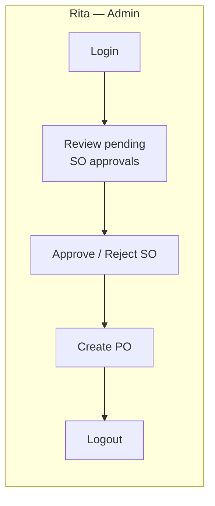
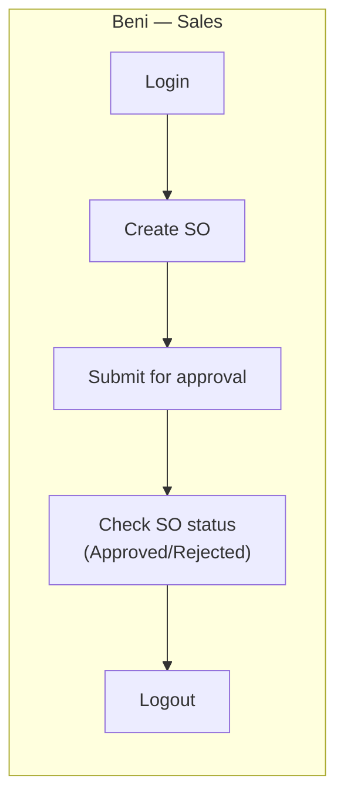
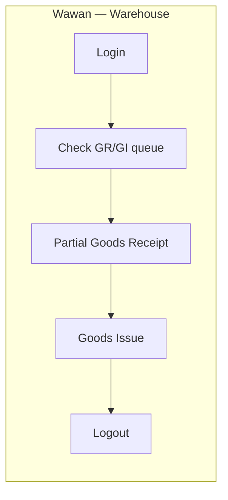
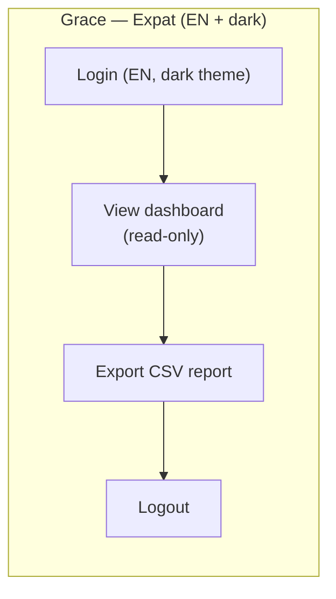

# UX/UI Specification — Stage 3

**Status:** v1.1 · 2026-09-01
**This document is the single source of truth** for Stage 3 — Design Tokens, all 12 Component Specs, 14 Wireframes, 4 User Journeys, and the Accessibility Checklist are all fully specified below, implementation-ready without needing Figma access.
**Bonus asset:** [Figma file](https://www.figma.com/design/mYFuerq3bu6tWbjAHsM4in) — has a visual mockup of Design Tokens + 8/12 Components, but is currently **unreachable** (rate limit, see §0). Treat it as optional/secondary reference, not a dependency.

---

## 0. Rationale — Why This Is Markdown-First, Not Figma-First

Full Stage 3 was originally scoped entirely in Figma. Mid-build, the Figma file's **Starter plan hit a hard MCP tool-call rate limit** (plan-level cap, not a transient error — confirmed twice: once after a real-world delay, once again on 2026-09-01 with a direct retry — both attempts failed identically). Design Tokens and 8 of 12 components had already been built and visually verified in Figma at that point. Rather than leave the spec split across two systems (one of which is inaccessible), **everything Figma had — plus everything it never got to — has been pulled into or reconstructed in this single Markdown document**, so Stage 3 is fully self-contained and doesn't block on Figma plan access at all. The Figma file remains as a nice-to-have visual artifact for the 8 components it reached, nothing more.

**Figma file structure (for reference / future resume, e.g. after a plan upgrade):**
- Page `0:1` "01 - Foundations" → Section "00 - Overview" (`2:6`), "01 - Design Tokens" (`3:13`), "02 - Components" (`3:120`, placeholder — Toast & Skeleton still missing)
- Page `2:4` "02 - Wireframes" — empty (superseded by §3 below)
- Page `2:5` "03 - Journeys & Accessibility" — empty (superseded by §4–§5 below)
- Variable collections: `Color Tokens - Light` (`2:23`), `Color Tokens - Dark` (`2:24`), `Spacing` (`2:47`), `Radius` (`2:55`) — one mode each (Starter plan caps collections at 1 mode; two collections used to simulate light/dark instead of one 2-mode collection)

---

## 1. Design Tokens

Canonical values (re-derived here so this document is implementation-ready even without Figma access; matches the intent of the Figma tokens page). All pairs below are computed with the WCAG relative-luminance formula, not estimated.

### 1.1 Color — semantic tokens

| Token | Light hex | Dark hex | Usage |
|---|---|---|---|
| `color-bg-primary` | `#FFFFFF` | `#14171C` | Page background |
| `color-bg-surface` | `#F5F6F8` | `#1E222A` | Card / panel background |
| `color-text-primary` | `#1A1D23` | `#F5F6F8` | Body text, headings |
| `color-text-secondary` | `#5B6472` | `#A8B0BD` | Helper text, captions, labels |
| `color-border` | `#E1E4E8` | `#2C313B` | Dividers, input borders |
| `color-brand-primary` | `#2563EB` | `#60A5FA` | Primary actions, links, active nav |
| `color-brand-secondary` | `#7C3AED` | `#A78BFA` | Secondary accents |
| `color-status-error` | `#DC2626` | `#F87171` | Destructive actions, error text/badge |
| `color-status-success` | `#15803D` | `#4ADE80` | Success badge/toast |
| `color-status-warning` | `#B45309` | `#FBBF24` | Warning badge/toast, low-stock alert |
| `color-status-info` | `#0E7490` | `#67E8F9` | Info badge/toast |

**WCAG AA contrast verification (BR-021)** — computed via relative luminance, ≥4.5:1 required for text, ≥3:1 for large text/UI components:

| Pair | Light | Dark |
|---|---|---|
| text/primary on bg/primary | 16.88:1 ✅ | 16.61:1 ✅ |
| text/secondary on bg/primary | 5.98:1 ✅ | 8.22:1 ✅ |
| text/primary on bg/surface | 15.61:1 ✅ | 14.74:1 ✅ |
| white/dark text on brand/primary (button label) | 5.17:1 ✅ | 7.36:1 ✅ |
| white/dark text on brand/secondary | 5.70:1 ✅ | 6.88:1 ✅ |
| text on status/error (badge/button) | 4.83:1 ✅ | 7.27:1 ✅ |
| text on status/success | 5.02:1 ✅ | 10.91:1 ✅ |
| text on status/warning | 5.02:1 ✅ | 11.13:1 ✅ |
| text on status/info | 5.36:1 ✅ | 12.74:1 ✅ |

All pairs pass WCAG AA in both themes. Status colors were adjusted darker (light theme) from initial picks specifically because the first attempt (`#16A34A`, `#D97706`, `#0891B2`) failed at 3.19–3.30:1 — kept here as a note so nobody "fixes" these back to the brighter, non-compliant shades.

### 1.2 Typography scale

Font family: **Inter** (system fallback: `-apple-system, Segoe UI, Roboto, sans-serif`).

| Style | Size | Weight | Line-height |
|---|---|---|---|
| Display | 32px | 700 | 40px |
| H1 | 28px | 700 | 36px |
| H2 | 22px | 600 | 30px |
| H3 | 18px | 600 | 26px |
| Body | 14px | 400 | 20px |
| Body Small | 13px | 400 | 18px |
| Caption | 12px | 400 | 16px |
| Label | 12px | 600 | 16px (uppercase, letter-spacing 0.02em) |

### 1.3 Spacing scale (4/8 base)

`space-1`=4px · `space-2`=8px · `space-3`=12px · `space-4`=16px · `space-6`=24px · `space-8`=32px · `space-12`=48px

### 1.4 Radius & elevation

- `radius-sm`=4px (badges, inputs) · `radius-md`=8px (cards, buttons) · `radius-lg`=12px (modals)
- `elevation-card-resting`: `0 1px 2px rgba(0,0,0,0.06)`
- `elevation-card-hover`: `0 4px 8px rgba(0,0,0,0.10)`
- `elevation-modal`: `0 12px 32px rgba(0,0,0,0.24)`

---

## 2. Component Spec

All 12 components are fully specified below and are implementation-ready directly from this table — no Figma access required. 8 of them (Button, Badge/Chip, Input, Form Field, Stat Tile, Table, Modal/Dialog, Empty State) also have a visual mockup in the [Figma file](https://www.figma.com/design/mYFuerq3bu6tWbjAHsM4in) (`3:120`) as a bonus reference, but that file is currently unreachable (Starter-plan rate limit, re-confirmed 2026-09-01 — still failing after a retry) so treat it as optional/secondary, not a dependency. Loader/Skeleton and Toast/Notification exist only here (never built in Figma before the limit hit).

| Component | Variants | States | Notes |
|---|---|---|---|
| Button | primary / secondary / tertiary / destructive | default / hover / focus / disabled | Height 40px, padding `space-4` horizontal, `radius-md` |
| Input | text / number / select / textarea / date | default / focus / error / disabled | Border `color-border`, focus ring `color-brand-primary` 2px, error border `color-status-error` |
| Label + Helper + Error text | — | — | Label = Label style; Helper = Caption + `text-secondary`; Error = Caption + `status-error`, shown only when Input state = error |
| Table | with/without row-select checkbox | sortable column header (arrow icon toggles asc/desc), empty state, pagination footer | Sticky header on scroll; row hover = `bg-surface` |
| Modal/Dialog | small (confirm) / large (form) | — | Header (title + close icon) / body / footer (secondary + primary button, right-aligned) |
| Empty state | — | — | Feather icon (48px) + message (Body) + optional CTA button |
| **Loader/Skeleton** | row skeleton / card skeleton | — | Shimmer animation (CSS `@keyframes`, 1.5s loop) using `bg-surface` ↔ `border` gradient |
| **Toast/Notification** | success / error / warning / info | entering / visible / exiting | Fixed top-right, icon + message + close, auto-dismiss 4s (except error: manual dismiss only), uses status color as left border accent + `bg-surface` background |
| Card / Stat tile | — | — | `bg-surface`, `radius-md`, `elevation-card-resting`; label (Caption) + value (H2) + optional trend badge |
| Badge / Chip | draft / pending-approval / approved / fulfilled / cancelled / rejected | — | `radius-sm`, `space-1`/`space-2` padding, status color background at 12% opacity + full-opacity status color text |

**Accessibility baseline for every component** (detail per-component in §5): min touch target 44×44px, visible focus ring (2px `color-brand-primary` outline, never `outline: none` without replacement), all icon-only controls carry `aria-label`.

---

## 3. Wireframes (14 screens)

Desktop-first, content max-width 1280px inside a 1440px canvas. Layout shorthand: `[Header]` = global top bar (logo, user menu), `[Sidebar]` = role-scoped nav. *(Amended 2026-09-08: locale toggle and theme toggle removed from the mandatory header — see §6 changelog and `docs/design/DESIGN_DECISION_RECORD_B01_B09.md` §B-02. Locale/theme switching is out of scope for the current release.)*

### 3.1 Login
```
+--------------------------------------------------+
|  [Logo]                                          [User menu v]   |
+--------------------------------------------------+
|                                                    |
|              +----------------------+              |
|              |  Sign in             |              |
|              |  [ Username input  ] |              |
|              |  [ Password input  ] |              |
|              |  [ ] Remember me     |              |
|              |  [   Sign in btn   ] |              |
|              |  (error text if invalid creds)       |
|              +----------------------+              |
+--------------------------------------------------+
```
*(Amended 2026-09-08: the pre-login locale/theme toggle shown here is no longer required — locale/theme switching is out of scope for the current release. Grace's persona journey in §4 is unaffected as a scenario description.)*

### 3.2 Dashboard — Admin (Rita)
```
[Header]
[Sidebar: Dashboard*/Products/Warehouses/Users/PO/SO/Reports]  [Content]
  Row 1: [Stat: Total Products] [Stat: Low Stock Items] [Stat: Pending SO Approvals] [Stat: Open PO]
  Row 2: [Card: Pending Approvals table (SO#, customer, sales, amount, [Review])]
  Row 3: [Card: Low Stock alert list (SKU, warehouse, qty, reorder point)]
```

### 3.3 Dashboard — Sales (Beni)
```
[Header]
[Sidebar: Dashboard*/My SO/Products(read-only)]  [Content]
  Row 1: [Stat: My Open SO] [Stat: My Pending Approval] [Stat: My Fulfilled This Month]
  Row 2: [ + Create Sales Order button ]
  Row 3: [Table: My Sales Orders — SO#, customer, status badge, amount, [View]]
```

### 3.4 Dashboard — Warehouse (Wawan)
```
[Header]
[Sidebar: Dashboard*/Goods Receipt/Goods Issue/Stock]  [Content]
  Row 1: [Stat: Pending Receipts] [Stat: Pending Issues] [Stat: Low Stock Alerts]
  Row 2: [Card: Goods Receipt queue — PO#, supplier, expected qty, [Receive]]
  Row 3: [Card: Goods Issue queue — SO#, customer, qty to pick, [Issue]]
```

### 3.5 List — Product
```
[Header][Sidebar]
[Content]
  [Search input] [Category filter v] [Warehouse filter v]      [+ Add Product]
  [Table: image thumb | SKU | name | category | stock (per wh) | [Edit][View] ]
  [Pagination: << 1 2 3 ... >>]
```

### 3.6 List — Purchase Order
```
[Header][Sidebar]
  [Search] [Status filter v] [Date range]                       [+ Create PO]
  [Table: PO# | supplier | status badge | order date | total | [View] ]
  [Pagination]
```

### 3.7 List — Sales Order
```
[Header][Sidebar]
  [Search] [Status filter v] [Date range]                       [+ Create SO]
  [Table: SO# | customer | sales rep | status badge | total | [View] ]
  (Beni sees only rows where sales rep = self — server-enforced, BR-018)
  [Pagination]
```

### 3.8 Detail — Purchase Order
```
[Header][Sidebar]
[Content]
  PO #PO-0001                                    [status badge]
  Supplier: ... | Order date: ... | Warehouse: ...
  --------------------------------------------------
  [Table: line items — product | ordered qty | received qty | unit price | subtotal]
  --------------------------------------------------
  [Status timeline: Draft -> Ordered -> Partially Received -> Received]
  [ Receive Goods button ]  (opens Goods Receipt modal, §3.12)
```

### 3.9 Detail — Sales Order
```
[Header][Sidebar]
[Content]
  SO #SO-0001                                    [status badge]
  Customer: ... | Sales rep: Beni | Order date: ...
  --------------------------------------------------
  [Table: line items — product | qty | unit price | subtotal]
  --------------------------------------------------
  [Status timeline: Draft -> PendingApproval -> Approved -> Fulfilled]

  IF viewer == creator (Beni viewing his own SO):
    [ Approve button — DISABLED, tooltip on hover/focus:
      "You cannot approve your own order (segregation of duties, BR-001)" ]
  ELSE IF viewer has approval permission and viewer != creator:
    [ Approve button — enabled ]  [ Reject button ]
```
*This is the critical BR-001 touchpoint — the disabled state + tooltip is a UI courtesy only; the server MUST independently reject the approve request (403) even if a client bypasses the disabled attribute.*

### 3.10 Form — Create/Edit Purchase Order
```
[Header][Sidebar]
[Content]
  Supplier [select]     Warehouse [select]     Expected date [date]
  --------------------------------------------------
  Line items:
  [Product select] [Qty input] [Unit price input] [Subtotal (calc)] [x remove]
  [ + Add line ]
  --------------------------------------------------
  Total: (calc, read-only)
  [ Save as Draft ]  [ Submit / Order ]
```

### 3.11 Form — Create/Edit Sales Order
```
[Header][Sidebar]
[Content]
  Customer [select]     Warehouse [select]
  --------------------------------------------------
  Line items:
  [Product select] [Qty input, capped by available stock] [Unit price] [Subtotal] [x remove]
  [ + Add line ]
  --------------------------------------------------
  Total: (calc, read-only)
  [ Save as Draft ]  [ Submit for Approval ]
```

### 3.12 Modal — Goods Receipt
```
+----------------------------------------+
| Goods Receipt — PO #PO-0001         [x]|
+----------------------------------------+
| Product      | Ordered | Already Recv | Receive now |
| Widget A     |   100   |      40      | [  60 ]     |
| Widget B     |    50   |       0      | [  50 ]     |
+----------------------------------------+
| (validation: receive now <= ordered - already recv) |
|                       [Cancel]  [Confirm Receipt]    |
+----------------------------------------+
```
Confirm triggers transactional stock + ledger update (ADR sequence: goods receipt).

### 3.13 Modal — Goods Issue
```
+----------------------------------------+
| Goods Issue — SO #SO-0001           [x]|
+----------------------------------------+
| Product      | Ordered Qty | Available Stock | Issue |
| Widget A     |     20      |       35         | [20]  |
+----------------------------------------+
| Note: stock check + row lock (SELECT FOR UPDATE, ARCH-02) |
| prevents oversell if two staff issue concurrently.        |
|                       [Cancel]  [Confirm Issue]            |
+----------------------------------------+
```

### 3.14 Report — CSV Export
```
[Header][Sidebar]
[Content]
  Report type [Stock Ledger v]   Date range [from] [to]   Warehouse [v]
  [ Preview ]                                            [ Export CSV ]
  --------------------------------------------------
  [Table preview: first 20 rows of the export, header localized per current UI locale]
```

---

## 3A. Responsive Shell (B-05)

*Added 2026-09-08 per `docs/design/DESIGN_DECISION_RECORD_B01_B09.md` §B-05. This section defines the
responsive shell pattern that `docs/design/design-audit.md` finding E-01/B-05 found missing from this
specification.*

**Desktop (>=1024px).** Sidebar persistent, fixed at 256px, exactly as specified in §3's wireframes
above. No change to existing desktop shell behavior.

**Tablet (768px-1023px).** Sidebar collapses to a 64px icon-only rail. The rail expands to the full
256px sidebar on hover or click, and collapses back on the same interaction leaving that area, or on an
explicit collapse control. The content area recovers the width freed by the collapsed rail.

**Mobile (<768px, hard floor 360px).** The sidebar becomes a hidden slide-in drawer, opened by a
hamburger control in the header and accompanied by a scrim behind it. The drawer's navigation list is
complete and identical to the desktop sidebar's - Dashboard, Products, Categories, Warehouses,
Suppliers, Customers, Purchase Orders, Sales Orders, Reports, and (Admin role only) Users. No reduced or
role-partial navigation variant is permitted in the drawer beyond the same role-scoping the desktop
sidebar already applies (per §3.2-§3.4). The drawer closes when: a navigation item is selected,
Escape is pressed, or the scrim is tapped/activated.

**360px floor (FR-15.1/FR-15.2).** At 360px viewport width, Login, all three Dashboards, at minimum one
List screen, one Detail screen, and one Form screen must render with zero horizontal body overflow.
Primary tables that do not fit at 360px use the existing stacked-card pattern (already applied to Users,
Stock Ledger, PO create/edit, Goods Receipt, SO create/edit) rather than horizontal scroll; other,
secondary tables may still use horizontal scroll intentionally per FR-15.2.

**Touch targets (FR-15.4).** All interactive controls maintain the existing >=44x44px touch target at
the mobile breakpoint, consistent with §5's Accessibility Checklist.

---

## 4. User Journeys









---

## 5. Accessibility Checklist (BR-021)

| Component | Contrast target | Keyboard nav | Focus visible | Touch target |
|---|---|---|---|---|
| Button | ≥4.5:1 label vs fill (verified §1.1) | Tab to focus, Enter/Space to activate | 2px outline, `color-brand-primary` | ≥44×44px |
| Input | ≥4.5:1 text vs bg; border ≥3:1 vs bg | Tab order follows form flow, native browser semantics | 2px outline on focus, error state adds icon (not color-only) | ≥44px height |
| Table (sortable) | header text ≥4.5:1 | Sort header reachable/togglable via Tab + Enter; pagination via Tab | visible ring on sort header & page buttons | pagination buttons ≥44×44px |
| Modal/Dialog | body text ≥4.5:1 | Focus trapped inside modal; Esc closes; focus returns to trigger element on close | first focusable element auto-focused on open | close icon ≥44×44px hit area |
| Badge/Chip | text ≥4.5:1 on tinted bg | not interactive — no nav needed | n/a | n/a |
| Toast | text ≥4.5:1 | dismiss button reachable via Tab | visible ring on dismiss button | dismiss ≥44×44px |
| Empty state / Skeleton | text ≥4.5:1 | n/a (skeleton not focusable; CTA in empty state follows Button rules) | n/a | n/a |
| Stat tile / Card | text ≥4.5:1 | if clickable, reachable via Tab | 2px outline | ≥44×44px if interactive |
| Approve button (SO detail, BR-001) | disabled state still ≥3:1 (non-text UI component visibility) | disabled buttons excluded from Tab order per native `disabled`; tooltip content also exposed via `aria-describedby` for screen readers, not hover-only | n/a while disabled | 44×44px maintained even disabled (no layout shift) |

General rules applied everywhere: never convey status by color alone (badges pair color + text label; error states pair color + icon + text); all icon-only buttons have `aria-label`. *(Amended 2026-09-08: the theme-toggle/locale-toggle keyboard-operability rule is removed — locale/theme switching is out of scope for the current release; see §6 changelog.)*

---

### 5.1 State Accessibility Contract (B-08)

*Added 2026-09-08 per `docs/design/DESIGN_DECISION_RECORD_B01_B09.md` §B-08, making binding here the
ARIA contract `docs/design/ioms-ui-design.md` §14 already assigns per canonical state, which
`docs/design/design-audit.md` finding A-01/B-08 found unapplied on every product screen.*

| Canonical state(s) | Required attributes |
|---|---|
| `LOADING`, `EMPTY`, `NO_RESULTS`, `MUTATION_SUCCESS`, `STALE_DATA` | `role="status"` + `aria-live="polite"` |
| `SERVER_ERROR`, `NETWORK_ERROR`, `MUTATION_ERROR`, `BUSINESS_ERROR` | `role="alert"` + `aria-live="assertive"` |
| `VALIDATION_ERROR` (per offending field) | `aria-invalid="true"` and `aria-describedby` pointing to the real error-message element |
| `SESSION_EXPIRED` | `role="alertdialog"` |
| `ACTION_LOADING` (on the triggering control) | `aria-busy="true"` + `aria-disabled="true"` |

**Modal/dialog contract** (extends the Modal/Dialog row of the table above): on open, focus moves into
the dialog and lands on the first appropriate focusable element; Tab and Shift+Tab remain trapped inside
the dialog while it is open; Escape closes it; focus returns to the element that triggered it after
close.

**Focus visibility.** A visible `:focus-visible` indicator is applied consistently to every interactive
element on every screen - not declared once and left unapplied, as `docs/design/design-audit.md`
finding A-02 found for the login lineage's `.focus-ring` class.

No new state or accessibility concept is introduced here; this section binds, into the specification
itself, a contract that was already defined for the 16-state registry but not previously reproduced in
this document.

---

## 6. Changelog

- **1.0 · 2026-09-01** — Initial version. Design Tokens + 8 components delivered in Figma (see §0); Wireframes, User Journeys, Accessibility Checklist delivered here after Figma Starter-plan rate limit blocked further Figma work.
- **1.1 · 2026-09-01** — Pulled the 8 Figma-only components fully into §2 (all 12 now fully specced here, self-contained). Re-confirmed Figma is still rate-limited (retried directly, same error). Document is now the sole source of truth; Figma is optional bonus reference only.
- **1.2 · 2026-09-08** — Added §3A Responsive Shell and §5.1 State Accessibility Contract, per
  the approved `docs/design/DESIGN_DECISION_RECORD_B01_B09.md` (findings B-05 and B-08). No other
  section changed; no token, component, or wireframe content altered.
- **1.3 · 2026-09-08** — Removed the mandatory locale toggle and theme toggle from §3's header
  shorthand, the Login wireframe (§3.1), and §5's general accessibility rules, per a product-scope
  decision (`docs/design/DESIGN_DECISION_RECORD_B01_B09.md` §B-02, amended). Locale switching (EN/ID)
  and theme switching (Auto/Light/Dark) are out of scope for the current release unless a future
  requirement reinstates them. No other section changed.
