# Class Diagram — Initial Design (Stage 4)

- **Status:** Initial — to be updated as `class-diagram-asbuilt.md` after Stage 6 implementation
- **Date:** 2026-09-01
- **Stage:** 4 / 9 (Technical Design)
- **Diagram Type:** Mermaid `classDiagram` (Phase 1: structural intent)
- **Related:** ADR-001 (Repository Pattern), PRD §9 ARCH-01

---

## Diagram

```mermaid
classDiagram
    %% ============== CORE LAYER ==============
    class Database {
        -pdo PDO
        +transaction(callable fn) mixed
        +lastInsertId() string
        +query(string sql, array params) PDOStatement
    }

    class Container {
        -config array
        -pdo PDO
        -repositories array
        +get(string key) mixed
        +getAuthService() AuthService
        +getProductService() ProductService
    }

    class SessionManager {
        +start() void
        +get(string key) mixed
        +set(string key, mixed val) void
        +regenerate() void
        +destroy() void
    }

    class LocaleResolver {
        +resolve() string
    }

    class Translator {
        +t(string key, array params) string
    }

    %% ============== ENTITIES ==============
    class User {
        +int id
        +string name
        +string email
        +string passwordHash
        +Role role
        +bool isActive
        +DateTime createdAt
        +DateTime updatedAt
    }

    class Category {
        +int id
        +string name
        +string description
        +bool isActive
    }

    class Product {
        +int id
        +string sku
        +string name
        +int categoryId
        +string unit
        +decimal purchasePrice
        +decimal salePrice
        +int reorderPoint
        +string imagePath
        +bool isActive
        +DateTime createdAt
        +DateTime updatedAt
        +bool isLowStock() bool
    }

    class ProductStock {
        +int id
        +int productId
        +int warehouseId
        +int quantity
        +DateTime updatedAt
    }

    class Warehouse {
        +int id
        +string code
        +string name
        +string location
        +bool isActive
    }

    class Supplier {
        +int id
        +string name
        +string contactPerson
        +string phone
        +string email
        +bool isActive
    }

    class Customer {
        +int id
        +string name
        +string contactPerson
        +string phone
        +string email
        +bool isActive
    }

    class PurchaseOrder {
        +int id
        +int supplierId
        +int destinationWarehouseId
        +PoStatus status
        +Date orderDate
        +string note
        +int createdBy
        +DateTime createdAt
        +DateTime updatedAt
        +submit() void
        +cancel() void
        +bool isFullyReceived() bool
        +bool isPartiallyReceived() bool
    }

    class PurchaseOrderItem {
        +int id
        +int purchaseOrderId
        +int productId
        +int qtyOrdered
        +int qtyReceived
        +decimal purchasePrice
        +int qtyPending() int
        +bool isFullyReceived() bool
    }

    class SalesOrder {
        +int id
        +int customerId
        +int sourceWarehouseId
        +SoStatus status
        +Date orderDate
        +string note
        +int createdBy
        +int approvedBy
        +DateTime approvedAt
        +int issuedBy
        +DateTime issuedAt
        +submitForApproval() void
        +approve(int actor) void
        +reject(int actor, string reason) void
        +cancel() void
        +fulfill() void
        +bool canBeApprovedBy(int actor) bool
    }

    class SalesOrderItem {
        +int id
        +int salesOrderId
        +int productId
        +int qty
        +decimal salePrice
    }

    class StockLedgerEntry {
        +int id
        +int productId
        +int warehouseId
        +LedgerType type
        +int qty
        +string refType
        +int refId
        +int doneByUserId
        +DateTime doneAt
    }

    %% ============== REPOSITORY INTERFACES ==============
    class UserRepositoryInterface {
        <<interface>>
        +findById(int id) ?User
        +findByEmail(string email) ?User
        +save(User user) int
        +update(User user) void
        +deactivate(int id) void
    }

    class ProductRepositoryInterface {
        <<interface>>
        +findById(int id) ?Product
        +findBySku(string sku) ?Product
        +list(array filters, int page, int limit) array
        +save(Product p) int
        +update(Product p) void
        +deactivate(int id) void
        +countLowStock() int
    }

    class ProductStockRepositoryInterface {
        <<interface>>
        +lockForUpdate(int pid, int wid) ProductStock
        +findOne(int pid, int wid) ?ProductStock
        +upsert(int pid, int wid, int qty) void
        +decrement(int pid, int wid, int qty) void
        +increment(int pid, int wid, int qty) void
        +sumByProduct(int pid) int
    }

    class PurchaseOrderRepositoryInterface {
        <<interface>>
        +findById(int id) ?PurchaseOrder
        +list(array filters, int page, int limit) array
        +save(PurchaseOrder po) int
        +updateStatus(int id, PoStatus status, array extras) void
    }

    class SalesOrderRepositoryInterface {
        <<interface>>
        +findById(int id) ?SalesOrder
        +listByCreator(int userId, array filters, int page, int limit) array
        +listAll(array filters, int page, int limit) array
        +save(SalesOrder so) int
        +updateStatus(int id, SoStatus status, array extras) void
    }

    class StockLedgerRepositoryInterface {
        <<interface>>
        +insert(StockLedgerEntry e) int
        +list(array filters, int page, int limit) array
        +sumByProductWarehouse(int pid, int wid) int
    }

    class WarehouseRepositoryInterface {
        <<interface>>
        +findById(int id) ?Warehouse
        +listAllActive() array
        +save(Warehouse w) int
        +deactivate(int id) void
    }

    class SupplierRepositoryInterface {
        <<interface>>
        +findById(int id) ?Supplier
        +listAllActive() array
        +save(Supplier s) int
        +deactivate(int id) void
    }

    class CustomerRepositoryInterface {
        <<interface>>
        +findById(int id) ?Customer
        +listAllActive() array
        +save(Customer c) int
        +deactivate(int id) void
    }

    class CategoryRepositoryInterface {
        <<interface>>
        +findById(int id) ?Category
        +listAll() array
        +save(Category c) int
    }

    %% ============== REPOSITORY IMPLEMENTATIONS ==============
    class UserMySQLRepository
    class ProductMySQLRepository
    class ProductStockMySQLRepository
    class PurchaseOrderMySQLRepository
    class SalesOrderMySQLRepository
    class StockLedgerMySQLRepository
    class WarehouseMySQLRepository
    class SupplierMySQLRepository
    class CustomerMySQLRepository
    class CategoryMySQLRepository

    class UserFakeRepository
    class ProductFakeRepository
    class ProductStockFakeRepository
    class PurchaseOrderFakeRepository
    class SalesOrderFakeRepository
    class StockLedgerFakeRepository

    %% ============== SERVICE LAYER ==============
    class AuthService {
        -userRepo UserRepositoryInterface
        +login(string email, string password) User
        +logout() void
        +currentUser() ?User
    }

    class UserService {
        -userRepo UserRepositoryInterface
        +create(array data) int
        +update(int id, array data) void
        +deactivate(int id) void
        +activate(int id) void
    }

    class ProductService {
        -productRepo ProductRepositoryInterface
        -categoryRepo CategoryRepositoryInterface
        -imageUploader ImageUploadService
        +create(array data, ?array imageFile) int
        +update(int id, array data) void
        +deactivate(int id) void
        +isInUse(int id) bool
    }

    class GoodsReceiptService {
        -poRepo PurchaseOrderRepositoryInterface
        -stockRepo ProductStockRepositoryInterface
        -ledgerRepo StockLedgerRepositoryInterface
        -db Database
        +process(int poId, array receipts, int actor) void
    }

    class GoodsIssueService {
        -soRepo SalesOrderRepositoryInterface
        -stockRepo ProductStockRepositoryInterface
        -ledgerRepo StockLedgerRepositoryInterface
        -db Database
        +issue(int soId, int actor) void
    }

    class SalesOrderService {
        -soRepo SalesOrderRepositoryInterface
        -stockRepo ProductStockRepositoryInterface
        -policy SalesOrderPolicy
        +create(array data, int creator) int
        +submitForApproval(int id) void
        +approve(int id, int actor) void
        +reject(int id, int actor, string reason) void
        +cancel(int id, int actor) void
    }

    class PurchaseOrderService {
        -poRepo PurchaseOrderRepositoryInterface
        +create(array data, int creator) int
        +submit(int id) void
        +cancel(int id, int actor) void
    }

    class StockCheckService {
        -productRepo ProductRepositoryInterface
        -stockRepo ProductStockRepositoryInterface
        +getLowStockProducts() array
    }

    class CsvExportService {
        -ledgerRepo StockLedgerRepositoryInterface
        -soRepo SalesOrderRepositoryInterface
        -poRepo PurchaseOrderRepositoryInterface
        +exportStockLedger(Date from, Date to, string locale) string
        +exportOrderStatus(Date from, Date to, array type, string locale) string
    }

    class DashboardService {
        -productRepo ProductRepositoryInterface
        -stockRepo ProductStockRepositoryInterface
        -poRepo PurchaseOrderRepositoryInterface
        -soRepo SalesOrderRepositoryInterface
        +getAdminStats() array
        +getSalesStats(int userId) array
        +getWarehouseStats() array
    }

    class ImageUploadService {
        +process(array uploaded) ImageResult
    }

    class TranslationService {
        -libreTranslateUrl string
        -cache array
        +translate(string text, string targetLang) string
    }

    class SalesOrderPolicy {
        <<policy>>
        +assertCanBeApprovedBy(SalesOrder so, int actor) void
        +assertCanIssue(SalesOrder so) void
        +assertCanCancel(SalesOrder so, int actor) void
    }

    %% ============== CONTROLLERS ==============
    class AuthController {
        +showLogin() void
        +handleLogin() void
        +handleLogout() void
    }

    class DashboardController {
        +index() void
    }

    class UserController {
        +index() void
        +create() void
        +store() void
        +edit(int id) void
        +update(int id) void
        +deactivate(int id) void
    }

    class ProductController {
        +index() void
        +show(int id) void
        +create() void
        +store() void
        +edit(int id) void
        +update(int id) void
    }

    class PurchaseOrderController {
        +index() void
        +show(int id) void
        +create() void
        +store() void
        +receive(int id) void
        +processReceipt(int id) void
        +cancel(int id) void
    }

    class SalesOrderController {
        +index() void
        +show(int id) void
        +create() void
        +store() void
        +approve(int id) void
        +reject(int id) void
        +issue(int id) void
        +cancel(int id) void
    }

    class WarehouseController {
        +index() void
        +create() void
        +store() void
        +deactivate(int id) void
    }

    class ReportController {
        +showForm() void
        +exportStockLedger() void
        +exportOrderStatus() void
    }

    class LocaleController {
        +switch(string locale) void
    }

    class ThemeController {
        +switch(string theme) void
    }

    class ProductApiController {
        +getAvailability(string sku) array
    }

    class BaseController {
        <<abstract>>
        +render(string view, array data) void
        +json(mixed data, int statusCode) void
        +redirect(string url) void
        +requireAuth() void
        +requireRole(Role role) void
        +getJsonBody() array
    }

    %% ============== ENUMS ==============
    class Role {
        <<enum>>
        Admin
        Sales
        WarehouseStaff
    }

    class SoStatus {
        <<enum>>
        Draft
        PendingApproval
        Approved
        Fulfilled
        Cancelled
    }

    class PoStatus {
        <<enum>>
        Draft
        Ordered
        PartiallyReceived
        Received
        Cancelled
    }

    class LedgerType {
        <<enum>>
        Receipt
        Issue
        Adjustment
    }

    %% ============== RELATIONSHIPS (selected) ==============
    User "1" --> "0..*" SalesOrder : creates
    User "1" --> "0..*" SalesOrder : approves
    User "1" --> "0..*" SalesOrder : issues
    User "1" --> "0..*" PurchaseOrder : creates
    Product "1" --> "0..*" ProductStock : stocked in
    Warehouse "1" --> "0..*" ProductStock : stores
    Category "1" --> "0..*" Product : groups
    Product "1" --> "0..*" PurchaseOrderItem : included
    Product "1" --> "0..*" SalesOrderItem : included
    PurchaseOrder "1" --> "0..*" PurchaseOrderItem : has
    SalesOrder "1" --> "0..*" SalesOrderItem : has
    Supplier "1" --> "0..*" PurchaseOrder : sourced
    Customer "1" --> "0..*" SalesOrder : ordered
    PurchaseOrder "1" --> "0..*" StockLedgerEntry : Receipt ref
    SalesOrder "1" --> "0..*" StockLedgerEntry : Issue ref
    ProductStock "1" --> "0..*" StockLedgerEntry : history

    %% Service dependencies
    AuthService --> UserRepositoryInterface
    SalesOrderService --> SalesOrderRepositoryInterface
    SalesOrderService --> SalesOrderPolicy
    SalesOrderService --> ProductStockRepositoryInterface
    GoodsReceiptService --> PurchaseOrderRepositoryInterface
    GoodsReceiptService --> ProductStockRepositoryInterface
    GoodsReceiptService --> StockLedgerRepositoryInterface
    GoodsIssueService --> SalesOrderRepositoryInterface
    GoodsIssueService --> ProductStockRepositoryInterface
    GoodsIssueService --> StockLedgerRepositoryInterface
    GoodsIssueService --> Database

    %% Repository inheritance
    UserMySQLRepository ..|> UserRepositoryInterface
    UserFakeRepository ..|> UserRepositoryInterface
    ProductMySQLRepository ..|> ProductRepositoryInterface
    ProductStockMySQLRepository ..|> ProductStockRepositoryInterface
    SalesOrderMySQLRepository ..|> SalesOrderRepositoryInterface
    PurchaseOrderMySQLRepository ..|> PurchaseOrderRepositoryInterface

    %% Controllers use Services
    AuthController --> AuthService
    UserController --> UserService
    ProductController --> ProductService
    SalesOrderController --> SalesOrderService
    SalesOrderController --> GoodsIssueService
    PurchaseOrderController --> PurchaseOrderService
    PurchaseOrderController --> GoodsReceiptService
    DashboardController --> DashboardService
    ReportController --> CsvExportService
    ProductApiController --> ProductStockRepositoryInterface

    %% Controllers inheritance
    AuthController --|> BaseController
    UserController --|> BaseController
    ProductController --|> BaseController
    SalesOrderController --|> BaseController
    PurchaseOrderController --|> BaseController
    WarehouseController --|> BaseController
    ReportController --|> BaseController
    LocaleController --|> BaseController
    ThemeController --|> BaseController
    ProductApiController --|> BaseController
    DashboardController --|> BaseController
```

---

## Design Notes

### Layer Boundaries

| Layer | Boleh Depend Pada | TIDAK Boleh Depend Pada |
|-------|-------------------|--------------------------|
| **Controller** | Service, Base (Session, Request, Response) | Repository langsung, PDO |
| **Service** | Repository interface, Database, Entity, Policy | Controller, View, Request |
| **Repository** | Database (PDO), Entity | Service, Controller |
| **Entity** | (pure value object — tidak depend apa-apa) | * |

### Anti-corruption Invariants (ARCH-01)

1. **Tidak ada `new PDO()` di Service atau Controller** — di-enforce via grep + PHPStan.
2. **Tidak ada `new MySQLRepository()` di Service** — selalu via interface + Container injection.
3. **Tidak ada HTTP-aware code (header, session_start, exit) di Service.**
4. **Tidak ada SQL query di Controller.**

### Key Patterns

| Pattern | Lokasi Contoh |
|---------|---------------|
| **Repository** | `XxxRepositoryInterface` + `XxxMySQLRepository` + `XxxFakeRepository` |
| **Service Layer** | Semua logic bisnis ada di `app/Service/*` |
| **Policy** | `SalesOrderPolicy` — authorization checks untuk segregation of duties |
| **Transaction wrapper** | `Database::transaction(callable)` |
| **Composition root** | `Container::get*` — manual DI, single wiring point |
| **Entity as immutable DTO** | Entity punya factory `fromArray()` + `toArray()` (no setters) |

### Out of Scope (Belum Ada)

- **No UseCase / Command pattern** — Untuk scope ini, Service langsung method. Tidak perlu Command layer.
- **No Event bus / Observer** — Side-effects (audit log, notification) di-inline di Service.
- **No DI Container framework** — Manual `Container::get()` sesuai ADR-001.
- **No ORM / Active Record** — Entity adalah pure DTO, bukan PDO-extended.
- **No CQRS / Event Sourcing** — Overkill untuk scope mid-size.

### Update Trigger

Class diagram ini akan di-update ke **`class-diagram-asbuilt.md`** di akhir Stage 6 — ketika kode aktual sudah tertulis dan kami melakukan SRP audit (DSM-01).

---

## References
- `docs/architecture/adr-001-repository-pattern.md`
- `docs/planning/prd.md` §2 High-Level Data Model + §9 ARCH-01
