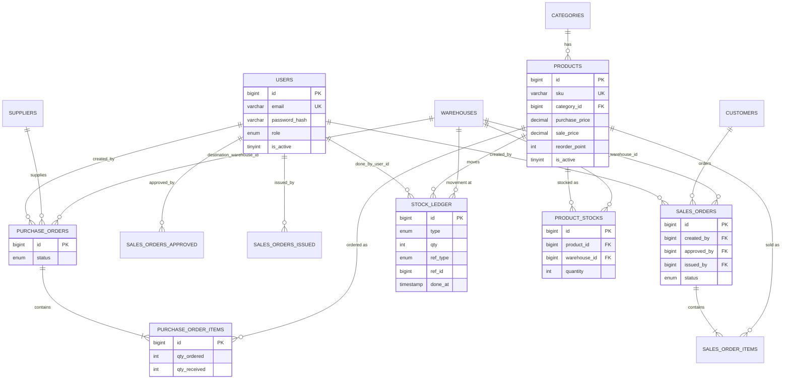

# ERD — Entity Relationship Diagram (As-Built)

- **Status:** As-built — verified against `database/schema.sql` on 2026-09-18
- **Related:** DESIGN-01 (brief §2), DB-01 (brief §2), `docs/architecture/db-schema-design.md` (full
  field-by-field DDL rationale), `docs/planning/master-project-specification.md` §08–§10

---

## Purpose

This is the presentation-ready ERD for the DB-01 defense item (brief requires ERD + schema + one
transaction walk-through + one index explained, all traceable to `database/schema.sql`). It is kept
in sync with `docs/architecture/db-schema-design.md`, the original detailed design doc; this file is
the compact version meant to be shown/walked live.

**Editable diagram:** `docs/planning/erd.drawio` — the same 15-table ERD as an editable
[diagrams.net](https://app.diagrams.net) file (open with File → Open, or the desktop app / VS Code
draw.io extension). It shows every table's full field list (PK/UK/FK marked), crow's-foot
cardinalities including the nullable `approved_by`/`issued_by`/`product_id`/`warehouse_id`/`user_id`
FKs, and the three supporting/bonus tables (`role_permissions`, `notifications`, `event_logs`) as
dashed boxes to distinguish them from the 12 core domain tables. It was generated from, and should
be kept in sync with, `database/schema.sql`. (`translation_cache` was dropped 2026-09-18 — verified
dead DDL, never referenced by any code.)

## Diagram



`SALES_ORDERS_APPROVED` and `SALES_ORDERS_ISSUED` are the second and third FK edges from `users` to
`sales_orders` (`approved_by`, `issued_by`), drawn as separate relationships only because Mermaid
cannot label multiple edges between the same two entities. The physical table is a single
`sales_orders` row with three nullable/non-nullable user FKs (`created_by` NOT NULL,
`approved_by`/`issued_by` nullable). **The pair (`created_by`, `approved_by`) is the structural
expression of segregation of duties** — enforced in `SalesOrderPolicy`, asserted in
`BR001SegregationTest`.

There are **no** `po_number` / `so_number` columns anywhere in the schema — a Purchase Order or Sales
Order is identified by its numeric `id`, plus supplier/customer, warehouse, date, status and `note`.

## Tables not shown above (non-core / bonus scope)

| Table | Role |
|---|---|
| `role_permissions` | DB-backed permission lookup replacing hardcoded `Role` checks in controllers/views |
| `notifications` | JOB-01 bonus scope — low-stock notifications populated by `scripts/check-low-stock.php` |
| `event_logs` | Added 2026-09-18 — general, insert-only activity/event log (auth events, CRUD, PO/SO transitions, exports). **Not** a replacement for `stock_ledger`, which remains the sole source of truth for stock movements. **Schema only** — no entity/repository/service exists yet, nothing writes to it (see `docs/quality/tech-debt.md` TDB-013) |

## One transaction walk-through (DB-01 evidence)

Goods Issue, per line, inside one transaction (`GoodsIssueService`):

```sql
-- 1. lock exactly one stock row
SELECT quantity FROM product_stocks
 WHERE product_id = :pid AND warehouse_id = :wid
 FOR UPDATE;
-- 2. service asserts quantity >= requested   (BR-GI-02)
-- 3. decrement
UPDATE product_stocks SET quantity = quantity - :qty, updated_at = NOW()
 WHERE product_id = :pid AND warehouse_id = :wid;
-- 4. append ledger — qty is stored NEGATIVE for an Issue (sign convention, ADR-002)
INSERT INTO stock_ledger
 (product_id, warehouse_id, type, qty, ref_type, ref_id, done_by_user_id, done_at)
 VALUES (:pid, :wid, 'Issue', -:qty, 'SO', :soid, :uid, NOW());
```

If any statement fails, the whole transaction rolls back — stock and ledger are never left
inconsistent (INV-2, INV-3).

## One index explained (DB-01 evidence)

**`uniq_product_warehouse`** on `product_stocks (product_id, warehouse_id)`. It is simultaneously:

1. The uniqueness guarantee behind INV-5 (exactly one stock row per product×warehouse pair).
2. The access path that makes `SELECT … FOR UPDATE` in the transaction above lock **exactly one row**
   rather than a range — which is what keeps ARCH-02 both correct (no oversell) and non-blocking for
   unrelated products/warehouses (two concurrent issues on different products proceed in parallel).

That dual role — a data-integrity constraint that is *also* the concurrency-control access path — is
the reason this is the index worth explaining at defense.

## See also

- `docs/architecture/db-schema-design.md` — full column-by-column DDL rationale for every table
- `docs/architecture/class-diagram-asbuilt.md` — class-level structure (Controller/Service/Repository)
- `docs/architecture/sequence-diagrams.md` — Goods Receipt / Goods Issue sequence diagrams
- `docs/architecture/adr-002-concurrency-strategy.md` — full ARCH-02 decision record
- `database/schema.sql` — the executable source of truth this document is derived from
