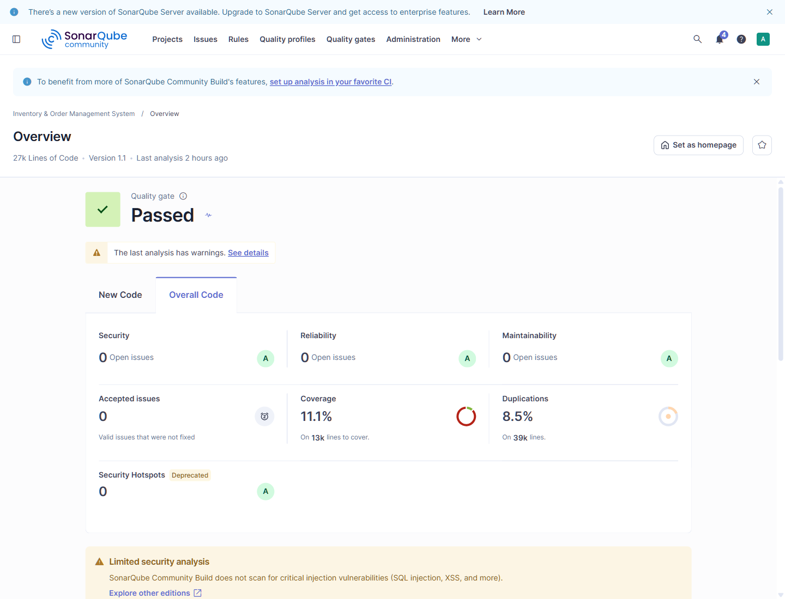
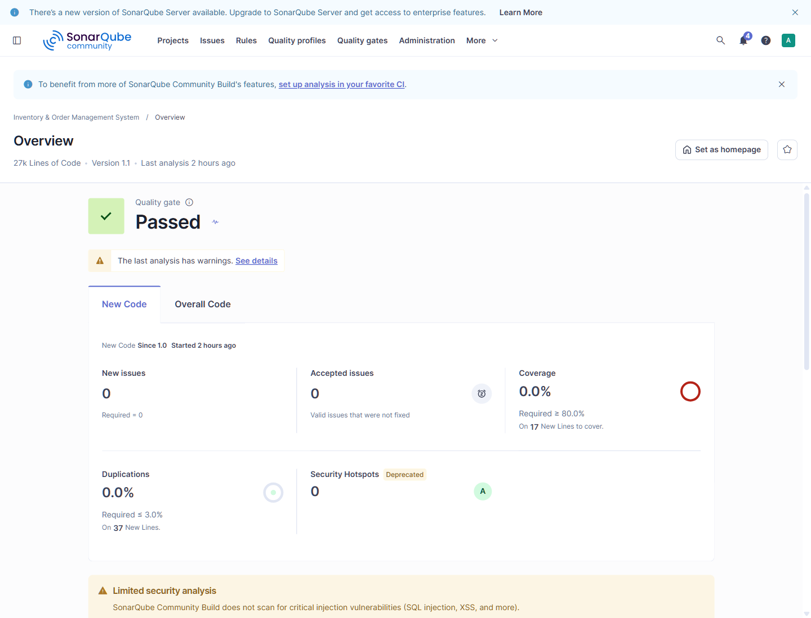

# SonarQube Dashboard Evidence — 2026-10-04

These saved screenshots show the Inventory & Order Management System dashboard, version 1.1. The Quality Gate displays **Passed**, with a warning that the latest analysis has warnings. They document the analysis available on the server when captured; they do not establish that the latest remediation was scanned. The analyzed Git revision is not visible in these images.

## Overall Code

Security, Reliability and Maintainability each show 0 open issues and an A rating. Coverage is 11.1%, duplications are 8.5%, and Security Hotspots are 0.

## New Code

The baseline is Since 1.0. New issues and accepted issues are 0. Coverage is 0.0% across 17 new lines to cover, below the displayed 80% target. Duplications are 0.0% across 37 new lines, and Security Hotspots are 0.

The displayed Passed status is separate from current PHPUnit results. See [test evidence](../testing/README.md) for verified Unit and isolated Integration runs, and the [reference audit](reference-gap-audit-2026-10-04.md) for remaining verification.

[Project README](../../README.md)
