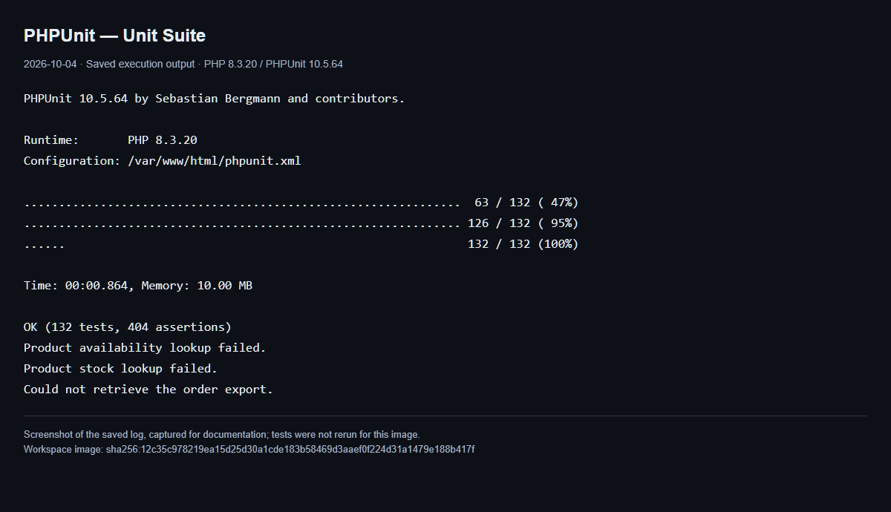
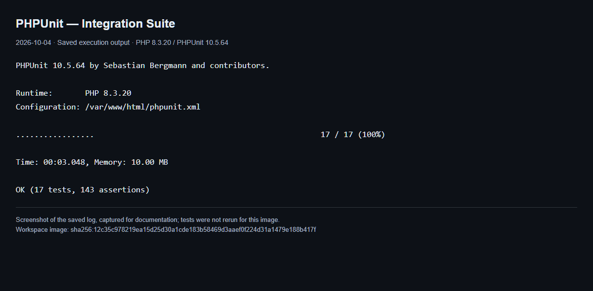

# Test Evidence

**Current source review:** 2026-10-04, working tree based on HEAD `239a98e`. Historical PHPUnit results remain in their original dated reports. Fresh Unit and isolated Integration runs passed after the user explicitly requested both suites in the collaborating session.

## Commands

From the repository root:

```bash
# Smoke regressions; no Composer, database, sessions, sockets or PHPUnit
php tests/Regression/run-reference-gaps.php

# Full unit suite, after installing project dependencies
php vendor/bin/phpunit --testsuite Unit

# Static analysis
php vendor/bin/phpstan analyse --configuration=phpstan.neon
```

For integration tests, reuse the existing isolated E2E stack:

```bash
cd tests/playwright
npm install
npm run test:integration
```

Prepare [env/e2e.env and prerequisites](../../tests/playwright/env/README.md) first. The opt-in `php-tests` profile builds the same application image, uses the dedicated `ioms-e2e` database/app, and mounts only tests/config read-only into the test runner. [compose.ts](../../tests/playwright/support/compose.ts) pins the project/file and protects developer volumes. Do not run Playwright and PHP fixture suites concurrently against this same disposable database. This command passed on 2026-10-04. The integration-app reuses the application definition without published ports and depends only on MySQL, Redis and Memcached; this PHP suite does not exercise image uploads or require the separate MinIO E2E services.

For a manually provisioned test environment, set `TEST_DB_NAME` explicitly and ensure it differs from `DB_NAME` (the regular application database). HTTP tests additionally require `APP_TEST_BASE_URL` pointing at a dedicated test app and `APP_TEST_DB_NAME` equal to `TEST_DB_NAME`. That app must actually be configured to use the test database; the environment declaration alone is not a remote database-identity probe. MySQL/HTTP tests and child concurrency workers all use [IntegrationEnvironment](../../tests/Support/IntegrationEnvironment.php). Missing or conflicting configuration fails before opening a fixture connection. Schema/seed and fixture SQL were executed only in the dedicated test stack; developer/production database data and schema were not changed. `failOnSkipped=true` remains enabled.

## Evidence by date

| Evidence | Result | Scope |
|---|---|---|
| Standalone workflow regressions, 2026-10-04 | 19 scenarios, 153 assertions, exit 0 | Current workspace; fake repositories and in-memory boundaries |
| PHPStan level 5, 2026-10-04 | 0 errors, exit 0 | Current app/public/scripts source; Fake repositories excluded by config |
| TypeScript typecheck and integration CLI ESLint, 2026-10-04 | exit 0 | E2E support including new integration entrypoint |
| Compose configuration validation, 2026-10-04 | exit 0 | Opt-in integration profile; no container launch |
| PHPUnit Unit, 2026-10-04 | 132 tests, 404 assertions, exit 0 | PHP 8.3.20 / PHPUnit 10.5.64, fresh workspace image and locked Composer dependencies |
| PHPUnit Integration, 2026-10-04 | 17 tests, 143 assertions, exit 0 | Dedicated ioms-e2e MySQL/HTTP stack, fresh workspace image |
| PHPUnit Unit, 2026-09-25 | 101 tests, 234 assertions | Historical Docker run, not current remediation |
| PHPUnit Integration, 2026-09-25 report | 17 tests, 143 assertions | Historical report; does not verify current remediation |

Source inventory now contains **132 named test methods in 15 Unit files** and **17 methods in 6 Integration files**. These counts are static source inventory, not runtime test counts or passing results.

## PHPUnit output screenshots — 2026-10-04

These screenshots display the saved output from the verified final workspace-image runs. They were captured from a readable log view for documentation, rather than from a new PHPUnit execution. The image revision and capture provenance are printed in each screenshot.

### Unit suite

**PASS: 132 tests, 404 assertions.** The final three log messages come from deliberately injected dependency failures; they are expected and do not indicate failing assertions.



[Saved Unit output](screenshots/phpunit-unit-2026-10-04.txt)

### Isolated Integration suite

**PASS: 17 tests, 143 assertions.** This is the PHPUnit result portion of the saved integration command output; Docker build/startup messages are outside this excerpt.



[Saved Integration output excerpt](screenshots/phpunit-integration-2026-10-04.txt)

## Current regression coverage

The [standalone runner](../../tests/Regression/run-reference-gaps.php) and PHPUnit adapters exercise public workflows:

- Reject malformed/out-of-range PO/SO quantities, prices, NUL dates and nonexistent dates; preserve valid integer quantities and leap dates.
- Reject stale PO cancellation after receipt, SO approval after rejection, and SO cancellation after issue.
- Require actual reversed item fixtures `[5,3]`, then verify ascending stock locks `[3,5]` and correct per-product stock/ledger quantities for both receipt and issue.
- Reject malformed receipt quantities before stock/ledger writes.
- Enforce Draft edit ownership/Admin and status, replace header/items, and reject a concurrent submit at the header-lock recheck.
- Verify controller API 401/404/500/200 behavior and Draft controller 404/403 behavior.
- Preserve report decimals, delegate scoped valuation to the existing stock aggregate, preserve search/count agreement and selectable sort pagination.
- Reject invalid export date ranges and dependency failures instead of returning successful empty CSV files.
- Exercise in-memory cache/session login/logout, separate database guards, and user update self-role/password contracts.

The unit adapters count the same explicit assertions executed by the standalone scenarios. The runner never loads PHPUnit. Fakes do not prove InnoDB blocking or rollback; existing MySQL integration tests supply that separate evidence when run in the correct isolated environment.

## Isolation and policy

AuthServiceTest uses an in-memory SessionManager subclass. PermissionServiceTest and FileValidationServiceTest use an in-memory CacheService subclass with unavailable-cache behavior; they no longer connect to a deliberately closed Memcached port. Production Redis/Memcached/session fallback mechanisms remain unchanged.

Sales cannot approve any Sales Order. Admin can approve, including an order they created. This is a role-based restriction, as stated in the original project brief; the old claim that Admin cannot approve their own order was incorrect.

## Reports and remaining verification

- [Historical unit results](unit-test-results.md)
- [Historical integration results](integration-test-results.md)
- [Current and historical PHPStan results](phpstan-results.md)
- [Remediation status (TDB-R14)](../quality/tech-debt.md)

The initial audit did not run PHPUnit. The user later explicitly requested Unit and isolated Integration, which now pass. The active developer iom_app mounts another checkout and was not used as evidence. The verified workspace image is sha256:12c35c978219ea15d25d30a1cde183b58469d3aaef0f224d31a1479e188b417f. Unit used the integration-tests service with --no-deps and an overridden PHPUnit Unit command; PHPStan used the same image with phpstan.neon mounted read-only. Intentional error logs from injected failures are expected.

Existing Integration tests cover their MySQL concurrency/rollback and HTTP scenarios; they do not establish every new race case or eliminate all possible deadlocks. Dedicated MySQL cancellation-race coverage, clean-clone build, full mobile/role demos, CLI job evidence, VPS MinIO image integration, and a revision-matched Sonar scan remain pending. The full Playwright stack initially encountered a minio/mc pull failure; the passing PHP Integration profile does not validate that separate stack.
